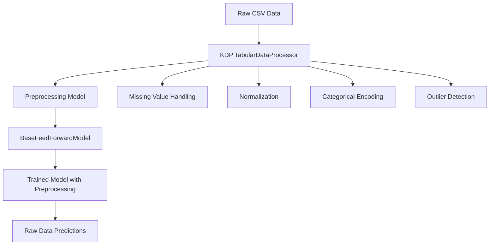

# 🚀 KMR BaseFeedForwardModel with KDP Integration Guide

This guide demonstrates how to use the **BaseFeedForwardModel** from KMR with **Keras Data Processor (KDP)** for end-to-end tabular data processing and machine learning.

## 📋 Overview

The integration between KMR's `BaseFeedForwardModel` and KDP provides a powerful solution for:

- **Automatic preprocessing** of tabular data (missing values, normalization, encoding)
- **End-to-end training** with preprocessing layers included in the model
- **Raw data prediction** without manual preprocessing steps
- **Model serialization** with preprocessing capabilities preserved

## 🏗️ Architecture



## 🚀 Quick Start

### 1. Installation

```bash
# Install KMR and KDP
pip install kmr
pip install git+https://github.com/piotrlaczkowski/keras-data-processor.git
```

### 2. Basic Usage

```python
import pandas as pd
import numpy as np
from keras.optimizers import Adam
from keras.losses import MeanSquaredError

from kmr.models.feed_forward import BaseFeedForwardModel
from kdp import TabularDataProcessor

# 1. Create dummy data
data = {
    'age': np.random.normal(35, 10, 1000),
    'income': np.random.exponential(50000, 1000),
    'education': np.random.choice(['High School', 'Bachelor', 'Master'], 1000),
    'target': np.random.uniform(0, 1, 1000)
}
df = pd.DataFrame(data)
df.to_csv('data.csv', index=False)

# 2. Create and fit KDP processor
processor = TabularDataProcessor(
    target_column='target',
    categorical_columns=['education'],
    numerical_columns=['age', 'income'],
    fill_missing_values=True,
    normalize_numerical=True,
    encode_categorical=True
)
processor.fit('data.csv')

# 3. Create preprocessing model
preprocessing_model = processor.create_preprocessing_model()

# 4. Create BaseFeedForwardModel with preprocessing
model = BaseFeedForwardModel(
    feature_names=['age', 'income', 'education'],
    hidden_units=[64, 32],
    output_units=1,
    preprocessing_model=preprocessing_model
)

# 5. Compile and train
model.compile(optimizer=Adam(0.001), loss=MeanSquaredError())
model.fit(X_train, y_train, epochs=10)

# 6. Predict with raw data
raw_data = {'age': [25], 'income': [45000], 'education': ['Bachelor']}
predictions = model.predict(raw_data)
```

## 📊 Complete Example

### Data Preparation

```python
import tempfile
from pathlib import Path

def create_sample_data():
    """Create sample tabular data with various feature types."""
    np.random.seed(42)
    
    data = {
        # Numerical features
        'age': np.random.normal(35, 10, 1000).astype(int),
        'income': np.random.exponential(50000, 1000),
        'credit_score': np.random.normal(650, 100, 1000).astype(int),
        
        # Categorical features
        'education': np.random.choice(['High School', 'Bachelor', 'Master', 'PhD'], 1000),
        'employment': np.random.choice(['Employed', 'Unemployed', 'Self-employed'], 1000),
        
        # Boolean features
        'has_loan': np.random.choice([True, False], 1000),
        'owns_property': np.random.choice([True, False], 1000),
        
        # Target
        'loan_approval_prob': np.random.uniform(0, 1, 1000)
    }
    
    df = pd.DataFrame(data)
    
    # Add missing values
    df.loc[df.sample(50).index, 'income'] = np.nan
    df.loc[df.sample(30).index, 'education'] = None
    
    return df
```

### Model Training

```python
def train_with_kdp_preprocessing():
    """Complete training pipeline with KDP preprocessing."""
    
    # Create data
    df = create_sample_data()
    df.to_csv('loan_data.csv', index=False)
    
    # Setup KDP processor
    processor = TabularDataProcessor(
        target_column='loan_approval_prob',
        categorical_columns=['education', 'employment', 'has_loan', 'owns_property'],
        numerical_columns=['age', 'income', 'credit_score'],
        fill_missing_values=True,
        normalize_numerical=True,
        encode_categorical=True,
        handle_outliers=True
    )
    
    processor.fit('loan_data.csv')
    preprocessing_model = processor.create_preprocessing_model()
    
    # Create model
    feature_names = [col for col in df.columns if col != 'loan_approval_prob']
    
    model = BaseFeedForwardModel(
        feature_names=feature_names,
        hidden_units=[128, 64, 32],
        output_units=1,
        dropout_rate=0.3,
        preprocessing_model=preprocessing_model
    )
    
    model.compile(
        optimizer=Adam(0.001),
        loss=MeanSquaredError(),
        metrics=['mae', 'mape']
    )
    
    # Prepare data
    X = {name: df[name].values for name in feature_names}
    y = df['loan_approval_prob'].values
    
    # Train
    history = model.fit(X, y, epochs=20, validation_split=0.2)
    
    return model, history
```

### Model Saving and Loading

```python
def save_and_load_model(model):
    """Save model with preprocessing and load for inference."""
    
    # Save model
    model.save('loan_predictor_model')
    
    # Load model
    loaded_model = tf.keras.models.load_model('loan_predictor_model')
    
    # Test with raw data
    raw_test_data = {
        'age': [25, 35, 45],
        'income': [45000, np.nan, 80000],  # Missing value
        'credit_score': [720, 580, 750],
        'education': ['Bachelor', None, 'Master'],  # Missing value
        'employment': ['Employed', 'Self-employed', 'Employed'],
        'has_loan': [True, False, False],
        'owns_property': [False, True, True]
    }
    
    predictions = loaded_model.predict(raw_test_data)
    print(f"Predictions: {predictions.flatten()}")
    
    return loaded_model
```

## 🔧 Advanced Configuration

### Custom Preprocessing Options

```python
# Advanced KDP configuration
processor = TabularDataProcessor(
    target_column='target',
    categorical_columns=['cat1', 'cat2'],
    numerical_columns=['num1', 'num2'],
    
    # Missing value handling
    fill_missing_values=True,
    missing_value_strategy='mean',  # or 'median', 'mode'
    
    # Normalization
    normalize_numerical=True,
    normalization_method='standard',  # or 'minmax', 'robust'
    
    # Categorical encoding
    encode_categorical=True,
    encoding_method='onehot',  # or 'ordinal', 'target'
    
    # Outlier handling
    handle_outliers=True,
    outlier_method='iqr',  # or 'zscore', 'isolation_forest'
    outlier_threshold=3.0,
    
    # Feature selection
    feature_selection=True,
    selection_method='mutual_info',  # or 'f_score', 'chi2'
    max_features=10
)
```

### Model Architecture Options

```python
# Advanced model configuration
model = BaseFeedForwardModel(
    feature_names=feature_names,
    hidden_units=[256, 128, 64, 32],  # Deep architecture
    output_units=1,
    dropout_rate=0.4,  # High regularization
    activation='relu',
    
    # Regularization
    kernel_regularizer='l2',
    bias_regularizer='l2',
    activity_regularizer='l1',
    
    # Initialization
    kernel_initializer='he_normal',
    bias_initializer='zeros',
    
    # Constraints
    kernel_constraint='max_norm',
    bias_constraint=None,
    
    preprocessing_model=preprocessing_model
)
```

## 📈 Performance Optimization

### Training Callbacks

```python
from keras.callbacks import EarlyStopping, ReduceLROnPlateau, ModelCheckpoint

callbacks = [
    EarlyStopping(
        monitor='val_loss',
        patience=10,
        restore_best_weights=True
    ),
    ReduceLROnPlateau(
        monitor='val_loss',
        factor=0.5,
        patience=5,
        min_lr=1e-6
    ),
    ModelCheckpoint(
        'best_model.h5',
        monitor='val_loss',
        save_best_only=True
    )
]

history = model.fit(
    X_train, y_train,
    validation_data=(X_val, y_val),
    epochs=100,
    batch_size=32,
    callbacks=callbacks
)
```

### Batch Processing for Large Datasets

```python
def train_on_large_dataset(csv_path, batch_size=1000):
    """Train on large datasets using batch processing."""
    
    # Process data in batches
    chunk_size = 10000
    model = None
    
    for chunk in pd.read_csv(csv_path, chunksize=chunk_size):
        if model is None:
            # Initialize model on first chunk
            processor = TabularDataProcessor(...)
            processor.fit(chunk)
            preprocessing_model = processor.create_preprocessing_model()
            
            model = BaseFeedForwardModel(
                feature_names=feature_names,
                hidden_units=[64, 32],
                preprocessing_model=preprocessing_model
            )
            model.compile(optimizer=Adam(0.001), loss=MeanSquaredError())
        
        # Train on chunk
        X_chunk = {name: chunk[name].values for name in feature_names}
        y_chunk = chunk['target'].values
        
        model.fit(X_chunk, y_chunk, epochs=1, verbose=0)
    
    return model
```

## 🧪 Testing and Validation

### Unit Testing

```python
import pytest
import tempfile
from pathlib import Path

def test_kdp_integration():
    """Test complete KDP integration workflow."""
    
    with tempfile.TemporaryDirectory() as temp_dir:
        temp_path = Path(temp_dir)
        
        # Create test data
        df = create_sample_data()
        csv_path = temp_path / "test_data.csv"
        df.to_csv(csv_path)
        
        # Test preprocessing
        processor = TabularDataProcessor(...)
        processor.fit(csv_path)
        preprocessing_model = processor.create_preprocessing_model()
        
        # Test model creation
        model = BaseFeedForwardModel(
            feature_names=feature_names,
            hidden_units=[32],
            preprocessing_model=preprocessing_model
        )
        
        # Test training
        X = {name: df[name].values[:100] for name in feature_names}
        y = df['target'].values[:100]
        
        model.compile(optimizer=Adam(0.001), loss=MeanSquaredError())
        history = model.fit(X, y, epochs=2, verbose=0)
        
        # Test prediction
        predictions = model.predict(X[:10], verbose=0)
        assert predictions.shape == (10, 1)
        assert not np.isnan(predictions).any()
        
        # Test saving/loading
        model_path = temp_path / "test_model"
        model.save(model_path)
        loaded_model = tf.keras.models.load_model(model_path)
        
        # Verify predictions match
        original_pred = model.predict(X[:5], verbose=0)
        loaded_pred = loaded_model.predict(X[:5], verbose=0)
        np.testing.assert_allclose(original_pred, loaded_pred, rtol=1e-5)
```

## 🚨 Common Issues and Solutions

### Issue 1: Missing Features in Prediction

**Problem**: `KeyError` when predicting with missing features.

**Solution**: Ensure all features are provided in the correct format.

```python
# ❌ Wrong
raw_data = {'age': [25], 'income': [45000]}  # Missing 'education'

# ✅ Correct
raw_data = {
    'age': [25], 
    'income': [45000], 
    'education': ['Bachelor']
}
```

### Issue 2: Data Type Mismatches

**Problem**: Type errors when passing data to the model.

**Solution**: Ensure correct data types.

```python
# ❌ Wrong
raw_data = {'age': ['25'], 'income': ['45000']}  # Strings instead of numbers

# ✅ Correct
raw_data = {'age': [25], 'income': [45000.0]}  # Proper types
```

### Issue 3: Model Loading Issues

**Problem**: Custom objects not found when loading model.

**Solution**: Use proper model saving format.

```python
# ✅ Recommended
model.save('model_path', save_format='tf')  # TensorFlow format

# Or use H5 format with custom objects
model.save('model_path.h5', save_format='h5')
```

## 📚 Additional Resources

- [KDP Documentation](https://github.com/piotrlaczkowski/keras-data-processor)
- [KMR Models Documentation](../api/models.md)
- [Keras Model Saving Guide](https://keras.io/guides/serialization_and_saving/)
- [Tabular Data Best Practices](https://keras.io/examples/structured_data/structured_data_classification_from_scratch/)

## 🤝 Contributing

Found an issue or want to contribute? Please:

1. Check existing issues on GitHub
2. Create a new issue with detailed description
3. Submit a pull request with tests

---

**Happy modeling with KMR and KDP! 🚀**
