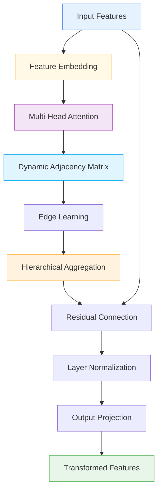

# 🕸️ AdvancedGraphFeatureLayer

<div class="layer-hero">
  <div class="layer-hero-content">
    <h1>🕸️ AdvancedGraphFeatureLayer</h1>
    <div class="layer-badges">
      <span class="badge badge-advanced">🔴 Advanced</span>
      <span class="badge badge-stable">✅ Stable</span>
      <span class="badge badge-popular">🔥 Popular</span>
    </div>
  </div>
</div>

## 🎯 Overview

The `AdvancedGraphFeatureLayer` is a sophisticated graph-based feature layer that projects scalar features into an embedding space and applies multi-head self-attention to compute data-dependent dynamic adjacencies between features. It learns edge attributes by considering both raw embeddings and their differences, with optional hierarchical aggregation.

This layer is particularly powerful for tabular data where feature interactions are important, providing a way to learn complex, dynamic relationships between features that traditional methods cannot capture.

## 🔍 How It Works

The AdvancedGraphFeatureLayer processes data through a sophisticated graph-based transformation:

1. **Feature Embedding**: Projects scalar features into embedding space
2. **Multi-Head Attention**: Computes data-dependent dynamic adjacencies
3. **Edge Learning**: Learns edge attributes from embeddings and differences
4. **Hierarchical Aggregation**: Optionally groups features into clusters
5. **Residual Connection**: Adds residual connection with layer normalization
6. **Output Projection**: Projects back to original feature space



## 💡 Why Use This Layer?

| Challenge | Traditional Approach | AdvancedGraphFeatureLayer's Solution |
|-----------|---------------------|--------------------------------|
| **Feature Interactions** | Manual feature crosses | 🎯 **Automatic learning** of feature relationships |
| **Dynamic Relationships** | Static feature processing | ⚡ **Data-dependent** dynamic adjacencies |
| **Complex Patterns** | Limited pattern recognition | 🧠 **Multi-head attention** for complex patterns |
| **Hierarchical Structure** | Flat feature processing | 🔗 **Hierarchical aggregation** for structured data |

## 📊 Use Cases

- **Tabular Data**: Complex feature interaction modeling
- **Feature Engineering**: Automatic feature relationship learning
- **Graph Neural Networks**: Graph-based processing for tabular data
- **Hierarchical Data**: Data with known grouping structure
- **Complex Patterns**: Capturing complex feature relationships

## 🚀 Quick Start

### Basic Usage

```python
import keras
from kmr.layers import AdvancedGraphFeatureLayer

# Create sample input data
batch_size, num_features = 32, 10
x = keras.random.normal((batch_size, num_features))

# Apply advanced graph feature layer
graph_layer = AdvancedGraphFeatureLayer(embed_dim=16, num_heads=4)
output = graph_layer(x, training=True)

print(f"Input shape: {x.shape}")           # (32, 10)
print(f"Output shape: {output.shape}")     # (32, 10)
```

### With Hierarchical Aggregation

```python
import keras
from kmr.layers import AdvancedGraphFeatureLayer

# Create sample input data
x = keras.random.normal((32, 20))  # 20 features

# Apply with hierarchical aggregation
graph_layer = AdvancedGraphFeatureLayer(
    embed_dim=16,
    num_heads=4,
    hierarchical=True,
    num_groups=4
)
output = graph_layer(x, training=True)

print(f"Output shape: {output.shape}")     # (32, 20)
```

### In a Sequential Model

```python
import keras
from kmr.layers import AdvancedGraphFeatureLayer

model = keras.Sequential([
    keras.layers.Dense(32, activation='relu'),
    AdvancedGraphFeatureLayer(embed_dim=16, num_heads=4),
    keras.layers.Dense(16, activation='relu'),
    AdvancedGraphFeatureLayer(embed_dim=8, num_heads=2),
    keras.layers.Dense(1, activation='sigmoid')
])

model.compile(optimizer='adam', loss='binary_crossentropy', metrics=['accuracy'])
```

### In a Functional Model

```python
import keras
from kmr.layers import AdvancedGraphFeatureLayer

# Define inputs
inputs = keras.Input(shape=(25,))  # 25 features

# Apply advanced graph feature layer
x = AdvancedGraphFeatureLayer(embed_dim=16, num_heads=4)(inputs)

# Continue processing
x = keras.layers.Dense(32, activation='relu')(x)
x = AdvancedGraphFeatureLayer(embed_dim=16, num_heads=4)(x)
x = keras.layers.Dense(16, activation='relu')(x)
outputs = keras.layers.Dense(1, activation='sigmoid')(x)

model = keras.Model(inputs, outputs)
```

### Advanced Configuration

```python
# Advanced configuration with hierarchical aggregation
def create_hierarchical_graph_model():
    inputs = keras.Input(shape=(30,))  # 30 features
    
    # Multiple graph layers with different configurations
    x = AdvancedGraphFeatureLayer(
        embed_dim=32,
        num_heads=8,
        dropout_rate=0.1,
        hierarchical=True,
        num_groups=6
    )(inputs)
    
    x = keras.layers.Dense(64, activation='relu')(x)
    x = keras.layers.BatchNormalization()(x)
    
    x = AdvancedGraphFeatureLayer(
        embed_dim=24,
        num_heads=6,
        dropout_rate=0.1,
        hierarchical=True,
        num_groups=4
    )(x)
    
    x = keras.layers.Dense(32, activation='relu')(x)
    x = keras.layers.Dropout(0.2)(x)
    
    # Multi-task output
    classification = keras.layers.Dense(3, activation='softmax', name='classification')(x)
    regression = keras.layers.Dense(1, name='regression')(x)
    
    return keras.Model(inputs, [classification, regression])

model = create_hierarchical_graph_model()
model.compile(
    optimizer='adam',
    loss={'classification': 'categorical_crossentropy', 'regression': 'mse'},
    loss_weights={'classification': 1.0, 'regression': 0.5}
)
```

## 📖 API Reference

### Class: AdvancedGraphFeatureLayer

**Inherits from**: `BaseLayer`

```python
class AdvancedGraphFeatureLayer(BaseLayer):
    """Advanced graph-based feature layer for tabular data."""
```

#### Constructor Parameters

- **`embed_dim`** (int): Dimensionality of the projected feature embeddings. Default: 16
- **`num_heads`** (int): Number of attention heads in the multi-head self-attention. Default: 4
- **`hierarchical`** (bool): Whether to apply hierarchical aggregation. Default: False
- **`num_groups`** (int): Number of groups for hierarchical aggregation (only used if hierarchical=True). Default: 4
- **`dropout_rate`** (float): Dropout rate for regularization. Default: 0.1
- **`name`** (str, optional): Layer name. Default: None

#### Key Methods

- **`call(inputs)`**: Forward pass that processes input tensor through graph-based transformations
- **`build(input_shape)`**: Builds the layer with given input shape
- **`get_config()`**: Returns layer configuration for serialization
- **`compute_output_shape(input_shape)`**: Computes output shape given input shape

#### Input/Output

- **Input Shape**: `(batch_size, num_features)`
- **Output Shape**: `(batch_size, num_features)`

## 🔧 Parameters Deep Dive

### `embed_dim` (int)
- **Purpose**: Dimensionality of the projected feature embeddings
- **Range**: 8 to 128+ (typically 16-64)
- **Impact**: Larger values = more expressive embeddings but more parameters
- **Recommendation**: Start with 16-32, scale based on data complexity

### `num_heads` (int)
- **Purpose**: Number of attention heads
- **Range**: 1 to 16+ (typically 4-8)
- **Impact**: More heads = more diverse attention patterns
- **Recommendation**: Use 4-8 heads for most applications

### `dropout_rate` (float)
- **Purpose**: Dropout rate applied to attention weights
- **Range**: 0.0 to 0.5 (typically 0.1-0.2)
- **Impact**: Higher values = more regularization
- **Recommendation**: Use 0.1-0.2 for regularization

### `hierarchical` (bool)
- **Purpose**: Whether to apply hierarchical aggregation
- **Default**: False
- **Impact**: Enables feature grouping for large feature sets
- **Recommendation**: Use True for >20 features or known grouping structure

### `num_groups` (int, optional)
- **Purpose**: Number of groups for hierarchical aggregation
- **Range**: 2 to 20+ (typically 4-8)
- **Impact**: Controls granularity of hierarchical aggregation
- **Recommendation**: Use 4-8 groups for most applications

## 📈 Performance Characteristics

- **Speed**: ⚡⚡⚡ Fast for small to medium models, scales with features²
- **Memory**: 💾💾💾💾 High memory usage due to attention computation
- **Accuracy**: 🎯🎯🎯🎯 Excellent for complex feature interactions
- **Best For**: Tabular data with complex feature relationships

## 🎨 Examples

### Example 1: Complex Feature Interactions

```python
import keras
import numpy as np
from kmr.layers import AdvancedGraphFeatureLayer

# Create a model for complex feature interactions
def create_feature_interaction_model():
    inputs = keras.Input(shape=(25,))  # 25 features
    
    # Multiple graph layers for different interaction levels
    x = AdvancedGraphFeatureLayer(
        embed_dim=32,
        num_heads=8,
        dropout_rate=0.1
    )(inputs)
    
    x = keras.layers.Dense(64, activation='relu')(x)
    x = keras.layers.BatchNormalization()(x)
    
    x = AdvancedGraphFeatureLayer(
        embed_dim=24,
        num_heads=6,
        dropout_rate=0.1
    )(x)
    
    x = keras.layers.Dense(32, activation='relu')(x)
    x = keras.layers.Dropout(0.2)(x)
    
    # Output
    outputs = keras.layers.Dense(1, activation='sigmoid')(x)
    
    return keras.Model(inputs, outputs)

model = create_feature_interaction_model()
model.compile(optimizer='adam', loss='binary_crossentropy')

# Test with sample data
sample_data = keras.random.normal((100, 25))
predictions = model(sample_data)
print(f"Feature interaction predictions shape: {predictions.shape}")
```

### Example 2: Hierarchical Feature Processing

```python
# Create a hierarchical feature processing model
def create_hierarchical_model():
    inputs = keras.Input(shape=(40,))  # 40 features
    
    # Hierarchical graph processing
    x = AdvancedGraphFeatureLayer(
        embed_dim=32,
        num_heads=8,
        dropout_rate=0.1,
        hierarchical=True,
        num_groups=8
    )(inputs)
    
    x = keras.layers.Dense(64, activation='relu')(x)
    x = keras.layers.BatchNormalization()(x)
    
    x = AdvancedGraphFeatureLayer(
        embed_dim=24,
        num_heads=6,
        dropout_rate=0.1,
        hierarchical=True,
        num_groups=4
    )(x)
    
    x = keras.layers.Dense(32, activation='relu')(x)
    x = keras.layers.Dropout(0.2)(x)
    
    # Output
    outputs = keras.layers.Dense(1, activation='sigmoid')(x)
    
    return keras.Model(inputs, outputs)

model = create_hierarchical_model()
model.compile(optimizer='adam', loss='binary_crossentropy')
```

### Example 3: Graph Analysis

```python
# Analyze graph behavior
def analyze_graph_behavior():
    # Create model with graph layer
    inputs = keras.Input(shape=(15,))
    x = AdvancedGraphFeatureLayer(embed_dim=16, num_heads=4)(inputs)
    outputs = keras.layers.Dense(1, activation='sigmoid')(x)
    
    model = keras.Model(inputs, outputs)
    
    # Test with different input patterns
    test_inputs = [
        keras.random.normal((10, 15)),  # Random data
        keras.random.normal((10, 15)) * 2,  # Scaled data
        keras.random.normal((10, 15)) + 1,  # Shifted data
    ]
    
    print("Graph Behavior Analysis:")
    print("=" * 40)
    
    for i, test_input in enumerate(test_inputs):
        prediction = model(test_input)
        print(f"Test {i+1}: Prediction mean = {keras.ops.mean(prediction):.4f}")
    
    return model

# Analyze graph behavior
# model = analyze_graph_behavior()
```

## 💡 Tips & Best Practices

- **Embedding Dimension**: Start with 16-32, scale based on data complexity
- **Attention Heads**: Use 4-8 heads for most applications
- **Hierarchical Mode**: Enable for >20 features or known grouping structure
- **Dropout Rate**: Use 0.1-0.2 for regularization
- **Feature Normalization**: Works best with normalized input features
- **Memory Usage**: Scales quadratically with number of features

## ⚠️ Common Pitfalls

- **Embedding Dimension**: Must be divisible by num_heads
- **Hierarchical Mode**: Must provide num_groups when hierarchical=True
- **Memory Usage**: Can be memory-intensive for large feature sets
- **Overfitting**: Monitor for overfitting with complex configurations
- **Feature Count**: Consider feature pre-selection for very large feature sets

## 🔗 Related Layers

- [GraphFeatureAggregation](graph-feature-aggregation.md) - Graph feature aggregation
- [MultiHeadGraphFeaturePreprocessor](multi-head-graph-feature-preprocessor.md) - Multi-head graph preprocessing
- [TabularAttention](tabular-attention.md) - Tabular attention mechanisms
- [VariableSelection](variable-selection.md) - Variable selection

## 📚 Further Reading

- [Graph Neural Networks](https://en.wikipedia.org/wiki/Graph_neural_network) - Graph neural network concepts
- [Multi-Head Attention](https://arxiv.org/abs/1706.03762) - Multi-head attention mechanism
- [Hierarchical Clustering](https://en.wikipedia.org/wiki/Hierarchical_clustering) - Hierarchical clustering concepts
- [KMR Layer Explorer](../layers_overview.md) - Browse all available layers
- [Feature Engineering Tutorial](../tutorials/feature-engineering.md) - Complete guide to feature engineering
