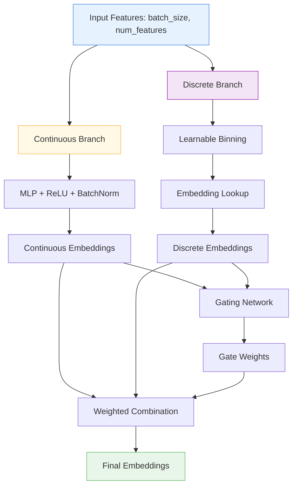

# 🔢 AdvancedNumericalEmbedding

<div class="layer-hero">
  <div class="layer-hero-content">
    <h1>🔢 AdvancedNumericalEmbedding</h1>
    <div class="layer-badges">
      <span class="badge badge-advanced">🔴 Advanced</span>
      <span class="badge badge-stable">✅ Stable</span>
      <span class="badge badge-popular">🔥 Popular</span>
    </div>
  </div>
</div>

## 🎯 Overview

The `AdvancedNumericalEmbedding` layer embeds continuous numerical features into a higher-dimensional space using a sophisticated dual-branch architecture. It combines continuous processing (via MLP) with discrete processing (via learnable binning and embedding lookup) to create rich feature representations.

This layer is particularly powerful for tabular data where numerical features need sophisticated representation learning, combining the benefits of both continuous and discrete processing approaches.

## 🔍 How It Works

The AdvancedNumericalEmbedding layer processes numerical features through a dual-branch architecture:

1. **Continuous Branch**: Each feature is processed via a small MLP with residual connection
2. **Discrete Branch**: Features are discretized into learnable bins with embedding lookup
3. **Gating Mechanism**: A learnable gate combines both branch outputs per feature
4. **Residual Connection**: Optional batch normalization for training stability
5. **Output Generation**: Produces rich embeddings combining both approaches



## 💡 Why Use This Layer?

| Challenge | Traditional Approach | AdvancedNumericalEmbedding's Solution |
|-----------|---------------------|--------------------------------------|
| **Feature Representation** | Simple dense layers or one-hot encoding | 🎯 **Dual-branch architecture** combining continuous and discrete processing |
| **Numerical Features** | Treat all numerical features uniformly | ⚡ **Specialized processing** for different numerical characteristics |
| **Embedding Learning** | Separate embedding for categorical only | 🧠 **Unified embedding** for both continuous and discrete aspects |
| **Feature Interactions** | Limited interaction modeling | 🔗 **Rich interactions** through gating and residual connections |

## 📊 Use Cases

- **Mixed Data Types**: Processing both continuous and discrete numerical features
- **Feature Engineering**: Creating rich embeddings for numerical features
- **Representation Learning**: Learning sophisticated feature representations
- **Tabular Deep Learning**: Advanced preprocessing for tabular neural networks
- **Transfer Learning**: Creating reusable feature embeddings

## 🚀 Quick Start

### Basic Usage

```python
import keras
from kmr.layers import AdvancedNumericalEmbedding

# Create sample input data
batch_size, num_features = 32, 5
x = keras.random.normal((batch_size, num_features))

# Apply advanced numerical embedding
embedding = AdvancedNumericalEmbedding(
    embedding_dim=8,
    mlp_hidden_units=16,
    num_bins=10
)
embedded = embedding(x)

print(f"Input shape: {x.shape}")           # (32, 5)
print(f"Output shape: {embedded.shape}")   # (32, 5, 8)
```

### In a Sequential Model

```python
import keras
from kmr.layers import AdvancedNumericalEmbedding

model = keras.Sequential([
    AdvancedNumericalEmbedding(
        embedding_dim=16,
        mlp_hidden_units=32,
        num_bins=20
    ),
    keras.layers.Flatten(),
    keras.layers.Dense(64, activation='relu'),
    keras.layers.Dense(1, activation='sigmoid')
])

model.compile(optimizer='adam', loss='binary_crossentropy', metrics=['accuracy'])
```

### In a Functional Model

```python
import keras
from kmr.layers import AdvancedNumericalEmbedding

# Define inputs
inputs = keras.Input(shape=(10,))  # 10 numerical features

# Apply advanced embedding
x = AdvancedNumericalEmbedding(
    embedding_dim=32,
    mlp_hidden_units=64,
    num_bins=15
)(inputs)

# Flatten and continue processing
x = keras.layers.Flatten()(x)
x = keras.layers.Dense(128, activation='relu')(x)
x = keras.layers.Dropout(0.2)(x)
outputs = keras.layers.Dense(1, activation='sigmoid')(x)

model = keras.Model(inputs, outputs)
```

### Advanced Configuration

```python
# Advanced configuration with custom parameters
embedding = AdvancedNumericalEmbedding(
    embedding_dim=64,           # Higher embedding dimension
    mlp_hidden_units=128,       # More hidden units
    num_bins=50,                # More bins for finer discretization
    init_min=-5.0,              # Custom initialization range
    init_max=5.0,
    dropout_rate=0.2,           # Higher dropout for regularization
    use_batch_norm=True,        # Enable batch normalization
    name="custom_advanced_embedding"
)

# Use in a complex model
inputs = keras.Input(shape=(20,))
x = embedding(inputs)
x = keras.layers.Flatten()(x)
x = keras.layers.Dense(256, activation='relu')(x)
x = keras.layers.Dropout(0.3)(x)
x = keras.layers.Dense(64, activation='relu')(x)
outputs = keras.layers.Dense(5, activation='softmax')(x)

model = keras.Model(inputs, outputs)
```

## 📖 API Reference

::: kmr.layers.AdvancedNumericalEmbedding

## 🔧 Parameters Deep Dive

### `embedding_dim` (int)
- **Purpose**: Output embedding dimension per feature
- **Range**: 4 to 128+ (typically 8-64)
- **Impact**: Higher values = richer representations but more parameters
- **Recommendation**: Start with 8-16, scale based on data complexity

### `mlp_hidden_units` (int)
- **Purpose**: Hidden units for the continuous branch MLP
- **Range**: 8 to 256+ (typically 16-128)
- **Impact**: Larger values = more complex continuous processing
- **Recommendation**: Start with 16-32, adjust based on feature complexity

### `num_bins` (int)
- **Purpose**: Number of bins for discretization
- **Range**: 5 to 100+ (typically 10-50)
- **Impact**: More bins = finer discretization but more parameters
- **Recommendation**: Start with 10-20, increase for high-precision features

### `init_min` / `init_max` (float or list)
- **Purpose**: Initial minimum/maximum values for discretization boundaries
- **Range**: -10.0 to 10.0 (typically -3.0 to 3.0)
- **Impact**: Affects initial bin boundaries and training stability
- **Recommendation**: Use -3.0 to 3.0 for normalized data, adjust based on data range

## 📈 Performance Characteristics

- **Speed**: ⚡⚡⚡ Fast for small to medium feature counts, scales with embedding_dim
- **Memory**: 💾💾💾 Moderate memory usage due to dual-branch architecture
- **Accuracy**: 🎯🎯🎯🎯 Excellent for complex numerical feature processing
- **Best For**: Tabular data with numerical features requiring rich representations

## 🎨 Examples

### Example 1: Mixed Data Type Processing

```python
import keras
import numpy as np
from kmr.layers import AdvancedNumericalEmbedding

# Simulate mixed numerical data
batch_size = 1000

# Continuous features (age, income, etc.)
continuous_features = np.random.normal(0, 1, (batch_size, 5))

# Discrete-like features (counts, ratings, etc.)
discrete_features = np.random.randint(0, 10, (batch_size, 3))

# Combine features
numerical_data = np.concatenate([continuous_features, discrete_features], axis=1)

# Build model with advanced embedding
inputs = keras.Input(shape=(8,))  # 8 numerical features

# Apply advanced numerical embedding
x = AdvancedNumericalEmbedding(
    embedding_dim=16,
    mlp_hidden_units=32,
    num_bins=20,
    init_min=-3.0,
    init_max=3.0
)(inputs)

# Process embeddings
x = keras.layers.Flatten()(x)
x = keras.layers.Dense(64, activation='relu')(x)
x = keras.layers.Dropout(0.2)(x)
x = keras.layers.Dense(32, activation='relu')(x)
output = keras.layers.Dense(1, activation='sigmoid')(x)

model = keras.Model(inputs, output)
model.compile(optimizer='adam', loss='binary_crossentropy')
```

### Example 2: Financial Data Embedding

```python
# Process financial data with advanced numerical embedding
def create_financial_model():
    inputs = keras.Input(shape=(15,))  # 15 financial features
    
    # Advanced numerical embedding
    x = AdvancedNumericalEmbedding(
        embedding_dim=32,
        mlp_hidden_units=64,
        num_bins=25,
        init_min=-5.0,
        init_max=5.0,
        dropout_rate=0.1
    )(inputs)
    
    # Process embeddings
    x = keras.layers.Flatten()(x)
    x = keras.layers.Dense(128, activation='relu')(x)
    x = keras.layers.BatchNormalization()(x)
    x = keras.layers.Dropout(0.3)(x)
    
    # Multiple outputs
    risk_score = keras.layers.Dense(1, activation='sigmoid', name='risk')(x)
    category = keras.layers.Dense(5, activation='softmax', name='category')(x)
    
    return keras.Model(inputs, [risk_score, category])

model = create_financial_model()
model.compile(
    optimizer='adam',
    loss={'risk': 'binary_crossentropy', 'category': 'categorical_crossentropy'},
    loss_weights={'risk': 1.0, 'category': 0.5}
)
```

### Example 3: Multi-Scale Feature Processing

```python
# Process features at different scales with advanced embedding
def create_multi_scale_model():
    inputs = keras.Input(shape=(20,))
    
    # Different embedding configurations for different feature groups
    # Group 1: High-precision features (0-5)
    high_precision = inputs[:, :5]
    high_precision_emb = AdvancedNumericalEmbedding(
        embedding_dim=16,
        mlp_hidden_units=32,
        num_bins=50,  # More bins for high precision
        init_min=0.0,
        init_max=5.0
    )(high_precision)
    
    # Group 2: General features (5-15)
    general_features = inputs[:, 5:15]
    general_emb = AdvancedNumericalEmbedding(
        embedding_dim=24,
        mlp_hidden_units=48,
        num_bins=20,
        init_min=-3.0,
        init_max=3.0
    )(general_features)
    
    # Group 3: Categorical-like features (15-20)
    categorical_like = inputs[:, 15:20]
    categorical_emb = AdvancedNumericalEmbedding(
        embedding_dim=12,
        mlp_hidden_units=24,
        num_bins=10,
        init_min=0.0,
        init_max=10.0
    )(categorical_like)
    
    # Combine all embeddings
    all_embeddings = keras.layers.Concatenate()([
        keras.layers.Flatten()(high_precision_emb),
        keras.layers.Flatten()(general_emb),
        keras.layers.Flatten()(categorical_emb)
    ])
    
    # Final processing
    x = keras.layers.Dense(128, activation='relu')(all_embeddings)
    x = keras.layers.Dropout(0.3)(x)
    x = keras.layers.Dense(64, activation='relu')(x)
    output = keras.layers.Dense(1, activation='sigmoid')(x)
    
    return keras.Model(inputs, output)

model = create_multi_scale_model()
model.compile(optimizer='adam', loss='binary_crossentropy')
```

## 💡 Tips & Best Practices

- **Feature Preprocessing**: Ensure numerical features are properly normalized
- **Bin Count**: Use more bins for high-precision features, fewer for general features
- **Embedding Dimension**: Start with 8-16, scale based on data complexity
- **Initialization Range**: Set init_min/max based on your data's actual range
- **Batch Normalization**: Enable for better training stability
- **Regularization**: Use appropriate dropout to prevent overfitting

## ⚠️ Common Pitfalls

- **Input Shape**: Must be 2D tensor (batch_size, num_features)
- **Memory Usage**: Scales with embedding_dim and num_bins
- **Initialization**: Poor init_min/max can hurt training - match your data range
- **Overfitting**: Can overfit on small datasets - use regularization
- **Feature Count**: Works best with moderate number of features (5-50)

## 🔗 Related Layers

- [DistributionAwareEncoder](distribution-aware-encoder.md) - Distribution-aware feature encoding
- [DistributionTransformLayer](distribution-transform-layer.md) - Distribution transformation
- [GatedFeatureFusion](gated-feature-fusion.md) - Feature fusion mechanism
- [TabularAttention](tabular-attention.md) - Attention-based feature processing

## 📚 Further Reading

- [Deep Learning for Tabular Data](https://arxiv.org/abs/2106.11959) - Tabular deep learning approaches
- [Feature Embedding in Neural Networks](https://en.wikipedia.org/wiki/Feature_learning) - Feature learning concepts
- [Numerical Feature Processing](https://en.wikipedia.org/wiki/Feature_engineering) - Feature engineering techniques
- [KMR Layer Explorer](../layers_overview.md) - Browse all available layers
- [Feature Engineering Tutorial](../tutorials/feature-engineering.md) - Complete guide to feature engineering
