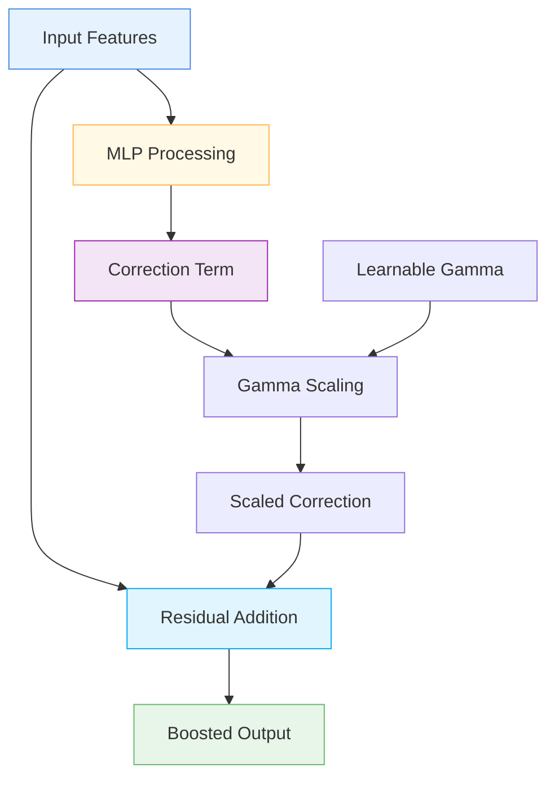

# 🚀 BoostingBlock

<div class="layer-hero">
  <div class="layer-hero-content">
    <h1>🚀 BoostingBlock</h1>
    <div class="layer-badges">
      <span class="badge badge-advanced">🔴 Advanced</span>
      <span class="badge badge-stable">✅ Stable</span>
      <span class="badge badge-popular">🔥 Popular</span>
    </div>
  </div>
</div>

## 🎯 Overview

The `BoostingBlock` simulates gradient boosting behavior in a neural network by computing a correction term via a configurable MLP and adding a scaled version to the input. This layer implements a weak learner that can be stacked to mimic the iterative residual-correction process of gradient boosting.

This layer is particularly powerful for tabular data where gradient boosting techniques are effective, allowing you to combine the benefits of neural networks with boosting algorithms.

## 🔍 How It Works

The BoostingBlock processes data through a boosting-inspired transformation:

1. **MLP Processing**: Applies a configurable MLP to the input
2. **Correction Computation**: Computes a correction term from the MLP output
3. **Scaling**: Applies a learnable or fixed scaling factor (gamma)
4. **Residual Addition**: Adds the scaled correction to the original input
5. **Output Generation**: Produces the boosted output



## 💡 Why Use This Layer?

| Challenge | Traditional Approach | BoostingBlock's Solution |
|-----------|---------------------|-------------------------|
| **Gradient Boosting** | Separate boosting algorithms | 🎯 **Neural network** implementation of boosting |
| **Residual Learning** | Manual residual computation | ⚡ **Automatic residual** correction learning |
| **Weak Learners** | Separate weak learner models | 🧠 **Integrated weak learners** in neural networks |
| **Ensemble Learning** | External ensemble methods | 🔗 **End-to-end** ensemble learning |

## 📊 Use Cases

- **Tabular Data**: Combining neural networks with boosting techniques
- **Residual Learning**: Learning residual corrections iteratively
- **Ensemble Methods**: Building ensemble models in neural networks
- **Gradient Boosting**: Implementing boosting algorithms in neural networks
- **Weak Learners**: Creating weak learners for ensemble methods

## 🚀 Quick Start

### Basic Usage

```python
import keras
from kmr.layers import BoostingBlock

# Create sample input data
batch_size, input_dim = 32, 16
x = keras.random.normal((batch_size, input_dim))

# Apply boosting block
boosting_block = BoostingBlock(hidden_units=64)
output = boosting_block(x)

print(f"Input shape: {x.shape}")           # (32, 16)
print(f"Output shape: {output.shape}")     # (32, 16)
```

### In a Sequential Model

```python
import keras
from kmr.layers import BoostingBlock

model = keras.Sequential([
    keras.layers.Dense(32, activation='relu'),
    BoostingBlock(hidden_units=64),
    BoostingBlock(hidden_units=32),
    keras.layers.Dense(16, activation='relu'),
    keras.layers.Dense(1, activation='sigmoid')
])

model.compile(optimizer='adam', loss='binary_crossentropy', metrics=['accuracy'])
```

### In a Functional Model

```python
import keras
from kmr.layers import BoostingBlock

# Define inputs
inputs = keras.Input(shape=(20,))  # 20 features

# Apply boosting blocks
x = BoostingBlock(hidden_units=64)(inputs)
x = BoostingBlock(hidden_units=32)(x)
x = keras.layers.Dense(16, activation='relu')(x)
outputs = keras.layers.Dense(1, activation='sigmoid')(x)

model = keras.Model(inputs, outputs)
```

### Advanced Configuration

```python
# Advanced configuration with multiple boosting blocks
def create_boosting_network():
    inputs = keras.Input(shape=(30,))
    
    # Multiple boosting blocks with different configurations
    x = BoostingBlock(
        hidden_units=[64, 32],  # Two hidden layers
        hidden_activation='selu',
        dropout_rate=0.1,
        gamma_trainable=True
    )(inputs)
    
    x = BoostingBlock(
        hidden_units=32,
        hidden_activation='relu',
        dropout_rate=0.1,
        gamma_trainable=True
    )(x)
    
    x = BoostingBlock(
        hidden_units=16,
        hidden_activation='tanh',
        dropout_rate=0.05,
        gamma_trainable=False
    )(x)
    
    # Final processing
    x = keras.layers.Dense(8, activation='relu')(x)
    x = keras.layers.Dropout(0.2)(x)
    
    # Multi-task output
    classification = keras.layers.Dense(3, activation='softmax', name='classification')(x)
    regression = keras.layers.Dense(1, name='regression')(x)
    
    return keras.Model(inputs, [classification, regression])

model = create_boosting_network()
model.compile(
    optimizer='adam',
    loss={'classification': 'categorical_crossentropy', 'regression': 'mse'},
    loss_weights={'classification': 1.0, 'regression': 0.5}
)
```

## 📖 API Reference

::: kmr.layers.BoostingBlock

## 🔧 Parameters Deep Dive

### `hidden_units` (int or list)
- **Purpose**: Number of hidden units in the MLP
- **Range**: 8 to 256+ (typically 32-128)
- **Impact**: Larger values = more complex corrections
- **Recommendation**: Start with 64, scale based on data complexity

### `hidden_activation` (str)
- **Purpose**: Activation function for hidden layers
- **Options**: 'relu', 'selu', 'tanh', 'sigmoid', etc.
- **Default**: 'relu'
- **Impact**: Affects the correction term computation
- **Recommendation**: Use 'relu' for most cases, 'selu' for deeper networks

### `gamma_trainable` (bool)
- **Purpose**: Whether the scaling factor is trainable
- **Default**: True
- **Impact**: Trainable gamma allows learning optimal scaling
- **Recommendation**: Use True for most cases, False for fixed scaling

### `dropout_rate` (float, optional)
- **Purpose**: Dropout rate for regularization
- **Range**: 0.0 to 0.5 (typically 0.1-0.2)
- **Impact**: Higher values = more regularization
- **Recommendation**: Use 0.1-0.2 for regularization

## 📈 Performance Characteristics

- **Speed**: ⚡⚡⚡ Fast - simple MLP computation
- **Memory**: 💾💾 Moderate memory usage due to MLP
- **Accuracy**: 🎯🎯🎯🎯 Excellent for residual learning
- **Best For**: Tabular data where boosting techniques are effective

## 🎨 Examples

### Example 1: Gradient Boosting Simulation

```python
import keras
import numpy as np
from kmr.layers import BoostingBlock

# Create a gradient boosting simulation
def create_gradient_boosting_simulation():
    inputs = keras.Input(shape=(25,))
    
    # Multiple boosting blocks to simulate gradient boosting
    x = BoostingBlock(hidden_units=64, gamma_trainable=True)(inputs)
    x = BoostingBlock(hidden_units=64, gamma_trainable=True)(x)
    x = BoostingBlock(hidden_units=32, gamma_trainable=True)(x)
    x = BoostingBlock(hidden_units=32, gamma_trainable=True)(x)
    x = BoostingBlock(hidden_units=16, gamma_trainable=True)(x)
    
    # Final processing
    x = keras.layers.Dense(8, activation='relu')(x)
    x = keras.layers.Dropout(0.2)(x)
    
    # Output
    outputs = keras.layers.Dense(1, activation='sigmoid')(x)
    
    return keras.Model(inputs, outputs)

model = create_gradient_boosting_simulation()
model.compile(optimizer='adam', loss='binary_crossentropy')

# Test with sample data
sample_data = keras.random.normal((100, 25))
predictions = model(sample_data)
print(f"Gradient boosting simulation predictions shape: {predictions.shape}")
```

### Example 2: Residual Learning Analysis

```python
# Analyze residual learning in boosting blocks
def analyze_residual_learning():
    # Create model with boosting blocks
    inputs = keras.Input(shape=(15,))
    x = BoostingBlock(hidden_units=32, gamma_trainable=True)(inputs)
    x = BoostingBlock(hidden_units=16, gamma_trainable=True)(x)
    outputs = keras.layers.Dense(1, activation='sigmoid')(x)
    
    model = keras.Model(inputs, outputs)
    
    # Test with different input patterns
    test_inputs = [
        keras.random.normal((10, 15)),  # Random data
        keras.random.normal((10, 15)) * 2,  # Scaled data
        keras.random.normal((10, 15)) + 1,  # Shifted data
    ]
    
    print("Residual Learning Analysis:")
    print("=" * 40)
    
    for i, test_input in enumerate(test_inputs):
        prediction = model(test_input)
        print(f"Test {i+1}: Prediction mean = {keras.ops.mean(prediction):.4f}")
    
    return model

# Analyze residual learning
# model = analyze_residual_learning()
```

### Example 3: Boosting Block Comparison

```python
# Compare different boosting block configurations
def compare_boosting_configurations():
    inputs = keras.Input(shape=(20,))
    
    # Configuration 1: Single hidden layer
    x1 = BoostingBlock(hidden_units=64, gamma_trainable=True)(inputs)
    x1 = keras.layers.Dense(1, activation='sigmoid')(x1)
    model1 = keras.Model(inputs, x1)
    
    # Configuration 2: Multiple hidden layers
    x2 = BoostingBlock(hidden_units=[64, 32], gamma_trainable=True)(inputs)
    x2 = keras.layers.Dense(1, activation='sigmoid')(x2)
    model2 = keras.Model(inputs, x2)
    
    # Configuration 3: Fixed gamma
    x3 = BoostingBlock(hidden_units=64, gamma_trainable=False)(inputs)
    x3 = keras.layers.Dense(1, activation='sigmoid')(x3)
    model3 = keras.Model(inputs, x3)
    
    # Test with sample data
    test_data = keras.random.normal((50, 20))
    
    print("Boosting Block Comparison:")
    print("=" * 40)
    print(f"Single hidden layer: {model1.count_params()} parameters")
    print(f"Multiple hidden layers: {model2.count_params()} parameters")
    print(f"Fixed gamma: {model3.count_params()} parameters")
    
    return model1, model2, model3

# Compare configurations
# models = compare_boosting_configurations()
```

## 💡 Tips & Best Practices

- **Hidden Units**: Start with 64 units, scale based on data complexity
- **Gamma Training**: Use trainable gamma for most applications
- **Activation Functions**: Use 'relu' for most cases, 'selu' for deeper networks
- **Dropout**: Use 0.1-0.2 dropout rate for regularization
- **Stacking**: Stack multiple boosting blocks for better performance
- **Residual Learning**: The layer automatically handles residual learning

## ⚠️ Common Pitfalls

- **Hidden Units**: Must be positive integer or list of positive integers
- **Gamma Training**: Fixed gamma may limit learning capacity
- **Overfitting**: Monitor for overfitting with complex configurations
- **Memory Usage**: Scales with hidden units and number of layers
- **Gradient Flow**: Residual connections help but monitor training

## 🔗 Related Layers

- [BoostingEnsembleLayer](boosting-ensemble-layer.md) - Ensemble of boosting blocks
- [GatedResidualNetwork](gated-residual-network.md) - Gated residual networks
- [StochasticDepth](stochastic-depth.md) - Stochastic depth regularization
- [VariableSelection](variable-selection.md) - Variable selection with GRN

## 📚 Further Reading

- [Gradient Boosting](https://en.wikipedia.org/wiki/Gradient_boosting) - Gradient boosting concepts
- [Residual Learning](https://arxiv.org/abs/1512.03385) - Residual learning paper
- [Ensemble Methods](https://en.wikipedia.org/wiki/Ensemble_learning) - Ensemble learning concepts
- [KMR Layer Explorer](../layers_overview.md) - Browse all available layers
- [Feature Engineering Tutorial](../tutorials/feature-engineering.md) - Complete guide to feature engineering
