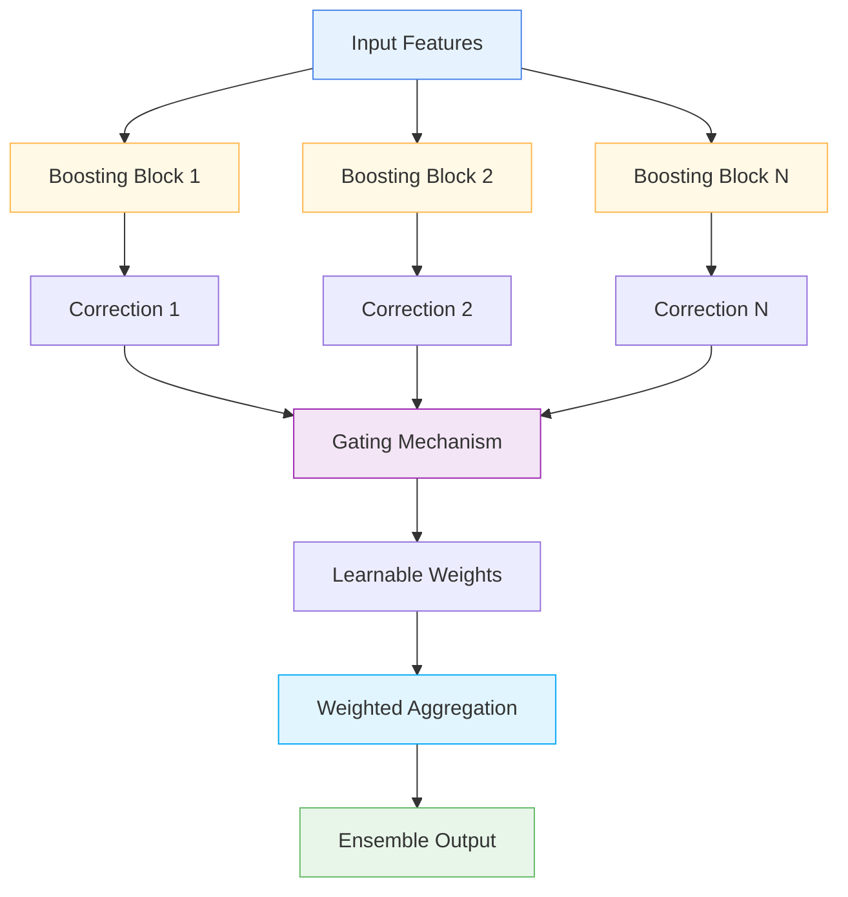

# 🎯 BoostingEnsembleLayer

<div class="layer-hero">
  <div class="layer-hero-content">
    <h1>🎯 BoostingEnsembleLayer</h1>
    <div class="layer-badges">
      <span class="badge badge-advanced">🔴 Advanced</span>
      <span class="badge badge-stable">✅ Stable</span>
      <span class="badge badge-popular">🔥 Popular</span>
    </div>
  </div>
</div>

## 🎯 Overview

The `BoostingEnsembleLayer` aggregates multiple BoostingBlocks in parallel, combining their outputs via learnable weights to form an ensemble prediction. This layer implements ensemble learning in a differentiable, end-to-end manner, allowing multiple weak learners to work together.

This layer is particularly powerful for tabular data where ensemble methods are effective, providing a neural network implementation of boosting ensemble techniques.

## 🔍 How It Works

The BoostingEnsembleLayer processes data through parallel boosting blocks:

1. **Parallel Processing**: Creates multiple boosting blocks that process input independently
2. **Correction Computation**: Each block computes its own correction term
3. **Gating Mechanism**: Learns weights for combining block outputs
4. **Weighted Aggregation**: Combines block outputs using learned weights
5. **Output Generation**: Produces ensemble prediction



## 💡 Why Use This Layer?

| Challenge | Traditional Approach | BoostingEnsembleLayer's Solution |
|-----------|---------------------|--------------------------------|
| **Ensemble Learning** | Separate ensemble models | 🎯 **Integrated ensemble** in neural networks |
| **Parallel Processing** | Sequential boosting | ⚡ **Parallel boosting** blocks |
| **Weight Learning** | Fixed ensemble weights | 🧠 **Learnable weights** for optimal combination |
| **End-to-End Learning** | Separate training phases | 🔗 **End-to-end** ensemble learning |

## 📊 Use Cases

- **Ensemble Learning**: Building ensemble models in neural networks
- **Parallel Boosting**: Implementing parallel boosting techniques
- **Weak Learner Combination**: Combining multiple weak learners
- **Tabular Data**: Effective for tabular data ensemble methods
- **Robust Predictions**: Creating more robust predictions through ensemble

## 🚀 Quick Start

### Basic Usage

```python
import keras
from kmr.layers import BoostingEnsembleLayer

# Create sample input data
batch_size, input_dim = 32, 16
x = keras.random.normal((batch_size, input_dim))

# Apply boosting ensemble
ensemble = BoostingEnsembleLayer(num_learners=3, learner_units=64)
output = ensemble(x)

print(f"Input shape: {x.shape}")           # (32, 16)
print(f"Output shape: {output.shape}")     # (32, 16)
```

### In a Sequential Model

```python
import keras
from kmr.layers import BoostingEnsembleLayer

model = keras.Sequential([
    keras.layers.Dense(32, activation='relu'),
    BoostingEnsembleLayer(num_learners=3, learner_units=64),
    keras.layers.Dense(16, activation='relu'),
    BoostingEnsembleLayer(num_learners=2, learner_units=32),
    keras.layers.Dense(1, activation='sigmoid')
])

model.compile(optimizer='adam', loss='binary_crossentropy', metrics=['accuracy'])
```

### In a Functional Model

```python
import keras
from kmr.layers import BoostingEnsembleLayer

# Define inputs
inputs = keras.Input(shape=(20,))  # 20 features

# Apply boosting ensemble
x = BoostingEnsembleLayer(num_learners=4, learner_units=64)(inputs)

# Continue processing
x = keras.layers.Dense(32, activation='relu')(x)
x = BoostingEnsembleLayer(num_learners=2, learner_units=32)(x)
x = keras.layers.Dense(16, activation='relu')(x)
outputs = keras.layers.Dense(1, activation='sigmoid')(x)

model = keras.Model(inputs, outputs)
```

### Advanced Configuration

```python
# Advanced configuration with multiple ensemble layers
def create_ensemble_network():
    inputs = keras.Input(shape=(30,))
    
    # Multiple ensemble layers with different configurations
    x = BoostingEnsembleLayer(
        num_learners=5,
        learner_units=[64, 32],  # Two hidden layers in each learner
        hidden_activation='selu',
        dropout_rate=0.1
    )(inputs)
    
    x = keras.layers.Dense(48, activation='relu')(x)
    x = keras.layers.BatchNormalization()(x)
    
    x = BoostingEnsembleLayer(
        num_learners=3,
        learner_units=32,
        hidden_activation='relu',
        dropout_rate=0.1
    )(x)
    
    x = keras.layers.Dense(24, activation='relu')(x)
    x = keras.layers.Dropout(0.2)(x)
    
    # Multi-task output
    classification = keras.layers.Dense(3, activation='softmax', name='classification')(x)
    regression = keras.layers.Dense(1, name='regression')(x)
    
    return keras.Model(inputs, [classification, regression])

model = create_ensemble_network()
model.compile(
    optimizer='adam',
    loss={'classification': 'categorical_crossentropy', 'regression': 'mse'},
    loss_weights={'classification': 1.0, 'regression': 0.5}
)
```

## 📖 API Reference

::: kmr.layers.BoostingEnsembleLayer

## 🔧 Parameters Deep Dive

### `num_learners` (int)
- **Purpose**: Number of boosting blocks in the ensemble
- **Range**: 2 to 20+ (typically 3-8)
- **Impact**: More learners = more ensemble diversity but more parameters
- **Recommendation**: Start with 3-5, scale based on data complexity

### `learner_units` (int or list)
- **Purpose**: Number of hidden units in each boosting block
- **Range**: 16 to 256+ (typically 32-128)
- **Impact**: Larger values = more complex individual learners
- **Recommendation**: Start with 64, scale based on data complexity

### `hidden_activation` (str)
- **Purpose**: Activation function for hidden layers in boosting blocks
- **Options**: 'relu', 'selu', 'tanh', 'sigmoid', etc.
- **Default**: 'relu'
- **Impact**: Affects individual learner behavior
- **Recommendation**: Use 'relu' for most cases, 'selu' for deeper networks

### `dropout_rate` (float, optional)
- **Purpose**: Dropout rate for regularization in boosting blocks
- **Range**: 0.0 to 0.5 (typically 0.1-0.2)
- **Impact**: Higher values = more regularization
- **Recommendation**: Use 0.1-0.2 for regularization

## 📈 Performance Characteristics

- **Speed**: ⚡⚡⚡ Fast for small to medium ensembles, scales with learners
- **Memory**: 💾💾💾 Moderate memory usage due to multiple learners
- **Accuracy**: 🎯🎯🎯🎯 Excellent for ensemble learning
- **Best For**: Tabular data where ensemble methods are effective

## 🎨 Examples

### Example 1: Ensemble Learning

```python
import keras
import numpy as np
from kmr.layers import BoostingEnsembleLayer

# Create an ensemble learning model
def create_ensemble_learning_model():
    inputs = keras.Input(shape=(25,))
    
    # Multiple ensemble layers
    x = BoostingEnsembleLayer(
        num_learners=6,
        learner_units=64,
        hidden_activation='relu',
        dropout_rate=0.1
    )(inputs)
    
    x = keras.layers.Dense(48, activation='relu')(x)
    x = keras.layers.BatchNormalization()(x)
    
    x = BoostingEnsembleLayer(
        num_learners=4,
        learner_units=32,
        hidden_activation='relu',
        dropout_rate=0.1
    )(x)
    
    x = keras.layers.Dense(24, activation='relu')(x)
    x = keras.layers.Dropout(0.2)(x)
    
    # Output
    outputs = keras.layers.Dense(1, activation='sigmoid')(x)
    
    return keras.Model(inputs, outputs)

model = create_ensemble_learning_model()
model.compile(optimizer='adam', loss='binary_crossentropy')

# Test with sample data
sample_data = keras.random.normal((100, 25))
predictions = model(sample_data)
print(f"Ensemble learning predictions shape: {predictions.shape}")
```

### Example 2: Ensemble Analysis

```python
# Analyze ensemble behavior
def analyze_ensemble_behavior():
    # Create model with ensemble
    inputs = keras.Input(shape=(15,))
    x = BoostingEnsembleLayer(num_learners=4, learner_units=32)(inputs)
    outputs = keras.layers.Dense(1, activation='sigmoid')(x)
    
    model = keras.Model(inputs, outputs)
    
    # Test with different input patterns
    test_inputs = [
        keras.random.normal((10, 15)),  # Random data
        keras.random.normal((10, 15)) * 2,  # Scaled data
        keras.random.normal((10, 15)) + 1,  # Shifted data
    ]
    
    print("Ensemble Behavior Analysis:")
    print("=" * 40)
    
    for i, test_input in enumerate(test_inputs):
        prediction = model(test_input)
        print(f"Test {i+1}: Prediction mean = {keras.ops.mean(prediction):.4f}")
    
    return model

# Analyze ensemble behavior
# model = analyze_ensemble_behavior()
```

### Example 3: Ensemble Comparison

```python
# Compare different ensemble configurations
def compare_ensemble_configurations():
    inputs = keras.Input(shape=(20,))
    
    # Configuration 1: Few learners, large units
    x1 = BoostingEnsembleLayer(num_learners=3, learner_units=64)(inputs)
    x1 = keras.layers.Dense(1, activation='sigmoid')(x1)
    model1 = keras.Model(inputs, x1)
    
    # Configuration 2: Many learners, small units
    x2 = BoostingEnsembleLayer(num_learners=8, learner_units=32)(inputs)
    x2 = keras.layers.Dense(1, activation='sigmoid')(x2)
    model2 = keras.Model(inputs, x2)
    
    # Configuration 3: Balanced configuration
    x3 = BoostingEnsembleLayer(num_learners=5, learner_units=48)(inputs)
    x3 = keras.layers.Dense(1, activation='sigmoid')(x3)
    model3 = keras.Model(inputs, x3)
    
    # Test with sample data
    test_data = keras.random.normal((50, 20))
    
    print("Ensemble Configuration Comparison:")
    print("=" * 50)
    print(f"Few learners, large units: {model1.count_params()} parameters")
    print(f"Many learners, small units: {model2.count_params()} parameters")
    print(f"Balanced configuration: {model3.count_params()} parameters")
    
    return model1, model2, model3

# Compare configurations
# models = compare_ensemble_configurations()
```

## 💡 Tips & Best Practices

- **Number of Learners**: Start with 3-5 learners, scale based on data complexity
- **Learner Units**: Use 32-64 units per learner for most applications
- **Activation Functions**: Use 'relu' for most cases, 'selu' for deeper networks
- **Dropout**: Use 0.1-0.2 dropout rate for regularization
- **Ensemble Diversity**: Different learners will specialize in different patterns
- **Weight Learning**: The layer automatically learns optimal combination weights

## ⚠️ Common Pitfalls

- **Number of Learners**: Must be positive integer
- **Learner Units**: Must be positive integer or list of positive integers
- **Memory Usage**: Scales with number of learners and units
- **Overfitting**: Can overfit with too many learners on small datasets
- **Learner Utilization**: Some learners may not be used effectively

## 🔗 Related Layers

- [BoostingBlock](boosting-block.md) - Individual boosting block
- [SparseAttentionWeighting](sparse-attention-weighting.md) - Sparse attention weighting
- [TabularMoELayer](tabular-moe-layer.md) - Mixture of experts
- [VariableSelection](variable-selection.md) - Variable selection

## 📚 Further Reading

- [Ensemble Learning](https://en.wikipedia.org/wiki/Ensemble_learning) - Ensemble learning concepts
- [Boosting Methods](https://en.wikipedia.org/wiki/Boosting_(machine_learning)) - Boosting techniques
- [Parallel Processing](https://en.wikipedia.org/wiki/Parallel_computing) - Parallel processing concepts
- [KMR Layer Explorer](../layers-explorer.md) - Browse all available layers
- [Feature Engineering Tutorial](../tutorials/feature-engineering.md) - Complete guide to feature engineering
