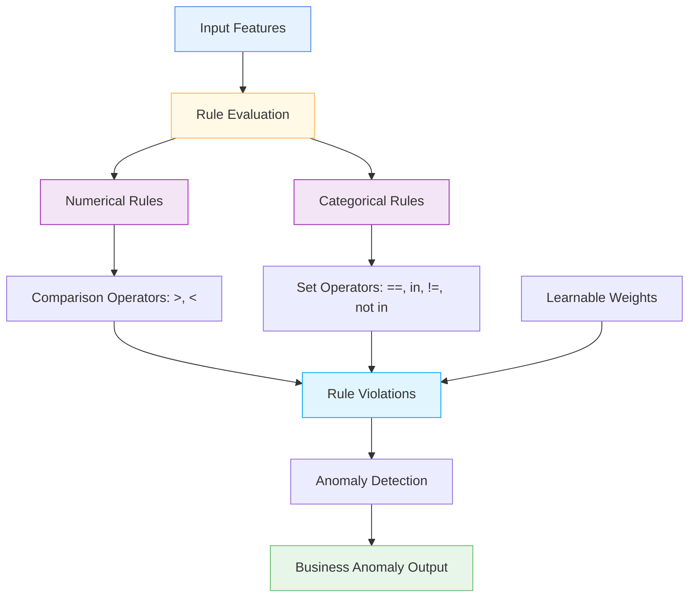

# 📋 BusinessRulesLayer

<div class="layer-hero">
  <div class="layer-hero-content">
    <h1>📋 BusinessRulesLayer</h1>
    <div class="layer-badges">
      <span class="badge badge-intermediate">🟡 Intermediate</span>
      <span class="badge badge-stable">✅ Stable</span>
      <span class="badge badge-popular">🔥 Popular</span>
    </div>
  </div>
</div>

## 🎯 Overview

The `BusinessRulesLayer` applies configurable business rules to neural network outputs, enabling the combination of learned patterns with explicit domain knowledge. This layer is particularly useful for anomaly detection and data validation where business rules can provide additional constraints.

This layer supports both numerical and categorical features with various comparison operators, making it flexible for different types of business rule validation.

## 🔍 How It Works

The BusinessRulesLayer processes data through configurable business rules:

1. **Rule Definition**: Defines business rules for numerical or categorical features
2. **Rule Evaluation**: Evaluates each rule against the input data
3. **Anomaly Detection**: Identifies data that violates business rules
4. **Weight Learning**: Optionally learns weights for soft rule enforcement
5. **Output Generation**: Produces anomaly detection results



## 💡 Why Use This Layer?

| Challenge | Traditional Approach | BusinessRulesLayer's Solution |
|-----------|---------------------|------------------------------|
| **Domain Knowledge** | Separate rule validation | 🎯 **Integrated business rules** in neural networks |
| **Anomaly Detection** | Statistical methods only | ⚡ **Rule-based anomaly** detection |
| **Data Validation** | Manual validation | 🧠 **Automatic validation** with business rules |
| **Interpretability** | Black box models | 🔗 **Interpretable** rule-based validation |

## 📊 Use Cases

- **Anomaly Detection**: Detecting data that violates business rules
- **Data Validation**: Validating data against business constraints
- **Domain Knowledge**: Incorporating domain expertise into models
- **Quality Control**: Ensuring data quality with business rules
- **Compliance**: Enforcing business compliance rules

## 🚀 Quick Start

### Basic Usage

```python
import keras
from kmr.layers import BusinessRulesLayer

# Create sample input data
batch_size, input_dim = 32, 1
x = keras.random.normal((batch_size, input_dim)) * 50  # Values around 0-50

# Apply business rules for numerical data
rules_layer = BusinessRulesLayer(
    rules=[(">", 0), ("<", 100)],  # Values must be between 0 and 100
    feature_type="numerical"
)
output = rules_layer(x)

print(f"Input shape: {x.shape}")           # (32, 1)
print(f"Output keys: {output.keys()}")     # ['business_anomaly']
print(f"Anomaly shape: {output['business_anomaly'].shape}")  # (32, 1)
```

### Categorical Rules

```python
import keras
from kmr.layers import BusinessRulesLayer

# Create sample categorical data
categorical_data = keras.ops.convert_to_tensor([
    ["red"], ["green"], ["blue"], ["yellow"]
])

# Apply business rules for categorical data
categorical_rules = BusinessRulesLayer(
    rules=[("in", ["red", "green", "blue"])],  # Only allow red, green, blue
    feature_type="categorical"
)
output = categorical_rules(categorical_data)

print(f"Anomaly detection: {output['business_anomaly']}")
# Output: [[False], [False], [False], [True]]  # yellow is anomalous
```

### In a Sequential Model

```python
import keras
from kmr.layers import BusinessRulesLayer

model = keras.Sequential([
    keras.layers.Dense(32, activation='relu'),
    keras.layers.Dense(16, activation='relu'),
    keras.layers.Dense(1, activation='sigmoid'),
    BusinessRulesLayer(
        rules=[(">", 0), ("<", 1)],  # Ensure output is between 0 and 1
        feature_type="numerical"
    )
])

model.compile(optimizer='adam', loss='binary_crossentropy', metrics=['accuracy'])
```

### In a Functional Model

```python
import keras
from kmr.layers import BusinessRulesLayer

# Define inputs
inputs = keras.Input(shape=(20,))  # 20 features

# Process features
x = keras.layers.Dense(32, activation='relu')(inputs)
x = keras.layers.Dense(16, activation='relu')(x)
x = keras.layers.Dense(1, activation='sigmoid')(x)

# Apply business rules
rules_output = BusinessRulesLayer(
    rules=[(">", 0), ("<", 1)],
    feature_type="numerical"
)(x)

# Combine with original output
combined = keras.layers.Concatenate()([x, rules_output['business_anomaly']])
final_output = keras.layers.Dense(1, activation='sigmoid')(combined)

model = keras.Model(inputs, final_output)
```

### Advanced Configuration

```python
# Advanced configuration with trainable weights
def create_business_rules_model():
    inputs = keras.Input(shape=(25,))
    
    # Process features
    x = keras.layers.Dense(64, activation='relu')(inputs)
    x = keras.layers.Dense(32, activation='relu')(x)
    x = keras.layers.Dense(16, activation='relu')(x)
    
    # Apply business rules with trainable weights
    rules_output = BusinessRulesLayer(
        rules=[(">", 0), ("<", 100), ("!=", 50)],  # Multiple rules
        feature_type="numerical",
        trainable_weights=True,  # Learn rule weights
        weight_initializer="ones"
    )(x)
    
    # Combine with anomaly information
    anomaly_info = rules_output['business_anomaly']
    combined = keras.layers.Concatenate()([x, anomaly_info])
    
    # Final processing
    x = keras.layers.Dense(8, activation='relu')(combined)
    x = keras.layers.Dropout(0.2)(x)
    
    # Multi-task output
    classification = keras.layers.Dense(3, activation='softmax', name='classification')(x)
    regression = keras.layers.Dense(1, name='regression')(x)
    anomaly = keras.layers.Dense(1, activation='sigmoid', name='anomaly')(x)
    
    return keras.Model(inputs, [classification, regression, anomaly])

model = create_business_rules_model()
model.compile(
    optimizer='adam',
    loss={'classification': 'categorical_crossentropy', 'regression': 'mse', 'anomaly': 'binary_crossentropy'},
    loss_weights={'classification': 1.0, 'regression': 0.5, 'anomaly': 0.3}
)
```

## 📖 API Reference

::: kmr.layers.BusinessRulesLayer

## 🔧 Parameters Deep Dive

### `rules` (list)
- **Purpose**: List of business rules to apply
- **Format**: List of tuples (operator, value)
- **Examples**: [(">", 0), ("<", 100)] for numerical, [("in", ["red", "green"])] for categorical
- **Impact**: Defines the business constraints to enforce
- **Recommendation**: Define rules based on domain knowledge

### `feature_type` (str)
- **Purpose**: Type of feature being validated
- **Options**: "numerical" or "categorical"
- **Impact**: Determines which operators are available
- **Recommendation**: Use "numerical" for continuous data, "categorical" for discrete data

### `trainable_weights` (bool)
- **Purpose**: Whether to use trainable weights for soft rule enforcement
- **Default**: True
- **Impact**: Allows learning optimal rule weights
- **Recommendation**: Use True for most applications

### `weight_initializer` (str or initializer)
- **Purpose**: Initializer for rule weights
- **Default**: "ones"
- **Impact**: Affects initial rule importance
- **Recommendation**: Use "ones" for equal initial importance

## 📈 Performance Characteristics

- **Speed**: ⚡⚡⚡⚡ Very fast - simple rule evaluation
- **Memory**: 💾 Low memory usage - minimal additional parameters
- **Accuracy**: 🎯🎯🎯🎯 Excellent for rule-based validation
- **Best For**: Data validation and anomaly detection with business rules

## 🎨 Examples

### Example 1: Financial Data Validation

```python
import keras
import numpy as np
from kmr.layers import BusinessRulesLayer

# Create financial data validation model
def create_financial_validation_model():
    inputs = keras.Input(shape=(10,))  # 10 financial features
    
    # Process financial features
    x = keras.layers.Dense(32, activation='relu')(inputs)
    x = keras.layers.Dense(16, activation='relu')(x)
    x = keras.layers.Dense(1, activation='sigmoid')(x)
    
    # Apply financial business rules
    rules_output = BusinessRulesLayer(
        rules=[(">", 0), ("<", 1)],  # Probability must be between 0 and 1
        feature_type="numerical",
        trainable_weights=True
    )(x)
    
    # Combine with anomaly information
    anomaly_info = rules_output['business_anomaly']
    combined = keras.layers.Concatenate()([x, anomaly_info])
    
    # Final output
    outputs = keras.layers.Dense(1, activation='sigmoid')(combined)
    
    return keras.Model(inputs, outputs)

model = create_financial_validation_model()
model.compile(optimizer='adam', loss='binary_crossentropy')

# Test with sample data
sample_data = keras.random.normal((100, 10))
predictions = model(sample_data)
print(f"Financial validation predictions shape: {predictions.shape}")
```

### Example 2: Categorical Data Validation

```python
# Create categorical data validation model
def create_categorical_validation_model():
    inputs = keras.Input(shape=(5,))  # 5 categorical features
    
    # Process categorical features
    x = keras.layers.Dense(32, activation='relu')(inputs)
    x = keras.layers.Dense(16, activation='relu')(x)
    x = keras.layers.Dense(1, activation='sigmoid')(x)
    
    # Apply categorical business rules
    rules_output = BusinessRulesLayer(
        rules=[(">", 0), ("<", 1)],  # Probability must be between 0 and 1
        feature_type="numerical",
        trainable_weights=True
    )(x)
    
    # Combine with anomaly information
    anomaly_info = rules_output['business_anomaly']
    combined = keras.layers.Concatenate()([x, anomaly_info])
    
    # Final output
    outputs = keras.layers.Dense(1, activation='sigmoid')(combined)
    
    return keras.Model(inputs, outputs)

model = create_categorical_validation_model()
model.compile(optimizer='adam', loss='binary_crossentropy')
```

### Example 3: Rule Analysis

```python
# Analyze rule violations
def analyze_rule_violations():
    # Create model with business rules
    inputs = keras.Input(shape=(15,))
    x = keras.layers.Dense(32, activation='relu')(inputs)
    x = keras.layers.Dense(16, activation='relu')(x)
    x = keras.layers.Dense(1, activation='sigmoid')(x)
    
    rules_output = BusinessRulesLayer(
        rules=[(">", 0), ("<", 1)],
        feature_type="numerical"
    )(x)
    
    model = keras.Model(inputs, [x, rules_output['business_anomaly']])
    
    # Test with different input patterns
    test_inputs = [
        keras.random.normal((10, 15)),  # Random data
        keras.random.normal((10, 15)) * 2,  # Scaled data
        keras.random.normal((10, 15)) + 1,  # Shifted data
    ]
    
    print("Rule Violation Analysis:")
    print("=" * 40)
    
    for i, test_input in enumerate(test_inputs):
        prediction, anomaly = model(test_input)
        print(f"Test {i+1}: Anomaly rate = {keras.ops.mean(anomaly):.4f}")
    
    return model

# Analyze rule violations
# model = analyze_rule_violations()
```

## 💡 Tips & Best Practices

- **Rule Definition**: Define rules based on domain knowledge
- **Feature Types**: Use appropriate feature types (numerical vs categorical)
- **Trainable Weights**: Use trainable weights for soft rule enforcement
- **Rule Complexity**: Start with simple rules, add complexity as needed
- **Validation**: Test rules on known good and bad data
- **Integration**: Combine with other layers for comprehensive validation

## ⚠️ Common Pitfalls

- **Feature Types**: Must match the actual data type
- **Rule Operators**: Use correct operators for each feature type
- **Rule Values**: Ensure rule values are appropriate for the data
- **Memory Usage**: Rules are evaluated for each sample
- **Gradient Flow**: Rules may not be differentiable

## 🔗 Related Layers

- [NumericalAnomalyDetection](numerical-anomaly-detection.md) - Numerical anomaly detection
- [CategoricalAnomalyDetectionLayer](categorical-anomaly-detection-layer.md) - Categorical anomaly detection
- [FeatureCutout](feature-cutout.md) - Feature regularization
- [StochasticDepth](stochastic-depth.md) - Stochastic depth regularization

## 📚 Further Reading

- [Business Rules](https://en.wikipedia.org/wiki/Business_rule) - Business rule concepts
- [Anomaly Detection](https://en.wikipedia.org/wiki/Anomaly_detection) - Anomaly detection techniques
- [Data Validation](https://en.wikipedia.org/wiki/Data_validation) - Data validation concepts
- [KMR Layer Explorer](../layers_overview.md) - Browse all available layers
- [Feature Engineering Tutorial](../tutorials/feature-engineering.md) - Complete guide to feature engineering
