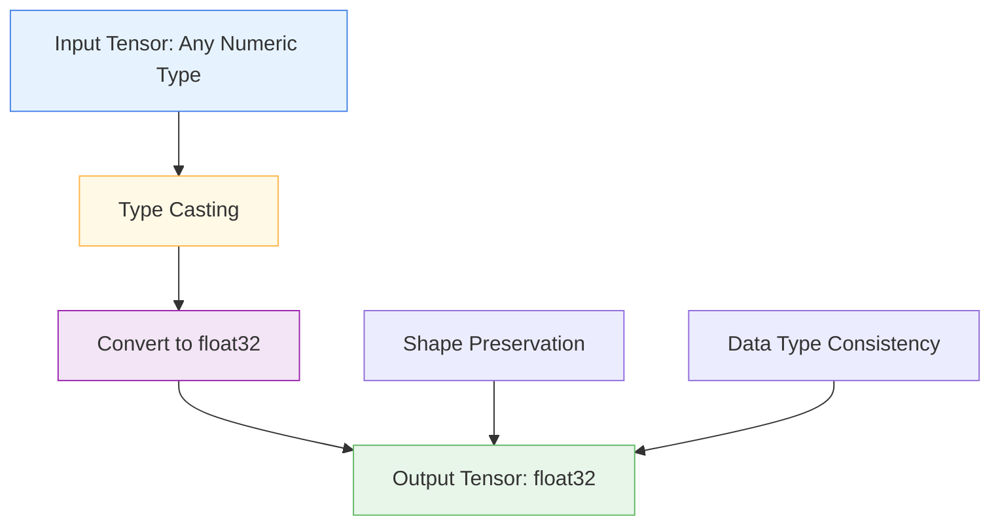

# 🔄 CastToFloat32Layer

<div class="layer-hero">
  <div class="layer-hero-content">
    <h1>🔄 CastToFloat32Layer</h1>
    <div class="layer-badges">
      <span class="badge badge-beginner">🟢 Beginner</span>
      <span class="badge badge-stable">✅ Stable</span>
      <span class="badge badge-popular">🔥 Popular</span>
    </div>
  </div>
</div>

## 🎯 Overview

The `CastToFloat32Layer` casts input tensors to float32 data type, ensuring consistent data types in a model. This layer is particularly useful when working with mixed precision or when receiving inputs of various data types.

This layer is essential for data preprocessing pipelines where data type consistency is crucial for neural network training and inference.

## 🔍 How It Works

The CastToFloat32Layer processes tensors through simple type casting:

1. **Input Validation**: Accepts tensors of any numeric data type
2. **Type Casting**: Converts input tensor to float32 data type
3. **Shape Preservation**: Maintains the original tensor shape
4. **Output Generation**: Produces float32 tensor with same shape



## 💡 Why Use This Layer?

| Challenge | Traditional Approach | CastToFloat32Layer's Solution |
|-----------|---------------------|------------------------------|
| **Data Type Inconsistency** | Manual type conversion | 🎯 **Automatic casting** to float32 |
| **Mixed Precision** | Complex type handling | ⚡ **Simplified type** management |
| **Model Compatibility** | Manual type checking | 🧠 **Ensures compatibility** with neural networks |
| **Data Preprocessing** | Separate conversion steps | 🔗 **Integrated type** casting in pipelines |

## 📊 Use Cases

- **Data Type Standardization**: Ensuring consistent float32 data types
- **Mixed Precision Training**: Converting inputs to float32 for training
- **Data Preprocessing**: Type casting in preprocessing pipelines
- **Model Compatibility**: Ensuring inputs are compatible with neural networks
- **Data Loading**: Converting loaded data to appropriate types

## 🚀 Quick Start

### Basic Usage

```python
import keras
import numpy as np
from kerasfactory.layers import CastToFloat32Layer

# Create sample input data with different types
int_data = keras.ops.convert_to_tensor(np.array([1, 2, 3], dtype=np.int64))
float64_data = keras.ops.convert_to_tensor(np.array([1.0, 2.0, 3.0], dtype=np.float64))

# Apply type casting
cast_layer = CastToFloat32Layer()
int_float32 = cast_layer(int_data)
float64_float32 = cast_layer(float64_data)

print(f"Input types: {int_data.dtype}, {float64_data.dtype}")
print(f"Output types: {int_float32.dtype}, {float64_float32.dtype}")
# Output: Input types: int64, float64
#         Output types: float32, float32
```

### In a Sequential Model

```python
import keras
from kerasfactory.layers import CastToFloat32Layer

model = keras.Sequential([
    CastToFloat32Layer(),  # Cast to float32 first
    keras.layers.Dense(32, activation='relu'),
    keras.layers.Dense(16, activation='relu'),
    keras.layers.Dense(1, activation='sigmoid')
])

model.compile(optimizer='adam', loss='binary_crossentropy', metrics=['accuracy'])
```

### In a Functional Model

```python
import keras
from kerasfactory.layers import CastToFloat32Layer

# Define inputs
inputs = keras.Input(shape=(10,))  # 10 features

# Apply type casting
x = CastToFloat32Layer()(inputs)

# Continue processing
x = keras.layers.Dense(32, activation='relu')(x)
x = keras.layers.Dropout(0.2)(x)
x = keras.layers.Dense(16, activation='relu')(x)
outputs = keras.layers.Dense(1, activation='sigmoid')(x)

model = keras.Model(inputs, outputs)
```

### Advanced Configuration

```python
# Advanced configuration with custom naming
def create_typed_model():
    # Input for mixed data types
    inputs = keras.Input(shape=(20,))
    
    # Apply type casting with custom name
    x = CastToFloat32Layer(name="input_type_casting")(inputs)
    
    # Process with different branches
    branch1 = keras.layers.Dense(32, activation='relu')(x)
    branch1 = keras.layers.Dense(16, activation='relu')(branch1)
    
    branch2 = keras.layers.Dense(32, activation='tanh')(x)
    branch2 = keras.layers.Dense(16, activation='tanh')(branch2)
    
    # Combine branches
    x = keras.layers.Concatenate()([branch1, branch2])
    x = keras.layers.Dense(64, activation='relu')(x)
    x = keras.layers.Dropout(0.3)(x)
    
    # Multi-task output
    classification = keras.layers.Dense(3, activation='softmax', name='classification')(x)
    regression = keras.layers.Dense(1, name='regression')(x)
    
    return keras.Model(inputs, [classification, regression])

model = create_typed_model()
model.compile(
    optimizer='adam',
    loss={'classification': 'categorical_crossentropy', 'regression': 'mse'},
    loss_weights={'classification': 1.0, 'regression': 0.5}
)
```

## 📖 API Reference

::: kerasfactory.layers.CastToFloat32Layer

## 🔧 Parameters Deep Dive

### No Parameters
- **Purpose**: This layer has no configurable parameters
- **Behavior**: Automatically casts input to float32
- **Output**: Always produces float32 tensor with same shape

## 📈 Performance Characteristics

- **Speed**: ⚡⚡⚡⚡ Very fast - simple type casting operation
- **Memory**: 💾 Low memory usage - no additional parameters
- **Accuracy**: 🎯🎯🎯🎯 Perfect for type conversion
- **Best For**: Data type standardization and mixed precision handling

## 🎨 Examples

### Example 1: Mixed Data Type Handling

```python
import keras
import numpy as np
from kerasfactory.layers import CastToFloat32Layer

# Handle mixed data types in a preprocessing pipeline
def create_mixed_type_pipeline():
    # Input for mixed data types
    inputs = keras.Input(shape=(15,))
    
    # Apply type casting
    x = CastToFloat32Layer()(inputs)
    
    # Process with different preprocessing
    x = keras.layers.Dense(32, activation='relu')(x)
    x = keras.layers.BatchNormalization()(x)
    x = keras.layers.Dropout(0.2)(x)
    x = keras.layers.Dense(16, activation='relu')(x)
    
    # Output
    outputs = keras.layers.Dense(1, activation='sigmoid')(x)
    
    return keras.Model(inputs, outputs)

model = create_mixed_type_pipeline()

# Test with different data types
int_data = keras.ops.convert_to_tensor(np.random.randint(0, 10, (10, 15)), dtype="int32")
float64_data = keras.ops.convert_to_tensor(np.random.randn(10, 15), dtype="float64")

# Both should work with the model
int_pred = model(int_data)
float64_pred = model(float64_data)

print(f"Int32 input prediction shape: {int_pred.shape}")
print(f"Float64 input prediction shape: {float64_pred.shape}")
```

### Example 2: Data Loading Pipeline

```python
# Create a data loading pipeline with type casting
def create_data_loading_pipeline():
    # Input for loaded data
    inputs = keras.Input(shape=(25,))
    
    # Apply type casting
    x = CastToFloat32Layer()(inputs)
    
    # Data preprocessing
    x = keras.layers.Dense(64, activation='relu')(x)
    x = keras.layers.BatchNormalization()(x)
    x = keras.layers.Dropout(0.2)(x)
    
    # Feature processing
    x = keras.layers.Dense(32, activation='relu')(x)
    x = keras.layers.Dropout(0.1)(x)
    x = keras.layers.Dense(16, activation='relu')(x)
    
    # Multi-task output
    classification = keras.layers.Dense(5, activation='softmax', name='classification')(x)
    regression = keras.layers.Dense(1, name='regression')(x)
    
    return keras.Model(inputs, [classification, regression])

model = create_data_loading_pipeline()
model.compile(
    optimizer='adam',
    loss={'classification': 'categorical_crossentropy', 'regression': 'mse'},
    loss_weights={'classification': 1.0, 'regression': 0.5}
)
```

### Example 3: Type Safety Validation

```python
# Validate type safety in a model
def validate_type_safety():
    # Create model with type casting
    inputs = keras.Input(shape=(10,))
    x = CastToFloat32Layer()(inputs)
    x = keras.layers.Dense(32, activation='relu')(x)
    outputs = keras.layers.Dense(1, activation='sigmoid')(x)
    
    model = keras.Model(inputs, outputs)
    
    # Test with different data types
    test_cases = [
        ("int32", keras.ops.convert_to_tensor(np.random.randint(0, 10, (5, 10)), dtype="int32")),
        ("int64", keras.ops.convert_to_tensor(np.random.randint(0, 10, (5, 10)), dtype="int64")),
        ("float32", keras.ops.convert_to_tensor(np.random.randn(5, 10), dtype="float32")),
        ("float64", keras.ops.convert_to_tensor(np.random.randn(5, 10), dtype="float64")),
    ]
    
    print("Type Safety Validation:")
    print("=" * 40)
    
    for dtype_name, data in test_cases:
        try:
            prediction = model(data)
            output_dtype = prediction.dtype
            print(f"{dtype_name:>8} -> {output_dtype:>8} ✓")
        except Exception as e:
            print(f"{dtype_name:>8} -> Error: {e}")
    
    return model

# Validate type safety
# model = validate_type_safety()
```

## 💡 Tips & Best Practices

- **Input Types**: Accepts any numeric data type
- **Output Type**: Always produces float32 tensor
- **Shape Preservation**: Maintains original tensor shape
- **Performance**: Very fast with minimal overhead
- **Integration**: Works seamlessly with other Keras layers
- **Memory**: No additional memory overhead

## ⚠️ Common Pitfalls

- **Non-Numeric Types**: Doesn't handle string or boolean types
- **Shape Changes**: Doesn't change tensor shape, only data type
- **Precision Loss**: May lose precision when converting from higher precision types
- **Memory Usage**: Creates new tensor, doesn't modify in-place
- **Gradient Flow**: Maintains gradient flow through type casting

## 🔗 Related Layers

- [DifferentiableTabularPreprocessor](differentiable-tabular-preprocessor.md) - End-to-end preprocessing
- [DifferentialPreprocessingLayer](differential-preprocessing-layer.md) - Advanced preprocessing
- [DateParsingLayer](date-parsing-layer.md) - Date string parsing
- [FeatureCutout](feature-cutout.md) - Feature regularization

## 📚 Further Reading

- [Data Type Conversion](https://en.wikipedia.org/wiki/Type_conversion) - Type conversion concepts
- [Mixed Precision Training](https://en.wikipedia.org/wiki/Mixed_precision) - Mixed precision techniques
- [Neural Network Data Types](https://en.wikipedia.org/wiki/Floating_point) - Floating point representation
- [KerasFactory Layer Explorer](../layers_overview.md) - Browse all available layers
- [Data Preprocessing Tutorial](../tutorials/feature-engineering.md) - Complete guide to data preprocessing
