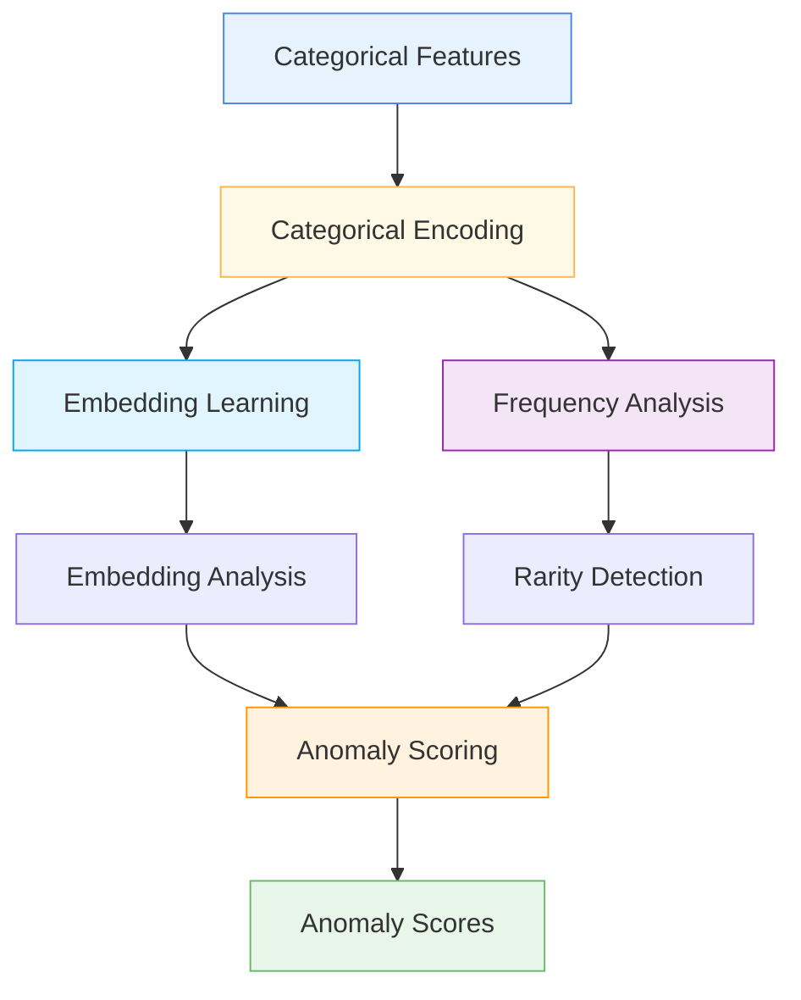

# 🔍 CategoricalAnomalyDetectionLayer

<div class="layer-hero">
  <div class="layer-hero-content">
    <h1>🔍 CategoricalAnomalyDetectionLayer</h1>
    <div class="layer-badges">
      <span class="badge badge-intermediate">🟡 Intermediate</span>
      <span class="badge badge-stable">✅ Stable</span>
      <span class="badge badge-popular">🔥 Popular</span>
    </div>
  </div>
</div>

## 🎯 Overview

The `CategoricalAnomalyDetectionLayer` identifies outliers in categorical features by learning the distribution of categorical values and detecting rare or unusual combinations. It uses embedding-based approaches and frequency analysis to detect anomalies in categorical data.

This layer is particularly powerful for identifying outliers in categorical data, providing a specialized approach for non-numerical features that traditional statistical methods may not handle well.

## 🔍 How It Works

The CategoricalAnomalyDetectionLayer processes data through categorical anomaly detection:

1. **Categorical Encoding**: Encodes categorical features into embeddings
2. **Frequency Analysis**: Analyzes frequency of categorical values
3. **Rarity Detection**: Identifies rare or unusual categorical combinations
4. **Embedding Learning**: Learns embeddings for categorical values
5. **Anomaly Scoring**: Computes anomaly scores based on rarity and embeddings
6. **Output Generation**: Produces anomaly scores for each categorical feature



## 💡 Why Use This Layer?

| Challenge | Traditional Approach | CategoricalAnomalyDetectionLayer's Solution |
|-----------|---------------------|--------------------------------------------|
| **Categorical Outliers** | Limited methods | 🎯 **Specialized approach** for categorical data |
| **Rarity Detection** | Manual frequency analysis | ⚡ **Automatic rarity** detection |
| **Embedding Learning** | No embedding learning | 🧠 **Embedding-based** anomaly detection |
| **Frequency Analysis** | Static frequency analysis | 🔗 **Dynamic frequency** analysis |

## 📊 Use Cases

- **Categorical Outlier Detection**: Identifying outliers in categorical features
- **Data Quality**: Ensuring data quality through categorical anomaly detection
- **Rarity Analysis**: Analyzing rare categorical combinations
- **Embedding Learning**: Learning embeddings for categorical values
- **Frequency Analysis**: Analyzing frequency of categorical values

## 🚀 Quick Start

### Basic Usage

```python
import keras
from kerasfactory.layers import CategoricalAnomalyDetectionLayer

# Create sample categorical data
batch_size, num_features = 32, 5
x = keras.ops.convert_to_tensor([
    ["red", "small", "A", "high", "yes"],
    ["blue", "large", "B", "low", "no"],
    ["green", "medium", "C", "medium", "yes"],
    # ... more samples
])

# Apply categorical anomaly detection
anomaly_layer = CategoricalAnomalyDetectionLayer()
anomaly_scores = anomaly_layer(x)

print(f"Input shape: {x.shape}")           # (32, 5)
print(f"Anomaly scores shape: {anomaly_scores.shape}")  # (32, 5)
```

### In a Sequential Model

```python
import keras
from kerasfactory.layers import CategoricalAnomalyDetectionLayer

model = keras.Sequential([
    keras.layers.Dense(32, activation='relu'),
    CategoricalAnomalyDetectionLayer(),
    keras.layers.Dense(16, activation='relu'),
    keras.layers.Dense(1, activation='sigmoid')
])

model.compile(optimizer='adam', loss='binary_crossentropy', metrics=['accuracy'])
```

### In a Functional Model

```python
import keras
from kerasfactory.layers import CategoricalAnomalyDetectionLayer

# Define inputs
inputs = keras.Input(shape=(10,), dtype='string')  # 10 categorical features

# Apply categorical anomaly detection
anomaly_scores = CategoricalAnomalyDetectionLayer()(inputs)

# Continue processing
x = keras.layers.Dense(32, activation='relu')(inputs)
x = keras.layers.Dense(16, activation='relu')(x)
outputs = keras.layers.Dense(1, activation='sigmoid')(x)

model = keras.Model(inputs, [outputs, anomaly_scores])
```

### Advanced Configuration

```python
# Advanced configuration with multiple anomaly detection layers
def create_categorical_anomaly_network():
    inputs = keras.Input(shape=(15,), dtype='string')  # 15 categorical features
    
    # Multiple anomaly detection layers
    anomaly_scores1 = CategoricalAnomalyDetectionLayer()(inputs)
    
    x = keras.layers.Dense(64, activation='relu')(inputs)
    x = keras.layers.BatchNormalization()(x)
    
    anomaly_scores2 = CategoricalAnomalyDetectionLayer()(x)
    
    x = keras.layers.Dense(32, activation='relu')(x)
    x = keras.layers.Dropout(0.2)(x)
    
    # Multi-task output
    classification = keras.layers.Dense(3, activation='softmax', name='classification')(x)
    regression = keras.layers.Dense(1, name='regression')(x)
    anomaly = keras.layers.Dense(1, activation='sigmoid', name='anomaly')(x)
    
    return keras.Model(inputs, [classification, regression, anomaly, anomaly_scores1, anomaly_scores2])

model = create_categorical_anomaly_network()
model.compile(
    optimizer='adam',
    loss={'classification': 'categorical_crossentropy', 'regression': 'mse', 'anomaly': 'binary_crossentropy'},
    loss_weights={'classification': 1.0, 'regression': 0.5, 'anomaly': 0.3}
)
```

## 📖 API Reference

::: kerasfactory.layers.CategoricalAnomalyDetectionLayer

## 🔧 Parameters Deep Dive

### `embedding_dim` (int, optional)
- **Purpose**: Dimension of categorical embeddings
- **Range**: 8 to 64+ (typically 16-32)
- **Impact**: Larger values = more expressive embeddings but more parameters
- **Recommendation**: Start with 16-32, scale based on data complexity

### `frequency_threshold` (float, optional)
- **Purpose**: Threshold for frequency-based anomaly detection
- **Range**: 0.0 to 1.0 (typically 0.01-0.1)
- **Impact**: Lower values = more sensitive to rare values
- **Recommendation**: Use 0.01-0.05 for most applications

### `embedding_weight` (float, optional)
- **Purpose**: Weight for embedding-based anomaly detection
- **Range**: 0.0 to 1.0 (typically 0.3-0.7)
- **Impact**: Higher values = more emphasis on embedding-based detection
- **Recommendation**: Use 0.3-0.7 based on data characteristics

## 📈 Performance Characteristics

- **Speed**: ⚡⚡⚡ Fast for small to medium models, scales with embedding dimension
- **Memory**: 💾💾💾 Moderate memory usage due to embeddings
- **Accuracy**: 🎯🎯🎯🎯 Excellent for categorical anomaly detection
- **Best For**: Categorical data with potential outliers

## 🎨 Examples

### Example 1: Categorical Outlier Detection

```python
import keras
import numpy as np
from kerasfactory.layers import CategoricalAnomalyDetectionLayer

# Create a model for categorical outlier detection
def create_categorical_outlier_model():
    inputs = keras.Input(shape=(10,), dtype='string')  # 10 categorical features
    
    # Anomaly detection layer
    anomaly_scores = CategoricalAnomalyDetectionLayer()(inputs)
    
    # Process features
    x = keras.layers.Dense(32, activation='relu')(inputs)
    x = keras.layers.BatchNormalization()(x)
    x = keras.layers.Dense(16, activation='relu')(x)
    x = keras.layers.Dropout(0.2)(x)
    
    # Output
    outputs = keras.layers.Dense(1, activation='sigmoid')(x)
    
    return keras.Model(inputs, [outputs, anomaly_scores])

model = create_categorical_outlier_model()
model.compile(optimizer='adam', loss='binary_crossentropy')

# Test with sample data
sample_data = keras.ops.convert_to_tensor([
    ["red", "small", "A", "high", "yes", "cat", "fast", "new", "good", "up"],
    ["blue", "large", "B", "low", "no", "dog", "slow", "old", "bad", "down"],
    # ... more samples
])
predictions, anomaly_scores = model(sample_data)
print(f"Categorical outlier predictions shape: {predictions.shape}")
print(f"Anomaly scores shape: {anomaly_scores.shape}")
```

### Example 2: Rarity Analysis

```python
# Analyze rarity in categorical data
def analyze_categorical_rarity():
    # Create model with categorical anomaly detection
    inputs = keras.Input(shape=(8,), dtype='string')
    anomaly_scores = CategoricalAnomalyDetectionLayer()(inputs)
    outputs = keras.layers.Dense(1, activation='sigmoid')(inputs)
    
    model = keras.Model(inputs, [outputs, anomaly_scores])
    
    # Test with different categorical patterns
    test_inputs = [
        keras.ops.convert_to_tensor([["common", "frequent", "usual", "normal", "typical", "standard", "regular", "ordinary"]]),
        keras.ops.convert_to_tensor([["rare", "unusual", "strange", "abnormal", "atypical", "nonstandard", "irregular", "extraordinary"]]),
    ]
    
    print("Categorical Rarity Analysis:")
    print("=" * 40)
    
    for i, test_input in enumerate(test_inputs):
        prediction, anomaly = model(test_input)
        print(f"Test {i+1}: Anomaly mean = {keras.ops.mean(anomaly):.4f}")
    
    return model

# Analyze categorical rarity
# model = analyze_categorical_rarity()
```

### Example 3: Frequency Analysis

```python
# Analyze frequency patterns in categorical data
def analyze_categorical_frequency():
    # Create model with categorical anomaly detection
    inputs = keras.Input(shape=(6,), dtype='string')
    anomaly_scores = CategoricalAnomalyDetectionLayer()(inputs)
    
    model = keras.Model(inputs, anomaly_scores)
    
    # Test with sample data
    sample_data = keras.ops.convert_to_tensor([
        ["red", "small", "A", "high", "yes", "cat"],
        ["blue", "large", "B", "low", "no", "dog"],
        # ... more samples
    ])
    anomaly_scores = model(sample_data)
    
    print("Categorical Frequency Analysis:")
    print("=" * 40)
    print(f"Input shape: {sample_data.shape}")
    print(f"Anomaly scores shape: {anomaly_scores.shape}")
    print(f"Model parameters: {model.count_params()}")
    
    return model

# Analyze categorical frequency
# model = analyze_categorical_frequency()
```

## 💡 Tips & Best Practices

- **Embedding Dimension**: Start with 16-32, scale based on data complexity
- **Frequency Threshold**: Use 0.01-0.05 for most applications
- **Embedding Weight**: Balance embedding and frequency-based detection
- **Categorical Encoding**: Ensure proper categorical encoding
- **Rarity Analysis**: Monitor rarity patterns for interpretability
- **Frequency Analysis**: Track frequency changes over time

## ⚠️ Common Pitfalls

- **Embedding Dimension**: Must be positive integer
- **Frequency Threshold**: Must be between 0 and 1
- **Embedding Weight**: Must be between 0 and 1
- **Memory Usage**: Scales with embedding dimension and vocabulary size
- **Categorical Encoding**: Ensure proper string tensor handling

## 🔗 Related Layers

- [NumericalAnomalyDetection](numerical-anomaly-detection.md) - Numerical anomaly detection
- [BusinessRulesLayer](business-rules-layer.md) - Business rules validation
- [FeatureCutout](feature-cutout.md) - Feature regularization
- [DistributionAwareEncoder](distribution-aware-encoder.md) - Distribution-aware encoding

## 📚 Further Reading

- [Categorical Data](https://en.wikipedia.org/wiki/Categorical_variable) - Categorical data concepts
- [Anomaly Detection](https://en.wikipedia.org/wiki/Anomaly_detection) - Anomaly detection techniques
- [Frequency Analysis](https://en.wikipedia.org/wiki/Frequency_analysis) - Frequency analysis concepts
- [KerasFactory Layer Explorer](../layers_overview.md) - Browse all available layers
- [Feature Engineering Tutorial](../tutorials/feature-engineering.md) - Complete guide to feature engineering
