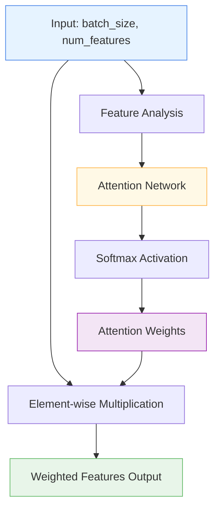

# 📊 ColumnAttention

<div class="layer-hero">
  <div class="layer-hero-content">
    <h1>📊 ColumnAttention</h1>
    <div class="layer-badges">
      <span class="badge badge-intermediate">🟡 Intermediate</span>
      <span class="badge badge-stable">✅ Stable</span>
      <span class="badge badge-popular">🔥 Popular</span>
    </div>
  </div>
</div>

## 🎯 Overview

The `ColumnAttention` layer implements a column-wise attention mechanism that dynamically weights features based on their importance and context. Unlike traditional attention mechanisms that focus on sequence relationships, this layer learns to assign attention weights to each feature (column) in tabular data, allowing the model to focus on the most relevant features for each prediction.

This layer is particularly useful for feature selection, interpretability, and improving model performance by learning which features are most important for each sample.

## 🔍 How It Works

The ColumnAttention layer processes tabular data through a feature-wise attention mechanism:

1. **Feature Analysis**: Analyzes all input features to understand their importance
2. **Attention Weight Generation**: Uses a neural network to compute attention weights for each feature
3. **Dynamic Weighting**: Applies learned weights to scale feature importance
4. **Weighted Output**: Returns the input features scaled by their attention weights



## 💡 Why Use This Layer?

| Challenge | Traditional Approach | ColumnAttention's Solution |
|-----------|---------------------|---------------------------|
| **Feature Importance** | Manual feature selection or uniform treatment | 🎯 **Automatic learning** of feature importance per sample |
| **Dynamic Weighting** | Static feature weights or simple normalization | ⚡ **Context-aware** feature weighting based on input |
| **Interpretability** | Black-box feature processing | 👁️ **Transparent** attention weights show feature importance |
| **Noise Reduction** | All features treated equally | 🔇 **Automatic filtering** of less important features |

## 📊 Use Cases

- **Feature Selection**: Automatically identifying and emphasizing important features
- **Noise Reduction**: Down-weighting irrelevant or noisy features
- **Interpretability**: Understanding which features drive predictions
- **Data Quality**: Handling datasets with varying feature importance
- **Model Regularization**: Preventing overfitting by focusing on important features

## 🚀 Quick Start

### Basic Usage

```python
import keras
from kmr.layers import ColumnAttention

# Create sample tabular data
batch_size, num_features = 32, 10
x = keras.random.normal((batch_size, num_features))

# Apply column attention
attention = ColumnAttention(input_dim=num_features)
weighted_features = attention(x)

print(f"Input shape: {x.shape}")           # (32, 10)
print(f"Output shape: {weighted_features.shape}")  # (32, 10)
```

### In a Sequential Model

```python
import keras
from kmr.layers import ColumnAttention

model = keras.Sequential([
    keras.layers.Dense(64, activation='relu'),
    ColumnAttention(input_dim=64),  # Apply attention to 64 features
    keras.layers.Dense(32, activation='relu'),
    keras.layers.Dense(1, activation='sigmoid')
])

model.compile(optimizer='adam', loss='binary_crossentropy', metrics=['accuracy'])
```

### In a Functional Model

```python
import keras
from kmr.layers import ColumnAttention

# Define inputs
inputs = keras.Input(shape=(20,))  # 20 features

# Process features
x = keras.layers.Dense(64, activation='relu')(inputs)
x = ColumnAttention(input_dim=64)(x)  # Apply column attention
x = keras.layers.Dropout(0.2)(x)
x = keras.layers.Dense(32, activation='relu')(x)
outputs = keras.layers.Dense(1, activation='sigmoid')(x)

model = keras.Model(inputs, outputs)
```

### Advanced Configuration

```python
# Advanced configuration with custom hidden dimension
attention = ColumnAttention(
    input_dim=128,
    hidden_dim=64,  # Custom hidden layer size
    name="custom_column_attention"
)

# Use in a complex model
inputs = keras.Input(shape=(50,))
x = keras.layers.Dense(128, activation='relu')(inputs)
x = attention(x)  # Apply column attention
x = keras.layers.LayerNormalization()(x)
x = keras.layers.Dense(64, activation='relu')(x)
x = keras.layers.Dropout(0.3)(x)
outputs = keras.layers.Dense(5, activation='softmax')(x)

model = keras.Model(inputs, outputs)
```

## 📖 API Reference

::: kmr.layers.ColumnAttention

## 🔧 Parameters Deep Dive

### `input_dim` (int)
- **Purpose**: Number of input features to apply attention to
- **Range**: 1 to 1000+ (typically 10-100)
- **Impact**: Must match the number of features in your input
- **Recommendation**: Set to the output dimension of your previous layer

### `hidden_dim` (int, optional)
- **Purpose**: Size of the hidden layer in the attention network
- **Range**: 1 to input_dim (default: input_dim // 2)
- **Impact**: Larger values = more complex attention patterns but more parameters
- **Recommendation**: Start with default, increase for complex feature interactions

## 📈 Performance Characteristics

- **Speed**: ⚡⚡⚡⚡ Very fast - simple neural network computation
- **Memory**: 💾💾 Low memory usage - minimal additional parameters
- **Accuracy**: 🎯🎯🎯 Good for feature importance and noise reduction
- **Best For**: Tabular data where feature importance varies by sample

## 🎨 Examples

### Example 1: Feature Importance Analysis

```python
import keras
import numpy as np
from kmr.layers import ColumnAttention

# Create data with varying feature importance
np.random.seed(42)
batch_size, num_features = 100, 8

# Features 0, 2, 5 are important, others are noise
important_features = np.random.normal(0, 1, (batch_size, 3))
noise_features = np.random.normal(0, 0.1, (batch_size, 5))
x = np.concatenate([important_features[:, [0]], noise_features[:, [0]], 
                   important_features[:, [1]], noise_features[:, [1]], 
                   noise_features[:, [2]], important_features[:, [2]], 
                   noise_features[:, [3]], noise_features[:, [4]]], axis=1)

# Build model with column attention
inputs = keras.Input(shape=(num_features,))
x = keras.layers.Dense(16, activation='relu')(inputs)
x = ColumnAttention(input_dim=16)(x)  # Learn feature importance
x = keras.layers.Dense(8, activation='relu')(x)
outputs = keras.layers.Dense(1, activation='sigmoid')(x)

model = keras.Model(inputs, outputs)
model.compile(optimizer='adam', loss='binary_crossentropy')

# Train and analyze attention weights
model.fit(x, np.random.randint(0, 2, (batch_size, 1)), epochs=10, verbose=0)

# Get attention weights for interpretability
attention_layer = model.layers[2]  # ColumnAttention layer
attention_weights = attention_layer.attention_net(x[:5])  # Get weights for first 5 samples
print("Attention weights shape:", attention_weights.shape)
print("Sample attention weights:", attention_weights[0])
```

### Example 2: Multi-Task Learning with Feature Attention

```python
# Multi-task model where different tasks need different features
def create_multi_task_model():
    inputs = keras.Input(shape=(20,))
    
    # Shared feature processing with attention
    x = keras.layers.Dense(64, activation='relu')(inputs)
    x = ColumnAttention(input_dim=64)(x)
    
    # Task 1: Classification (needs different features)
    task1 = keras.layers.Dense(32, activation='relu')(x)
    task1 = keras.layers.Dropout(0.2)(task1)
    task1_output = keras.layers.Dense(3, activation='softmax', name='classification')(task1)
    
    # Task 2: Regression (needs different features)
    task2 = keras.layers.Dense(32, activation='relu')(x)
    task2 = keras.layers.Dropout(0.2)(task2)
    task2_output = keras.layers.Dense(1, name='regression')(task2)
    
    return keras.Model(inputs, [task1_output, task2_output])

model = create_multi_task_model()
model.compile(
    optimizer='adam',
    loss={'classification': 'categorical_crossentropy', 'regression': 'mse'},
    loss_weights={'classification': 1.0, 'regression': 0.5}
)
```

### Example 3: Noisy Data Handling

```python
# Handle noisy tabular data with column attention
def create_robust_model():
    inputs = keras.Input(shape=(30,))
    
    # Initial feature processing
    x = keras.layers.Dense(128, activation='relu')(inputs)
    x = keras.layers.BatchNormalization()(x)
    
    # Column attention to focus on important features
    x = ColumnAttention(input_dim=128, hidden_dim=64)(x)
    
    # Additional processing
    x = keras.layers.Dense(64, activation='relu')(x)
    x = keras.layers.Dropout(0.3)(x)
    x = keras.layers.Dense(32, activation='relu')(x)
    
    # Output
    outputs = keras.layers.Dense(1, activation='sigmoid')(x)
    
    return keras.Model(inputs, outputs)

# Use with noisy data
model = create_robust_model()
model.compile(optimizer='adam', loss='binary_crossentropy')

# The column attention will automatically learn to down-weight noisy features
```

## 💡 Tips & Best Practices

- **Placement**: Use after initial feature processing but before final predictions
- **Hidden Dimension**: Start with input_dim // 2, adjust based on complexity
- **Regularization**: Combine with dropout and batch normalization for better generalization
- **Interpretability**: Access attention weights to understand feature importance
- **Data Quality**: Particularly effective with noisy or high-dimensional data
- **Monitoring**: Track attention weight distributions during training

## ⚠️ Common Pitfalls

- **Input Shape**: Must be 2D tensor (batch_size, num_features)
- **Dimension Mismatch**: input_dim must match the number of features
- **Overfitting**: Can overfit on small datasets - use regularization
- **Memory**: Hidden dimension affects memory usage - keep reasonable
- **Interpretation**: Attention weights are relative, not absolute importance

## 🔗 Related Layers

- [RowAttention](row-attention.md) - Row-wise attention for sample relationships
- [TabularAttention](tabular-attention.md) - General tabular attention mechanism
- [VariableSelection](variable-selection.md) - Feature selection layer
- [SparseAttentionWeighting](sparse-attention-weighting.md) - Sparse attention weights

## 📚 Further Reading

- [Attention Mechanisms in Deep Learning](https://distill.pub/2016/augmented-rnns/) - Understanding attention mechanisms
- [Feature Selection in Machine Learning](https://en.wikipedia.org/wiki/Feature_selection) - Feature selection concepts
- [KMR Layer Explorer](../layers_overview.md) - Browse all available layers
- [Feature Engineering Tutorial](../tutorials/feature-engineering.md) - Complete guide to feature engineering
