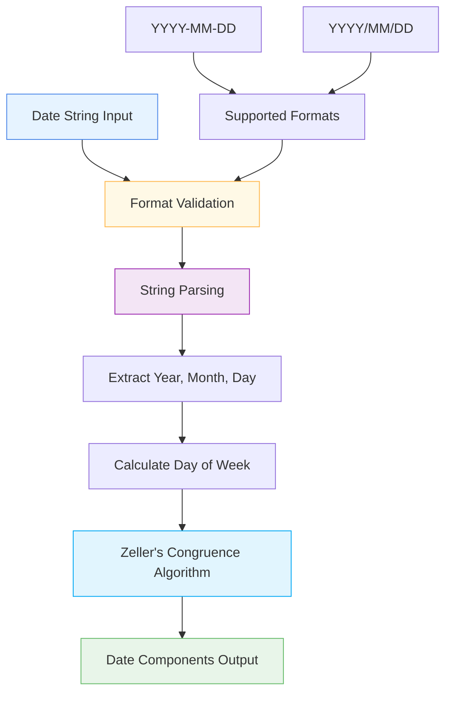

# 📅 DateParsingLayer

<div class="layer-hero">
  <div class="layer-hero-content">
    <h1>📅 DateParsingLayer</h1>
    <div class="layer-badges">
      <span class="badge badge-beginner">🟢 Beginner</span>
      <span class="badge badge-stable">✅ Stable</span>
      <span class="badge badge-popular">🔥 Popular</span>
    </div>
  </div>
</div>

## 🎯 Overview

The `DateParsingLayer` takes date strings in a specified format and returns a tensor containing the year, month, day of the month, and day of the week. This layer is essential for processing temporal data and converting date strings into numerical features that can be used by neural networks.

This layer supports multiple date formats and automatically calculates the day of the week using Zeller's congruence algorithm, making it perfect for time series analysis and temporal feature engineering.

## 🔍 How It Works

The DateParsingLayer processes date strings through intelligent parsing:

1. **Format Validation**: Validates the input date format
2. **String Parsing**: Extracts year, month, and day components
3. **Day of Week Calculation**: Uses Zeller's congruence to calculate day of week
4. **Component Extraction**: Returns [year, month, day, day_of_week] as integers
5. **Output Generation**: Produces numerical date components



## 💡 Why Use This Layer?

| Challenge | Traditional Approach | DateParsingLayer's Solution |
|-----------|---------------------|----------------------------|
| **Date String Processing** | Manual parsing with pandas/datetime | 🎯 **Automatic parsing** with format validation |
| **Day of Week Calculation** | Separate calculation step | ⚡ **Integrated calculation** using Zeller's algorithm |
| **Format Consistency** | Multiple parsing functions | 🧠 **Unified interface** for different date formats |
| **Neural Network Integration** | Separate preprocessing step | 🔗 **Seamless integration** with Keras models |

## 📊 Use Cases

- **Time Series Analysis**: Converting date strings to numerical features
- **Temporal Feature Engineering**: Creating date-based features
- **Event Analysis**: Processing event timestamps
- **Seasonal Analysis**: Extracting seasonal information from dates
- **Financial Data**: Processing financial timestamps and dates

## 🚀 Quick Start

### Basic Usage

```python
import keras
from kerasfactory.layers import DateParsingLayer

# Create sample date strings
date_strings = [
    "2023-01-15",
    "2023-06-21", 
    "2023-12-25"
]

# Apply date parsing
parser = DateParsingLayer(date_format="YYYY-MM-DD")
parsed = parser(date_strings)

print(f"Input: {date_strings}")
print(f"Output shape: {parsed.shape}")  # (3, 4)
print(f"Parsed dates: {parsed}")
# Output: [[2023, 1, 15, 6], [2023, 6, 21, 2], [2023, 12, 25, 0]]
# Format: [year, month, day, day_of_week] where 0=Sunday, 6=Saturday
```

### In a Sequential Model

```python
import keras
from kerasfactory.layers import DateParsingLayer

model = keras.Sequential([
    DateParsingLayer(date_format="YYYY-MM-DD"),
    keras.layers.Dense(32, activation='relu'),
    keras.layers.Dense(16, activation='relu'),
    keras.layers.Dense(1, activation='sigmoid')
])

model.compile(optimizer='adam', loss='binary_crossentropy', metrics=['accuracy'])
```

### In a Functional Model

```python
import keras
from kerasfactory.layers import DateParsingLayer

# Define inputs
inputs = keras.Input(shape=(), dtype="string")  # String input for dates

# Apply date parsing
x = DateParsingLayer(date_format="YYYY-MM-DD")(inputs)

# Continue processing
x = keras.layers.Dense(32, activation='relu')(x)
x = keras.layers.Dropout(0.2)(x)
x = keras.layers.Dense(16, activation='relu')(x)
outputs = keras.layers.Dense(1, activation='sigmoid')(x)

model = keras.Model(inputs, outputs)
```

### Advanced Configuration

```python
# Advanced configuration with different date formats
def create_date_processing_model():
    # Input for date strings
    date_input = keras.Input(shape=(), dtype="string")
    
    # Parse dates
    date_components = DateParsingLayer(date_format="YYYY/MM/DD")(date_input)
    
    # Process date components
    x = keras.layers.Dense(64, activation='relu')(date_components)
    x = keras.layers.BatchNormalization()(x)
    x = keras.layers.Dropout(0.2)(x)
    
    # Multi-task output
    season = keras.layers.Dense(4, activation='softmax', name='season')(x)
    weekday = keras.layers.Dense(7, activation='softmax', name='weekday')(x)
    is_weekend = keras.layers.Dense(1, activation='sigmoid', name='is_weekend')(x)
    
    return keras.Model(date_input, [season, weekday, is_weekend])

model = create_date_processing_model()
model.compile(
    optimizer='adam',
    loss={'season': 'categorical_crossentropy', 'weekday': 'categorical_crossentropy', 'is_weekend': 'binary_crossentropy'},
    loss_weights={'season': 1.0, 'weekday': 0.5, 'is_weekend': 0.3}
)
```

## 📖 API Reference

::: kerasfactory.layers.DateParsingLayer

## 🔧 Parameters Deep Dive

### `date_format` (str)
- **Purpose**: Format of the date strings
- **Options**: "YYYY-MM-DD", "YYYY/MM/DD"
- **Default**: "YYYY-MM-DD"
- **Impact**: Determines how date strings are parsed
- **Recommendation**: Use "YYYY-MM-DD" for ISO format, "YYYY/MM/DD" for alternative format

## 📈 Performance Characteristics

- **Speed**: ⚡⚡⚡⚡ Very fast - simple string parsing
- **Memory**: 💾 Low memory usage - no additional parameters
- **Accuracy**: 🎯🎯🎯🎯 Excellent for date parsing and day calculation
- **Best For**: Date string processing and temporal feature extraction

## 🎨 Examples

### Example 1: Time Series Feature Engineering

```python
import keras
import numpy as np
from kerasfactory.layers import DateParsingLayer

# Create time series data with dates
def create_time_series_features():
    # Sample date strings
    dates = [
        "2023-01-01", "2023-01-02", "2023-01-03",
        "2023-02-14", "2023-03-15", "2023-04-01",
        "2023-05-01", "2023-06-21", "2023-07-04",
        "2023-08-15", "2023-09-01", "2023-10-31",
        "2023-11-11", "2023-12-25"
    ]
    
    # Parse dates
    parser = DateParsingLayer(date_format="YYYY-MM-DD")
    date_components = parser(dates)
    
    # Create additional features
    year = date_components[:, 0:1]
    month = date_components[:, 1:2]
    day = date_components[:, 2:3]
    day_of_week = date_components[:, 3:4]
    
    # Create derived features
    is_weekend = keras.ops.cast(day_of_week >= 5, "float32")  # Saturday=5, Sunday=6
    is_month_start = keras.ops.cast(day == 1, "float32")
    is_quarter_start = keras.ops.cast(
        keras.ops.logical_or(
            keras.ops.equal(month, 1),
            keras.ops.logical_or(
                keras.ops.equal(month, 4),
                keras.ops.logical_or(
                    keras.ops.equal(month, 7),
                    keras.ops.equal(month, 10)
                )
            )
        ), "float32"
    )
    
    # Combine all features
    features = keras.ops.concatenate([
        year, month, day, day_of_week,
        is_weekend, is_month_start, is_quarter_start
    ], axis=1)
    
    return features

# Create features
time_series_features = create_time_series_features()
print(f"Time series features shape: {time_series_features.shape}")
print(f"Features: [year, month, day, day_of_week, is_weekend, is_month_start, is_quarter_start]")
```

### Example 2: Seasonal Analysis

```python
# Analyze seasonal patterns in dates
def create_seasonal_analysis_model():
    # Input for date strings
    date_input = keras.Input(shape=(), dtype="string")
    
    # Parse dates
    date_components = DateParsingLayer(date_format="YYYY-MM-DD")(date_input)
    
    # Extract components
    year = date_components[:, 0:1]
    month = date_components[:, 1:2]
    day = date_components[:, 2:3]
    day_of_week = date_components[:, 3:4]
    
    # Create seasonal features
    # Spring: March (3), April (4), May (5)
    is_spring = keras.ops.cast(
        keras.ops.logical_and(month >= 3, month <= 5), "float32"
    )
    
    # Summer: June (6), July (7), August (8)
    is_summer = keras.ops.cast(
        keras.ops.logical_and(month >= 6, month <= 8), "float32"
    )
    
    # Fall: September (9), October (10), November (11)
    is_fall = keras.ops.cast(
        keras.ops.logical_and(month >= 9, month <= 11), "float32"
    )
    
    # Winter: December (12), January (1), February (2)
    is_winter = keras.ops.cast(
        keras.ops.logical_or(
            keras.ops.equal(month, 12),
            keras.ops.logical_or(
                keras.ops.equal(month, 1),
                keras.ops.equal(month, 2)
            )
        ), "float32"
    )
    
    # Combine features
    seasonal_features = keras.ops.concatenate([
        year, month, day, day_of_week,
        is_spring, is_summer, is_fall, is_winter
    ], axis=1)
    
    # Process seasonal features
    x = keras.layers.Dense(32, activation='relu')(seasonal_features)
    x = keras.layers.Dropout(0.2)(x)
    x = keras.layers.Dense(16, activation='relu')(x)
    
    # Predictions
    season_pred = keras.layers.Dense(4, activation='softmax', name='season')(x)
    temperature_pred = keras.layers.Dense(1, name='temperature')(x)
    
    return keras.Model(date_input, [season_pred, temperature_pred])

model = create_seasonal_analysis_model()
model.compile(
    optimizer='adam',
    loss={'season': 'categorical_crossentropy', 'temperature': 'mse'},
    loss_weights={'season': 1.0, 'temperature': 0.5}
)
```

### Example 3: Business Day Analysis

```python
# Analyze business day patterns
def create_business_day_model():
    # Input for date strings
    date_input = keras.Input(shape=(), dtype="string")
    
    # Parse dates
    date_components = DateParsingLayer(date_format="YYYY-MM-DD")(date_input)
    
    # Extract components
    year = date_components[:, 0:1]
    month = date_components[:, 1:2]
    day = date_components[:, 2:3]
    day_of_week = date_components[:, 3:4]
    
    # Create business day features
    is_weekday = keras.ops.cast(day_of_week < 5, "float32")  # Monday=0 to Friday=4
    is_weekend = keras.ops.cast(day_of_week >= 5, "float32")  # Saturday=5, Sunday=6
    is_monday = keras.ops.cast(day_of_week == 0, "float32")
    is_friday = keras.ops.cast(day_of_week == 4, "float32")
    
    # Month-end and month-start features
    is_month_start = keras.ops.cast(day == 1, "float32")
    is_month_end = keras.ops.cast(day >= 28, "float32")  # Approximate month-end
    
    # Combine features
    business_features = keras.ops.concatenate([
        year, month, day, day_of_week,
        is_weekday, is_weekend, is_monday, is_friday,
        is_month_start, is_month_end
    ], axis=1)
    
    # Process business features
    x = keras.layers.Dense(64, activation='relu')(business_features)
    x = keras.layers.BatchNormalization()(x)
    x = keras.layers.Dropout(0.2)(x)
    x = keras.layers.Dense(32, activation='relu')(x)
    
    # Predictions
    is_business_day = keras.layers.Dense(1, activation='sigmoid', name='is_business_day')(x)
    activity_level = keras.layers.Dense(1, name='activity_level')(x)
    
    return keras.Model(date_input, [is_business_day, activity_level])

model = create_business_day_model()
model.compile(
    optimizer='adam',
    loss={'is_business_day': 'binary_crossentropy', 'activity_level': 'mse'},
    loss_weights={'is_business_day': 1.0, 'activity_level': 0.5}
)
```

## 💡 Tips & Best Practices

- **Date Format**: Use consistent date format across your dataset
- **String Input**: Ensure input is string tensor, not numerical
- **Day of Week**: Remember 0=Sunday, 6=Saturday
- **Validation**: Layer validates date format automatically
- **Integration**: Works seamlessly with other Keras layers
- **Performance**: Very fast for batch processing of dates

## ⚠️ Common Pitfalls

- **Input Type**: Must be string tensor, not numerical
- **Date Format**: Must match one of the supported formats
- **Invalid Dates**: Layer doesn't validate date validity (e.g., 2023-02-30)
- **Timezone**: Doesn't handle timezone information
- **Leap Years**: Day of week calculation handles leap years correctly

## 🔗 Related Layers

- [DateEncodingLayer](date-encoding-layer.md) - Cyclical date encoding
- [SeasonLayer](season-layer.md) - Seasonal information extraction
- [CastToFloat32Layer](cast-to-float32-layer.md) - Type casting utility
- [DifferentiableTabularPreprocessor](differentiable-tabular-preprocessor.md) - End-to-end preprocessing

## 📚 Further Reading

- [Date and Time Processing](https://en.wikipedia.org/wiki/Date_and_time_representation_by_country) - Date format standards
- [Zeller's Congruence](https://en.wikipedia.org/wiki/Zeller%27s_congruence) - Day of week calculation algorithm
- [Time Series Analysis](https://en.wikipedia.org/wiki/Time_series) - Time series concepts
- [KerasFactory Layer Explorer](../layers_overview.md) - Browse all available layers
- [Data Preprocessing Tutorial](../tutorials/feature-engineering.md) - Complete guide to data preprocessing
