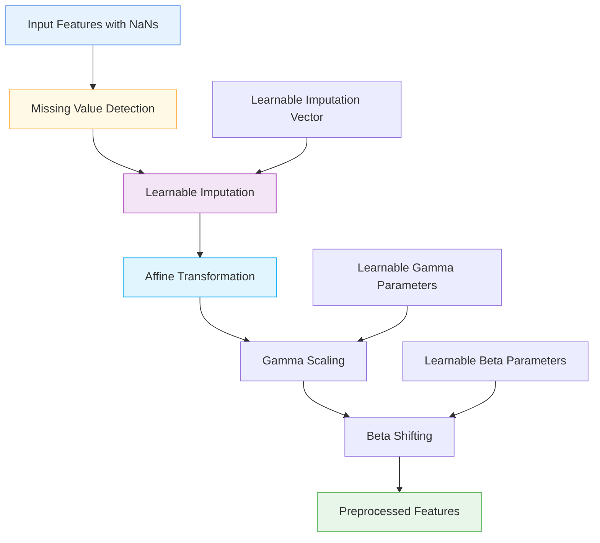

# 🔧 DifferentiableTabularPreprocessor

<div class="layer-hero">
  <div class="layer-hero-content">
    <h1>🔧 DifferentiableTabularPreprocessor</h1>
    <div class="layer-badges">
      <span class="badge badge-advanced">🔴 Advanced</span>
      <span class="badge badge-stable">✅ Stable</span>
      <span class="badge badge-popular">🔥 Popular</span>
    </div>
  </div>
</div>

## 🎯 Overview

The `DifferentiableTabularPreprocessor` integrates preprocessing into the model so that optimal imputation and normalization parameters are learned end-to-end. This approach is particularly useful for tabular data with missing values and features that need normalization.

This layer replaces missing values with learnable imputation vectors and applies learned affine transformations (scaling and shifting) to each feature, making the entire preprocessing pipeline differentiable.

## 🔍 How It Works

The DifferentiableTabularPreprocessor processes tabular data through learnable preprocessing:

1. **Missing Value Detection**: Identifies NaN values in input data
2. **Learnable Imputation**: Replaces missing values with learned imputation vectors
3. **Affine Transformation**: Applies learned scaling (gamma) and shifting (beta) to each feature
4. **End-to-End Learning**: All parameters are learned jointly with the model
5. **Output Generation**: Produces preprocessed features ready for downstream processing



## 💡 Why Use This Layer?

| Challenge | Traditional Approach | DifferentiableTabularPreprocessor's Solution |
|-----------|---------------------|--------------------------------------------|
| **Missing Values** | Separate imputation step (mean, median, etc.) | 🎯 **Learnable imputation** optimized for the task |
| **Feature Scaling** | Static normalization (z-score, min-max) | ⚡ **Learned scaling** adapted to data and task |
| **End-to-End Learning** | Separate preprocessing and modeling | 🧠 **Integrated preprocessing** learned jointly |
| **Data Quality** | Fixed preprocessing strategies | 🔗 **Adaptive preprocessing** that improves with training |

## 📊 Use Cases

- **Missing Data Handling**: Intelligent imputation of missing values
- **Feature Normalization**: Learned scaling and shifting of features
- **End-to-End Learning**: Integrated preprocessing and modeling
- **Tabular Deep Learning**: Advanced preprocessing for tabular neural networks
- **Data Quality**: Adaptive preprocessing that improves with training

## 🚀 Quick Start

### Basic Usage

```python
import keras
import numpy as np
from kerasfactory.layers import DifferentiableTabularPreprocessor

# Create sample data with missing values
x = keras.ops.convert_to_tensor([
    [1.0, np.nan, 3.0, 4.0, 5.0],
    [2.0, 2.0, np.nan, 4.0, 5.0],
    [np.nan, 2.0, 3.0, 4.0, np.nan]
], dtype="float32")

# Apply differentiable preprocessing
preprocessor = DifferentiableTabularPreprocessor(num_features=5)
preprocessed = preprocessor(x)

print(f"Input shape: {x.shape}")           # (3, 5)
print(f"Output shape: {preprocessed.shape}")  # (3, 5)
print(f"Has NaNs: {keras.ops.any(keras.ops.isnan(preprocessed))}")  # False
```

### In a Sequential Model

```python
import keras
from kerasfactory.layers import DifferentiableTabularPreprocessor

model = keras.Sequential([
    DifferentiableTabularPreprocessor(num_features=10),  # Preprocess first
    keras.layers.Dense(64, activation='relu'),
    keras.layers.Dropout(0.2),
    keras.layers.Dense(32, activation='relu'),
    keras.layers.Dense(1, activation='sigmoid')
])

model.compile(optimizer='adam', loss='binary_crossentropy', metrics=['accuracy'])
```

### In a Functional Model

```python
import keras
from kerasfactory.layers import DifferentiableTabularPreprocessor

# Define inputs
inputs = keras.Input(shape=(15,))  # 15 features

# Apply differentiable preprocessing
x = DifferentiableTabularPreprocessor(num_features=15)(inputs)

# Continue processing
x = keras.layers.Dense(64, activation='relu')(x)
x = keras.layers.BatchNormalization()(x)
x = keras.layers.Dropout(0.2)(x)
x = keras.layers.Dense(32, activation='relu')(x)
outputs = keras.layers.Dense(1, activation='sigmoid')(x)

model = keras.Model(inputs, outputs)
```

### Advanced Configuration

```python
# Advanced configuration with custom preprocessing
def create_advanced_preprocessing_model():
    inputs = keras.Input(shape=(20,))
    
    # Apply differentiable preprocessing
    x = DifferentiableTabularPreprocessor(
        num_features=20,
        name="learnable_preprocessing"
    )(inputs)
    
    # Multi-branch processing
    branch1 = keras.layers.Dense(32, activation='relu')(x)
    branch1 = keras.layers.Dense(16, activation='relu')(branch1)
    
    branch2 = keras.layers.Dense(32, activation='tanh')(x)
    branch2 = keras.layers.Dense(16, activation='tanh')(branch2)
    
    # Combine branches
    x = keras.layers.Concatenate()([branch1, branch2])
    x = keras.layers.Dense(64, activation='relu')(x)
    x = keras.layers.Dropout(0.3)(x)
    
    # Multi-task output
    classification = keras.layers.Dense(3, activation='softmax', name='classification')(x)
    regression = keras.layers.Dense(1, name='regression')(x)
    
    return keras.Model(inputs, [classification, regression])

model = create_advanced_preprocessing_model()
model.compile(
    optimizer='adam',
    loss={'classification': 'categorical_crossentropy', 'regression': 'mse'},
    loss_weights={'classification': 1.0, 'regression': 0.5}
)
```

## 📖 API Reference

::: kerasfactory.layers.DifferentiableTabularPreprocessor

## 🔧 Parameters Deep Dive

### `num_features` (int)
- **Purpose**: Number of numeric features in the input
- **Range**: 1 to 1000+ (typically 5-100)
- **Impact**: Must match the last dimension of your input tensor
- **Recommendation**: Set to the number of features in your dataset

## 📈 Performance Characteristics

- **Speed**: ⚡⚡⚡ Fast - simple mathematical operations
- **Memory**: 💾💾 Low memory usage - minimal additional parameters
- **Accuracy**: 🎯🎯🎯🎯 Excellent for handling missing values and normalization
- **Best For**: Tabular data with missing values requiring end-to-end learning

## 🎨 Examples

### Example 1: Missing Data Handling

```python
import keras
import numpy as np
from kerasfactory.layers import DifferentiableTabularPreprocessor

# Create data with different missing patterns
def create_missing_data():
    np.random.seed(42)
    n_samples, n_features = 1000, 8
    
    # Create base data
    data = np.random.normal(0, 1, (n_samples, n_features))
    
    # Introduce missing values with different patterns
    # Random missing
    random_mask = np.random.random((n_samples, n_features)) < 0.1
    data[random_mask] = np.nan
    
    # Column-specific missing (some columns have more missing values)
    data[:, 2][np.random.random(n_samples) < 0.3] = np.nan  # 30% missing in column 2
    data[:, 5][np.random.random(n_samples) < 0.2] = np.nan  # 20% missing in column 5
    
    return data

# Create and preprocess data
missing_data = create_missing_data()
print(f"Missing data shape: {missing_data.shape}")
print(f"Missing values per column: {np.isnan(missing_data).sum(axis=0)}")

# Build model with differentiable preprocessing
inputs = keras.Input(shape=(8,))
x = DifferentiableTabularPreprocessor(num_features=8)(inputs)
x = keras.layers.Dense(32, activation='relu')(x)
x = keras.layers.Dropout(0.2)(x)
x = keras.layers.Dense(16, activation='relu')(x)
outputs = keras.layers.Dense(1, activation='sigmoid')(x)

model = keras.Model(inputs, outputs)
model.compile(optimizer='adam', loss='binary_crossentropy')

# Test preprocessing
test_data = keras.ops.convert_to_tensor(missing_data[:10], dtype="float32")
preprocessed = model.layers[0](test_data)
print(f"Preprocessed shape: {preprocessed.shape}")
print(f"Has NaNs after preprocessing: {keras.ops.any(keras.ops.isnan(preprocessed))}")
```

### Example 2: Feature-Specific Preprocessing

```python
# Analyze learned preprocessing parameters
def analyze_preprocessing_parameters(model):
    """Analyze the learned preprocessing parameters."""
    preprocessor = model.layers[0]  # First layer is the preprocessor
    
    # Get learned parameters
    imputation_values = preprocessor.impute.numpy()
    gamma_values = preprocessor.gamma.numpy()
    beta_values = preprocessor.beta.numpy()
    
    print("Learned Preprocessing Parameters:")
    print("=" * 50)
    
    for i in range(len(imputation_values)):
        print(f"Feature {i+1}:")
        print(f"  Imputation value: {imputation_values[i]:.4f}")
        print(f"  Gamma (scaling): {gamma_values[i]:.4f}")
        print(f"  Beta (shifting): {beta_values[i]:.4f}")
        print()
    
    return {
        'imputation': imputation_values,
        'gamma': gamma_values,
        'beta': beta_values
    }

# Use with your trained model
# params = analyze_preprocessing_parameters(model)
```

### Example 3: Comparison with Traditional Preprocessing

```python
# Compare with traditional preprocessing methods
def compare_preprocessing_methods():
    # Create data with missing values
    data = np.random.normal(0, 1, (100, 5))
    data[data < -1] = np.nan  # Introduce missing values
    
    # Traditional preprocessing
    from sklearn.impute import SimpleImputer
    from sklearn.preprocessing import StandardScaler
    
    # Impute missing values
    imputer = SimpleImputer(strategy='mean')
    data_imputed = imputer.fit_transform(data)
    
    # Standardize
    scaler = StandardScaler()
    data_traditional = scaler.fit_transform(data_imputed)
    
    # Differentiable preprocessing
    inputs = keras.Input(shape=(5,))
    x = DifferentiableTabularPreprocessor(num_features=5)(inputs)
    model = keras.Model(inputs, x)
    
    # Apply differentiable preprocessing
    data_differentiable = model(keras.ops.convert_to_tensor(data, dtype="float32"))
    
    print("Traditional Preprocessing:")
    print(f"  Mean: {np.mean(data_traditional, axis=0)}")
    print(f"  Std: {np.std(data_traditional, axis=0)}")
    
    print("\nDifferentiable Preprocessing:")
    print(f"  Mean: {keras.ops.mean(data_differentiable, axis=0).numpy()}")
    print(f"  Std: {keras.ops.std(data_differentiable, axis=0).numpy()}")
    
    return data_traditional, data_differentiable.numpy()

# Compare methods
# traditional, differentiable = compare_preprocessing_methods()
```

## 💡 Tips & Best Practices

- **Feature Count**: Must match the number of features in your dataset
- **Missing Values**: Works best with moderate amounts of missing data
- **Initialization**: Parameters are initialized to reasonable defaults
- **End-to-End Learning**: Let the model learn optimal preprocessing parameters
- **Monitoring**: Track learned parameters to understand preprocessing behavior
- **Combination**: Use with other preprocessing layers for complex pipelines

## ⚠️ Common Pitfalls

- **Input Shape**: Must be 2D tensor (batch_size, num_features)
- **Feature Mismatch**: num_features must match input dimension
- **NaN Handling**: Only handles NaN values, not other missing value representations
- **Memory Usage**: Creates learnable parameters for each feature
- **Overfitting**: Can overfit on small datasets with many features

## 🔗 Related Layers

- [DifferentialPreprocessingLayer](differential-preprocessing-layer.md) - Advanced differential preprocessing
- [DistributionTransformLayer](distribution-transform-layer.md) - Distribution transformation
- [CastToFloat32Layer](cast-to-float32-layer.md) - Type casting utility
- [FeatureCutout](feature-cutout.md) - Feature regularization

## 📚 Further Reading

- [End-to-End Learning in Deep Learning](https://en.wikipedia.org/wiki/End-to-end_learning) - End-to-end learning concepts
- [Missing Data Handling](https://en.wikipedia.org/wiki/Missing_data) - Missing data techniques
- [Feature Normalization](https://en.wikipedia.org/wiki/Feature_scaling) - Feature scaling methods
- [KerasFactory Layer Explorer](../layers_overview.md) - Browse all available layers
- [Data Preprocessing Tutorial](../tutorials/feature-engineering.md) - Complete guide to data preprocessing
