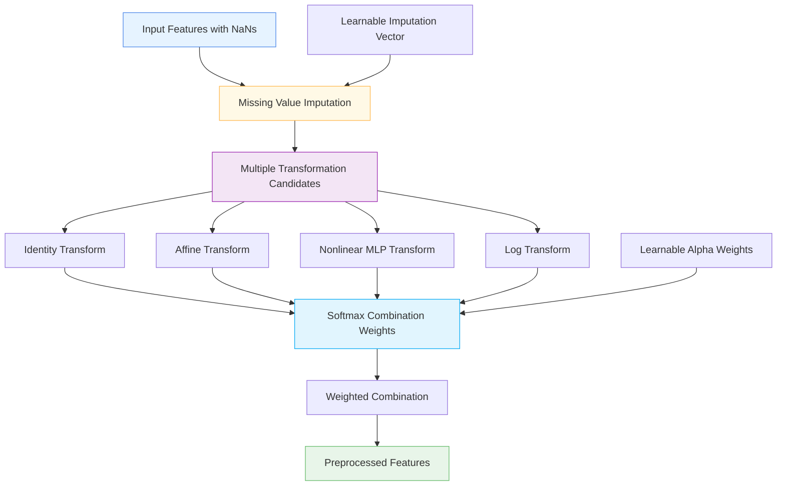

# 🔄 DifferentialPreprocessingLayer

<div class="layer-hero">
  <div class="layer-hero-content">
    <h1>🔄 DifferentialPreprocessingLayer</h1>
    <div class="layer-badges">
      <span class="badge badge-advanced">🔴 Advanced</span>
      <span class="badge badge-stable">✅ Stable</span>
      <span class="badge badge-popular">🔥 Popular</span>
    </div>
  </div>
</div>

## 🎯 Overview

The `DifferentialPreprocessingLayer` applies multiple candidate transformations to tabular data and learns to combine them optimally. It handles missing values with learnable imputation and provides a differentiable preprocessing pipeline where the optimal preprocessing strategy is learned end-to-end.

This layer is particularly powerful for tabular data where the optimal preprocessing strategy is not known in advance, allowing the model to learn the best combination of transformations.

## 🔍 How It Works

The DifferentialPreprocessingLayer processes data through multiple transformation candidates:

1. **Missing Value Imputation**: Replaces missing values with learnable imputation vectors
2. **Multiple Transformations**: Applies several candidate transformations:
   - Identity (pass-through)
   - Affine transformation (learnable scaling and bias)
   - Nonlinear transformation via MLP
   - Log transformation (using softplus for positivity)
3. **Learnable Combination**: Uses softmax weights to combine transformation outputs
4. **End-to-End Learning**: All parameters are learned jointly with the model
5. **Output Generation**: Produces optimally preprocessed features



## 💡 Why Use This Layer?

| Challenge | Traditional Approach | DifferentialPreprocessingLayer's Solution |
|-----------|---------------------|----------------------------------------|
| **Unknown Preprocessing** | Manual preprocessing strategy selection | 🎯 **Automatic learning** of optimal preprocessing |
| **Multiple Transformations** | Single transformation approach | ⚡ **Multiple candidates** with learned combination |
| **Missing Values** | Separate imputation step | 🧠 **Integrated imputation** learned end-to-end |
| **Adaptive Preprocessing** | Fixed preprocessing pipeline | 🔗 **Adaptive preprocessing** that improves with training |

## 📊 Use Cases

- **Unknown Data Characteristics**: When optimal preprocessing strategy is unknown
- **Multiple Transformation Needs**: Data requiring different preprocessing approaches
- **End-to-End Learning**: Integrated preprocessing and modeling
- **Adaptive Preprocessing**: Preprocessing that adapts to data patterns
- **Complex Tabular Data**: Sophisticated preprocessing for complex datasets

## 🚀 Quick Start

### Basic Usage

```python
import keras
import numpy as np
from kerasfactory.layers import DifferentialPreprocessingLayer

# Create sample data with missing values
x = keras.ops.convert_to_tensor([
    [1.0, 2.0, float('nan'), 4.0],
    [2.0, float('nan'), 3.0, 4.0],
    [float('nan'), 2.0, 3.0, 4.0],
    [1.0, 2.0, 3.0, float('nan')],
    [1.0, 2.0, 3.0, 4.0],
    [2.0, 3.0, 4.0, 5.0],
], dtype="float32")

# Apply differential preprocessing
preprocessor = DifferentialPreprocessingLayer(
    num_features=4,
    mlp_hidden_units=8
)
preprocessed = preprocessor(x)

print(f"Input shape: {x.shape}")           # (6, 4)
print(f"Output shape: {preprocessed.shape}")  # (6, 4)
print(f"Has NaNs: {keras.ops.any(keras.ops.isnan(preprocessed))}")  # False
```

### In a Sequential Model

```python
import keras
from kerasfactory.layers import DifferentialPreprocessingLayer

model = keras.Sequential([
    DifferentialPreprocessingLayer(
        num_features=10,
        mlp_hidden_units=16
    ),
    keras.layers.Dense(64, activation='relu'),
    keras.layers.Dropout(0.2),
    keras.layers.Dense(32, activation='relu'),
    keras.layers.Dense(1, activation='sigmoid')
])

model.compile(optimizer='adam', loss='binary_crossentropy', metrics=['accuracy'])
```

### In a Functional Model

```python
import keras
from kerasfactory.layers import DifferentialPreprocessingLayer

# Define inputs
inputs = keras.Input(shape=(15,))  # 15 features

# Apply differential preprocessing
x = DifferentialPreprocessingLayer(
    num_features=15,
    mlp_hidden_units=32
)(inputs)

# Continue processing
x = keras.layers.Dense(64, activation='relu')(x)
x = keras.layers.BatchNormalization()(x)
x = keras.layers.Dropout(0.2)(x)
x = keras.layers.Dense(32, activation='relu')(x)
outputs = keras.layers.Dense(1, activation='sigmoid')(x)

model = keras.Model(inputs, outputs)
```

### Advanced Configuration

```python
# Advanced configuration with custom MLP size
def create_advanced_preprocessing_model():
    inputs = keras.Input(shape=(20,))
    
    # Apply differential preprocessing with larger MLP
    x = DifferentialPreprocessingLayer(
        num_features=20,
        mlp_hidden_units=64,  # Larger MLP for more complex transformations
        name="advanced_preprocessing"
    )(inputs)
    
    # Multi-branch processing
    branch1 = keras.layers.Dense(32, activation='relu')(x)
    branch1 = keras.layers.Dense(16, activation='relu')(branch1)
    
    branch2 = keras.layers.Dense(32, activation='tanh')(x)
    branch2 = keras.layers.Dense(16, activation='tanh')(branch2)
    
    # Combine branches
    x = keras.layers.Concatenate()([branch1, branch2])
    x = keras.layers.Dense(64, activation='relu')(x)
    x = keras.layers.Dropout(0.3)(x)
    
    # Multi-task output
    classification = keras.layers.Dense(3, activation='softmax', name='classification')(x)
    regression = keras.layers.Dense(1, name='regression')(x)
    
    return keras.Model(inputs, [classification, regression])

model = create_advanced_preprocessing_model()
model.compile(
    optimizer='adam',
    loss={'classification': 'categorical_crossentropy', 'regression': 'mse'},
    loss_weights={'classification': 1.0, 'regression': 0.5}
)
```

## 📖 API Reference

::: kerasfactory.layers.DifferentialPreprocessingLayer

## 🔧 Parameters Deep Dive

### `num_features` (int)
- **Purpose**: Number of numeric features in the input
- **Range**: 1 to 1000+ (typically 5-100)
- **Impact**: Must match the last dimension of your input tensor
- **Recommendation**: Set to the number of features in your dataset

### `mlp_hidden_units` (int)
- **Purpose**: Number of hidden units in the nonlinear transformation MLP
- **Range**: 2 to 128+ (typically 4-32)
- **Impact**: Larger values = more complex nonlinear transformations
- **Recommendation**: Start with 4-8, increase for more complex data

## 📈 Performance Characteristics

- **Speed**: ⚡⚡⚡ Fast - simple mathematical operations
- **Memory**: 💾💾💾 Moderate memory usage due to multiple transformations
- **Accuracy**: 🎯🎯🎯🎯 Excellent for adaptive preprocessing
- **Best For**: Tabular data requiring sophisticated preprocessing strategies

## 🎨 Examples

### Example 1: Adaptive Preprocessing Analysis

```python
import keras
import numpy as np
from kerasfactory.layers import DifferentialPreprocessingLayer

# Analyze which transformations are being used
def analyze_transformation_usage(model):
    """Analyze which transformations are being used most."""
    preprocessor = model.layers[0]  # First layer is the preprocessor
    
    # Get learned combination weights
    alpha_weights = preprocessor.alpha.numpy()
    
    # Apply softmax to get probabilities
    transformation_probs = keras.ops.softmax(alpha_weights, axis=0).numpy()
    
    transformation_names = [
        "Identity",
        "Affine",
        "Nonlinear MLP",
        "Log Transform"
    ]
    
    print("Transformation Usage Probabilities:")
    print("=" * 40)
    for i, (name, prob) in enumerate(zip(transformation_names, transformation_probs)):
        print(f"{name}: {prob:.4f}")
    
    # Find most used transformation
    most_used = np.argmax(transformation_probs)
    print(f"\nMost used transformation: {transformation_names[most_used]}")
    
    return transformation_probs

# Use with your trained model
# probs = analyze_transformation_usage(model)
```

### Example 2: Comparison with Single Transformations

```python
# Compare with single transformation approaches
def compare_preprocessing_approaches():
    # Create data with missing values
    data = np.random.normal(0, 1, (100, 5))
    data[data < -1] = np.nan  # Introduce missing values
    
    # Single transformation approaches
    from sklearn.impute import SimpleImputer
    from sklearn.preprocessing import StandardScaler, MinMaxScaler
    
    # Approach 1: Mean imputation + Standard scaling
    imputer1 = SimpleImputer(strategy='mean')
    scaler1 = StandardScaler()
    data1 = scaler1.fit_transform(imputer1.fit_transform(data))
    
    # Approach 2: Mean imputation + MinMax scaling
    imputer2 = SimpleImputer(strategy='mean')
    scaler2 = MinMaxScaler()
    data2 = scaler2.fit_transform(imputer2.fit_transform(data))
    
    # Approach 3: Differential preprocessing
    inputs = keras.Input(shape=(5,))
    x = DifferentialPreprocessingLayer(num_features=5, mlp_hidden_units=8)(inputs)
    model = keras.Model(inputs, x)
    data3 = model(keras.ops.convert_to_tensor(data, dtype="float32")).numpy()
    
    print("Preprocessing Comparison:")
    print("=" * 50)
    print(f"Standard + Mean: Mean={np.mean(data1):.4f}, Std={np.std(data1):.4f}")
    print(f"MinMax + Mean: Mean={np.mean(data2):.4f}, Std={np.std(data2):.4f}")
    print(f"Differential: Mean={np.mean(data3):.4f}, Std={np.std(data3):.4f}")
    
    return data1, data2, data3

# Compare approaches
# std_data, minmax_data, diff_data = compare_preprocessing_approaches()
```

### Example 3: Feature-Specific Preprocessing

```python
# Apply different preprocessing to different feature groups
def create_feature_specific_model():
    inputs = keras.Input(shape=(20,))
    
    # Split features into groups
    numerical_features = inputs[:, :10]    # First 10 features (numerical)
    categorical_features = inputs[:, 10:15] # Next 5 features (categorical-like)
    mixed_features = inputs[:, 15:20]      # Last 5 features (mixed)
    
    # Apply different preprocessing to each group
    numerical_preprocessed = DifferentialPreprocessingLayer(
        num_features=10,
        mlp_hidden_units=16
    )(numerical_features)
    
    categorical_preprocessed = DifferentialPreprocessingLayer(
        num_features=5,
        mlp_hidden_units=8
    )(categorical_features)
    
    mixed_preprocessed = DifferentialPreprocessingLayer(
        num_features=5,
        mlp_hidden_units=12
    )(mixed_features)
    
    # Combine preprocessed features
    x = keras.layers.Concatenate()([
        numerical_preprocessed,
        categorical_preprocessed,
        mixed_preprocessed
    ])
    
    # Process combined features
    x = keras.layers.Dense(64, activation='relu')(x)
    x = keras.layers.BatchNormalization()(x)
    x = keras.layers.Dropout(0.2)(x)
    x = keras.layers.Dense(32, activation='relu')(x)
    outputs = keras.layers.Dense(1, activation='sigmoid')(x)
    
    return keras.Model(inputs, outputs)

model = create_feature_specific_model()
model.compile(optimizer='adam', loss='binary_crossentropy')
```

## 💡 Tips & Best Practices

- **MLP Size**: Start with 4-8 hidden units, increase for complex data
- **Feature Count**: Must match the number of features in your dataset
- **Missing Data**: Works best with moderate amounts of missing data
- **End-to-End Learning**: Let the model learn optimal preprocessing
- **Monitoring**: Track transformation usage to understand preprocessing behavior
- **Combination**: Use with other preprocessing layers for complex pipelines

## ⚠️ Common Pitfalls

- **Input Shape**: Must be 2D tensor (batch_size, num_features)
- **Feature Mismatch**: num_features must match input dimension
- **NaN Handling**: Only handles NaN values, not other missing value representations
- **Memory Usage**: Creates multiple transformation branches
- **Overfitting**: Can overfit on small datasets with many features

## 🔗 Related Layers

- [DifferentiableTabularPreprocessor](differentiable-tabular-preprocessor.md) - Simple differentiable preprocessing
- [DistributionTransformLayer](distribution-transform-layer.md) - Distribution transformation
- [CastToFloat32Layer](cast-to-float32-layer.md) - Type casting utility
- [FeatureCutout](feature-cutout.md) - Feature regularization

## 📚 Further Reading

- [End-to-End Learning in Deep Learning](https://en.wikipedia.org/wiki/End-to-end_learning) - End-to-end learning concepts
- [Missing Data Handling](https://en.wikipedia.org/wiki/Missing_data) - Missing data techniques
- [Feature Transformation](https://en.wikipedia.org/wiki/Feature_engineering) - Feature transformation methods
- [KerasFactory Layer Explorer](../layers_overview.md) - Browse all available layers
- [Data Preprocessing Tutorial](../tutorials/feature-engineering.md) - Complete guide to data preprocessing
