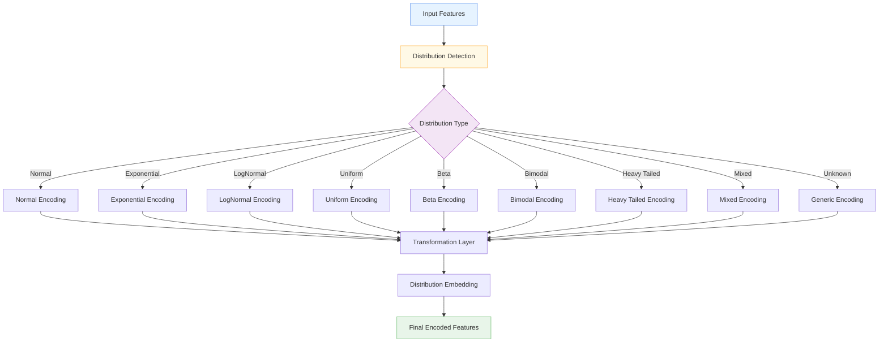

# 📊 DistributionAwareEncoder

<div class="layer-hero">
  <div class="layer-hero-content">
    <h1>📊 DistributionAwareEncoder</h1>
    <div class="layer-badges">
      <span class="badge badge-advanced">🔴 Advanced</span>
      <span class="badge badge-stable">✅ Stable</span>
      <span class="badge badge-popular">🔥 Popular</span>
    </div>
  </div>
</div>

## 🎯 Overview

The `DistributionAwareEncoder` automatically detects the distribution type of input data and applies appropriate transformations and encodings. It builds upon the DistributionTransformLayer but adds sophisticated distribution detection and specialized encoding for different distribution types.

This layer is particularly powerful for preprocessing data where the distribution characteristics are unknown or vary across features, providing intelligent adaptation to different data patterns.

## 🔍 How It Works

The DistributionAwareEncoder processes data through intelligent distribution-aware encoding:

1. **Distribution Detection**: Analyzes input data to identify distribution type
2. **Transformation Selection**: Chooses optimal transformation based on detected distribution
3. **Specialized Encoding**: Applies distribution-specific encoding strategies
4. **Embedding Generation**: Creates rich embeddings with optional distribution information
5. **Output Generation**: Produces encoded features optimized for the detected distribution



## 💡 Why Use This Layer?

| Challenge | Traditional Approach | DistributionAwareEncoder's Solution |
|-----------|---------------------|------------------------------------|
| **Unknown Distributions** | One-size-fits-all preprocessing | 🎯 **Automatic detection** and adaptation to distribution type |
| **Mixed Data Types** | Uniform processing for all features | ⚡ **Specialized encoding** for different distribution types |
| **Distribution Changes** | Static preprocessing strategies | 🧠 **Adaptive encoding** that adjusts to data characteristics |
| **Feature Engineering** | Manual distribution analysis | 🔗 **Automated preprocessing** with learned distribution awareness |

## 📊 Use Cases

- **Mixed Distribution Data**: Datasets with features following different distributions
- **Unknown Data Characteristics**: When distribution types are not known in advance
- **Adaptive Preprocessing**: Systems that need to adapt to changing data patterns
- **Feature Engineering**: Automated creation of distribution-aware features
- **Data Quality**: Handling datasets with varying distribution quality

## 🚀 Quick Start

### Basic Usage

```python
import keras
import numpy as np
from kmr.layers import DistributionAwareEncoder

# Create sample data with different distributions
batch_size = 1000

# Normal distribution
normal_data = np.random.normal(0, 1, (batch_size, 5))

# Exponential distribution
exp_data = np.random.exponential(1, (batch_size, 5))

# Combine features
mixed_data = np.concatenate([normal_data, exp_data], axis=1)

# Apply distribution-aware encoding
encoder = DistributionAwareEncoder(
    embedding_dim=16,
    add_distribution_embedding=True
)
encoded = encoder(mixed_data)

print(f"Input shape: {mixed_data.shape}")    # (1000, 10)
print(f"Output shape: {encoded.shape}")     # (1000, 16)
```

### Automatic Detection

```python
# Let the layer automatically detect distributions
auto_encoder = DistributionAwareEncoder(
    embedding_dim=32,
    auto_detect=True,  # Enable automatic detection
    add_distribution_embedding=True
)

# Apply to unknown data
unknown_data = keras.random.normal((100, 20))
encoded = auto_encoder(unknown_data)
```

### Manual Distribution Type

```python
# Specify distribution type manually
manual_encoder = DistributionAwareEncoder(
    embedding_dim=24,
    auto_detect=False,
    distribution_type="exponential",  # Specify distribution type
    transform_type="log"  # Specify transformation
)

# Apply to exponential data
exp_data = keras.random.exponential(1, (100, 15))
encoded = manual_encoder(exp_data)
```

### In a Sequential Model

```python
import keras
from kmr.layers import DistributionAwareEncoder

model = keras.Sequential([
    DistributionAwareEncoder(
        embedding_dim=32,
        add_distribution_embedding=True
    ),
    keras.layers.Dense(64, activation='relu'),
    keras.layers.Dropout(0.2),
    keras.layers.Dense(32, activation='relu'),
    keras.layers.Dense(1, activation='sigmoid')
])

model.compile(optimizer='adam', loss='binary_crossentropy', metrics=['accuracy'])
```

### In a Functional Model

```python
import keras
from kmr.layers import DistributionAwareEncoder

# Define inputs
inputs = keras.Input(shape=(25,))  # 25 features

# Apply distribution-aware encoding
x = DistributionAwareEncoder(
    embedding_dim=48,
    auto_detect=True,
    add_distribution_embedding=True
)(inputs)

# Continue processing
x = keras.layers.Dense(128, activation='relu')(x)
x = keras.layers.BatchNormalization()(x)
x = keras.layers.Dropout(0.3)(x)
x = keras.layers.Dense(64, activation='relu')(x)
outputs = keras.layers.Dense(1, activation='sigmoid')(x)

model = keras.Model(inputs, outputs)
```

### Advanced Configuration

```python
# Advanced configuration with custom parameters
encoder = DistributionAwareEncoder(
    embedding_dim=64,                    # Higher embedding dimension
    auto_detect=True,                    # Enable automatic detection
    transform_type="auto",               # Automatic transformation selection
    add_distribution_embedding=True,     # Include distribution information
    name="custom_distribution_encoder"
)

# Use in a complex preprocessing pipeline
inputs = keras.Input(shape=(50,))

# Apply distribution-aware encoding
x = encoder(inputs)

# Multi-task processing
task1 = keras.layers.Dense(32, activation='relu')(x)
task1 = keras.layers.Dropout(0.2)(task1)
classification = keras.layers.Dense(5, activation='softmax', name='classification')(task1)

task2 = keras.layers.Dense(16, activation='relu')(x)
task2 = keras.layers.Dropout(0.1)(task2)
regression = keras.layers.Dense(1, name='regression')(task2)

model = keras.Model(inputs, [classification, regression])
```

## 📖 API Reference

::: kmr.layers.DistributionAwareEncoder

## 🔧 Parameters Deep Dive

### `embedding_dim` (int, optional)
- **Purpose**: Dimension of the output embedding
- **Range**: 8 to 256+ (typically 16-64)
- **Impact**: Higher values = richer representations but more parameters
- **Recommendation**: Start with 16-32, scale based on data complexity

### `auto_detect` (bool)
- **Purpose**: Whether to automatically detect distribution type
- **Default**: True
- **Impact**: Enables intelligent distribution detection
- **Recommendation**: Use True for unknown data, False for known distributions

### `distribution_type` (str)
- **Purpose**: Distribution type to use if auto_detect is False
- **Options**: "normal", "exponential", "lognormal", "uniform", "beta", "bimodal", "heavy_tailed", "mixed", "bounded", "unknown"
- **Default**: "unknown"
- **Impact**: Determines encoding strategy
- **Recommendation**: Use specific type when you know the distribution

### `add_distribution_embedding` (bool)
- **Purpose**: Whether to add learned distribution type embedding
- **Default**: False
- **Impact**: Includes distribution information in output
- **Recommendation**: Use True for complex models that benefit from distribution awareness

## 📈 Performance Characteristics

- **Speed**: ⚡⚡⚡ Fast for small to medium datasets, scales with embedding_dim
- **Memory**: 💾💾💾 Moderate memory usage due to distribution detection and encoding
- **Accuracy**: 🎯🎯🎯🎯 Excellent for mixed-distribution data
- **Best For**: Tabular data with unknown or mixed distribution types

## 🎨 Examples

### Example 1: Mixed Distribution Data

```python
import keras
import numpy as np
from kmr.layers import DistributionAwareEncoder

# Create data with different distributions
batch_size = 2000

# Different distribution types
normal_features = np.random.normal(0, 1, (batch_size, 5))
exponential_features = np.random.exponential(1, (batch_size, 5))
uniform_features = np.random.uniform(-2, 2, (batch_size, 5))
beta_features = np.random.beta(2, 5, (batch_size, 5))

# Combine all features
mixed_data = np.concatenate([
    normal_features, exponential_features, 
    uniform_features, beta_features
], axis=1)

# Build model with distribution-aware encoding
inputs = keras.Input(shape=(20,))  # 20 mixed features

# Apply distribution-aware encoding
x = DistributionAwareEncoder(
    embedding_dim=32,
    auto_detect=True,
    add_distribution_embedding=True
)(inputs)

# Process encoded features
x = keras.layers.Dense(64, activation='relu')(x)
x = keras.layers.BatchNormalization()(x)
x = keras.layers.Dropout(0.2)(x)
x = keras.layers.Dense(32, activation='relu')(x)
output = keras.layers.Dense(1, activation='sigmoid')(x)

model = keras.Model(inputs, output)
model.compile(optimizer='adam', loss='binary_crossentropy')
```

### Example 2: Time Series with Varying Distributions

```python
# Process time series data with varying distributions over time
def create_time_series_model():
    inputs = keras.Input(shape=(24, 10))  # 24 time steps, 10 features
    
    # Apply distribution-aware encoding to each time step
    x = keras.layers.TimeDistributed(
        DistributionAwareEncoder(
            embedding_dim=16,
            auto_detect=True,
            add_distribution_embedding=True
        )
    )(inputs)
    
    # Process time series
    x = keras.layers.LSTM(64, return_sequences=True)(x)
    x = keras.layers.LSTM(32)(x)
    
    # Multiple outputs
    trend = keras.layers.Dense(1, name='trend')(x)
    anomaly = keras.layers.Dense(1, activation='sigmoid', name='anomaly')(x)
    
    return keras.Model(inputs, [trend, anomaly])

model = create_time_series_model()
model.compile(
    optimizer='adam',
    loss={'trend': 'mse', 'anomaly': 'binary_crossentropy'},
    loss_weights={'trend': 1.0, 'anomaly': 0.5}
)
```

### Example 3: Multi-Modal Data Processing

```python
# Process different data modalities with distribution-aware encoding
def create_multi_modal_model():
    # Different input modalities
    numerical_input = keras.Input(shape=(15,), name='numerical')
    sensor_input = keras.Input(shape=(10,), name='sensor')
    
    # Apply distribution-aware encoding to each modality
    numerical_encoded = DistributionAwareEncoder(
        embedding_dim=24,
        auto_detect=True,
        add_distribution_embedding=True
    )(numerical_input)
    
    sensor_encoded = DistributionAwareEncoder(
        embedding_dim=16,
        auto_detect=True,
        add_distribution_embedding=True
    )(sensor_input)
    
    # Combine modalities
    combined = keras.layers.Concatenate()([numerical_encoded, sensor_encoded])
    
    # Multi-task processing
    x = keras.layers.Dense(64, activation='relu')(combined)
    x = keras.layers.Dropout(0.3)(x)
    
    # Different tasks
    classification = keras.layers.Dense(3, activation='softmax', name='classification')(x)
    regression = keras.layers.Dense(1, name='regression')(x)
    
    return keras.Model([numerical_input, sensor_input], [classification, regression])

model = create_multi_modal_model()
model.compile(
    optimizer='adam',
    loss={'classification': 'categorical_crossentropy', 'regression': 'mse'},
    loss_weights={'classification': 1.0, 'regression': 0.5}
)
```

## 💡 Tips & Best Practices

- **Auto Detection**: Use auto_detect=True for unknown data distributions
- **Distribution Embedding**: Enable add_distribution_embedding for complex models
- **Feature Preprocessing**: Ensure features are properly scaled before encoding
- **Embedding Dimension**: Start with 16-32, scale based on data complexity
- **Monitoring**: Track distribution detection accuracy during training
- **Data Quality**: Works best with clean, well-preprocessed data

## ⚠️ Common Pitfalls

- **Input Shape**: Must be 2D tensor (batch_size, num_features)
- **Distribution Detection**: May not work well with very small datasets
- **Memory Usage**: Scales with embedding_dim and distribution complexity
- **Overfitting**: Can overfit on small datasets - use regularization
- **Distribution Changes**: May need retraining if data distribution changes significantly

## 🔗 Related Layers

- [DistributionTransformLayer](distribution-transform-layer.md) - Distribution transformation
- [AdvancedNumericalEmbedding](advanced-numerical-embedding.md) - Advanced numerical embeddings
- [DifferentiableTabularPreprocessor](differentiable-tabular-preprocessor.md) - End-to-end preprocessing
- [CastToFloat32Layer](cast-to-float32-layer.md) - Type casting utility

## 📚 Further Reading

- [Distribution Detection in Machine Learning](https://en.wikipedia.org/wiki/Goodness_of_fit) - Distribution testing concepts
- [Feature Encoding Techniques](https://en.wikipedia.org/wiki/Feature_engineering) - Feature encoding approaches
- [Adaptive Preprocessing](https://en.wikipedia.org/wiki/Data_pre-processing) - Adaptive data preprocessing
- [KMR Layer Explorer](../layers-explorer.md) - Browse all available layers
- [Data Preprocessing Tutorial](../tutorials/feature-engineering.md) - Complete guide to data preprocessing
