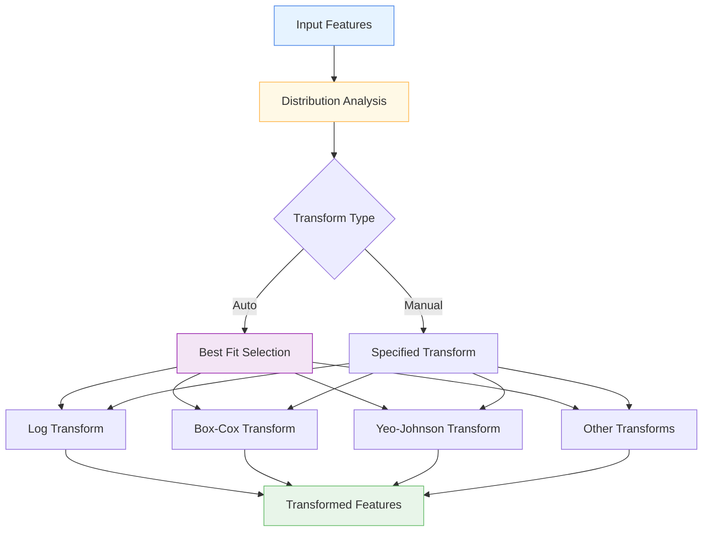

# 📊 DistributionTransformLayer

<div class="layer-hero">
  <div class="layer-hero-content">
    <h1>📊 DistributionTransformLayer</h1>
    <div class="badge badge-popular">🔥 Popular</div>
    <div class="badge badge-stable">✅ Stable</div>
    <div class="badge badge-beginner">🟢 Beginner</div>
  </div>
</div>

## 🎯 Overview

The `DistributionTransformLayer` automatically transforms numerical features to improve their distribution characteristics, making them more suitable for neural network processing. This layer supports multiple transformation types including log, square root, Box-Cox, Yeo-Johnson, and more, with an intelligent 'auto' mode that selects the best transformation based on data characteristics.

This layer is particularly valuable for preprocessing numerical data where the original distribution may not be optimal for neural network training, such as skewed distributions, heavy-tailed data, or features with varying scales.

## 🔍 How It Works

The DistributionTransformLayer processes numerical features through intelligent transformation:

1. **Distribution Analysis**: Analyzes input data characteristics (skewness, kurtosis, etc.)
2. **Transformation Selection**: Chooses optimal transformation based on data properties
3. **Parameter Learning**: Learns transformation parameters during training
4. **Data Transformation**: Applies the selected transformation to normalize the data
5. **Output Generation**: Returns transformed features with improved distribution



## 💡 Why Use This Layer?

| Challenge | Traditional Approach | DistributionTransformLayer's Solution |
|-----------|---------------------|--------------------------------------|
| **Skewed Data** | Manual transformation or ignore | 🎯 **Automatic detection** and transformation of skewed distributions |
| **Scale Differences** | Manual normalization | ⚡ **Intelligent scaling** based on data characteristics |
| **Distribution Types** | One-size-fits-all approach | 🧠 **Adaptive transformation** for different distribution types |
| **Preprocessing Complexity** | Manual feature engineering | 🔗 **Automated preprocessing** with learned parameters |

## 📊 Use Cases

- **Financial Data**: Transforming skewed financial metrics and ratios
- **Medical Data**: Normalizing lab values and health measurements
- **Sensor Data**: Preprocessing IoT and sensor readings
- **Survey Data**: Transforming rating scales and response distributions
- **Time Series**: Preprocessing numerical time series features

## 🚀 Quick Start

### Basic Usage

```python
import keras
from kmr.layers import DistributionTransformLayer

# Create sample data with skewed distribution
batch_size, num_features = 32, 10
x = keras.random.exponential((batch_size, num_features))  # Exponential distribution

# Apply automatic transformation
transformer = DistributionTransformLayer(transform_type='auto')
transformed = transformer(x)

print(f"Input shape: {x.shape}")           # (32, 10)
print(f"Output shape: {transformed.shape}")  # (32, 10)
```

### Manual Transformation

```python
# Apply specific transformation
log_transformer = DistributionTransformLayer(transform_type='log')
log_transformed = log_transformer(x)

# Box-Cox transformation
box_cox_transformer = DistributionTransformLayer(
    transform_type='box-cox',
    lambda_param=0.5
)
box_cox_transformed = box_cox_transformer(x)
```

### In a Sequential Model

```python
import keras
from kmr.layers import DistributionTransformLayer

model = keras.Sequential([
    DistributionTransformLayer(transform_type='auto'),  # Preprocess data
    keras.layers.Dense(64, activation='relu'),
    keras.layers.Dense(32, activation='relu'),
    keras.layers.Dense(1, activation='sigmoid')
])

model.compile(optimizer='adam', loss='binary_crossentropy', metrics=['accuracy'])
```

### In a Functional Model

```python
import keras
from kmr.layers import DistributionTransformLayer

# Define inputs
inputs = keras.Input(shape=(20,))  # 20 numerical features

# Apply distribution transformation
x = DistributionTransformLayer(transform_type='yeo-johnson')(inputs)

# Continue processing
x = keras.layers.Dense(64, activation='relu')(x)
x = keras.layers.Dropout(0.2)(x)
x = keras.layers.Dense(32, activation='relu')(x)
outputs = keras.layers.Dense(1, activation='sigmoid')(x)

model = keras.Model(inputs, outputs)
```

### Advanced Configuration

```python
# Advanced configuration with custom parameters
transformer = DistributionTransformLayer(
    transform_type='auto',
    epsilon=1e-8,                    # Custom epsilon for numerical stability
    auto_candidates=['log', 'sqrt', 'box-cox', 'yeo-johnson'],  # Limited candidates
    name="custom_distribution_transform"
)

# Use in a complex preprocessing pipeline
inputs = keras.Input(shape=(50,))

# Multiple transformation strategies
x1 = DistributionTransformLayer(transform_type='log')(inputs)
x2 = DistributionTransformLayer(transform_type='yeo-johnson')(inputs)

# Combine different transformations
x = keras.layers.Concatenate()([x1, x2])
x = keras.layers.Dense(128, activation='relu')(x)
x = keras.layers.Dropout(0.3)(x)
outputs = keras.layers.Dense(5, activation='softmax')(x)

model = keras.Model(inputs, outputs)
```

## 📖 API Reference

::: kmr.layers.DistributionTransformLayer

## 🔧 Parameters Deep Dive

### `transform_type` (str)
- **Purpose**: Type of transformation to apply
- **Options**: 'none', 'log', 'sqrt', 'box-cox', 'yeo-johnson', 'arcsinh', 'cube-root', 'logit', 'quantile', 'robust-scale', 'min-max', 'auto'
- **Default**: 'none'
- **Impact**: Determines how the data is transformed
- **Recommendation**: Use 'auto' for automatic selection, specific types for known distributions

### `lambda_param` (float)
- **Purpose**: Parameter for Box-Cox and Yeo-Johnson transformations
- **Range**: -2.0 to 2.0 (typically 0.0 to 1.0)
- **Impact**: Controls the strength of the transformation
- **Recommendation**: Use 0.5 for moderate transformation, 0.0 for log-like behavior

### `epsilon` (float)
- **Purpose**: Small value to prevent numerical issues
- **Range**: 1e-10 to 1e-6
- **Impact**: Prevents log(0) and division by zero errors
- **Recommendation**: Use 1e-8 for most cases, 1e-10 for very small values

## 📈 Performance Characteristics

- **Speed**: ⚡⚡⚡⚡ Very fast - simple mathematical transformations
- **Memory**: 💾💾 Low memory usage - minimal additional parameters
- **Accuracy**: 🎯🎯🎯🎯 Excellent for improving data distribution characteristics
- **Best For**: Numerical data with skewed or non-normal distributions

## 🎨 Examples

### Example 1: Financial Data Preprocessing

```python
import keras
import numpy as np
from kmr.layers import DistributionTransformLayer

# Simulate financial data with different distributions
batch_size = 1000

# Income data (log-normal distribution)
income = np.random.lognormal(mean=10, sigma=1, size=(batch_size, 1))

# Age data (normal distribution)
age = np.random.normal(50, 15, size=(batch_size, 1))

# Debt ratio (beta distribution)
debt_ratio = np.random.beta(2, 5, size=(batch_size, 1))

# Combine features
financial_data = np.concatenate([income, age, debt_ratio], axis=1)

# Build preprocessing model
inputs = keras.Input(shape=(3,))

# Apply different transformations for different features
income_transformed = DistributionTransformLayer(transform_type='log')(inputs[:, :1])
age_transformed = DistributionTransformLayer(transform_type='none')(inputs[:, 1:2])
debt_transformed = DistributionTransformLayer(transform_type='logit')(inputs[:, 2:3])

# Combine transformed features
x = keras.layers.Concatenate()([income_transformed, age_transformed, debt_transformed])
x = keras.layers.Dense(32, activation='relu')(x)
x = keras.layers.Dropout(0.2)(x)
output = keras.layers.Dense(1, activation='sigmoid')(x)

model = keras.Model(inputs, output)
model.compile(optimizer='adam', loss='binary_crossentropy')
```

### Example 2: Sensor Data Preprocessing

```python
# Preprocess IoT sensor data with automatic transformation
def create_sensor_model():
    inputs = keras.Input(shape=(10,))  # 10 sensor readings
    
    # Automatic transformation selection
    x = DistributionTransformLayer(transform_type='auto')(inputs)
    
    # Additional preprocessing
    x = keras.layers.BatchNormalization()(x)
    x = keras.layers.Dense(64, activation='relu')(x)
    x = keras.layers.Dropout(0.3)(x)
    
    # Multiple outputs
    anomaly_score = keras.layers.Dense(1, activation='sigmoid', name='anomaly')(x)
    sensor_health = keras.layers.Dense(3, activation='softmax', name='health')(x)
    
    return keras.Model(inputs, [anomaly_score, sensor_health])

model = create_sensor_model()
model.compile(
    optimizer='adam',
    loss={'anomaly': 'binary_crossentropy', 'health': 'categorical_crossentropy'},
    loss_weights={'anomaly': 1.0, 'health': 0.5}
)
```

### Example 3: Survey Data Analysis

```python
# Process survey data with different response scales
def create_survey_model():
    inputs = keras.Input(shape=(15,))  # 15 survey questions
    
    # Different transformations for different question types
    # Likert scale (1-5) - no transformation needed
    likert_questions = inputs[:, :5]
    
    # Rating scale (0-10) - min-max scaling
    rating_questions = DistributionTransformLayer(transform_type='min-max')(inputs[:, 5:10])
    
    # Open-ended numerical - log transformation
    numerical_questions = DistributionTransformLayer(transform_type='log')(inputs[:, 10:15])
    
    # Combine all features
    x = keras.layers.Concatenate()([likert_questions, rating_questions, numerical_questions])
    x = keras.layers.Dense(64, activation='relu')(x)
    x = keras.layers.Dropout(0.2)(x)
    x = keras.layers.Dense(32, activation='relu')(x)
    
    # Survey analysis outputs
    satisfaction = keras.layers.Dense(1, activation='sigmoid', name='satisfaction')(x)
    category = keras.layers.Dense(5, activation='softmax', name='category')(x)
    
    return keras.Model(inputs, [satisfaction, category])

model = create_survey_model()
model.compile(
    optimizer='adam',
    loss={'satisfaction': 'binary_crossentropy', 'category': 'categorical_crossentropy'},
    loss_weights={'satisfaction': 1.0, 'category': 0.3}
)
```

## 💡 Tips & Best Practices

- **Auto Mode**: Use 'auto' for unknown distributions, specific types for known patterns
- **Data Validation**: Check for negative values before applying log transformations
- **Epsilon Tuning**: Adjust epsilon based on your data's numerical precision
- **Feature-Specific**: Apply different transformations to different feature types
- **Monitoring**: Track transformation effects on model performance
- **Inverse Transform**: Consider if you need to inverse transform predictions

## ⚠️ Common Pitfalls

- **Negative Values**: Log and sqrt transformations require non-negative values
- **Zero Values**: Use appropriate epsilon to handle zero values
- **Overfitting**: Don't over-transform - sometimes original distributions are fine
- **Interpretability**: Transformed features may be harder to interpret
- **Inverse Transform**: Remember to inverse transform if needed for predictions

## 🔗 Related Layers

- [DistributionAwareEncoder](distribution-aware-encoder.md) - Distribution-aware feature encoding
- [AdvancedNumericalEmbedding](advanced-numerical-embedding.md) - Advanced numerical embeddings
- [DifferentiableTabularPreprocessor](differentiable-tabular-preprocessor.md) - End-to-end preprocessing
- [CastToFloat32Layer](cast-to-float32-layer.md) - Type casting utility

## 📚 Further Reading

- [Box-Cox Transformation](https://en.wikipedia.org/wiki/Power_transform#Box%E2%80%93Cox_transformation) - Box-Cox transformation details
- [Yeo-Johnson Transformation](https://en.wikipedia.org/wiki/Power_transform#Yeo%E2%80%93Johnson_transformation) - Yeo-Johnson transformation
- [Data Preprocessing in Machine Learning](https://en.wikipedia.org/wiki/Data_pre-processing) - Data preprocessing concepts
- [KMR Layer Explorer](../layers-explorer.md) - Browse all available layers
- [Data Preprocessing Tutorial](../tutorials/feature-engineering.md) - Complete guide to data preprocessing
