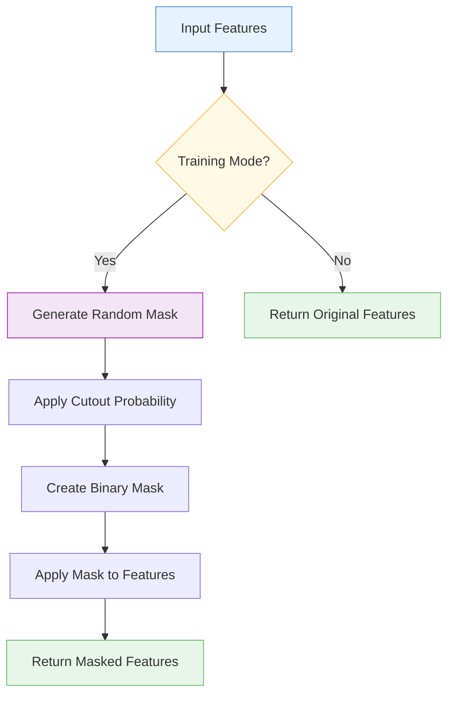

# ✂️ FeatureCutout

<div class="layer-hero">
  <div class="layer-hero-content">
    <h1>✂️ FeatureCutout</h1>
    <div class="layer-badges">
      <span class="badge badge-intermediate">🟡 Intermediate</span>
      <span class="badge badge-stable">✅ Stable</span>
      <span class="badge badge-popular">🔥 Popular</span>
    </div>
  </div>
</div>

## 🎯 Overview

The `FeatureCutout` layer randomly masks out (sets to zero) a specified fraction of features during training to improve model robustness and prevent overfitting. During inference, all features are kept intact, making it a powerful regularization technique.

This layer is particularly effective for tabular data where feature interactions are complex and overfitting is a common concern. It forces the model to learn robust representations that don't rely on any single feature.

## 🔍 How It Works

The FeatureCutout layer applies random masking during training:

1. **Training Mode Check**: Only applies masking during training
2. **Random Mask Generation**: Creates random mask based on cutout probability
3. **Feature Masking**: Sets selected features to specified noise value
4. **Inference Passthrough**: Returns original features during inference
5. **Output Generation**: Produces masked or original features based on mode



## 💡 Why Use This Layer?

| Challenge | Traditional Approach | FeatureCutout's Solution |
|-----------|---------------------|-------------------------|
| **Overfitting** | Dropout on hidden layers only | 🎯 **Feature-level regularization** prevents overfitting on input features |
| **Feature Dependencies** | Model may rely on specific features | ⚡ **Forces robustness** by randomly removing features |
| **Generalization** | Poor performance on unseen data | 🧠 **Improves generalization** through feature masking |
| **Data Augmentation** | Limited augmentation for tabular data | 🔗 **Tabular data augmentation** through feature masking |

## 📊 Use Cases

- **Overfitting Prevention**: Regularizing models prone to overfitting
- **Feature Robustness**: Ensuring models don't rely on specific features
- **Data Augmentation**: Augmenting tabular datasets during training
- **Generalization**: Improving model performance on unseen data
- **Feature Importance**: Understanding which features are truly important

## 🚀 Quick Start

### Basic Usage

```python
import keras
from kerasfactory.layers import FeatureCutout

# Create sample input data
batch_size, feature_dim = 32, 10
x = keras.random.normal((batch_size, feature_dim))

# Apply feature cutout
cutout = FeatureCutout(cutout_prob=0.2)
masked = cutout(x, training=True)

print(f"Input shape: {x.shape}")           # (32, 10)
print(f"Output shape: {masked.shape}")     # (32, 10)
print(f"Training mode: {cutout.training}") # True
```

### In a Sequential Model

```python
import keras
from kerasfactory.layers import FeatureCutout

model = keras.Sequential([
    FeatureCutout(cutout_prob=0.15),  # Apply feature cutout first
    keras.layers.Dense(64, activation='relu'),
    keras.layers.Dropout(0.2),
    keras.layers.Dense(32, activation='relu'),
    keras.layers.Dense(1, activation='sigmoid')
])

model.compile(optimizer='adam', loss='binary_crossentropy', metrics=['accuracy'])
```

### In a Functional Model

```python
import keras
from kerasfactory.layers import FeatureCutout

# Define inputs
inputs = keras.Input(shape=(20,))  # 20 features

# Apply feature cutout
x = FeatureCutout(cutout_prob=0.1)(inputs)

# Continue processing
x = keras.layers.Dense(64, activation='relu')(x)
x = keras.layers.BatchNormalization()(x)
x = keras.layers.Dropout(0.2)(x)
x = keras.layers.Dense(32, activation='relu')(x)
outputs = keras.layers.Dense(1, activation='sigmoid')(x)

model = keras.Model(inputs, outputs)
```

### Advanced Configuration

```python
# Advanced configuration with custom parameters
cutout = FeatureCutout(
    cutout_prob=0.25,        # Higher cutout probability
    noise_value=-1.0,        # Custom noise value instead of zero
    seed=42,                 # Fixed seed for reproducibility
    name="custom_feature_cutout"
)

# Use in a complex model
inputs = keras.Input(shape=(50,))

# Apply feature cutout
x = cutout(inputs)

# Multi-branch processing
branch1 = keras.layers.Dense(32, activation='relu')(x)
branch2 = keras.layers.Dense(32, activation='tanh')(x)

# Combine branches
x = keras.layers.Concatenate()([branch1, branch2])
x = keras.layers.Dense(64, activation='relu')(x)
x = keras.layers.Dropout(0.3)(x)
outputs = keras.layers.Dense(1, activation='sigmoid')(x)

model = keras.Model(inputs, outputs)
```

## 📖 API Reference

::: kerasfactory.layers.FeatureCutout

## 🔧 Parameters Deep Dive

### `cutout_prob` (float)
- **Purpose**: Probability of masking each feature
- **Range**: 0.0 to 1.0 (typically 0.05-0.3)
- **Impact**: Higher values = more aggressive regularization
- **Recommendation**: Start with 0.1-0.2, adjust based on overfitting

### `noise_value` (float)
- **Purpose**: Value to use for masked features
- **Default**: 0.0
- **Impact**: Affects how masked features are represented
- **Recommendation**: Use 0.0 for most cases, -1.0 for normalized data

### `seed` (int, optional)
- **Purpose**: Random seed for reproducibility
- **Default**: None (random)
- **Impact**: Controls randomness of masking
- **Recommendation**: Use fixed seed for reproducible experiments

## 📈 Performance Characteristics

- **Speed**: ⚡⚡⚡⚡ Very fast - simple masking operation
- **Memory**: 💾 Low memory usage - no additional parameters
- **Accuracy**: 🎯🎯🎯 Good for preventing overfitting
- **Best For**: Tabular data where overfitting is a concern

## 🎨 Examples

### Example 1: Overfitting Prevention

```python
import keras
import numpy as np
from kerasfactory.layers import FeatureCutout

# Create a model prone to overfitting
def create_overfitting_model():
    inputs = keras.Input(shape=(100,))  # High-dimensional input
    
    # Apply feature cutout to prevent overfitting
    x = FeatureCutout(cutout_prob=0.2)(inputs)
    
    # Deep network
    x = keras.layers.Dense(256, activation='relu')(x)
    x = keras.layers.Dropout(0.3)(x)
    x = keras.layers.Dense(128, activation='relu')(x)
    x = keras.layers.Dropout(0.2)(x)
    x = keras.layers.Dense(64, activation='relu')(x)
    x = keras.layers.Dropout(0.1)(x)
    x = keras.layers.Dense(32, activation='relu')(x)
    
    # Output
    outputs = keras.layers.Dense(1, activation='sigmoid')(x)
    
    return keras.Model(inputs, outputs)

model = create_overfitting_model()
model.compile(optimizer='adam', loss='binary_crossentropy', metrics=['accuracy'])

# Train with feature cutout
# model.fit(X_train, y_train, validation_data=(X_val, y_val), epochs=100)
```

### Example 2: Progressive Feature Cutout

```python
# Apply different cutout probabilities to different feature groups
def create_progressive_cutout_model():
    inputs = keras.Input(shape=(30,))
    
    # Split features into groups
    important_features = inputs[:, :10]    # First 10 features (important)
    regular_features = inputs[:, 10:25]    # Next 15 features (regular)
    noisy_features = inputs[:, 25:30]      # Last 5 features (potentially noisy)
    
    # Apply different cutout probabilities
    important_cutout = FeatureCutout(cutout_prob=0.05)(important_features)  # Low cutout
    regular_cutout = FeatureCutout(cutout_prob=0.15)(regular_features)      # Medium cutout
    noisy_cutout = FeatureCutout(cutout_prob=0.3)(noisy_features)           # High cutout
    
    # Combine features
    x = keras.layers.Concatenate()([important_cutout, regular_cutout, noisy_cutout])
    
    # Process combined features
    x = keras.layers.Dense(64, activation='relu')(x)
    x = keras.layers.BatchNormalization()(x)
    x = keras.layers.Dropout(0.2)(x)
    x = keras.layers.Dense(32, activation='relu')(x)
    outputs = keras.layers.Dense(1, activation='sigmoid')(x)
    
    return keras.Model(inputs, outputs)

model = create_progressive_cutout_model()
model.compile(optimizer='adam', loss='binary_crossentropy')
```

### Example 3: Feature Importance Analysis

```python
# Analyze which features are most affected by cutout
def analyze_feature_importance(model, test_data, feature_names=None):
    """Analyze feature importance by measuring performance drop when features are cut out."""
    # Get baseline performance
    baseline_pred = model(test_data)
    
    # Test each feature individually
    feature_importance = []
    
    for i in range(test_data.shape[1]):
        # Create copy of test data
        test_copy = test_data.numpy().copy()
        
        # Mask feature i
        test_copy[:, i] = 0.0
        
        # Get prediction with masked feature
        masked_pred = model(keras.ops.convert_to_tensor(test_copy))
        
        # Calculate importance as difference in prediction
        importance = keras.ops.mean(keras.ops.abs(baseline_pred - masked_pred))
        feature_importance.append(importance.numpy())
    
    # Sort features by importance
    sorted_indices = np.argsort(feature_importance)[::-1]
    
    print("Feature importance (based on cutout sensitivity):")
    for i, idx in enumerate(sorted_indices[:10]):  # Top 10 features
        feature_name = feature_names[idx] if feature_names else f"Feature_{idx}"
        print(f"{i+1}. {feature_name}: {feature_importance[idx]:.4f}")
    
    return feature_importance

# Use with your model
# importance_scores = analyze_feature_importance(model, test_data, feature_names)
```

## 💡 Tips & Best Practices

- **Cutout Probability**: Start with 0.1-0.2, increase if overfitting persists
- **Feature Groups**: Apply different cutout probabilities to different feature types
- **Seed Setting**: Use fixed seed for reproducible experiments
- **Noise Value**: Choose noise value based on your data distribution
- **Monitoring**: Track validation performance to tune cutout probability
- **Combination**: Use with other regularization techniques (dropout, batch norm)

## ⚠️ Common Pitfalls

- **Input Shape**: Must be 2D tensor (batch_size, feature_dim)
- **Training Mode**: Only applies masking during training
- **Over-regularization**: Too high cutout_prob can hurt performance
- **Feature Dependencies**: May not work well if features are highly correlated
- **Memory Usage**: Creates temporary masks during training

## 🔗 Related Layers

- [GatedFeatureSelection](gated-feature-selection.md) - Feature selection mechanism
- [VariableSelection](variable-selection.md) - Dynamic feature selection
- [SparseAttentionWeighting](sparse-attention-weighting.md) - Sparse attention weighting
- [DifferentiableTabularPreprocessor](differentiable-tabular-preprocessor.md) - End-to-end preprocessing

## 📚 Further Reading

- [Dropout Regularization](https://jmlr.org/papers/v15/srivastava14a.html) - Original dropout paper
- [Data Augmentation Techniques](https://en.wikipedia.org/wiki/Data_augmentation) - Data augmentation concepts
- [Regularization in Deep Learning](https://en.wikipedia.org/wiki/Regularization_(mathematics)) - Regularization techniques
- [KerasFactory Layer Explorer](../layers_overview.md) - Browse all available layers
- [Feature Engineering Tutorial](../tutorials/feature-engineering.md) - Complete guide to feature engineering
