# 🔀 FeatureMixing

<div class="layer-hero">
  <div class="layer-hero-content">
    <h1>🔀 FeatureMixing</h1>
    <div class="layer-badges">
      <span class="badge badge-intermediate">🟡 Intermediate</span>
      <span class="badge badge-stable">✅ Stable</span>
      <span class="badge badge-timeseries">⏱️ Time Series</span>
    </div>
  </div>
</div>

## 🎯 Overview

The `FeatureMixing` layer applies feed-forward MLPs across the feature (channel) dimension to mix information between different time series while preserving temporal structure. This enables cross-series learning and correlation discovery, complementing the TemporalMixing layer's temporal processing.

This layer is essential for capturing relationships between features in multivariate forecasting, allowing the model to learn feature interactions through a two-layer feed-forward network with a configurable hidden dimension.

## 🔍 How It Works

The FeatureMixing layer processes data through feature-space transformations:

1. **Flatten**: Reshapes from (batch, time, features) to (batch, time × features)
2. **Batch Normalization**: Normalizes across all dimensions (epsilon=0.001, momentum=0.01)
3. **Reshape**: Restores to (batch, time, features)
4. **First Dense Layer**: Projects to hidden dimension ff_dim with ReLU activation
5. **First Dropout**: Regularization after first layer
6. **Second Dense Layer**: Projects back to original feature dimension
7. **Second Dropout**: Final stochastic regularization
8. **Residual Connection**: Adds input to output for gradient flow

```mermaid
graph LR
    A["Input<br/>(batch, time, feat)"] --> B["Flatten<br/>→ (batch, t×f)"]
    B --> C["BatchNorm<br/>ε=0.001"]
    C --> D["Reshape<br/>→ (batch, t, f)"]
    D --> E["Dense(ff_dim)<br/>ReLU"]
    E --> F["Dropout 1<br/>rate=dropout"]
    F --> G["Dense(feat)<br/>Linear"]
    G --> H["Dropout 2<br/>rate=dropout"]
    H --> I["Residual<br/>output + input"]
    I --> J["Output<br/>(batch, t, f)"]
    
    style A fill:#e6f3ff,stroke:#4a86e8
    style J fill:#e8f5e9,stroke:#66bb6a
    style E fill:#fff9e6,stroke:#ffb74d
    style I fill:#f3e5f5,stroke:#9c27b0
```



## 💡 Why Use This Layer?

| Challenge | Traditional Approach | FeatureMixing Solution |
|-----------|---------------------|------------------------|
| **Feature Correlation** | Independent processing | 🎯 **Joint** feature learning |
| **Cross-Series Learning** | Ignores relationships | 🔗 **Learnable** cross-series interactions |
| **Non-Linear Interactions** | Linear combinations | 🧠 **Non-linear** MLPs for expressiveness |
| **Flexibility** | Fixed architectures | 🎛️ **Configurable** ff_dim for capacity |

## 📊 Use Cases

- **Cross-Series Correlation**: Discovering relationships between multiple time series
- **Feature Interactions**: Learning non-linear interactions between features
- **Dimensionality Modulation**: Using ff_dim to compress or expand feature space
- **Multivariate Forecasting**: When features have strong interdependencies
- **Transfer Learning**: Feature extraction with learned cross-series patterns

## 🚀 Quick Start

### Basic Usage

```python
import keras
from kmr.layers import FeatureMixing

# Create sample multivariate time series
batch_size, time_steps, features = 32, 96, 7
x = keras.random.normal((batch_size, time_steps, features))

# Apply feature mixing layer
layer = FeatureMixing(
    n_series=features,
    input_size=time_steps,
    dropout=0.1,
    ff_dim=64
)
output = layer(x, training=True)

print(f"Input shape:  {x.shape}")        # (32, 96, 7)
print(f"Output shape: {output.shape}")   # (32, 96, 7)
```

### Architecture Variants

```python
from kmr.layers import FeatureMixing
import keras

# Bottleneck: compress feature space
bottleneck = FeatureMixing(
    n_series=10,
    input_size=96,
    dropout=0.1,
    ff_dim=4  # ff_dim < n_series
)

# Expansion: expand feature space for better representation
expansion = FeatureMixing(
    n_series=10,
    input_size=96,
    dropout=0.1,
    ff_dim=32  # ff_dim > n_series
)

# Balanced: moderate hidden dimension
balanced = FeatureMixing(
    n_series=10,
    input_size=96,
    dropout=0.1,
    ff_dim=16  # ff_dim ≈ 1.5x n_series
)
```

## 🎓 Advanced Usage

### Training & Inference Modes

```python
import tensorflow as tf

layer = FeatureMixing(n_series=7, input_size=96, dropout=0.2, ff_dim=64)
x = keras.random.normal((32, 96, 7))

# Training mode: dropout active, batch norm learning
output_train1 = layer(x, training=True)
output_train2 = layer(x, training=True)
train_variance = tf.reduce_mean(tf.abs(output_train1 - output_train2))
print(f"Training variance (due to dropout): {train_variance:.6f}")

# Inference mode: deterministic, batch norm frozen
output_infer1 = layer(x, training=False)
output_infer2 = layer(x, training=False)
tf.debugging.assert_near(output_infer1, output_infer2)
print("Inference: outputs are identical ✓")
```

### Analyzing Feature Interactions

```python
# Single feature impact
# Create layer to study feature interactions
layer = FeatureMixing(n_series=5, input_size=48, dropout=0.1, ff_dim=16)

# Create test input with one feature set to different values
x_base = keras.random.normal((1, 48, 5))
x_modified = x_base.numpy().copy()
x_modified[0, :, 0] = 1.0  # Set feature 0 to constant

out_base = layer(x_base, training=False)
out_modified = layer(x_modified, training=False)

# Check how much the output changed
impact = tf.reduce_mean(tf.abs(out_base - out_modified))
print(f"Feature 0 impact on output: {impact:.6f}")
```

### Stacking for Deeper Feature Learning

```python
# Create multi-layer feature mixing
n_feature_layers = 3
feature_layers = [
    FeatureMixing(n_series=7, input_size=96, dropout=0.1, ff_dim=64)
    for _ in range(n_feature_layers)
]

x = keras.random.normal((32, 96, 7))
for layer in feature_layers:
    x = layer(x, training=True)

print(f"After {n_feature_layers} feature mixing layers: {x.shape}")
```

## 📈 Performance Characteristics

| Aspect | Value | Details |
|--------|-------|---------|
| **Time Complexity** | O(B × T × (F² + F×H)) | B=batch, T=time, F=features, H=ff_dim |
| **Space Complexity** | O(B × T × F) | Includes temporary hidden activations |
| **Gradient Flow** | ✅ Excellent | Residual connection ensures stable backprop |
| **Feature Interaction** | ⭐⭐⭐⭐⭐ | Non-linear mixing via two-layer MLP |
| **Computational Cost** | Moderate | Dominated by dense layer operations |

## 🔧 Parameter Guide

| Parameter | Type | Range | Impact | Recommendation |
|-----------|------|-------|--------|-----------------|
| **n_series** | int | > 0 | Number of features/channels | Match your feature count |
| **input_size** | int | > 0 | Temporal sequence length | Match your time series length |
| **dropout** | float | [0, 1] | Regularization strength | 0.1-0.2 for stability |
| **ff_dim** | int | > 0 | Hidden layer capacity | 0.5-2x n_series |

### Capacity Analysis

```python
# Estimate parameter counts for different ff_dim values
def estimate_params(n_series, ff_dim):
    # Dense 1: n_series → ff_dim
    dense1 = n_series * ff_dim + ff_dim
    # Dense 2: ff_dim → n_series
    dense2 = ff_dim * n_series + n_series
    # BatchNorm: 2 * (n_series * input_size) for scale & shift
    return dense1 + dense2

for ff_dim in [8, 16, 32, 64, 128]:
    params = estimate_params(n_series=7, ff_dim=ff_dim)
    print(f"ff_dim={ff_dim:3d} → {params:5d} parameters")
```

## 🧪 Testing & Validation

### Comprehensive Testing

```python
import tensorflow as tf
from kmr.layers import FeatureMixing

layer = FeatureMixing(n_series=7, input_size=96, dropout=0.1, ff_dim=64)
x = tf.random.normal((32, 96, 7))

# Test 1: Shape preservation
output = layer(x)
assert output.shape == x.shape, "Shape mismatch!"

# Test 2: Feature mixing effect
output = layer(x, training=False)
diff = tf.reduce_max(tf.abs(output - x))
assert diff > 0, "Output should differ due to feature mixing"

# Test 3: Different ff_dim variants
for ff_dim in [4, 7, 14, 32]:
    layer_var = FeatureMixing(n_series=7, input_size=96, dropout=0.1, ff_dim=ff_dim)
    out_var = layer_var(x)
    assert out_var.shape == x.shape, f"Failed for ff_dim={ff_dim}"

print("✅ All tests passed!")
```

## ⚠️ Common Issues & Solutions

| Issue | Cause | Solution |
|-------|-------|----------|
| **NaN outputs** | Unstable batch norm or extreme inputs | Normalize inputs; check weight initialization |
| **Slow convergence** | ff_dim too small or dropout too high | Increase ff_dim; reduce dropout to 0.05-0.1 |
| **Memory issues** | Large ff_dim or batch size | Reduce ff_dim; use smaller batches |
| **Poor feature learning** | Insufficient mixing capacity | Increase ff_dim; use 1.5-2x n_series |
| **Overfitting** | Insufficient regularization | Increase dropout to 0.2-0.3 |

## 📚 Related Layers & Components

- **TemporalMixing**: Complements by mixing temporal dimension
- **MixingLayer**: Combines TemporalMixing + FeatureMixing
- **ReversibleInstanceNorm**: Normalization for TSMixer
- **TokenEmbedding**: Value embedding before mixing
- **TemporalEmbedding**: Temporal feature embedding

## 🔗 Integration with TSMixer Architecture

```
MixingLayer (n_blocks times):
    ↓
TemporalMixing (time dimension)
    ↓
FeatureMixing ← You are here!
    (feature dimension mixing)
    ↓
[Repeat for next block]
```

## 📖 References

- Chen, Si-An, et al. (2023). "TSMixer: An All-MLP Architecture for Time Series Forecasting." arXiv:2303.06053
- Feedforward Networks: Transformer "Feed-Forward Networks" from Vaswani et al. (2017)
- Batch Normalization: Ioffe & Szegedy (2015). "Batch Normalization: Accelerating Deep Network Training"

## 💻 Implementation Details

- **Backend**: Pure Keras 3 with ops module
- **Computation**: Fully vectorized dense operations
- **Memory**: Efficient with residual connections
- **Serialization**: Full `get_config()` / `from_config()` support
- **Compatibility**: Works with all Keras optimizers and losses
- **Distributed**: Compatible with Keras distributed training
