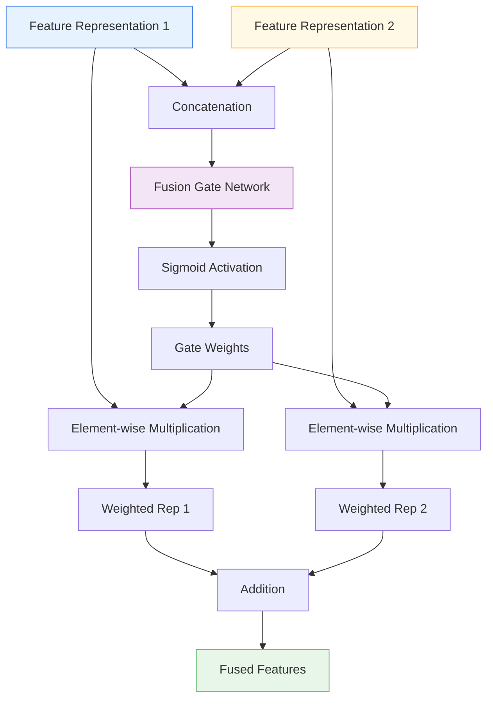

# 🔀 GatedFeatureFusion

<div class="layer-hero">
  <div class="layer-hero-content">
    <h1>🔀 GatedFeatureFusion</h1>
    <div class="layer-badges">
      <span class="badge badge-popular">🔥 Popular</span>
      <span class="badge badge-stable">✅ Stable</span>
      <span class="badge badge-intermediate">🟡 Intermediate</span>
    </div>
  </div>
</div>

## 🎯 Overview

The `GatedFeatureFusion` layer intelligently combines two feature representations using a learned gating mechanism. This is particularly useful when you have multiple representations of the same data (e.g., raw numerical features alongside their embeddings) and want to learn the optimal way to combine them.

The layer uses a learned gate to balance the contributions of both representations, allowing the model to dynamically decide how much to rely on each representation based on the input context.

## 🔍 How It Works

The GatedFeatureFusion layer processes two feature representations through a sophisticated fusion mechanism:

1. **Input Concatenation**: Combines both feature representations
2. **Gate Learning**: Uses a dense layer to learn fusion weights
3. **Sigmoid Activation**: Applies sigmoid to create gating values between 0 and 1
4. **Weighted Fusion**: Combines representations using learned gates
5. **Output Generation**: Produces the fused feature representation



## 💡 Why Use This Layer?

| Challenge | Traditional Approach | GatedFeatureFusion's Solution |
|-----------|---------------------|-------------------------------|
| **Multiple Representations** | Simple concatenation or averaging | 🎯 **Learned fusion** that adapts to input context |
| **Feature Redundancy** | Treat all features equally | ⚡ **Intelligent weighting** to balance contributions |
| **Representation Quality** | No adaptation to representation quality | 🧠 **Dynamic gating** based on representation relevance |
| **Information Loss** | Fixed combination strategies | 🔗 **Preserves information** from both representations |

## 📊 Use Cases

- **Multi-Modal Data**: Combining different data types (numerical + categorical embeddings)
- **Feature Engineering**: Fusing raw features with engineered features
- **Ensemble Methods**: Combining different model representations
- **Transfer Learning**: Fusing pre-trained features with task-specific features
- **Data Augmentation**: Combining original and augmented feature representations

## 🚀 Quick Start

### Basic Usage

```python
import keras
from kmr.layers import GatedFeatureFusion

# Create two feature representations
batch_size, num_features = 32, 10
features1 = keras.random.normal((batch_size, num_features))  # Raw features
features2 = keras.random.normal((batch_size, num_features))  # Processed features

# Apply gated fusion
fusion = GatedFeatureFusion()
fused_features = fusion([features1, features2])

print(f"Fused features shape: {fused_features.shape}")  # (32, 10)
```

### In a Sequential Model

```python
import keras
from kmr.layers import GatedFeatureFusion

# Create a model with feature fusion
model = keras.Sequential([
    keras.layers.Dense(64, activation='relu'),
    keras.layers.Dense(32, activation='relu'),
    # Split into two representations
    keras.layers.Lambda(lambda x: [x, x]),  # For demo - normally you'd have different paths
    GatedFeatureFusion(),
    keras.layers.Dense(16, activation='relu'),
    keras.layers.Dense(1, activation='sigmoid')
])

model.compile(optimizer='adam', loss='binary_crossentropy')
```

### In a Functional Model

```python
import keras
from kmr.layers import GatedFeatureFusion

# Define inputs
inputs = keras.Input(shape=(20,))  # 20 features

# Create two different representations
raw_features = keras.layers.Dense(32, activation='relu')(inputs)
processed_features = keras.layers.Dense(32, activation='tanh')(inputs)

# Apply gated fusion
fused = GatedFeatureFusion()([raw_features, processed_features])

# Continue processing
x = keras.layers.Dense(16, activation='relu')(fused)
x = keras.layers.Dropout(0.2)(x)
outputs = keras.layers.Dense(1, activation='sigmoid')(x)

model = keras.Model(inputs, outputs)
```

### Advanced Configuration

```python
# Advanced configuration with custom activation
fusion = GatedFeatureFusion(
    activation='tanh',  # Custom activation for the gate
    name="custom_fusion"
)

# Use in a complex multi-representation model
inputs = keras.Input(shape=(50,))

# Multiple feature processing paths
path1 = keras.layers.Dense(64, activation='relu')(inputs)
path1 = keras.layers.Dense(32, activation='relu')(path1)

path2 = keras.layers.Dense(64, activation='tanh')(inputs)
path2 = keras.layers.Dense(32, activation='sigmoid')(path2)

# Fuse the representations
fused = fusion([path1, path2])

# Final processing
x = keras.layers.Dense(16, activation='relu')(fused)
x = keras.layers.Dropout(0.3)(x)
outputs = keras.layers.Dense(5, activation='softmax')(x)

model = keras.Model(inputs, outputs)
```

## 📖 API Reference

::: kmr.layers.GatedFeatureFusion

## 🔧 Parameters Deep Dive

### `activation` (str)
- **Purpose**: Activation function for the fusion gate
- **Options**: 'sigmoid', 'tanh', 'relu', 'softmax', etc.
- **Default**: 'sigmoid'
- **Impact**: Controls the gating behavior and output range
- **Recommendation**: Use 'sigmoid' for balanced fusion, 'tanh' for signed gating

## 📈 Performance Characteristics

- **Speed**: ⚡⚡⚡⚡ Very fast - simple dense layer computation
- **Memory**: 💾💾 Low memory usage - minimal additional parameters
- **Accuracy**: 🎯🎯🎯🎯 Excellent for multi-representation fusion
- **Best For**: Tabular data with multiple feature representations

## 🎨 Examples

### Example 1: Numerical + Categorical Embeddings

```python
import keras
from kmr.layers import GatedFeatureFusion

# Simulate mixed data: numerical features + categorical embeddings
batch_size = 32
numerical_features = keras.random.normal((batch_size, 10))  # 10 numerical features
categorical_embeddings = keras.random.normal((batch_size, 10))  # 10-dim categorical embeddings

# Build fusion model
num_input = keras.Input(shape=(10,), name='numerical')
cat_input = keras.Input(shape=(10,), name='categorical')

# Process each type
num_processed = keras.layers.Dense(16, activation='relu')(num_input)
cat_processed = keras.layers.Dense(16, activation='relu')(cat_input)

# Fuse representations
fused = GatedFeatureFusion()([num_processed, cat_processed])

# Final prediction
x = keras.layers.Dense(32, activation='relu')(fused)
x = keras.layers.Dropout(0.2)(x)
output = keras.layers.Dense(1, activation='sigmoid')(x)

model = keras.Model([num_input, cat_input], output)
model.compile(optimizer='adam', loss='binary_crossentropy')
```

### Example 2: Multi-Scale Feature Fusion

```python
# Fuse features at different scales/resolutions
def create_multi_scale_model():
    inputs = keras.Input(shape=(20,))
    
    # Fine-grained features
    fine_features = keras.layers.Dense(64, activation='relu')(inputs)
    fine_features = keras.layers.Dense(32, activation='relu')(fine_features)
    
    # Coarse-grained features
    coarse_features = keras.layers.Dense(32, activation='relu')(inputs)
    coarse_features = keras.layers.Dense(32, activation='relu')(coarse_features)
    
    # Fuse different scales
    fused = GatedFeatureFusion()([fine_features, coarse_features])
    
    # Multi-task output
    task1 = keras.layers.Dense(16, activation='relu')(fused)
    task1 = keras.layers.Dense(3, activation='softmax', name='classification')(task1)
    
    task2 = keras.layers.Dense(8, activation='relu')(fused)
    task2 = keras.layers.Dense(1, name='regression')(task2)
    
    return keras.Model(inputs, [task1, task2])

model = create_multi_scale_model()
model.compile(
    optimizer='adam',
    loss={'classification': 'categorical_crossentropy', 'regression': 'mse'},
    loss_weights={'classification': 1.0, 'regression': 0.5}
)
```

### Example 3: Ensemble Feature Fusion

```python
# Fuse features from different models/representations
def create_ensemble_fusion_model():
    inputs = keras.Input(shape=(15,))
    
    # Model 1 representation
    model1_features = keras.layers.Dense(32, activation='relu')(inputs)
    model1_features = keras.layers.Dense(16, activation='relu')(model1_features)
    
    # Model 2 representation
    model2_features = keras.layers.Dense(32, activation='tanh')(inputs)
    model2_features = keras.layers.Dense(16, activation='sigmoid')(model2_features)
    
    # Fuse ensemble representations
    ensemble_fused = GatedFeatureFusion()([model1_features, model2_features])
    
    # Final prediction
    x = keras.layers.Dense(32, activation='relu')(ensemble_fused)
    x = keras.layers.Dropout(0.3)(x)
    x = keras.layers.Dense(16, activation='relu')(x)
    output = keras.layers.Dense(1, activation='sigmoid')(output)
    
    return keras.Model(inputs, output)

model = create_ensemble_fusion_model()
model.compile(optimizer='adam', loss='binary_crossentropy')
```

## 💡 Tips & Best Practices

- **Representation Quality**: Ensure both representations are meaningful and complementary
- **Feature Alignment**: Both inputs must have the same feature dimension
- **Activation Choice**: Use 'sigmoid' for balanced fusion, 'tanh' for signed gating
- **Regularization**: Combine with dropout to prevent overfitting
- **Interpretability**: Monitor gate values to understand fusion behavior
- **Data Preprocessing**: Ensure both representations are properly normalized

## ⚠️ Common Pitfalls

- **Shape Mismatch**: Both inputs must have identical shapes
- **Input Format**: Must provide exactly two inputs as a list
- **Representation Quality**: Poor representations will lead to poor fusion
- **Overfitting**: Can overfit on small datasets - use regularization
- **Gate Interpretation**: Gate values are relative, not absolute importance

## 🔗 Related Layers

- [GatedFeatureSelection](gated-feature-selection.md) - Gated feature selection mechanism
- [VariableSelection](variable-selection.md) - Dynamic feature selection
- [AdvancedNumericalEmbedding](advanced-numerical-embedding.md) - Advanced numerical embeddings
- [TabularAttention](tabular-attention.md) - Attention-based feature processing

## 📚 Further Reading

- [Gated Residual Networks](https://arxiv.org/abs/1612.08083) - GRN architecture details
- [Feature Fusion in Deep Learning](https://en.wikipedia.org/wiki/Feature_fusion) - Feature fusion concepts
- [Multi-Modal Learning](https://en.wikipedia.org/wiki/Multimodal_learning) - Multi-modal learning approaches
- [KMR Layer Explorer](../layers-explorer.md) - Browse all available layers
- [Feature Engineering Tutorial](../tutorials/feature-engineering.md) - Complete guide to feature engineering
