# 🎯 GatedFeatureSelection

<div class="layer-hero">
  <div class="layer-hero-content">
    <h1>🎯 GatedFeatureSelection</h1>
    <div class="layer-badges">
      <span class="badge badge-intermediate">🟡 Intermediate</span>
      <span class="badge badge-stable">✅ Stable</span>
      <span class="badge badge-popular">🔥 Popular</span>
    </div>
  </div>
</div>

## 🎯 Overview

The `GatedFeatureSelection` layer implements a learnable feature selection mechanism using a sophisticated gating network. Each feature is assigned a dynamic importance weight between 0 and 1 through a multi-layer gating network that includes batch normalization and ReLU activations for stable training.

This layer is particularly powerful for dynamic feature importance learning, feature selection in time-series data, and implementing attention-like mechanisms for tabular data. It includes a small residual connection to maintain gradient flow and prevent information loss.

## 🔍 How It Works

The GatedFeatureSelection layer processes features through a sophisticated gating mechanism:

1. **Feature Analysis**: Analyzes all input features to understand their importance
2. **Gating Network**: Uses a multi-layer network to compute feature weights
3. **Weight Generation**: Produces sigmoid-activated weights between 0 and 1
4. **Residual Connection**: Adds a small residual connection for gradient flow
5. **Weighted Output**: Applies learned weights to scale feature importance

```mermaid
graph TD
    A[Input Features: batch_size, input_dim] --> B[Gating Network]
    B --> C[Hidden Layer 1 + ReLU + BatchNorm]
    C --> D[Hidden Layer 2 + ReLU + BatchNorm]
    D --> E[Output Layer + Sigmoid]
    E --> F[Feature Weights: 0-1]
    
    A --> G[Element-wise Multiplication]
    F --> G
    A --> H[Residual Connection × 0.1]
    G --> I[Weighted Features]
    H --> I
    I --> J[Final Output]
    
    style A fill:#e6f3ff,stroke:#4a86e8
    style J fill:#e8f5e9,stroke:#66bb6a
    style B fill:#fff9e6,stroke:#ffb74d
    style F fill:#f3e5f5,stroke:#9c27b0
```



## 💡 Why Use This Layer?

| Challenge | Traditional Approach | GatedFeatureSelection's Solution |
|-----------|---------------------|----------------------------------|
| **Feature Importance** | Manual feature selection or uniform treatment | 🎯 **Automatic learning** of feature importance through gating |
| **Dynamic Selection** | Static feature selection decisions | ⚡ **Context-aware** selection that adapts to input |
| **Gradient Flow** | Potential vanishing gradients in selection | 🔗 **Residual connection** maintains gradient flow |
| **Noise Reduction** | All features treated equally | 🧠 **Intelligent filtering** of less important features |

## 📊 Use Cases

- **Time Series Analysis**: Dynamic feature selection for different time periods
- **Noise Reduction**: Filtering out irrelevant or noisy features
- **Feature Engineering**: Learning which features are most important
- **Attention Mechanisms**: Implementing attention-like behavior for tabular data
- **High-Dimensional Data**: Intelligently reducing feature space

## 🚀 Quick Start

### Basic Usage

```python
import keras
from kerasfactory.layers import GatedFeatureSelection

# Create sample input data
batch_size, input_dim = 32, 20
x = keras.random.normal((batch_size, input_dim))

# Apply gated feature selection
gated_selection = GatedFeatureSelection(input_dim=input_dim, reduction_ratio=4)
selected_features = gated_selection(x)

print(f"Input shape: {x.shape}")           # (32, 20)
print(f"Output shape: {selected_features.shape}")  # (32, 20)
```

### In a Sequential Model

```python
import keras
from kerasfactory.layers import GatedFeatureSelection

model = keras.Sequential([
    keras.layers.Dense(64, activation='relu'),
    GatedFeatureSelection(input_dim=64, reduction_ratio=8),
    keras.layers.Dense(32, activation='relu'),
    keras.layers.Dense(1, activation='sigmoid')
])

model.compile(optimizer='adam', loss='binary_crossentropy', metrics=['accuracy'])
```

### In a Functional Model

```python
import keras
from kerasfactory.layers import GatedFeatureSelection

# Define inputs
inputs = keras.Input(shape=(20,))  # 20 features

# Process features
x = keras.layers.Dense(64, activation='relu')(inputs)
x = GatedFeatureSelection(input_dim=64, reduction_ratio=4)(x)
x = keras.layers.Dropout(0.2)(x)
x = keras.layers.Dense(32, activation='relu')(x)
outputs = keras.layers.Dense(1, activation='sigmoid')(x)

model = keras.Model(inputs, outputs)
```

### Advanced Configuration

```python
# Advanced configuration with custom reduction ratio
gated_selection = GatedFeatureSelection(
    input_dim=128,
    reduction_ratio=16,  # More aggressive reduction
    name="custom_gated_selection"
)

# Use in a complex model
inputs = keras.Input(shape=(50,))
x = keras.layers.Dense(128, activation='relu')(inputs)
x = keras.layers.BatchNormalization()(x)
x = gated_selection(x)  # Apply gated selection
x = keras.layers.Dense(64, activation='relu')(x)
x = keras.layers.Dropout(0.3)(x)
outputs = keras.layers.Dense(5, activation='softmax')(x)

model = keras.Model(inputs, outputs)
```

## 📖 API Reference

::: kerasfactory.layers.GatedFeatureSelection

## 🔧 Parameters Deep Dive

### `input_dim` (int)
- **Purpose**: Dimension of the input features
- **Range**: 1 to 1000+ (typically 10-100)
- **Impact**: Must match the last dimension of your input tensor
- **Recommendation**: Set to the output dimension of your previous layer

### `reduction_ratio` (int)
- **Purpose**: Ratio to reduce the hidden dimension of the gating network
- **Range**: 2 to 32+ (typically 4-16)
- **Impact**: Higher ratio = fewer parameters but potentially less expressive gates
- **Recommendation**: Start with 4, increase for more aggressive feature selection

## 📈 Performance Characteristics

- **Speed**: ⚡⚡⚡ Fast - simple neural network computation
- **Memory**: 💾💾 Low memory usage - minimal additional parameters
- **Accuracy**: 🎯🎯🎯 Good for feature importance and noise reduction
- **Best For**: Tabular data where feature importance varies by context

## 🎨 Examples

### Example 1: Time Series Feature Selection

```python
import keras
import numpy as np
from kerasfactory.layers import GatedFeatureSelection

# Simulate time series data with varying feature importance
batch_size, time_steps, features = 32, 24, 15
time_series_data = keras.random.normal((batch_size, time_steps, features))

# Build time series model with gated selection
inputs = keras.Input(shape=(time_steps, features))

# Process each time step
x = keras.layers.Dense(32, activation='relu')(inputs)
x = keras.layers.Reshape((-1, 32))(x)  # Flatten time dimension

# Apply gated feature selection
x = GatedFeatureSelection(input_dim=32, reduction_ratio=8)(x)

# Reshape back and process
x = keras.layers.Reshape((time_steps, 32))(x)
x = keras.layers.LSTM(64, return_sequences=True)(x)
x = keras.layers.LSTM(32)(x)
output = keras.layers.Dense(1, activation='sigmoid')(x)

model = keras.Model(inputs, output)
model.compile(optimizer='adam', loss='binary_crossentropy')
```

### Example 2: Multi-Task Feature Selection

```python
# Different tasks may need different feature selections
def create_multi_task_model():
    inputs = keras.Input(shape=(25,))  # 25 features
    
    # Shared feature processing with gated selection
    x = keras.layers.Dense(64, activation='relu')(inputs)
    x = keras.layers.BatchNormalization()(x)
    x = GatedFeatureSelection(input_dim=64, reduction_ratio=4)(x)
    
    # Task-specific processing
    # Classification task
    cls_features = keras.layers.Dense(32, activation='relu')(x)
    cls_features = keras.layers.Dropout(0.3)(cls_features)
    classification = keras.layers.Dense(3, activation='softmax', name='classification')(cls_features)
    
    # Regression task
    reg_features = keras.layers.Dense(16, activation='relu')(x)
    reg_features = keras.layers.Dropout(0.2)(reg_features)
    regression = keras.layers.Dense(1, name='regression')(reg_features)
    
    return keras.Model(inputs, [classification, regression])

model = create_multi_task_model()
model.compile(
    optimizer='adam',
    loss={'classification': 'categorical_crossentropy', 'regression': 'mse'},
    loss_weights={'classification': 1.0, 'regression': 0.5}
)
```

### Example 3: Feature Importance Analysis

```python
# Analyze which features are being selected
def analyze_feature_selection(model, test_data, feature_names=None):
    """Analyze feature selection patterns."""
    # Get the gated feature selection layer
    gated_layer = None
    for layer in model.layers:
        if isinstance(layer, GatedFeatureSelection):
            gated_layer = layer
            break
    
    if gated_layer is None:
        print("No GatedFeatureSelection layer found")
        return
    
    # Get feature weights
    weights = gated_layer.gate_net(test_data)
    
    # Analyze weights
    avg_weights = np.mean(weights, axis=0)
    print("Average feature weights:")
    for i, weight in enumerate(avg_weights):
        feature_name = feature_names[i] if feature_names else f"Feature_{i}"
        print(f"{feature_name}: {weight:.4f}")
    
    # Find most important features
    top_features = np.argsort(avg_weights)[-5:]  # Top 5 features
    print(f"\nTop 5 most important features: {top_features}")
    
    return weights

# Use with your model
# weights = analyze_feature_selection(model, test_data, feature_names)
```

## 💡 Tips & Best Practices

- **Reduction Ratio**: Start with 4, adjust based on feature complexity and model size
- **Residual Connection**: The 0.1 residual connection helps maintain gradient flow
- **Batch Normalization**: The gating network includes batch norm for stable training
- **Feature Preprocessing**: Ensure features are properly normalized before selection
- **Monitoring**: Track feature weights to understand selection patterns
- **Regularization**: Combine with dropout to prevent overfitting

## ⚠️ Common Pitfalls

- **Input Dimension**: Must match the last dimension of your input tensor
- **Reduction Ratio**: Too high can lead to underfitting, too low to overfitting
- **Gradient Flow**: The residual connection helps but monitor for vanishing gradients
- **Feature Interpretation**: Weights are relative, not absolute importance
- **Memory Usage**: Scales with input_dim, be careful with very large feature spaces

## 🔗 Related Layers

- [VariableSelection](variable-selection.md) - Dynamic feature selection using GRNs
- [ColumnAttention](column-attention.md) - Column-wise attention mechanism
- [TabularAttention](tabular-attention.md) - General tabular attention
- [SparseAttentionWeighting](sparse-attention-weighting.md) - Sparse attention weights

## 📚 Further Reading

- [Attention Mechanisms in Deep Learning](https://distill.pub/2016/augmented-rnns/) - Understanding attention mechanisms
- [Feature Selection in Machine Learning](https://en.wikipedia.org/wiki/Feature_selection) - Feature selection concepts
- [Gated Networks](https://arxiv.org/abs/1612.08083) - Gated network architectures
- [KerasFactory Layer Explorer](../layers_overview.md) - Browse all available layers
- [Feature Engineering Tutorial](../tutorials/feature-engineering.md) - Complete guide to feature engineering
