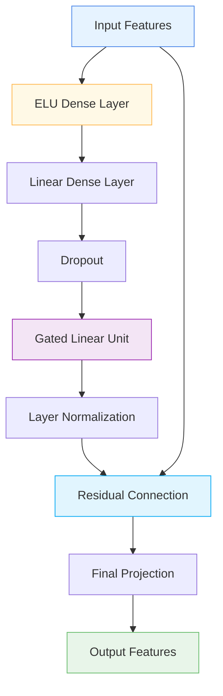

# 🔗 GatedResidualNetwork

<div class="layer-hero">
  <div class="layer-hero-content">
    <h1>🔗 GatedResidualNetwork</h1>
    <div class="layer-badges">
      <span class="badge badge-advanced">🔴 Advanced</span>
      <span class="badge badge-stable">✅ Stable</span>
      <span class="badge badge-popular">🔥 Popular</span>
    </div>
  </div>
</div>

## 🎯 Overview

The `GatedResidualNetwork` is a sophisticated layer that combines residual connections with gated linear units for improved gradient flow and feature transformation. It applies a series of transformations including dense layers, dropout, gated linear units, and layer normalization, all while maintaining residual connections.

This layer is particularly powerful for deep neural networks where gradient flow and feature transformation are critical, making it ideal for complex tabular data processing and feature engineering.

## 🔍 How It Works

The GatedResidualNetwork processes data through a sophisticated transformation pipeline:

1. **ELU Dense Layer**: Applies dense transformation with ELU activation
2. **Linear Dense Layer**: Applies linear transformation
3. **Dropout Regularization**: Applies dropout for regularization
4. **Gated Linear Unit**: Applies gated linear transformation
5. **Layer Normalization**: Normalizes the transformed features
6. **Residual Connection**: Adds the original input to maintain gradient flow
7. **Final Projection**: Applies final dense transformation



## 💡 Why Use This Layer?

| Challenge | Traditional Approach | GatedResidualNetwork's Solution |
|-----------|---------------------|--------------------------------|
| **Gradient Flow** | Vanishing gradients in deep networks | 🎯 **Residual connections** maintain gradient flow |
| **Feature Transformation** | Simple dense layers | ⚡ **Sophisticated transformation** with gating |
| **Regularization** | Basic dropout | 🧠 **Advanced regularization** with layer normalization |
| **Deep Networks** | Limited depth due to gradient issues | 🔗 **Enables deeper networks** with better training |

## 📊 Use Cases

- **Deep Tabular Networks**: Building deep networks for tabular data
- **Feature Transformation**: Sophisticated feature processing
- **Gradient Flow**: Maintaining gradients in deep architectures
- **Complex Patterns**: Capturing complex relationships in data
- **Ensemble Learning**: As a component in ensemble architectures

## 🚀 Quick Start

### Basic Usage

```python
import keras
from kerasfactory.layers import GatedResidualNetwork

# Create sample input data
batch_size, input_dim = 32, 16
x = keras.random.normal((batch_size, input_dim))

# Apply gated residual network
grn = GatedResidualNetwork(units=16, dropout_rate=0.2)
output = grn(x)

print(f"Input shape: {x.shape}")           # (32, 16)
print(f"Output shape: {output.shape}")     # (32, 16)
```

### In a Sequential Model

```python
import keras
from kerasfactory.layers import GatedResidualNetwork

model = keras.Sequential([
    keras.layers.Dense(32, activation='relu'),
    GatedResidualNetwork(units=32, dropout_rate=0.2),
    keras.layers.Dense(16, activation='relu'),
    GatedResidualNetwork(units=16, dropout_rate=0.1),
    keras.layers.Dense(1, activation='sigmoid')
])

model.compile(optimizer='adam', loss='binary_crossentropy', metrics=['accuracy'])
```

### In a Functional Model

```python
import keras
from kerasfactory.layers import GatedResidualNetwork

# Define inputs
inputs = keras.Input(shape=(20,))  # 20 features

# Apply gated residual network
x = GatedResidualNetwork(units=32, dropout_rate=0.2)(inputs)

# Continue processing
x = keras.layers.Dense(64, activation='relu')(x)
x = GatedResidualNetwork(units=64, dropout_rate=0.1)(x)
x = keras.layers.Dense(32, activation='relu')(x)
outputs = keras.layers.Dense(1, activation='sigmoid')(x)

model = keras.Model(inputs, outputs)
```

### Advanced Configuration

```python
# Advanced configuration with multiple GRN layers
def create_deep_grn_model():
    inputs = keras.Input(shape=(50,))
    
    # Multiple GRN layers with different configurations
    x = GatedResidualNetwork(units=64, dropout_rate=0.3)(inputs)
    x = GatedResidualNetwork(units=64, dropout_rate=0.2)(x)
    x = GatedResidualNetwork(units=32, dropout_rate=0.1)(x)
    
    # Final processing
    x = keras.layers.Dense(16, activation='relu')(x)
    x = keras.layers.Dropout(0.2)(x)
    
    # Multi-task output
    classification = keras.layers.Dense(3, activation='softmax', name='classification')(x)
    regression = keras.layers.Dense(1, name='regression')(x)
    
    return keras.Model(inputs, [classification, regression])

model = create_deep_grn_model()
model.compile(
    optimizer='adam',
    loss={'classification': 'categorical_crossentropy', 'regression': 'mse'},
    loss_weights={'classification': 1.0, 'regression': 0.5}
)
```

## 📖 API Reference

::: kerasfactory.layers.GatedResidualNetwork

## 🔧 Parameters Deep Dive

### `units` (int)
- **Purpose**: Dimensionality of the output space
- **Range**: 1 to 1000+ (typically 16-256)
- **Impact**: Determines the size of the transformed features
- **Recommendation**: Start with 32-64, scale based on data complexity

### `dropout_rate` (float)
- **Purpose**: Dropout rate for regularization
- **Range**: 0.0 to 0.9 (typically 0.1-0.3)
- **Impact**: Higher values = more regularization but potential underfitting
- **Recommendation**: Start with 0.2, adjust based on overfitting

## 📈 Performance Characteristics

- **Speed**: ⚡⚡⚡ Fast - efficient transformations
- **Memory**: 💾💾💾 Moderate memory usage due to multiple layers
- **Accuracy**: 🎯🎯🎯🎯 Excellent for complex feature transformation
- **Best For**: Deep networks requiring sophisticated feature processing

## 🎨 Examples

### Example 1: Deep Tabular Network

```python
import keras
import numpy as np
from kerasfactory.layers import GatedResidualNetwork

# Create a deep tabular network with GRN layers
def create_deep_tabular_network():
    inputs = keras.Input(shape=(30,))  # 30 features
    
    # Initial processing
    x = keras.layers.Dense(64, activation='relu')(inputs)
    x = keras.layers.BatchNormalization()(x)
    
    # Multiple GRN layers
    x = GatedResidualNetwork(units=64, dropout_rate=0.2)(x)
    x = GatedResidualNetwork(units=64, dropout_rate=0.2)(x)
    x = GatedResidualNetwork(units=32, dropout_rate=0.1)(x)
    x = GatedResidualNetwork(units=32, dropout_rate=0.1)(x)
    
    # Final processing
    x = keras.layers.Dense(16, activation='relu')(x)
    x = keras.layers.Dropout(0.2)(x)
    
    # Output
    outputs = keras.layers.Dense(1, activation='sigmoid')(x)
    
    return keras.Model(inputs, outputs)

model = create_deep_tabular_network()
model.compile(optimizer='adam', loss='binary_crossentropy')

# Test with sample data
sample_data = keras.random.normal((100, 30))
predictions = model(sample_data)
print(f"Deep network predictions shape: {predictions.shape}")
```

### Example 2: Feature Transformation Pipeline

```python
# Create a feature transformation pipeline with GRN
def create_feature_transformation_pipeline():
    inputs = keras.Input(shape=(25,))
    
    # Feature transformation stages
    # Stage 1: Basic transformation
    x1 = keras.layers.Dense(32, activation='relu')(inputs)
    x1 = GatedResidualNetwork(units=32, dropout_rate=0.2)(x1)
    
    # Stage 2: Advanced transformation
    x2 = keras.layers.Dense(64, activation='relu')(inputs)
    x2 = GatedResidualNetwork(units=64, dropout_rate=0.2)(x2)
    x2 = GatedResidualNetwork(units=32, dropout_rate=0.1)(x2)
    
    # Stage 3: Final transformation
    x3 = keras.layers.Dense(48, activation='relu')(inputs)
    x3 = GatedResidualNetwork(units=48, dropout_rate=0.2)(x3)
    x3 = GatedResidualNetwork(units=24, dropout_rate=0.1)(x3)
    
    # Combine transformed features
    combined = keras.layers.Concatenate()([x1, x2, x3])
    
    # Final processing
    x = keras.layers.Dense(32, activation='relu')(combined)
    x = keras.layers.Dropout(0.2)(x)
    outputs = keras.layers.Dense(1, activation='sigmoid')(x)
    
    return keras.Model(inputs, outputs)

model = create_feature_transformation_pipeline()
model.compile(optimizer='adam', loss='binary_crossentropy')
```

### Example 3: Gradient Flow Analysis

```python
# Analyze gradient flow in GRN networks
def analyze_gradient_flow():
    # Create model with GRN layers
    inputs = keras.Input(shape=(20,))
    x = GatedResidualNetwork(units=32, dropout_rate=0.2)(inputs)
    x = GatedResidualNetwork(units=32, dropout_rate=0.2)(x)
    x = GatedResidualNetwork(units=16, dropout_rate=0.1)(x)
    outputs = keras.layers.Dense(1, activation='sigmoid')(x)
    
    model = keras.Model(inputs, outputs)
    
    # Test gradient flow
    with keras.GradientTape() as tape:
        x = keras.random.normal((10, 20))
        y = model(x)
        loss = keras.ops.mean(y)
    
    # Compute gradients
    gradients = tape.gradient(loss, model.trainable_variables)
    
    # Analyze gradient magnitudes
    print("Gradient Flow Analysis:")
    print("=" * 40)
    for i, grad in enumerate(gradients):
        if grad is not None:
            grad_norm = keras.ops.norm(grad)
            print(f"Layer {i}: Gradient norm = {grad_norm:.6f}")
    
    return model

# Analyze gradient flow
# model = analyze_gradient_flow()
```

## 💡 Tips & Best Practices

- **Units**: Start with 32-64 units, scale based on data complexity
- **Dropout Rate**: Use 0.2-0.3 for regularization, adjust based on overfitting
- **Residual Connections**: The layer automatically handles residual connections
- **Layer Normalization**: Built-in layer normalization for stable training
- **Gradient Flow**: Excellent for maintaining gradients in deep networks
- **Combination**: Works well with other Keras layers

## ⚠️ Common Pitfalls

- **Units**: Must be positive integer
- **Dropout Rate**: Must be between 0 and 1
- **Memory Usage**: Can be memory-intensive with large units
- **Overfitting**: Monitor for overfitting with high dropout rates
- **Gradient Explosion**: Rare but possible with very deep networks

## 🔗 Related Layers

- [GatedLinearUnit](gated-linear-unit.md) - Gated linear unit component
- [TransformerBlock](transformer-block.md) - Transformer-style processing
- [TabularMoELayer](tabular-moe-layer.md) - Mixture of experts
- [VariableSelection](variable-selection.md) - Variable selection with GRN

## 📚 Further Reading

- [Residual Networks](https://en.wikipedia.org/wiki/Residual_neural_network) - Residual network concepts
- [Gated Linear Units](https://arxiv.org/abs/1612.08083) - Gated linear unit paper
- [Layer Normalization](https://arxiv.org/abs/1607.06450) - Layer normalization paper
- [KerasFactory Layer Explorer](../layers_overview.md) - Browse all available layers
- [Feature Engineering Tutorial](../tutorials/feature-engineering.md) - Complete guide to feature engineering
