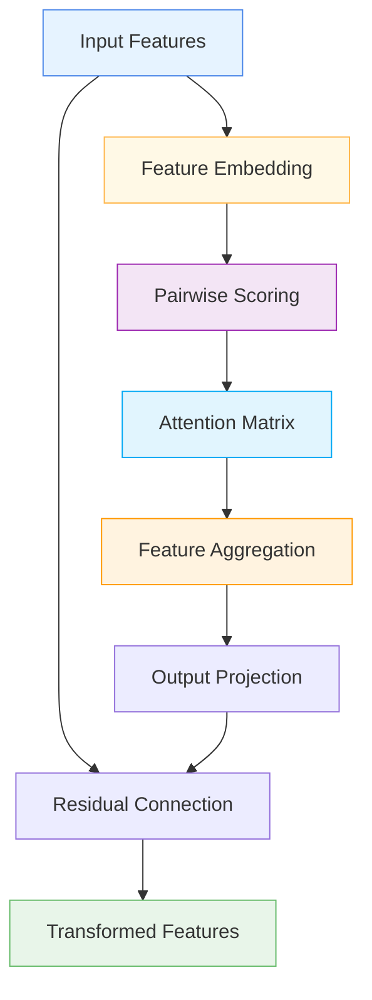

# 🔗 GraphFeatureAggregation

<div class="layer-hero">
  <div class="layer-hero-content">
    <h1>🔗 GraphFeatureAggregation</h1>
    <div class="layer-badges">
      <span class="badge badge-intermediate">🟡 Intermediate</span>
      <span class="badge badge-stable">✅ Stable</span>
      <span class="badge badge-popular">🔥 Popular</span>
    </div>
  </div>
</div>

## 🎯 Overview

The `GraphFeatureAggregation` layer treats each input feature as a node in a graph and uses self-attention mechanisms to learn relationships between features. It projects features into an embedding space, computes pairwise attention scores, and aggregates feature information based on these scores.

This layer is particularly powerful for tabular data where features have inherent relationships, providing a way to learn and exploit these relationships automatically without manual feature engineering.

## 🔍 How It Works

The GraphFeatureAggregation processes data through a graph-based transformation:

1. **Feature Embedding**: Projects each scalar feature to an embedding
2. **Pairwise Scoring**: Computes pairwise concatenated embeddings and scores them
3. **Attention Matrix**: Normalizes scores with softmax to create dynamic adjacency matrix
4. **Feature Aggregation**: Aggregates neighboring features via weighted sum
5. **Output Projection**: Projects back to original dimension with residual connection



## 💡 Why Use This Layer?

| Challenge | Traditional Approach | GraphFeatureAggregation's Solution |
|-----------|---------------------|-----------------------------------|
| **Feature Relationships** | Manual feature engineering | 🎯 **Automatic learning** of feature relationships |
| **Graph Structure** | No graph structure | ⚡ **Graph-based** feature processing |
| **Attention Mechanisms** | No attention | 🧠 **Self-attention** for feature interactions |
| **Dynamic Adjacency** | Static relationships | 🔗 **Dynamic adjacency** matrix learning |

## 📊 Use Cases

- **Tabular Data**: Learning feature relationships in tabular data
- **Graph Neural Networks**: Graph-based processing for tabular data
- **Feature Engineering**: Automatic feature relationship learning
- **Attention Mechanisms**: Self-attention for feature interactions
- **Dynamic Relationships**: Learning dynamic feature relationships

## 🚀 Quick Start

### Basic Usage

```python
import keras
from kmr.layers import GraphFeatureAggregation

# Create sample input data
batch_size, num_features = 32, 10
x = keras.random.normal((batch_size, num_features))

# Apply graph feature aggregation
graph_layer = GraphFeatureAggregation(embed_dim=8, dropout_rate=0.1)
output = graph_layer(x, training=True)

print(f"Input shape: {x.shape}")           # (32, 10)
print(f"Output shape: {output.shape}")     # (32, 10)
```

### In a Sequential Model

```python
import keras
from kmr.layers import GraphFeatureAggregation

model = keras.Sequential([
    keras.layers.Dense(32, activation='relu'),
    GraphFeatureAggregation(embed_dim=16, dropout_rate=0.1),
    keras.layers.Dense(16, activation='relu'),
    GraphFeatureAggregation(embed_dim=8, dropout_rate=0.1),
    keras.layers.Dense(1, activation='sigmoid')
])

model.compile(optimizer='adam', loss='binary_crossentropy', metrics=['accuracy'])
```

### In a Functional Model

```python
import keras
from kmr.layers import GraphFeatureAggregation

# Define inputs
inputs = keras.Input(shape=(20,))  # 20 features

# Apply graph feature aggregation
x = GraphFeatureAggregation(embed_dim=16, dropout_rate=0.1)(inputs)

# Continue processing
x = keras.layers.Dense(32, activation='relu')(x)
x = GraphFeatureAggregation(embed_dim=16, dropout_rate=0.1)(x)
x = keras.layers.Dense(16, activation='relu')(x)
outputs = keras.layers.Dense(1, activation='sigmoid')(x)

model = keras.Model(inputs, outputs)
```

### Advanced Configuration

```python
# Advanced configuration with multiple graph layers
def create_graph_network():
    inputs = keras.Input(shape=(25,))  # 25 features
    
    # Multiple graph layers with different configurations
    x = GraphFeatureAggregation(
        embed_dim=16,
        dropout_rate=0.1,
        leaky_relu_alpha=0.2
    )(inputs)
    
    x = keras.layers.Dense(32, activation='relu')(x)
    x = keras.layers.BatchNormalization()(x)
    
    x = GraphFeatureAggregation(
        embed_dim=12,
        dropout_rate=0.1,
        leaky_relu_alpha=0.2
    )(x)
    
    x = keras.layers.Dense(24, activation='relu')(x)
    x = keras.layers.Dropout(0.2)(x)
    
    # Multi-task output
    classification = keras.layers.Dense(3, activation='softmax', name='classification')(x)
    regression = keras.layers.Dense(1, name='regression')(x)
    
    return keras.Model(inputs, [classification, regression])

model = create_graph_network()
model.compile(
    optimizer='adam',
    loss={'classification': 'categorical_crossentropy', 'regression': 'mse'},
    loss_weights={'classification': 1.0, 'regression': 0.5}
)
```

## 📖 API Reference

::: kmr.layers.GraphFeatureAggregation

## 🔧 Parameters Deep Dive

### `embed_dim` (int)
- **Purpose**: Dimensionality of the projected feature embeddings
- **Range**: 4 to 64+ (typically 8-32)
- **Impact**: Larger values = more expressive embeddings but more parameters
- **Recommendation**: Start with 8-16, scale based on data complexity

### `dropout_rate` (float)
- **Purpose**: Dropout rate applied to attention weights
- **Range**: 0.0 to 0.5 (typically 0.1-0.2)
- **Impact**: Higher values = more regularization
- **Recommendation**: Use 0.1-0.2 for regularization

### `leaky_relu_alpha` (float)
- **Purpose**: Alpha parameter for LeakyReLU activation
- **Range**: 0.0 to 1.0 (typically 0.2)
- **Impact**: Controls the negative slope of LeakyReLU
- **Recommendation**: Use 0.2 for most applications

## 📈 Performance Characteristics

- **Speed**: ⚡⚡⚡ Fast for small to medium models, scales with features²
- **Memory**: 💾💾💾 Moderate memory usage due to attention computation
- **Accuracy**: 🎯🎯🎯🎯 Excellent for feature relationship learning
- **Best For**: Tabular data with inherent feature relationships

## 🎨 Examples

### Example 1: Feature Relationship Learning

```python
import keras
import numpy as np
from kmr.layers import GraphFeatureAggregation

# Create a model for feature relationship learning
def create_relationship_learning_model():
    inputs = keras.Input(shape=(20,))  # 20 features
    
    # Multiple graph layers for different relationship levels
    x = GraphFeatureAggregation(
        embed_dim=16,
        dropout_rate=0.1,
        leaky_relu_alpha=0.2
    )(inputs)
    
    x = keras.layers.Dense(32, activation='relu')(x)
    x = keras.layers.BatchNormalization()(x)
    
    x = GraphFeatureAggregation(
        embed_dim=12,
        dropout_rate=0.1,
        leaky_relu_alpha=0.2
    )(x)
    
    x = keras.layers.Dense(16, activation='relu')(x)
    x = keras.layers.Dropout(0.2)(x)
    
    # Output
    outputs = keras.layers.Dense(1, activation='sigmoid')(x)
    
    return keras.Model(inputs, outputs)

model = create_relationship_learning_model()
model.compile(optimizer='adam', loss='binary_crossentropy')

# Test with sample data
sample_data = keras.random.normal((100, 20))
predictions = model(sample_data)
print(f"Relationship learning predictions shape: {predictions.shape}")
```

### Example 2: Graph Structure Analysis

```python
# Analyze graph structure behavior
def analyze_graph_structure():
    # Create model with graph layer
    inputs = keras.Input(shape=(15,))
    x = GraphFeatureAggregation(embed_dim=8, dropout_rate=0.1)(inputs)
    outputs = keras.layers.Dense(1, activation='sigmoid')(x)
    
    model = keras.Model(inputs, outputs)
    
    # Test with different input patterns
    test_inputs = [
        keras.random.normal((10, 15)),  # Random data
        keras.random.normal((10, 15)) * 2,  # Scaled data
        keras.random.normal((10, 15)) + 1,  # Shifted data
    ]
    
    print("Graph Structure Analysis:")
    print("=" * 40)
    
    for i, test_input in enumerate(test_inputs):
        prediction = model(test_input)
        print(f"Test {i+1}: Prediction mean = {keras.ops.mean(prediction):.4f}")
    
    return model

# Analyze graph structure
# model = analyze_graph_structure()
```

### Example 3: Attention Pattern Analysis

```python
# Analyze attention patterns in graph layer
def analyze_attention_patterns():
    # Create model with graph layer
    inputs = keras.Input(shape=(12,))
    x = GraphFeatureAggregation(embed_dim=8, dropout_rate=0.1)(inputs)
    outputs = keras.layers.Dense(1, activation='sigmoid')(x)
    
    model = keras.Model(inputs, outputs)
    
    # Test with sample data
    sample_data = keras.random.normal((50, 12))
    predictions = model(sample_data)
    
    print("Attention Pattern Analysis:")
    print("=" * 40)
    print(f"Input shape: {sample_data.shape}")
    print(f"Output shape: {predictions.shape}")
    print(f"Model parameters: {model.count_params()}")
    
    return model

# Analyze attention patterns
# model = analyze_attention_patterns()
```

## 💡 Tips & Best Practices

- **Embedding Dimension**: Start with 8-16, scale based on data complexity
- **Dropout Rate**: Use 0.1-0.2 for regularization
- **LeakyReLU Alpha**: Use 0.2 for most applications
- **Feature Relationships**: Works best when features have inherent relationships
- **Residual Connections**: Built-in residual connections for gradient flow
- **Attention Patterns**: Monitor attention patterns for interpretability

## ⚠️ Common Pitfalls

- **Embedding Dimension**: Must be positive integer
- **Dropout Rate**: Must be between 0 and 1
- **Memory Usage**: Scales quadratically with number of features
- **Overfitting**: Monitor for overfitting with complex configurations
- **Feature Count**: Consider feature pre-selection for very large feature sets

## 🔗 Related Layers

- [AdvancedGraphFeature](advanced-graph-feature.md) - Advanced graph feature layer
- [MultiHeadGraphFeaturePreprocessor](multi-head-graph-feature-preprocessor.md) - Multi-head graph preprocessing
- [TabularAttention](tabular-attention.md) - Tabular attention mechanisms
- [VariableSelection](variable-selection.md) - Variable selection

## 📚 Further Reading

- [Graph Neural Networks](https://en.wikipedia.org/wiki/Graph_neural_network) - Graph neural network concepts
- [Self-Attention](https://arxiv.org/abs/1706.03762) - Self-attention mechanism
- [Feature Relationships](https://en.wikipedia.org/wiki/Feature_engineering) - Feature relationship concepts
- [KMR Layer Explorer](../layers_overview.md) - Browse all available layers
- [Feature Engineering Tutorial](../tutorials/feature-engineering.md) - Complete guide to feature engineering
