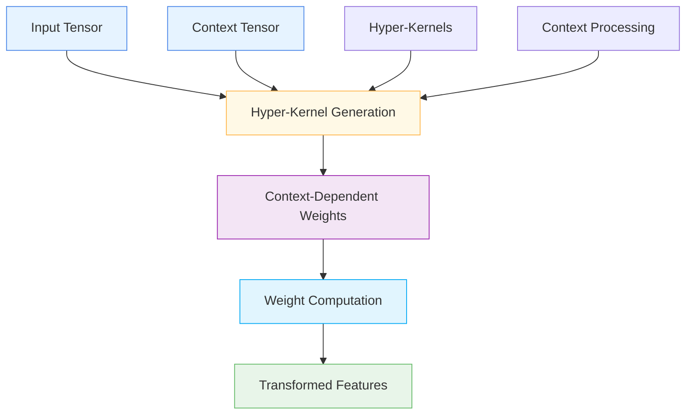

# ⚡ HyperZZWOperator

<div class="layer-hero">
  <div class="layer-hero-content">
    <h1>⚡ HyperZZWOperator</h1>
    <div class="layer-badges">
      <span class="badge badge-advanced">🔴 Advanced</span>
      <span class="badge badge-stable">✅ Stable</span>
      <span class="badge badge-popular">🔥 Popular</span>
    </div>
  </div>
</div>

## 🎯 Overview

The `HyperZZWOperator` computes context-dependent weights by multiplying inputs with hyper-kernels. This specialized layer takes two inputs: the original input tensor and a context tensor, then generates hyper-kernels from the context to perform context-dependent transformations.

This layer is particularly powerful for specialized transformations where the processing should depend on contextual information, making it ideal for advanced neural network architectures and context-aware processing.

## 🔍 How It Works

The HyperZZWOperator processes data through context-dependent transformations:

1. **Input Processing**: Takes input tensor and context tensor
2. **Hyper-Kernel Generation**: Generates hyper-kernels from context
3. **Context-Dependent Transformation**: Applies context-dependent weights
4. **Weight Computation**: Computes context-dependent weights
5. **Output Generation**: Produces transformed features



## 💡 Why Use This Layer?

| Challenge | Traditional Approach | HyperZZWOperator's Solution |
|-----------|---------------------|----------------------------|
| **Context Processing** | Fixed transformations | 🎯 **Context-dependent** transformations |
| **Specialized Processing** | Generic processing | ⚡ **Specialized transformations** with hyper-kernels |
| **Context Awareness** | No context consideration | 🧠 **Context-aware** processing |
| **Advanced Architectures** | Standard layer stacking | 🔗 **Specialized component** for advanced architectures |

## 📊 Use Cases

- **Context-Aware Processing**: Processing that depends on contextual information
- **Specialized Transformations**: Advanced transformations with hyper-kernels
- **Advanced Architectures**: Components for sophisticated neural networks
- **Context-Dependent Weights**: Learning context-dependent weight patterns
- **Specialized Models**: Building specialized models like Terminator

## 🚀 Quick Start

### Basic Usage

```python
import keras
from kerasfactory.layers import HyperZZWOperator

# Create sample input data
batch_size, input_dim, context_dim = 32, 16, 8
inputs = keras.random.normal((batch_size, input_dim))
context = keras.random.normal((batch_size, context_dim))

# Apply hyper ZZW operator
zzw_op = HyperZZWOperator(input_dim=16, context_dim=8)
output = zzw_op([inputs, context])

print(f"Input shape: {inputs.shape}")      # (32, 16)
print(f"Context shape: {context.shape}")   # (32, 8)
print(f"Output shape: {output.shape}")     # (32, 16)
```

### In a Sequential Model

```python
import keras
from kerasfactory.layers import HyperZZWOperator

# Note: Sequential models don't work well with multiple inputs
# Use functional API for HyperZZWOperator
```

### In a Functional Model

```python
import keras
from kerasfactory.layers import HyperZZWOperator

# Define inputs
input_tensor = keras.Input(shape=(20,), name='input_features')
context_tensor = keras.Input(shape=(10,), name='context_features')

# Apply hyper ZZW operator
x = HyperZZWOperator(input_dim=20, context_dim=10)([input_tensor, context_tensor])

# Continue processing
x = keras.layers.Dense(32, activation='relu')(x)
x = keras.layers.Dense(16, activation='relu')(x)
outputs = keras.layers.Dense(1, activation='sigmoid')(x)

model = keras.Model([input_tensor, context_tensor], outputs)
```

### Advanced Configuration

```python
# Advanced configuration with multiple hyper ZZW operators
def create_context_aware_network():
    # Define inputs
    input_tensor = keras.Input(shape=(25,), name='input_features')
    context_tensor = keras.Input(shape=(12,), name='context_features')
    
    # Multiple hyper ZZW operators
    x = HyperZZWOperator(input_dim=25, context_dim=12)([input_tensor, context_tensor])
    x = keras.layers.Dense(64, activation='relu')(x)
    x = keras.layers.BatchNormalization()(x)
    
    x = HyperZZWOperator(input_dim=64, context_dim=12)([x, context_tensor])
    x = keras.layers.Dense(32, activation='relu')(x)
    x = keras.layers.Dropout(0.2)(x)
    
    x = HyperZZWOperator(input_dim=32, context_dim=12)([x, context_tensor])
    x = keras.layers.Dense(16, activation='relu')(x)
    x = keras.layers.Dropout(0.1)(x)
    
    # Multi-task output
    classification = keras.layers.Dense(3, activation='softmax', name='classification')(x)
    regression = keras.layers.Dense(1, name='regression')(x)
    
    return keras.Model([input_tensor, context_tensor], [classification, regression])

model = create_context_aware_network()
model.compile(
    optimizer='adam',
    loss={'classification': 'categorical_crossentropy', 'regression': 'mse'},
    loss_weights={'classification': 1.0, 'regression': 0.5}
)
```

## 📖 API Reference

::: kerasfactory.layers.HyperZZWOperator

## 🔧 Parameters Deep Dive

### `input_dim` (int)
- **Purpose**: Dimension of the input features
- **Range**: 1 to 1000+ (typically 16-256)
- **Impact**: Determines the input feature dimension
- **Recommendation**: Match the actual input feature dimension

### `context_dim` (int, optional)
- **Purpose**: Dimension of the context features
- **Range**: 1 to 1000+ (typically 8-128)
- **Impact**: Determines the context feature dimension
- **Recommendation**: Use appropriate context dimension for your use case

## 📈 Performance Characteristics

- **Speed**: ⚡⚡⚡ Fast for small to medium models, scales with dimensions
- **Memory**: 💾💾💾 Moderate memory usage due to hyper-kernel computation
- **Accuracy**: 🎯🎯🎯🎯 Excellent for context-dependent processing
- **Best For**: Context-aware processing and specialized transformations

## 🎨 Examples

### Example 1: Context-Aware Processing

```python
import keras
import numpy as np
from kerasfactory.layers import HyperZZWOperator

# Create a context-aware processing model
def create_context_aware_model():
    # Define inputs
    input_tensor = keras.Input(shape=(20,), name='input_features')
    context_tensor = keras.Input(shape=(8,), name='context_features')
    
    # Context-aware processing
    x = HyperZZWOperator(input_dim=20, context_dim=8)([input_tensor, context_tensor])
    x = keras.layers.Dense(32, activation='relu')(x)
    x = keras.layers.BatchNormalization()(x)
    
    x = HyperZZWOperator(input_dim=32, context_dim=8)([x, context_tensor])
    x = keras.layers.Dense(16, activation='relu')(x)
    x = keras.layers.Dropout(0.2)(x)
    
    # Output
    outputs = keras.layers.Dense(1, activation='sigmoid')(x)
    
    return keras.Model([input_tensor, context_tensor], outputs)

model = create_context_aware_model()
model.compile(optimizer='adam', loss='binary_crossentropy')

# Test with sample data
sample_inputs = keras.random.normal((100, 20))
sample_context = keras.random.normal((100, 8))
predictions = model([sample_inputs, sample_context])
print(f"Context-aware predictions shape: {predictions.shape}")
```

### Example 2: Specialized Transformation

```python
# Create a specialized transformation model
def create_specialized_transformation():
    # Define inputs
    input_tensor = keras.Input(shape=(15,), name='input_features')
    context_tensor = keras.Input(shape=(6,), name='context_features')
    
    # Specialized transformation
    x = HyperZZWOperator(input_dim=15, context_dim=6)([input_tensor, context_tensor])
    x = keras.layers.Dense(24, activation='relu')(x)
    x = keras.layers.BatchNormalization()(x)
    
    x = HyperZZWOperator(input_dim=24, context_dim=6)([x, context_tensor])
    x = keras.layers.Dense(12, activation='relu')(x)
    x = keras.layers.Dropout(0.1)(x)
    
    # Output
    outputs = keras.layers.Dense(1, activation='sigmoid')(x)
    
    return keras.Model([input_tensor, context_tensor], outputs)

model = create_specialized_transformation()
model.compile(optimizer='adam', loss='binary_crossentropy')
```

### Example 3: Context Analysis

```python
# Analyze context-dependent behavior
def analyze_context_behavior():
    # Create model with HyperZZWOperator
    input_tensor = keras.Input(shape=(12,))
    context_tensor = keras.Input(shape=(6,))
    
    x = HyperZZWOperator(input_dim=12, context_dim=6)([input_tensor, context_tensor])
    outputs = keras.layers.Dense(1, activation='sigmoid')(x)
    
    model = keras.Model([input_tensor, context_tensor], outputs)
    
    # Test with different context patterns
    test_inputs = keras.random.normal((10, 12))
    test_contexts = [
        keras.random.normal((10, 6)),  # Random context
        keras.random.normal((10, 6)) * 2,  # Scaled context
        keras.random.normal((10, 6)) + 1,  # Shifted context
    ]
    
    print("Context Behavior Analysis:")
    print("=" * 40)
    
    for i, test_context in enumerate(test_contexts):
        prediction = model([test_inputs, test_context])
        print(f"Context {i+1}: Prediction mean = {keras.ops.mean(prediction):.4f}")
    
    return model

# Analyze context behavior
# model = analyze_context_behavior()
```

## 💡 Tips & Best Practices

- **Input Dimension**: Must match the actual input feature dimension
- **Context Dimension**: Use appropriate context dimension for your use case
- **Context Quality**: Ensure context information is meaningful and relevant
- **Multiple Inputs**: Use functional API for multiple input models
- **Specialized Use**: Best for specialized transformations and context-aware processing
- **Architecture**: Use as components in advanced architectures

## ⚠️ Common Pitfalls

- **Input Format**: Must be a list of [input_tensor, context_tensor]
- **Input Dimension**: Must be positive integer
- **Context Dimension**: Must be positive integer
- **Memory Usage**: Scales with input and context dimensions
- **Complexity**: More complex than standard layers

## 🔗 Related Layers

- [SlowNetwork](slow-network.md) - Multi-layer network processing
- [GatedResidualNetwork](gated-residual-network.md) - Gated residual networks
- [TransformerBlock](transformer-block.md) - Transformer processing
- [SparseAttentionWeighting](sparse-attention-weighting.md) - Sparse attention weighting

## 📚 Further Reading

- [Hyper-Kernels](https://en.wikipedia.org/wiki/Hyperparameter) - Hyper-parameter concepts
- [Context-Aware Processing](https://en.wikipedia.org/wiki/Context_awareness) - Context awareness concepts
- [Specialized Transformations](https://en.wikipedia.org/wiki/Transformation_(function)) - Transformation concepts
- [KerasFactory Layer Explorer](../layers_overview.md) - Browse all available layers
- [Feature Engineering Tutorial](../tutorials/feature-engineering.md) - Complete guide to feature engineering
