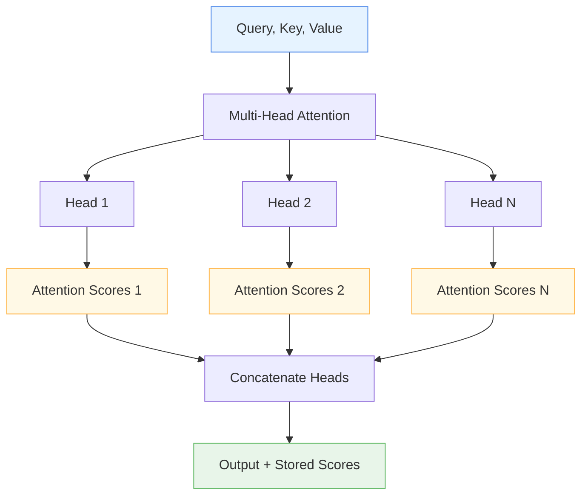

# 👁️ InterpretableMultiHeadAttention

<div class="layer-hero">
  <div class="layer-hero-content">
    <h1>👁️ InterpretableMultiHeadAttention</h1>
    <div class="layer-badges">
      <span class="badge badge-advanced">🔴 Advanced</span>
      <span class="badge badge-stable">✅ Stable</span>
      <span class="badge badge-popular">🔥 Popular</span>
    </div>
  </div>
</div>

## 🎯 Overview

The `InterpretableMultiHeadAttention` layer is a specialized multi-head attention mechanism designed for interpretability and explainability. Unlike standard attention layers that hide their internal workings, this layer exposes attention scores, allowing you to understand exactly what the model is focusing on during its decision-making process.

This layer is particularly valuable for applications where model interpretability is crucial, such as healthcare, finance, and other high-stakes domains where understanding model decisions is as important as accuracy.

## 🔍 How It Works

The InterpretableMultiHeadAttention layer extends the standard multi-head attention mechanism with interpretability features:

1. **Multi-Head Processing**: Processes input through multiple attention heads in parallel
2. **Attention Score Storage**: Captures and stores attention weights for each head
3. **Score Accessibility**: Provides easy access to attention scores for analysis
4. **Interpretable Output**: Returns both the attention output and accessible attention weights



## 💡 Why Use This Layer?

| Challenge | Traditional Approach | InterpretableMultiHeadAttention's Solution |
|-----------|---------------------|-------------------------------------------|
| **Model Interpretability** | Black-box attention with no visibility | 👁️ **Transparent attention** with accessible attention scores |
| **Debugging Models** | Difficult to understand what model focuses on | 🔍 **Clear visibility** into attention patterns and focus areas |
| **Regulatory Compliance** | Limited explainability for high-stakes decisions | 📋 **Full traceability** of attention decisions for compliance |
| **Model Validation** | Hard to validate attention behavior | ✅ **Easy validation** through attention score analysis |

## 📊 Use Cases

- **Healthcare AI**: Understanding which medical features drive diagnoses
- **Financial Risk**: Explaining which factors influence risk assessments
- **Regulatory Compliance**: Providing interpretable decisions for auditors
- **Model Debugging**: Identifying attention patterns and potential issues
- **Research**: Analyzing attention mechanisms in academic studies
- **Customer-Facing AI**: Explaining decisions to end users

## 🚀 Quick Start

### Basic Usage

```python
import keras
from kmr.layers import InterpretableMultiHeadAttention

# Create sample data
batch_size, seq_len, d_model = 32, 10, 64
query = keras.random.normal((batch_size, seq_len, d_model))
key = keras.random.normal((batch_size, seq_len, d_model))
value = keras.random.normal((batch_size, seq_len, d_model))

# Apply interpretable attention
attention = InterpretableMultiHeadAttention(
    d_model=d_model,
    n_head=8,
    dropout_rate=0.1
)
output = attention(query, key, value)

print(f"Output shape: {output.shape}")  # (32, 10, 64)

# Access attention scores for interpretability
attention_scores = attention.attention_scores
print(f"Attention scores shape: {attention_scores.shape}")  # (32, 8, 10, 10)
```

### In a Sequential Model

```python
import keras
from kmr.layers import InterpretableMultiHeadAttention

# Create a model with interpretable attention
model = keras.Sequential([
    keras.layers.Dense(64, activation='relu'),
    keras.layers.Reshape((1, 64)),  # Reshape for attention
    InterpretableMultiHeadAttention(d_model=64, n_head=4),
    keras.layers.Flatten(),
    keras.layers.Dense(32, activation='relu'),
    keras.layers.Dense(1, activation='sigmoid')
])

model.compile(optimizer='adam', loss='binary_crossentropy')
```

### In a Functional Model

```python
import keras
from kmr.layers import InterpretableMultiHeadAttention

# Define inputs
inputs = keras.Input(shape=(20,))  # 20 features

# Process features
x = keras.layers.Dense(64, activation='relu')(inputs)
x = keras.layers.Reshape((1, 64))(x)  # Reshape for attention

# Apply interpretable attention
x = InterpretableMultiHeadAttention(d_model=64, n_head=8)(x, x, x)

# Continue processing
x = keras.layers.Flatten()(x)
x = keras.layers.Dense(32, activation='relu')(x)
outputs = keras.layers.Dense(1, activation='sigmoid')(x)

model = keras.Model(inputs, outputs)
```

### Advanced Configuration

```python
# Advanced configuration with custom parameters
attention = InterpretableMultiHeadAttention(
    d_model=128,
    n_head=16,
    dropout_rate=0.2,
    kernel_initializer='he_normal',
    use_bias=False,
    name="advanced_interpretable_attention"
)

# Use in a complex model
inputs = keras.Input(shape=(50,))
x = keras.layers.Dense(128, activation='relu')(inputs)
x = keras.layers.Reshape((1, 128))(x)
x = attention(x, x, x)  # Self-attention
x = keras.layers.Flatten()(x)
x = keras.layers.Dense(64, activation='relu')(x)
outputs = keras.layers.Dense(5, activation='softmax')(x)

model = keras.Model(inputs, outputs)
```

## 📖 API Reference

::: kmr.layers.InterpretableMultiHeadAttention

## 🔧 Parameters Deep Dive

### `d_model` (int)
- **Purpose**: Size of each attention head for query, key, and value
- **Range**: 16 to 512+ (typically 64-256)
- **Impact**: Higher values = richer representations but more parameters
- **Recommendation**: Start with 64, scale based on data complexity

### `n_head` (int)
- **Purpose**: Number of attention heads for parallel processing
- **Range**: 1 to 32+ (typically 4, 8, or 16)
- **Impact**: More heads = better pattern recognition but higher computational cost
- **Recommendation**: Start with 8, increase for complex patterns

### `dropout_rate` (float)
- **Purpose**: Regularization to prevent overfitting
- **Range**: 0.0 to 0.9
- **Impact**: Higher values = more regularization but potentially less learning
- **Recommendation**: Start with 0.1, adjust based on overfitting

## 📈 Performance Characteristics

- **Speed**: ⚡⚡⚡ Fast for small to medium datasets, scales with head count
- **Memory**: 💾💾💾 Moderate memory usage due to attention score storage
- **Accuracy**: 🎯🎯🎯🎯 Excellent for complex patterns with interpretability
- **Best For**: Applications requiring both high performance and interpretability

## 🎨 Examples

### Example 1: Medical Diagnosis with Interpretability

```python
import keras
import numpy as np
from kmr.layers import InterpretableMultiHeadAttention

# Simulate medical data: symptoms, lab values, demographics
batch_size, num_features = 32, 20
medical_data = keras.random.normal((batch_size, num_features))

# Build interpretable diagnosis model
inputs = keras.Input(shape=(num_features,))
x = keras.layers.Dense(64, activation='relu')(inputs)
x = keras.layers.Reshape((1, 64))(x)

# Interpretable attention
x = InterpretableMultiHeadAttention(d_model=64, n_head=8)(x, x, x)

# Get attention scores for interpretability
attention_layer = model.layers[3]  # InterpretableMultiHeadAttention layer
output = attention_layer(x, x, x)
attention_scores = attention_layer.attention_scores

# Process output
x = keras.layers.Flatten()(x)
x = keras.layers.Dense(32, activation='relu')(x)
diagnosis = keras.layers.Dense(5, activation='softmax')(x)  # 5 possible diagnoses

model = keras.Model(inputs, diagnosis)
model.compile(optimizer='adam', loss='categorical_crossentropy')

# Train model
model.fit(medical_data, np.random.randint(0, 5, (batch_size, 1)), epochs=10, verbose=0)

# Analyze attention patterns
print("Attention scores shape:", attention_scores.shape)  # (32, 8, 1, 1)
print("Average attention per head:", np.mean(attention_scores, axis=(0, 2, 3)))
```

### Example 2: Financial Risk Assessment

```python
# Financial risk model with interpretable attention
def create_interpretable_risk_model():
    inputs = keras.Input(shape=(25,))  # 25 financial features
    
    # Feature processing
    x = keras.layers.Dense(128, activation='relu')(inputs)
    x = keras.layers.BatchNormalization()(x)
    x = keras.layers.Reshape((1, 128))(x)
    
    # Interpretable attention
    attention = InterpretableMultiHeadAttention(d_model=128, n_head=12)
    x = attention(x, x, x)
    
    # Get attention scores for analysis
    attention_scores = attention.attention_scores
    
    # Risk prediction
    x = keras.layers.Flatten()(x)
    x = keras.layers.Dense(64, activation='relu')(x)
    x = keras.layers.Dropout(0.3)(x)
    risk_score = keras.layers.Dense(1, activation='sigmoid')(x)
    
    return keras.Model(inputs, risk_score), attention_scores

model, attention_scores = create_interpretable_risk_model()
model.compile(optimizer='adam', loss='binary_crossentropy')

# The attention_scores can be used for interpretability analysis
```

### Example 3: Attention Visualization

```python
import matplotlib.pyplot as plt

# Function to visualize attention patterns
def visualize_attention(attention_scores, feature_names=None, head_idx=0):
    """Visualize attention patterns for a specific head."""
    # Get attention scores for the first sample and specified head
    scores = attention_scores[0, head_idx, :, :]  # Shape: (seq_len, seq_len)
    
    plt.figure(figsize=(10, 8))
    plt.imshow(scores, cmap='Blues', aspect='auto')
    plt.colorbar(label='Attention Weight')
    plt.title(f'Attention Pattern - Head {head_idx}')
    plt.xlabel('Key Position')
    plt.ylabel('Query Position')
    
    if feature_names:
        plt.xticks(range(len(feature_names)), feature_names, rotation=45)
        plt.yticks(range(len(feature_names)), feature_names)
    
    plt.tight_layout()
    plt.show()

# Use with your model
# visualize_attention(attention_scores, feature_names=['feature1', 'feature2', ...])
```

## 💡 Tips & Best Practices

- **Interpretability**: Access `attention_scores` attribute after each forward pass
- **Head Analysis**: Analyze individual heads to understand different attention patterns
- **Visualization**: Use attention scores for heatmap visualizations
- **Regularization**: Use appropriate dropout to prevent overfitting
- **Head Count**: Start with 8 heads, adjust based on complexity
- **Memory**: Be aware that attention scores increase memory usage

## ⚠️ Common Pitfalls

- **Memory Usage**: Storing attention scores increases memory consumption
- **Score Access**: Must access scores immediately after forward pass
- **Head Interpretation**: Different heads may focus on different patterns
- **Overfitting**: Complex attention can overfit on small datasets
- **Performance**: More heads = higher computational cost

## 🔗 Related Layers

- [TabularAttention](tabular-attention.md) - General tabular attention mechanism
- [MultiResolutionTabularAttention](multi-resolution-tabular-attention.md) - Multi-resolution attention
- [ColumnAttention](column-attention.md) - Column-wise attention
- [RowAttention](row-attention.md) - Row-wise attention

## 📚 Further Reading

- [Attention Is All You Need](https://arxiv.org/abs/1706.03762) - Original Transformer paper
- [The Annotated Transformer](http://nlp.seas.harvard.edu/2018/04/03/attention.html) - Detailed attention explanation
- [Attention Visualization in Deep Learning](https://distill.pub/2016/augmented-rnns/) - Attention visualization techniques
- [KMR Layer Explorer](../layers-explorer.md) - Browse all available layers
- [Model Interpretability Tutorial](../tutorials/feature-engineering.md) - Complete guide to model interpretability
