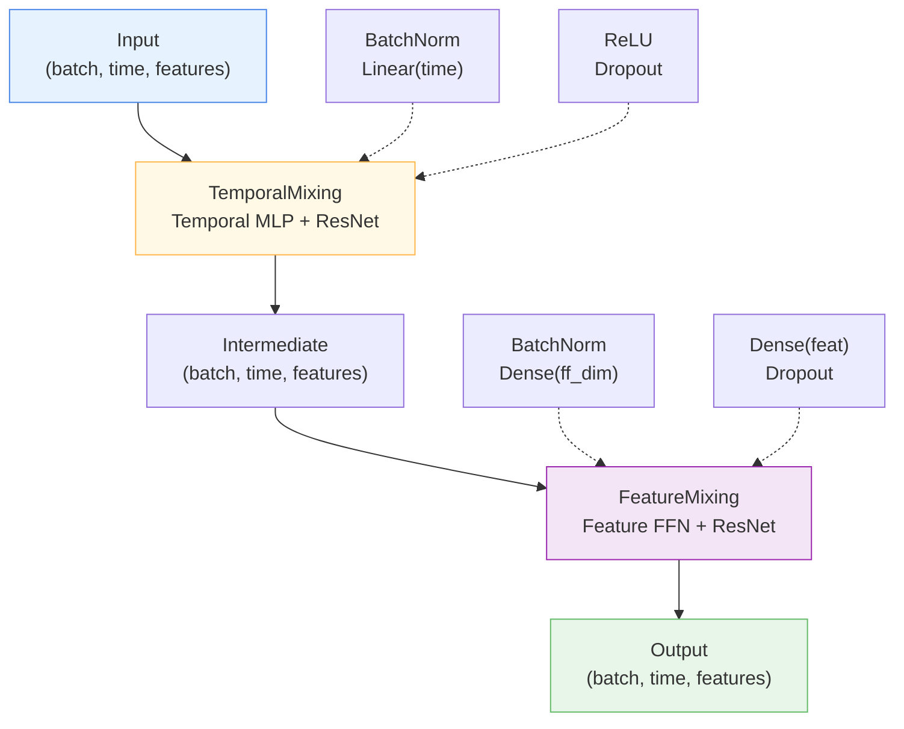

# 🔀 MixingLayer

<div class="layer-hero">
  <div class="layer-hero-content">
    <h1>🔀 MixingLayer</h1>
    <div class="layer-badges">
      <span class="badge badge-advanced">🔴 Advanced</span>
      <span class="badge badge-stable">✅ Stable</span>
      <span class="badge badge-timeseries">⏱️ Time Series</span>
    </div>
  </div>
</div>

## 🎯 Overview

The `MixingLayer` is the core building block of the TSMixer architecture, combining sequential TemporalMixing and FeatureMixing layers. It jointly learns temporal and cross-sectional representations by alternating between time and feature dimension mixing. This layer is essential for capturing complex interdependencies in multivariate time series data.

The architecture enables the model to learn both temporal patterns and feature correlations in a unified framework, making it highly effective for multivariate forecasting tasks.

## 🔍 How It Works

The MixingLayer processes data sequentially through two distinct mixing phases:

1. **TemporalMixing Phase**: Mixes information across the time dimension
   - Batch normalization across time-feature space
   - Linear projection across temporal axis
   - ReLU activation for non-linearity
   - Residual connection for gradient flow

2. **FeatureMixing Phase**: Mixes information across the feature dimension
   - Batch normalization across feature-time space
   - Feed-forward network with configurable hidden dimension
   - Two-layer MLP for feature interactions
   - Residual connection for gradient flow



## 💡 Why Use This Layer?

| Challenge | Traditional Approach | MixingLayer Solution |
|-----------|---------------------|----------------------|
| **Temporal Dependencies** | Fixed patterns | 🎯 **Learnable** temporal mixing |
| **Feature Correlations** | Independent features | 🔗 **Joint** feature learning |
| **Deep Models** | Gradient vanishing | ✨ **Residual connections** stabilize |
| **Complex Interactions** | Simple architectures | 🧩 **Dual-phase** mixing strategy |

## 📊 Use Cases

- **Multivariate Time Series Forecasting**: Multiple related time series with temporal and cross-series dependencies
- **Deep Architectures**: As a stackable building block for very deep models (4+ layers)
- **Complex Pattern Learning**: When both temporal and feature interactions are important
- **High-Dimensional Data**: When features number > 10 with strong correlations
- **Transfer Learning**: As a feature extractor in downstream forecasting tasks

## 🚀 Quick Start

### Basic Usage

```python
import keras
from kmr.layers import MixingLayer

# Create sample multivariate time series
batch_size, time_steps, features = 32, 96, 7
x = keras.random.normal((batch_size, time_steps, features))

# Apply mixing layer (temporal + feature)
layer = MixingLayer(
    n_series=features,
    input_size=time_steps,
    dropout=0.1,
    ff_dim=64
)
output = layer(x, training=True)

print(f"Input shape:  {x.shape}")        # (32, 96, 7)
print(f"Output shape: {output.shape}")   # (32, 96, 7)
```

### Stacking Multiple Layers

```python
from kmr.layers import MixingLayer
import keras

# Create stacked mixing layers (core of TSMixer)
n_blocks = 4
mixing_layers = [
    MixingLayer(n_series=7, input_size=96, dropout=0.1, ff_dim=64)
    for _ in range(n_blocks)
]

x = keras.random.normal((32, 96, 7))
for layer in mixing_layers:
    x = layer(x, training=True)

print(f"After {n_blocks} mixing blocks: {x.shape}")  # (32, 96, 7)
```

## 🎓 Advanced Usage

### Parameter Tuning for Different Scenarios

```python
# Scenario 1: Large dataset with high dimensionality
large_model = MixingLayer(
    n_series=50,      # Many features
    input_size=512,   # Long sequences
    dropout=0.05,     # Low dropout (sufficient data)
    ff_dim=256        # Larger capacity
)

# Scenario 2: Small dataset with few features
small_model = MixingLayer(
    n_series=5,       # Few features
    input_size=48,    # Short sequences
    dropout=0.3,      # Higher dropout (prevent overfitting)
    ff_dim=32         # Reduced capacity
)

# Scenario 3: Bottleneck architecture
bottleneck = MixingLayer(
    n_series=20,
    input_size=96,
    dropout=0.1,
    ff_dim=8  # ff_dim < n_series for compression
)
```

### Training Mode Effects

```python
import tensorflow as tf

layer = MixingLayer(n_series=7, input_size=96, dropout=0.2, ff_dim=64)
x = keras.random.normal((32, 96, 7))

# Training: dropout active, batch norm updated
output_train1 = layer(x, training=True)
output_train2 = layer(x, training=True)
train_diff = tf.reduce_mean(tf.abs(output_train1 - output_train2))
print(f"Training mode difference: {train_diff:.6f}")  # > 0 due to dropout

# Inference: dropout disabled, batch norm frozen
output_infer1 = layer(x, training=False)
output_infer2 = layer(x, training=False)
tf.debugging.assert_near(output_infer1, output_infer2)
print("Inference mode: outputs are identical ✓")
```

### Serialization & Model Checkpointing

```python
import keras

# Create and configure layer
layer = MixingLayer(n_series=7, input_size=96, dropout=0.1, ff_dim=64)

# Get config for saving
config = layer.get_config()
print(f"Config keys: {config.keys()}")

# Recreate from config
new_layer = MixingLayer.from_config(config)

# Verify parameters match
assert new_layer.n_series == layer.n_series
assert new_layer.input_size == layer.input_size
assert new_layer.dropout_rate == layer.dropout_rate
assert new_layer.ff_dim == layer.ff_dim
```

## 📈 Performance Characteristics

| Aspect | Value | Details |
|--------|-------|---------|
| **Time Complexity** | O(B × T × (D² + D×H)) | B=batch, T=time, D=features, H=ff_dim |
| **Space Complexity** | O(B × T × D) | Residual connection overhead minimal |
| **Gradient Flow** | ✅ Excellent | Dual residual connections prevent vanishing gradients |
| **Trainability** | ⭐⭐⭐⭐⭐ | Very stable with batch norm in both phases |
| **Memory Usage** | Moderate | More than single phase, less than attention |

## 🔧 Parameter Guide

| Parameter | Type | Range | Impact | Recommendation |
|-----------|------|-------|--------|-----------------|
| **n_series** | int | > 0 | Number of features/channels | Match your data dimensionality |
| **input_size** | int | > 0 | Temporal sequence length | Match your time series length |
| **dropout** | float | [0, 1] | Regularization strength | 0.1-0.2 for training stability |
| **ff_dim** | int | > 0 | Feature mixing capacity | 1-2x n_series for expressiveness |

### Tuning Strategy

```python
# Start with baseline
base = MixingLayer(n_series=7, input_size=96, dropout=0.1, ff_dim=64)

# For overfitting: increase dropout or reduce ff_dim
overfit_fix = MixingLayer(n_series=7, input_size=96, dropout=0.2, ff_dim=32)

# For underfitting: decrease dropout or increase ff_dim
underfit_fix = MixingLayer(n_series=7, input_size=96, dropout=0.05, ff_dim=128)

# For efficiency: reduce ff_dim
efficient = MixingLayer(n_series=7, input_size=96, dropout=0.1, ff_dim=32)
```

## 🧪 Testing & Validation

### Comprehensive Tests

```python
import tensorflow as tf
from kmr.layers import MixingLayer

layer = MixingLayer(n_series=7, input_size=96, dropout=0.1, ff_dim=64)
x = tf.random.normal((32, 96, 7))

# Test 1: Shape preservation
output = layer(x)
assert output.shape == x.shape, "Shape mismatch!"

# Test 2: Residual effect (output differs from input)
output = layer(x, training=False)
diff = tf.reduce_max(tf.abs(output - x))
assert diff > 0, "Output should differ from input due to mixing"

# Test 3: Dropout effect
outputs_train = [layer(x, training=True) for _ in range(5)]
diffs = [tf.reduce_mean(tf.abs(outputs_train[i] - outputs_train[i+1])).numpy() 
         for i in range(4)]
assert all(d > 0 for d in diffs), "Dropout should cause variation"

# Test 4: Batch norm stability
outputs = [layer(x, training=False) for _ in range(5)]
for o1, o2 in zip(outputs[:-1], outputs[1:]):
    tf.debugging.assert_near(o1, o2)

print("✅ All tests passed!")
```

## ⚠️ Common Issues & Solutions

| Issue | Cause | Solution |
|-------|-------|----------|
| **NaN in output** | Unstable batch norm or extreme inputs | Normalize inputs to [-1, 1]; check initial weights |
| **Slow convergence** | Dropout too high or ff_dim too small | Reduce dropout to 0.05-0.1; increase ff_dim |
| **High memory usage** | Large ff_dim or sequence length | Reduce ff_dim; use gradient accumulation |
| **Poor generalization** | Insufficient regularization | Increase dropout or add weight regularization |
| **Vanishing gradients** | Very deep stacking | Use skip connections between mixing blocks |

## 📚 Related Layers & Components

- **TemporalMixing**: Handles temporal dimension mixing
- **FeatureMixing**: Handles feature dimension mixing
- **ReversibleInstanceNorm**: Normalization layer for TSMixer
- **MovingAverage**: Alternative temporal processing
- **MultiScaleSeasonMixing**: Multi-scale seasonal patterns

## 🔗 Integration with TSMixer

```
TSMixer Architecture:
    Input
      ↓
  [RevIN Normalize]
      ↓
  [MixingLayer] × n_blocks ← You are here!
      ↓
  [Dense Projection]
      ↓
  [RevIN Denormalize]
      ↓
  Output Forecast
```

## 📖 References

- Chen, Si-An, et al. (2023). "TSMixer: An All-MLP Architecture for Time Series Forecasting." arXiv:2303.06053
- Batch Normalization: Ioffe & Szegedy (2015). "Batch Normalization: Accelerating Deep Network Training"
- Residual Networks: He, K., et al. (2015). "Deep Residual Learning for Image Recognition"

## 💻 Implementation Details

- **Backend**: Pure Keras 3 ops module
- **Computation**: CPU/GPU optimized
- **Memory**: Efficient with residual shortcuts
- **Serialization**: Full `get_config()` / `from_config()` support
- **Compatibility**: Works with any Keras optimizer and loss function
