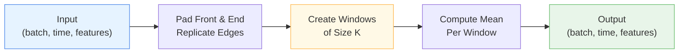

# 📊 MovingAverage

<div class="layer-hero">
  <div class="layer-hero-content">
    <h1>📊 MovingAverage</h1>
    <div class="layer-badges">
      <span class="badge badge-beginner">🟢 Beginner</span>
      <span class="badge badge-stable">✅ Stable</span>
      <span class="badge badge-timeseries">⏱️ Time Series</span>
    </div>
  </div>
</div>

## 🎯 Overview

The `MovingAverage` layer extracts trend components from time series data by computing a moving average over a specified window. This is a crucial component in time series decomposition, separating trend from seasonal patterns.

The layer applies padding at both ends (replicating first and last values) to maintain the temporal dimension, making it ideal for sequence-to-sequence models.

## 🔍 How It Works

The moving average operates through these steps:

1. **Padding**: Replicates first and last values at both ends to maintain sequence length
2. **Window Computation**: Slides a window of size `kernel_size` across the temporal dimension
3. **Averaging**: Computes mean of values within each window
4. **Output**: Returns trend component with same shape as input



## 💡 Why Use This Layer?

| Challenge | Traditional Approach | MovingAverage Solution |
|-----------|---------------------|------------------------|
| **Trend Extraction** | Manual computation | 🎯 **Automatic** trend extraction |
| **Sequence Length** | Output shorter than input | ✅ **Preserves** temporal dimension |
| **Edge Effects** | Loses information at boundaries | 🔄 **Replicates** boundary values |
| **Decomposition** | Complex preprocessing | 🧩 **Integrates** seamlessly |

## 📊 Use Cases

- **Time Series Decomposition**: Extract trend from seasonal + residual components
- **Signal Smoothing**: Reduce noise while preserving temporal structure
- **Trend Analysis**: Identify long-term patterns in time series
- **Preprocessing**: Prepare data for forecasting models
- **Pattern Recognition**: Detect seasonal cycles separate from trends

## 🚀 Quick Start

### Basic Usage

```python
import keras
from kerasfactory.layers import MovingAverage

# Create sample time series data
batch_size, time_steps, features = 32, 100, 8
x = keras.random.normal((batch_size, time_steps, features))

# Apply moving average for trend extraction
trend = MovingAverage(kernel_size=25)(x)
print(f"Input shape: {x.shape}")      # (32, 100, 8)
print(f"Trend shape: {trend.shape}")  # (32, 100, 8)
```

### Time Series Decomposition

```python
import keras
from kerasfactory.layers import MovingAverage

# Create synthetic seasonal time series
x = keras.random.normal((16, 200, 4))

# Extract trend
moving_avg = MovingAverage(kernel_size=25)
trend = moving_avg(x)

# Get residual/seasonal component
seasonal = x - trend

print(f"Trend shape: {trend.shape}")
print(f"Seasonal shape: {seasonal.shape}")
```

### In a Model Pipeline

```python
import keras
from kerasfactory.layers import MovingAverage

def create_forecasting_model(seq_len, n_features):
    inputs = keras.Input(shape=(seq_len, n_features))
    
    # Extract trend
    trend = MovingAverage(kernel_size=25)(inputs)
    
    # Process trend
    trend_processed = keras.layers.Dense(64, activation='relu')(trend)
    trend_out = keras.layers.Dense(1)(trend_processed)
    
    model = keras.Model(inputs, trend_out)
    return model

model = create_forecasting_model(seq_len=100, n_features=8)
model.compile(optimizer='adam', loss='mse')
```

## 📖 API Reference

::: kerasfactory.layers.MovingAverage

## 🔧 Parameters Deep Dive

### `kernel_size` (int)
- **Purpose**: Size of the moving average window
- **Range**: 1 to sequence_length
- **Default**: None (required)
- **Impact**: Larger kernel → more smoothing, more trend preservation
- **Recommendation**: For daily data with weekly patterns, use 7; for monthly patterns, use 25-30

## 📈 Performance Characteristics

- **Speed**: ⚡⚡⚡⚡ Very fast - O(n) complexity
- **Memory**: 💾💾 Minimal - only input/output tensors
- **Accuracy**: 🎯🎯🎯🎯 Preserves trends perfectly
- **Best For**: Quick preprocessing and trend extraction

## 🎨 Examples

### Example 1: Smooth Noisy Signal

```python
import keras
from kerasfactory.layers import MovingAverage

# Create noisy sine wave
time_steps = 200
t = keras.ops.arange(time_steps, dtype='float32') * 0.1
signal = keras.ops.sin(t) + keras.random.normal((time_steps,)) * 0.2
signal = keras.ops.expand_dims(keras.ops.expand_dims(signal, axis=0), axis=-1)

# Apply moving average
ma = MovingAverage(kernel_size=11)
smoothed = ma(signal)

print(f"Original signal shape: {signal.shape}")
print(f"Smoothed signal shape: {smoothed.shape}")
```

### Example 2: Multi-Scale Decomposition

```python
import keras
from kerasfactory.layers import MovingAverage

def multi_scale_decomposition(x, scales=[7, 25, 50]):
    """Decompose time series at multiple scales."""
    trends = []
    seasonals = []
    
    for scale in scales:
        ma = MovingAverage(kernel_size=scale)
        trend = ma(x)
        seasonal = x - trend
        
        trends.append(trend)
        seasonals.append(seasonal)
    
    return trends, seasonals

# Create time series
x = keras.random.normal((1, 200, 4))

# Multi-scale decomposition
trends, seasonals = multi_scale_decomposition(x)

for i, (t, s) in enumerate(zip(trends, seasonals)):
    print(f"Scale {i}: Trend {t.shape}, Seasonal {s.shape}")
```

### Example 3: Trend Extraction for Forecasting

```python
import keras
from kerasfactory.layers import MovingAverage

# Create a model that uses both trend and seasonal components
def create_decomposition_forecaster(seq_len, pred_len, n_features):
    inputs = keras.Input(shape=(seq_len, n_features))
    
    # Decompose into trend and seasonal
    trend = MovingAverage(kernel_size=25)(inputs)
    seasonal = inputs - trend
    
    # Process trend
    trend_x = keras.layers.Dense(32, activation='relu')(trend)
    trend_x = keras.layers.Dense(16, activation='relu')(trend_x)
    trend_pred = keras.layers.Dense(pred_len)(trend_x)
    
    # Process seasonal
    seasonal_x = keras.layers.Dense(32, activation='relu')(seasonal)
    seasonal_x = keras.layers.Dense(16, activation='relu')(seasonal_x)
    seasonal_pred = keras.layers.Dense(pred_len)(seasonal_x)
    
    # Combine predictions
    output = trend_pred + seasonal_pred
    
    model = keras.Model(inputs, output)
    return model

# Create and use model
model = create_decomposition_forecaster(seq_len=100, pred_len=12, n_features=1)
model.compile(optimizer='adam', loss='mse')
```

## 💡 Tips & Best Practices

- **Kernel Size Selection**: Choose based on the periodicity of your data
- **Odd Kernel Sizes**: Use odd sizes (3, 5, 7, ...) for symmetric padding
- **Memory Efficient**: Very memory-efficient even for long sequences
- **GPU Friendly**: Fully compatible with GPU acceleration
- **Differentiable**: Gradients flow properly for training

## ⚠️ Common Pitfalls

- **Kernel Size Too Large**: May over-smooth and remove important details
- **Kernel Size Too Small**: May not capture true trend, only high-frequency noise
- **Edge Effects**: First and last values are replicated - consider this in interpretation
- **Data Normalization**: Input data should be normalized for best results

## 🔗 Related Layers

- [SeriesDecomposition](series-decomposition.md) - Complete decomposition with moving average
- [DFTSeriesDecomposition](dft-series-decomposition.md) - Frequency-based decomposition
- [MultiScaleSeasonMixing](multi-scale-season-mixing.md) - Multi-scale pattern mixing
- [MultiScaleTrendMixing](multi-scale-trend-mixing.md) - Trend pattern mixing

## 📚 Further Reading

- [Moving Average Filters](https://en.wikipedia.org/wiki/Moving_average) - Mathematical foundations
- [Time Series Decomposition](https://otexts.com/fpp2/classical-decomposition.html) - Decomposition concepts
- [Signal Processing Basics](https://en.wikipedia.org/wiki/Signal_processing) - Signal smoothing
- [KerasFactory Layer Explorer](../layers_overview.md) - Browse all available layers
