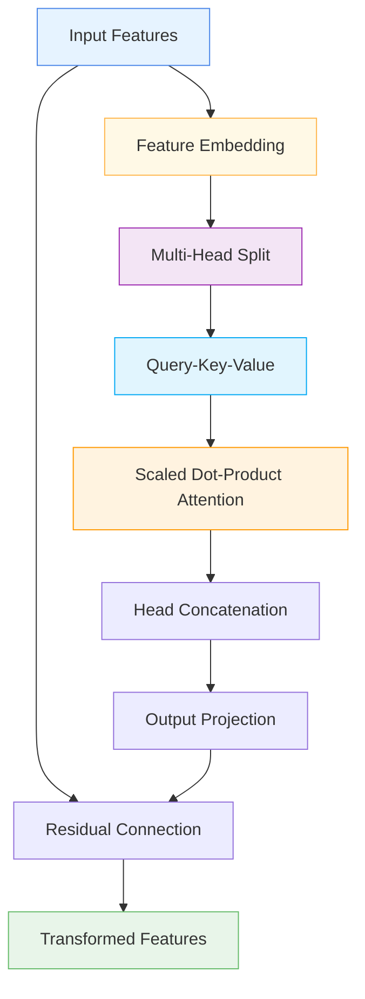

# 🔀 MultiHeadGraphFeaturePreprocessor

<div class="layer-hero">
  <div class="layer-hero-content">
    <h1>🔀 MultiHeadGraphFeaturePreprocessor</h1>
    <div class="layer-badges">
      <span class="badge badge-intermediate">🟡 Intermediate</span>
      <span class="badge badge-stable">✅ Stable</span>
      <span class="badge badge-popular">🔥 Popular</span>
    </div>
  </div>
</div>

## 🎯 Overview

The `MultiHeadGraphFeaturePreprocessor` treats each feature as a node in a graph and applies multi-head self-attention to capture and aggregate complex interactions among features. It learns multiple relational views among features, which can significantly boost performance on tabular data.

This layer is particularly powerful for tabular data where complex feature relationships need to be captured, providing a sophisticated preprocessing step that can learn multiple aspects of feature interactions.

## 🔍 How It Works

The MultiHeadGraphFeaturePreprocessor processes data through multi-head graph-based transformation:

1. **Feature Embedding**: Projects each scalar input into an embedding
2. **Multi-Head Split**: Splits the embedding into multiple heads
3. **Query-Key-Value**: Computes queries, keys, and values for each head
4. **Scaled Dot-Product Attention**: Calculates attention across feature dimension
5. **Head Concatenation**: Concatenates head outputs
6. **Output Projection**: Projects back to original dimension with residual connection



## 💡 Why Use This Layer?

| Challenge | Traditional Approach | MultiHeadGraphFeaturePreprocessor's Solution |
|-----------|---------------------|--------------------------------------------|
| **Feature Interactions** | Manual feature engineering | 🎯 **Automatic learning** of complex feature interactions |
| **Multiple Views** | Single perspective | ⚡ **Multi-head attention** for multiple relational views |
| **Graph Structure** | No graph structure | 🧠 **Graph-based** feature preprocessing |
| **Complex Relationships** | Limited relationship modeling | 🔗 **Sophisticated** relationship learning |

## 📊 Use Cases

- **Tabular Data**: Complex feature relationship preprocessing
- **Graph Neural Networks**: Graph-based preprocessing for tabular data
- **Feature Engineering**: Automatic feature interaction learning
- **Multi-Head Attention**: Multiple relational views of features
- **Complex Patterns**: Capturing complex feature relationships

## 🚀 Quick Start

### Basic Usage

```python
import keras
from kerasfactory.layers import MultiHeadGraphFeaturePreprocessor

# Create sample input data
batch_size, num_features = 32, 10
x = keras.random.normal((batch_size, num_features))

# Apply multi-head graph feature preprocessor
graph_preproc = MultiHeadGraphFeaturePreprocessor(embed_dim=16, num_heads=4)
output = graph_preproc(x, training=True)

print(f"Input shape: {x.shape}")           # (32, 10)
print(f"Output shape: {output.shape}")     # (32, 10)
```

### In a Sequential Model

```python
import keras
from kerasfactory.layers import MultiHeadGraphFeaturePreprocessor

model = keras.Sequential([
    keras.layers.Dense(32, activation='relu'),
    MultiHeadGraphFeaturePreprocessor(embed_dim=16, num_heads=4),
    keras.layers.Dense(16, activation='relu'),
    MultiHeadGraphFeaturePreprocessor(embed_dim=8, num_heads=2),
    keras.layers.Dense(1, activation='sigmoid')
])

model.compile(optimizer='adam', loss='binary_crossentropy', metrics=['accuracy'])
```

### In a Functional Model

```python
import keras
from kerasfactory.layers import MultiHeadGraphFeaturePreprocessor

# Define inputs
inputs = keras.Input(shape=(20,))  # 20 features

# Apply multi-head graph feature preprocessor
x = MultiHeadGraphFeaturePreprocessor(embed_dim=16, num_heads=4)(inputs)

# Continue processing
x = keras.layers.Dense(32, activation='relu')(x)
x = MultiHeadGraphFeaturePreprocessor(embed_dim=16, num_heads=4)(x)
x = keras.layers.Dense(16, activation='relu')(x)
outputs = keras.layers.Dense(1, activation='sigmoid')(x)

model = keras.Model(inputs, outputs)
```

### Advanced Configuration

```python
# Advanced configuration with multiple graph preprocessors
def create_multi_head_graph_network():
    inputs = keras.Input(shape=(25,))  # 25 features
    
    # Multiple graph preprocessors with different configurations
    x = MultiHeadGraphFeaturePreprocessor(
        embed_dim=24,
        num_heads=6,
        dropout_rate=0.1
    )(inputs)
    
    x = keras.layers.Dense(48, activation='relu')(x)
    x = keras.layers.BatchNormalization()(x)
    
    x = MultiHeadGraphFeaturePreprocessor(
        embed_dim=20,
        num_heads=5,
        dropout_rate=0.1
    )(x)
    
    x = keras.layers.Dense(32, activation='relu')(x)
    x = keras.layers.Dropout(0.2)(x)
    
    # Multi-task output
    classification = keras.layers.Dense(3, activation='softmax', name='classification')(x)
    regression = keras.layers.Dense(1, name='regression')(x)
    
    return keras.Model(inputs, [classification, regression])

model = create_multi_head_graph_network()
model.compile(
    optimizer='adam',
    loss={'classification': 'categorical_crossentropy', 'regression': 'mse'},
    loss_weights={'classification': 1.0, 'regression': 0.5}
)
```

## 📖 API Reference

::: kerasfactory.layers.MultiHeadGraphFeaturePreprocessor

## 🔧 Parameters Deep Dive

### `embed_dim` (int)
- **Purpose**: Dimension of the feature embeddings
- **Range**: 8 to 128+ (typically 16-64)
- **Impact**: Larger values = more expressive embeddings but more parameters
- **Recommendation**: Start with 16-32, scale based on data complexity

### `num_heads` (int)
- **Purpose**: Number of attention heads
- **Range**: 1 to 16+ (typically 4-8)
- **Impact**: More heads = more diverse attention patterns
- **Recommendation**: Use 4-8 heads for most applications

### `dropout_rate` (float)
- **Purpose**: Dropout rate applied to attention weights
- **Range**: 0.0 to 0.5 (typically 0.1-0.2)
- **Impact**: Higher values = more regularization
- **Recommendation**: Use 0.1-0.2 for regularization

## 📈 Performance Characteristics

- **Speed**: ⚡⚡⚡ Fast for small to medium models, scales with heads and features
- **Memory**: 💾💾💾 Moderate memory usage due to multi-head attention
- **Accuracy**: 🎯🎯🎯🎯 Excellent for complex feature relationship learning
- **Best For**: Tabular data with complex feature relationships

## 🎨 Examples

### Example 1: Complex Feature Relationships

```python
import keras
import numpy as np
from kerasfactory.layers import MultiHeadGraphFeaturePreprocessor

# Create a model for complex feature relationships
def create_complex_relationship_model():
    inputs = keras.Input(shape=(20,))  # 20 features
    
    # Multiple graph preprocessors for different relationship levels
    x = MultiHeadGraphFeaturePreprocessor(
        embed_dim=24,
        num_heads=6,
        dropout_rate=0.1
    )(inputs)
    
    x = keras.layers.Dense(48, activation='relu')(x)
    x = keras.layers.BatchNormalization()(x)
    
    x = MultiHeadGraphFeaturePreprocessor(
        embed_dim=20,
        num_heads=5,
        dropout_rate=0.1
    )(x)
    
    x = keras.layers.Dense(32, activation='relu')(x)
    x = keras.layers.Dropout(0.2)(x)
    
    # Output
    outputs = keras.layers.Dense(1, activation='sigmoid')(x)
    
    return keras.Model(inputs, outputs)

model = create_complex_relationship_model()
model.compile(optimizer='adam', loss='binary_crossentropy')

# Test with sample data
sample_data = keras.random.normal((100, 20))
predictions = model(sample_data)
print(f"Complex relationship predictions shape: {predictions.shape}")
```

### Example 2: Multi-Head Analysis

```python
# Analyze multi-head behavior
def analyze_multi_head_behavior():
    # Create model with multi-head graph preprocessor
    inputs = keras.Input(shape=(15,))
    x = MultiHeadGraphFeaturePreprocessor(embed_dim=16, num_heads=4)(inputs)
    outputs = keras.layers.Dense(1, activation='sigmoid')(x)
    
    model = keras.Model(inputs, outputs)
    
    # Test with different input patterns
    test_inputs = [
        keras.random.normal((10, 15)),  # Random data
        keras.random.normal((10, 15)) * 2,  # Scaled data
        keras.random.normal((10, 15)) + 1,  # Shifted data
    ]
    
    print("Multi-Head Behavior Analysis:")
    print("=" * 40)
    
    for i, test_input in enumerate(test_inputs):
        prediction = model(test_input)
        print(f"Test {i+1}: Prediction mean = {keras.ops.mean(prediction):.4f}")
    
    return model

# Analyze multi-head behavior
# model = analyze_multi_head_behavior()
```

### Example 3: Attention Head Analysis

```python
# Analyze attention head patterns
def analyze_attention_heads():
    # Create model with multi-head graph preprocessor
    inputs = keras.Input(shape=(12,))
    x = MultiHeadGraphFeaturePreprocessor(embed_dim=16, num_heads=4)(inputs)
    outputs = keras.layers.Dense(1, activation='sigmoid')(x)
    
    model = keras.Model(inputs, outputs)
    
    # Test with sample data
    sample_data = keras.random.normal((50, 12))
    predictions = model(sample_data)
    
    print("Attention Head Analysis:")
    print("=" * 40)
    print(f"Input shape: {sample_data.shape}")
    print(f"Output shape: {predictions.shape}")
    print(f"Model parameters: {model.count_params()}")
    
    return model

# Analyze attention heads
# model = analyze_attention_heads()
```

## 💡 Tips & Best Practices

- **Embedding Dimension**: Start with 16-32, scale based on data complexity
- **Number of Heads**: Use 4-8 heads for most applications
- **Dropout Rate**: Use 0.1-0.2 for regularization
- **Feature Relationships**: Works best when features have complex relationships
- **Residual Connections**: Built-in residual connections for gradient flow
- **Attention Patterns**: Monitor attention patterns for interpretability

## ⚠️ Common Pitfalls

- **Embedding Dimension**: Must be divisible by num_heads
- **Number of Heads**: Must be positive integer
- **Dropout Rate**: Must be between 0 and 1
- **Memory Usage**: Scales with number of heads and features
- **Overfitting**: Monitor for overfitting with complex configurations

## 🔗 Related Layers

- [AdvancedGraphFeature](advanced-graph-feature.md) - Advanced graph feature layer
- [GraphFeatureAggregation](graph-feature-aggregation.md) - Graph feature aggregation
- [TabularAttention](tabular-attention.md) - Tabular attention mechanisms
- [VariableSelection](variable-selection.md) - Variable selection

## 📚 Further Reading

- [Multi-Head Attention](https://arxiv.org/abs/1706.03762) - Multi-head attention mechanism
- [Graph Neural Networks](https://en.wikipedia.org/wiki/Graph_neural_network) - Graph neural network concepts
- [Feature Relationships](https://en.wikipedia.org/wiki/Feature_engineering) - Feature relationship concepts
- [KerasFactory Layer Explorer](../layers_overview.md) - Browse all available layers
- [Feature Engineering Tutorial](../tutorials/feature-engineering.md) - Complete guide to feature engineering
