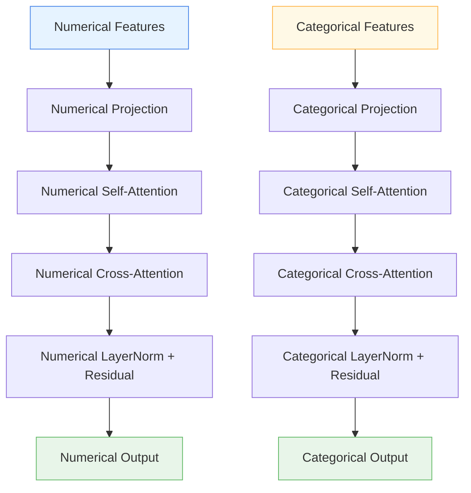

# 🔍 MultiResolutionTabularAttention

<div class="layer-hero">
  <div class="layer-hero-content">
    <h1>🔍 MultiResolutionTabularAttention</h1>
    <div class="layer-badges">
      <span class="badge badge-advanced">🔴 Advanced</span>
      <span class="badge badge-stable">✅ Stable</span>
      <span class="badge badge-popular">🔥 Popular</span>
    </div>
  </div>
</div>

## 🎯 Overview

The `MultiResolutionTabularAttention` layer is a sophisticated attention mechanism designed specifically for mixed-type tabular data. Unlike standard attention layers that treat all features uniformly, this layer recognizes that numerical and categorical features have fundamentally different characteristics and require specialized processing.

This layer implements separate attention mechanisms for numerical and categorical features, along with cross-attention between them, enabling the model to learn optimal representations for each data type while capturing their interactions.

## 🔍 How It Works

The MultiResolutionTabularAttention processes mixed-type tabular data through specialized attention pathways:

1. **Numerical Feature Processing**: Dedicated attention for continuous numerical features
2. **Categorical Feature Processing**: Specialized attention for discrete categorical features  
3. **Cross-Attention**: Bidirectional attention between numerical and categorical features
4. **Feature Fusion**: Intelligent combination of both feature types



## 💡 Why Use This Layer?

| Challenge | Traditional Approach | MultiResolutionTabularAttention's Solution |
|-----------|---------------------|-------------------------------------------|
| **Mixed Data Types** | Treat all features the same way | 🎯 **Specialized processing** for numerical vs categorical features |
| **Feature Interactions** | Simple concatenation or basic attention | 🔗 **Cross-attention** between different feature types |
| **Information Loss** | One-size-fits-all representations | 📊 **Preserved semantics** of each data type |
| **Complex Relationships** | Limited cross-type learning | 🧠 **Rich interactions** between numerical and categorical features |

## 📊 Use Cases

- **Customer Analytics**: Combining numerical metrics (age, income) with categorical data (region, product category)
- **Medical Diagnosis**: Processing lab values (numerical) alongside symptoms and demographics (categorical)
- **E-commerce**: Analyzing purchase amounts and quantities (numerical) with product categories and user segments (categorical)
- **Financial Modeling**: Combining market indicators (numerical) with sector classifications and risk categories (categorical)
- **Survey Analysis**: Processing rating scales (numerical) with demographic and preference data (categorical)

## 🚀 Quick Start

### Basic Usage

```python
import keras
from kerasfactory.layers import MultiResolutionTabularAttention

# Create mixed-type tabular data
batch_size, num_samples = 32, 100
numerical_features = keras.random.normal((batch_size, num_samples, 10))  # 10 numerical features
categorical_features = keras.random.normal((batch_size, num_samples, 5))  # 5 categorical features

# Apply multi-resolution attention
attention = MultiResolutionTabularAttention(num_heads=8, d_model=64, dropout_rate=0.1)
num_output, cat_output = attention([numerical_features, categorical_features])

print(f"Numerical output shape: {num_output.shape}")  # (32, 100, 64)
print(f"Categorical output shape: {cat_output.shape}")  # (32, 100, 64)
```

### In a Sequential Model

```python
import keras
from kerasfactory.layers import MultiResolutionTabularAttention

# For mixed-type data, you'll need to handle inputs separately
def create_mixed_model():
    # Define separate inputs
    num_input = keras.Input(shape=(100, 10), name='numerical')
    cat_input = keras.Input(shape=(100, 5), name='categorical')
    
    # Apply multi-resolution attention
    num_out, cat_out = MultiResolutionTabularAttention(
        num_heads=4, d_model=32, dropout_rate=0.1
    )([num_input, cat_input])
    
    # Combine outputs
    combined = keras.layers.Concatenate()([num_out, cat_out])
    combined = keras.layers.Dense(64, activation='relu')(combined)
    output = keras.layers.Dense(1, activation='sigmoid')(combined)
    
    return keras.Model([num_input, cat_input], output)

model = create_mixed_model()
model.compile(optimizer='adam', loss='binary_crossentropy')
```

### In a Functional Model

```python
import keras
from kerasfactory.layers import MultiResolutionTabularAttention

# Define inputs for mixed data
num_inputs = keras.Input(shape=(50, 15), name='numerical_features')
cat_inputs = keras.Input(shape=(50, 8), name='categorical_features')

# Apply multi-resolution attention
num_attended, cat_attended = MultiResolutionTabularAttention(
    num_heads=8, d_model=128, dropout_rate=0.15
)([num_inputs, cat_inputs])

# Process each type separately
num_processed = keras.layers.Dense(64, activation='relu')(num_attended)
cat_processed = keras.layers.Dense(64, activation='relu')(cat_attended)

# Combine and final prediction
combined = keras.layers.Concatenate()([num_processed, cat_processed])
combined = keras.layers.Dropout(0.2)(combined)
outputs = keras.layers.Dense(3, activation='softmax')(combined)

model = keras.Model([num_inputs, cat_inputs], outputs)
```

### Advanced Configuration

```python
# Advanced configuration with custom parameters
attention = MultiResolutionTabularAttention(
    num_heads=16,           # More heads for complex cross-attention
    d_model=256,            # Higher dimensionality for rich representations
    dropout_rate=0.2,       # Higher dropout for regularization
    name="advanced_multi_resolution"
)

# Use in a complex multi-task model
def create_advanced_model():
    num_input = keras.Input(shape=(100, 20), name='numerical')
    cat_input = keras.Input(shape=(100, 10), name='categorical')
    
    # Multi-resolution attention
    num_out, cat_out = attention([num_input, cat_input])
    
    # Task-specific processing
    num_features = keras.layers.GlobalAveragePooling1D()(num_out)
    cat_features = keras.layers.GlobalAveragePooling1D()(cat_out)
    
    # Multiple outputs
    combined = keras.layers.Concatenate()([num_features, cat_features])
    
    # Classification head
    classification = keras.layers.Dense(64, activation='relu')(combined)
    classification = keras.layers.Dropout(0.3)(classification)
    classification_out = keras.layers.Dense(5, activation='softmax', name='classification')(classification)
    
    # Regression head
    regression = keras.layers.Dense(32, activation='relu')(combined)
    regression_out = keras.layers.Dense(1, name='regression')(regression)
    
    return keras.Model([num_input, cat_input], [classification_out, regression_out])

model = create_advanced_model()
```

## 📖 API Reference

::: kerasfactory.layers.MultiResolutionTabularAttention

## 🔧 Parameters Deep Dive

### `num_heads` (int)
- **Purpose**: Number of attention heads for parallel processing
- **Range**: 1 to 32+ (typically 4, 8, or 16)
- **Impact**: More heads = better cross-type pattern recognition
- **Recommendation**: Start with 8, increase for complex mixed-type interactions

### `d_model` (int)
- **Purpose**: Dimensionality of the attention model
- **Range**: 32 to 512+ (must be divisible by num_heads)
- **Impact**: Higher values = richer cross-type representations
- **Recommendation**: Start with 64-128, scale based on data complexity

### `dropout_rate` (float)
- **Purpose**: Regularization to prevent overfitting
- **Range**: 0.0 to 0.9
- **Impact**: Higher values = more regularization for complex interactions
- **Recommendation**: Start with 0.1-0.2, adjust based on overfitting

## 📈 Performance Characteristics

- **Speed**: ⚡⚡ Fast for small to medium datasets, scales with feature complexity
- **Memory**: 💾💾💾 Higher memory usage due to dual attention mechanisms
- **Accuracy**: 🎯🎯🎯🎯 Excellent for mixed-type tabular data with complex interactions
- **Best For**: Mixed-type tabular data requiring specialized feature processing

## 🎨 Examples

### Example 1: E-commerce Recommendation

```python
import keras
import numpy as np
from kerasfactory.layers import MultiResolutionTabularAttention

# Simulate e-commerce data
batch_size, num_users = 32, 1000

# Numerical features: purchase_amount, session_duration, page_views, etc.
numerical_data = keras.random.normal((batch_size, num_users, 8))

# Categorical features: user_segment, product_category, device_type, etc.
categorical_data = keras.random.normal((batch_size, num_users, 6))

# Build recommendation model
num_input = keras.Input(shape=(num_users, 8), name='numerical')
cat_input = keras.Input(shape=(num_users, 6), name='categorical')

# Multi-resolution attention
num_out, cat_out = MultiResolutionTabularAttention(
    num_heads=8, d_model=64, dropout_rate=0.1
)([num_input, cat_input])

# User-level features
user_features = keras.layers.Concatenate()([
    keras.layers.GlobalAveragePooling1D()(num_out),
    keras.layers.GlobalAveragePooling1D()(cat_out)
])

# Recommendation score
recommendation = keras.layers.Dense(128, activation='relu')(user_features)
recommendation = keras.layers.Dropout(0.2)(recommendation)
recommendation_score = keras.layers.Dense(1, activation='sigmoid')(recommendation)

model = keras.Model([num_input, cat_input], recommendation_score)
model.compile(optimizer='adam', loss='binary_crossentropy')
```

### Example 2: Medical Diagnosis

```python
# Medical data with lab values and categorical symptoms
lab_values = keras.random.normal((32, 200, 12))  # 12 lab tests
symptoms = keras.random.normal((32, 200, 8))     # 8 symptom categories

# Diagnosis model
lab_input = keras.Input(shape=(200, 12), name='lab_values')
symptom_input = keras.Input(shape=(200, 8), name='symptoms')

# Multi-resolution attention
lab_out, symptom_out = MultiResolutionTabularAttention(
    num_heads=6, d_model=96, dropout_rate=0.15
)([lab_input, symptom_input])

# Patient-level representation
patient_features = keras.layers.Concatenate()([
    keras.layers.GlobalMaxPooling1D()(lab_out),
    keras.layers.GlobalMaxPooling1D()(symptom_out)
])

# Diagnosis prediction
diagnosis = keras.layers.Dense(64, activation='relu')(patient_features)
diagnosis = keras.layers.Dropout(0.3)(diagnosis)
diagnosis_out = keras.layers.Dense(10, activation='softmax')(diagnosis)  # 10 possible diagnoses

model = keras.Model([lab_input, symptom_input], diagnosis_out)
model.compile(optimizer='adam', loss='categorical_crossentropy')
```

### Example 3: Financial Risk Assessment

```python
# Financial data with numerical metrics and categorical risk factors
financial_metrics = keras.random.normal((32, 500, 15))  # 15 financial indicators
risk_factors = keras.random.normal((32, 500, 7))        # 7 risk categories

# Risk assessment model
metrics_input = keras.Input(shape=(500, 15), name='financial_metrics')
risk_input = keras.Input(shape=(500, 7), name='risk_factors')

# Multi-resolution attention
metrics_out, risk_out = MultiResolutionTabularAttention(
    num_heads=12, d_model=144, dropout_rate=0.2
)([metrics_input, risk_input])

# Portfolio-level risk assessment
portfolio_risk = keras.layers.Concatenate()([
    keras.layers.GlobalAveragePooling1D()(metrics_out),
    keras.layers.GlobalAveragePooling1D()(risk_out)
])

# Risk prediction
risk_score = keras.layers.Dense(128, activation='relu')(portfolio_risk)
risk_score = keras.layers.Dropout(0.25)(risk_score)
risk_score = keras.layers.Dense(64, activation='relu')(risk_score)
risk_output = keras.layers.Dense(1, activation='sigmoid')(risk_score)  # Risk probability

model = keras.Model([metrics_input, risk_input], risk_output)
model.compile(optimizer='adam', loss='binary_crossentropy')
```

## 💡 Tips & Best Practices

- **Data Preprocessing**: Ensure numerical features are normalized and categorical features are properly encoded
- **Feature Balance**: Maintain reasonable balance between numerical and categorical feature counts
- **Head Configuration**: Use more attention heads for complex cross-type interactions
- **Regularization**: Apply appropriate dropout to prevent overfitting in cross-attention
- **Output Processing**: Consider different pooling strategies for different feature types
- **Monitoring**: Track attention weights to understand cross-type learning

## ⚠️ Common Pitfalls

- **Input Format**: Must provide exactly two inputs: [numerical_features, categorical_features]
- **Shape Mismatch**: Ensure both inputs have the same batch_size and num_samples dimensions
- **Memory Usage**: Higher memory consumption due to dual attention mechanisms
- **Overfitting**: Complex cross-attention can lead to overfitting on small datasets
- **Feature Imbalance**: Severe imbalance between feature types can hurt performance

## 🔗 Related Layers

- [TabularAttention](tabular-attention.md) - General tabular attention for uniform feature processing
- [ColumnAttention](column-attention.md) - Column-wise attention for feature relationships
- [AdvancedNumericalEmbedding](advanced-numerical-embedding.md) - Specialized numerical feature processing
- [DistributionAwareEncoder](distribution-aware-encoder.md) - Distribution-aware feature encoding

## 📚 Further Reading

- [TabNet: Attentive Interpretable Tabular Learning](https://arxiv.org/abs/1908.07442) - Tabular-specific attention mechanisms
- [Attention Is All You Need](https://arxiv.org/abs/1706.03762) - Original Transformer architecture
- [KerasFactory Layer Explorer](../layers_overview.md) - Browse all available layers
- [Mixed-Type Data Tutorial](../tutorials/feature-engineering.md) - Complete guide to mixed-type tabular modeling
