# 📏 NormalizedDotProductSimilarity

<div class="layer-hero">
  <div class="layer-hero-content">
    <h1>📏 NormalizedDotProductSimilarity</h1>
    <div class="layer-badges">
      <span class="badge badge-beginner">🟢 Beginner</span>
      <span class="badge badge-stable">✅ Stable</span>
      <span class="badge badge-recommendation">📊 Recommendation</span>
    </div>
  </div>
</div>

## 🎯 Overview

The `NormalizedDotProductSimilarity` layer computes normalized dot product (cosine) similarity between user and item representations. It measures how similar each user is to each item on a normalized scale [-1, 1], forming the basis for similarity-based recommendation scoring.

This layer is crucial for two-tower models and collaborative filtering approaches, providing interpretable similarity scores that are invariant to vector magnitude.

## 🔍 How It Works

The layer computes cosine similarity via normalization and dot product:

1. **User Representation**: (batch_size, 1, embedding_dim)
2. **Item Representations**: (batch_size, num_items, embedding_dim)
3. **Normalize User**: Divide by L2 norm → unit vectors
4. **Normalize Items**: Divide by L2 norm → unit vectors
5. **Dot Product**: Matrix multiplication
6. **Output Similarities**: (batch_size, num_items) in range [-1, 1]

```mermaid
graph TD
    A[User Repr<br/>batch × 1 × dim] --> B[L2 Normalize<br/>User]
    C[Item Reprs<br/>batch × items × dim] --> D[L2 Normalize<br/>Items]
    B --> E[Batched<br/>MatMul]
    D --> E
    E --> F[Similarities<br/>batch × items]
    
    style A fill:#e6f3ff,stroke:#4a86e8
    style C fill:#e6f3ff,stroke:#4a86e8
    style F fill:#e8f5e9,stroke:#66bb6a
```



## 💡 Why Use This Layer?

| Challenge | Traditional Approach | Solution |
|-----------|---------------------|----------|
| **Similarity Computation** | Manual dot products | 🎯 **Automatic** similarity |
| **Normalization** | Manual L2 normalization | ⚡ **Built-in** normalization |
| **Scale Invariance** | Magnitude-dependent | 🧠 **Magnitude-invariant** |
| **Interpretability** | Raw dot products [-∞, ∞] | 📊 **Interpretable** [-1, 1] range |

## 📊 Use Cases

- **Two-Tower Models**: Computing user-item similarity
- **Collaborative Filtering**: Similarity-based recommendations
- **Content-Based Filtering**: Feature similarity computation
- **Ranking**: Scoring for recommendation ranking
- **Retrieval**: Finding similar items or users

## 🚀 Quick Start

```python
import keras
from kmr.layers import NormalizedDotProductSimilarity

# Create similarity layer
similarity_layer = NormalizedDotProductSimilarity()

# Compute similarities
user_repr = keras.random.normal((32, 1, 64))  # (batch, 1, dim)
item_repr = keras.random.normal((32, 100, 64))  # (batch, items, dim)
similarities = similarity_layer([user_repr, item_repr])

print(f"Similarities shape: {similarities.shape}")  # (32, 100)
print(f"Similarities range: [{similarities.min():.2f}, {similarities.max():.2f}]")  # ~[-1, 1]
```

## 📖 API Reference

::: kmr.layers.NormalizedDotProductSimilarity

## 📈 Performance Characteristics

- **Speed**: ⚡⚡⚡⚡ Very fast - O(batch × items × dim)
- **Memory**: 💾 Minimal - no additional buffers
- **Accuracy**: 🎯🎯🎯🎯 Mathematically precise cosine similarity
- **Scalability**: Linear with number of items

## 🎨 Examples

### Example 1: Basic Similarity Computation

```python
import keras
from kmr.layers import NormalizedDotProductSimilarity

# Create layer
similarity = NormalizedDotProductSimilarity()

# Representations
user = keras.random.normal((8, 1, 32))
items = keras.random.normal((8, 50, 32))

# Compute
sims = similarity([user, items])
print(f"Shape: {sims.shape}")  # (8, 50)
print(f"Min: {sims.min():.3f}, Max: {sims.max():.3f}")
```

### Example 2: Batch Processing

```python
import keras
import numpy as np
from kmr.layers import NormalizedDotProductSimilarity

similarity = NormalizedDotProductSimilarity()

# Different batch sizes
for batch_size in [1, 32, 256]:
    user = keras.random.normal((batch_size, 1, 64))
    items = keras.random.normal((batch_size, 1000, 64))
    sims = similarity([user, items])
    print(f"Batch {batch_size}: {sims.shape} - range [{sims.min():.3f}, {sims.max():.3f}]")
```

## 💡 Tips & Best Practices

- **Normalization**: Output is always in [-1, 1] range for interpretability
- **Batch Processing**: Efficiently handles multiple users and items
- **Score Range**: Works with any embedding dimension
- **Integration**: Perfect middle layer between embeddings and ranking

## ⚠️ Common Pitfalls

- **Input Shapes**: User must be (batch, 1, dim); items must be (batch, num_items, dim)
- **Dimension Mismatch**: User and item embedding dimensions must match
- **Zero Vectors**: Division by zero handled via epsilon in normalization

## 🔗 Related Layers

- [CollaborativeUserItemEmbedding](collaborative-user-item-embedding.md) - Get embeddings
- [DeepFeatureTower](deep-feature-tower.md) - Process features
- [TopKRecommendationSelector](top-k-recommendation-selector.md) - Select top-K

## 📚 Further Reading

- [Cosine Similarity](https://en.wikipedia.org/wiki/Cosine_similarity)
- [Embedding Spaces](https://arxiv.org/abs/1906.04289)
- [Recommendation Systems](https://arxiv.org/abs/1707.07435)
