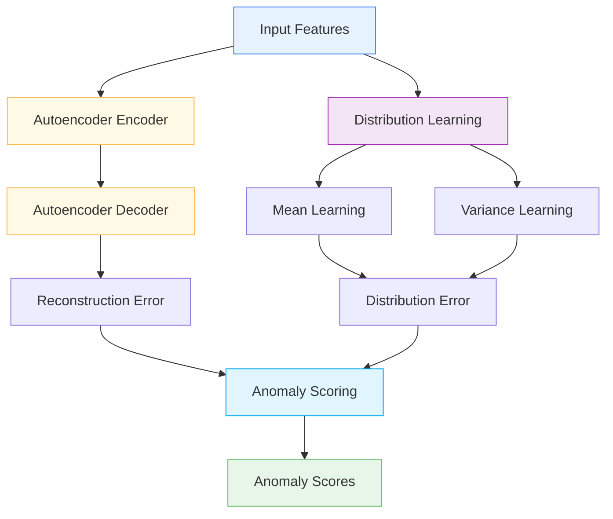

# 🔍 NumericalAnomalyDetection

<div class="layer-hero">
  <div class="layer-hero-content">
    <h1>🔍 NumericalAnomalyDetection</h1>
    <div class="layer-badges">
      <span class="badge badge-intermediate">🟡 Intermediate</span>
      <span class="badge badge-stable">✅ Stable</span>
      <span class="badge badge-popular">🔥 Popular</span>
    </div>
  </div>
</div>

## 🎯 Overview

The `NumericalAnomalyDetection` layer learns a distribution for each numerical feature and outputs an anomaly score for each feature based on how far it deviates from the learned distribution. It uses a combination of mean, variance, and autoencoder reconstruction error to detect anomalies.

This layer is particularly powerful for identifying outliers in numerical data, providing a comprehensive approach that combines statistical and neural network-based anomaly detection methods.

## 🔍 How It Works

The NumericalAnomalyDetection processes data through a multi-component anomaly detection system:

1. **Autoencoder Processing**: Encodes and decodes features through a neural network
2. **Reconstruction Error**: Computes reconstruction error for each feature
3. **Distribution Learning**: Learns mean and variance for each feature
4. **Distribution Error**: Computes distribution-based error
5. **Anomaly Scoring**: Combines reconstruction and distribution errors
6. **Output Generation**: Produces anomaly scores for each feature



## 💡 Why Use This Layer?

| Challenge | Traditional Approach | NumericalAnomalyDetection's Solution |
|-----------|---------------------|-------------------------------------|
| **Outlier Detection** | Statistical methods only | 🎯 **Combined approach** with neural networks |
| **Feature-Specific** | Global anomaly detection | ⚡ **Per-feature** anomaly scoring |
| **Reconstruction Error** | No reconstruction learning | 🧠 **Autoencoder-based** reconstruction error |
| **Distribution Learning** | Fixed distributions | 🔗 **Learned distributions** for each feature |

## 📊 Use Cases

- **Outlier Detection**: Identifying outliers in numerical features
- **Data Quality**: Ensuring data quality through anomaly detection
- **Feature Analysis**: Analyzing feature-level anomalies
- **Autoencoder Applications**: Using autoencoders for anomaly detection
- **Distribution Learning**: Learning feature distributions

## 🚀 Quick Start

### Basic Usage

```python
import keras
from kerasfactory.layers import NumericalAnomalyDetection

# Create sample input data
batch_size, num_features = 32, 5
x = keras.random.normal((batch_size, num_features))

# Apply numerical anomaly detection
anomaly_layer = NumericalAnomalyDetection(
    hidden_dims=[8, 4],
    reconstruction_weight=0.5,
    distribution_weight=0.5
)
anomaly_scores = anomaly_layer(x)

print(f"Input shape: {x.shape}")           # (32, 5)
print(f"Anomaly scores shape: {anomaly_scores.shape}")  # (32, 5)
```

### In a Sequential Model

```python
import keras
from kerasfactory.layers import NumericalAnomalyDetection

model = keras.Sequential([
    keras.layers.Dense(32, activation='relu'),
    NumericalAnomalyDetection(hidden_dims=[16, 8], reconstruction_weight=0.3, distribution_weight=0.7),
    keras.layers.Dense(16, activation='relu'),
    keras.layers.Dense(1, activation='sigmoid')
])

model.compile(optimizer='adam', loss='binary_crossentropy', metrics=['accuracy'])
```

### In a Functional Model

```python
import keras
from kerasfactory.layers import NumericalAnomalyDetection

# Define inputs
inputs = keras.Input(shape=(20,))  # 20 features

# Apply numerical anomaly detection
anomaly_scores = NumericalAnomalyDetection(
    hidden_dims=[16, 8],
    reconstruction_weight=0.4,
    distribution_weight=0.6
)(inputs)

# Continue processing
x = keras.layers.Dense(32, activation='relu')(inputs)
x = keras.layers.Dense(16, activation='relu')(x)
outputs = keras.layers.Dense(1, activation='sigmoid')(x)

model = keras.Model(inputs, [outputs, anomaly_scores])
```

### Advanced Configuration

```python
# Advanced configuration with multiple anomaly detection layers
def create_anomaly_detection_network():
    inputs = keras.Input(shape=(25,))  # 25 features
    
    # Multiple anomaly detection layers
    anomaly_scores1 = NumericalAnomalyDetection(
        hidden_dims=[32, 16],
        reconstruction_weight=0.3,
        distribution_weight=0.7
    )(inputs)
    
    x = keras.layers.Dense(64, activation='relu')(inputs)
    x = keras.layers.BatchNormalization()(x)
    
    anomaly_scores2 = NumericalAnomalyDetection(
        hidden_dims=[24, 12],
        reconstruction_weight=0.4,
        distribution_weight=0.6
    )(x)
    
    x = keras.layers.Dense(32, activation='relu')(x)
    x = keras.layers.Dropout(0.2)(x)
    
    # Multi-task output
    classification = keras.layers.Dense(3, activation='softmax', name='classification')(x)
    regression = keras.layers.Dense(1, name='regression')(x)
    anomaly = keras.layers.Dense(1, activation='sigmoid', name='anomaly')(x)
    
    return keras.Model(inputs, [classification, regression, anomaly, anomaly_scores1, anomaly_scores2])

model = create_anomaly_detection_network()
model.compile(
    optimizer='adam',
    loss={'classification': 'categorical_crossentropy', 'regression': 'mse', 'anomaly': 'binary_crossentropy'},
    loss_weights={'classification': 1.0, 'regression': 0.5, 'anomaly': 0.3}
)
```

## 📖 API Reference

::: kerasfactory.layers.NumericalAnomalyDetection

## 🔧 Parameters Deep Dive

### `hidden_dims` (list)
- **Purpose**: List of hidden dimensions for the autoencoder
- **Range**: [4, 2] to [128, 64, 32] (typically [16, 8] or [32, 16])
- **Impact**: Larger values = more complex autoencoder but more parameters
- **Recommendation**: Start with [16, 8], scale based on data complexity

### `reconstruction_weight` (float)
- **Purpose**: Weight for reconstruction error in anomaly score
- **Range**: 0.0 to 1.0 (typically 0.3-0.7)
- **Impact**: Higher values = more emphasis on reconstruction error
- **Recommendation**: Use 0.3-0.7 based on data characteristics

### `distribution_weight` (float)
- **Purpose**: Weight for distribution-based error in anomaly score
- **Range**: 0.0 to 1.0 (typically 0.3-0.7)
- **Impact**: Higher values = more emphasis on distribution error
- **Recommendation**: Use 0.3-0.7, should sum to 1.0 with reconstruction_weight

## 📈 Performance Characteristics

- **Speed**: ⚡⚡⚡ Fast for small to medium models, scales with hidden dimensions
- **Memory**: 💾💾💾 Moderate memory usage due to autoencoder
- **Accuracy**: 🎯🎯🎯🎯 Excellent for numerical anomaly detection
- **Best For**: Numerical data with potential outliers

## 🎨 Examples

### Example 1: Outlier Detection

```python
import keras
import numpy as np
from kerasfactory.layers import NumericalAnomalyDetection

# Create a model for outlier detection
def create_outlier_detection_model():
    inputs = keras.Input(shape=(15,))  # 15 features
    
    # Anomaly detection layer
    anomaly_scores = NumericalAnomalyDetection(
        hidden_dims=[16, 8],
        reconstruction_weight=0.4,
        distribution_weight=0.6
    )(inputs)
    
    # Process features
    x = keras.layers.Dense(32, activation='relu')(inputs)
    x = keras.layers.BatchNormalization()(x)
    x = keras.layers.Dense(16, activation='relu')(x)
    x = keras.layers.Dropout(0.2)(x)
    
    # Output
    outputs = keras.layers.Dense(1, activation='sigmoid')(x)
    
    return keras.Model(inputs, [outputs, anomaly_scores])

model = create_outlier_detection_model()
model.compile(optimizer='adam', loss='binary_crossentropy')

# Test with sample data
sample_data = keras.random.normal((100, 15))
predictions, anomaly_scores = model(sample_data)
print(f"Outlier detection predictions shape: {predictions.shape}")
print(f"Anomaly scores shape: {anomaly_scores.shape}")
```

### Example 2: Anomaly Analysis

```python
# Analyze anomaly detection behavior
def analyze_anomaly_detection():
    # Create model with anomaly detection
    inputs = keras.Input(shape=(12,))
    anomaly_scores = NumericalAnomalyDetection(
        hidden_dims=[8, 4],
        reconstruction_weight=0.5,
        distribution_weight=0.5
    )(inputs)
    outputs = keras.layers.Dense(1, activation='sigmoid')(inputs)
    
    model = keras.Model(inputs, [outputs, anomaly_scores])
    
    # Test with different input patterns
    test_inputs = [
        keras.random.normal((10, 12)),  # Random data
        keras.random.normal((10, 12)) * 2,  # Scaled data
        keras.random.normal((10, 12)) + 1,  # Shifted data
    ]
    
    print("Anomaly Detection Analysis:")
    print("=" * 40)
    
    for i, test_input in enumerate(test_inputs):
        prediction, anomaly = model(test_input)
        print(f"Test {i+1}: Anomaly mean = {keras.ops.mean(anomaly):.4f}")
    
    return model

# Analyze anomaly detection
# model = analyze_anomaly_detection()
```

### Example 3: Reconstruction Analysis

```python
# Analyze reconstruction behavior
def analyze_reconstruction():
    # Create model with anomaly detection
    inputs = keras.Input(shape=(10,))
    anomaly_scores = NumericalAnomalyDetection(
        hidden_dims=[8, 4],
        reconstruction_weight=0.5,
        distribution_weight=0.5
    )(inputs)
    
    model = keras.Model(inputs, anomaly_scores)
    
    # Test with sample data
    sample_data = keras.random.normal((50, 10))
    anomaly_scores = model(sample_data)
    
    print("Reconstruction Analysis:")
    print("=" * 40)
    print(f"Input shape: {sample_data.shape}")
    print(f"Anomaly scores shape: {anomaly_scores.shape}")
    print(f"Model parameters: {model.count_params()}")
    
    return model

# Analyze reconstruction
# model = analyze_reconstruction()
```

## 💡 Tips & Best Practices

- **Hidden Dimensions**: Start with [16, 8], scale based on data complexity
- **Weight Balance**: Balance reconstruction and distribution weights
- **Feature Normalization**: Works best with normalized input features
- **Anomaly Threshold**: Set appropriate thresholds for anomaly detection
- **Autoencoder Training**: Ensure autoencoder is well-trained
- **Distribution Learning**: Monitor distribution learning progress

## ⚠️ Common Pitfalls

- **Hidden Dimensions**: Must be positive integers
- **Weight Sum**: Reconstruction and distribution weights should sum to 1.0
- **Memory Usage**: Scales with hidden dimensions
- **Overfitting**: Monitor for overfitting with complex autoencoders
- **Anomaly Threshold**: May need tuning for different datasets

## 🔗 Related Layers

- [CategoricalAnomalyDetectionLayer](categorical-anomaly-detection-layer.md) - Categorical anomaly detection
- [BusinessRulesLayer](business-rules-layer.md) - Business rules validation
- [FeatureCutout](feature-cutout.md) - Feature regularization
- [DistributionAwareEncoder](distribution-aware-encoder.md) - Distribution-aware encoding

## 📚 Further Reading

- [Anomaly Detection](https://en.wikipedia.org/wiki/Anomaly_detection) - Anomaly detection concepts
- [Autoencoders](https://en.wikipedia.org/wiki/Autoencoder) - Autoencoder concepts
- [Outlier Detection](https://en.wikipedia.org/wiki/Outlier) - Outlier detection techniques
- [KerasFactory Layer Explorer](../layers_overview.md) - Browse all available layers
- [Feature Engineering Tutorial](../tutorials/feature-engineering.md) - Complete guide to feature engineering
