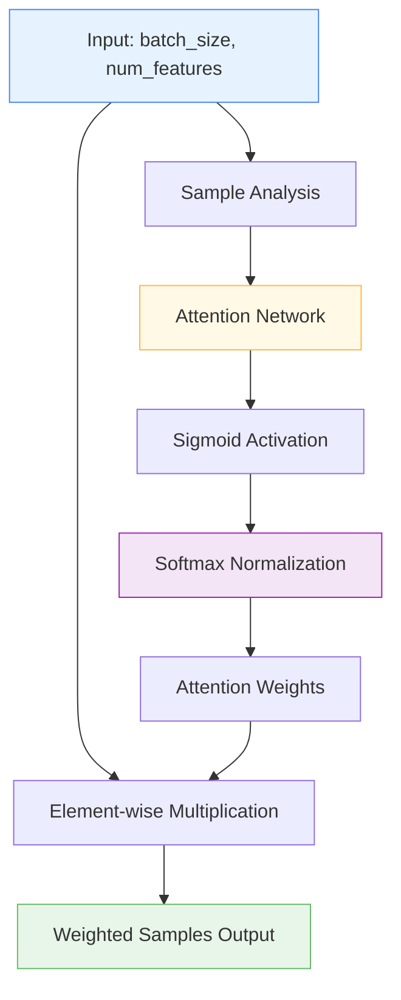

# 📋 RowAttention

<div class="layer-hero">
  <div class="layer-hero-content">
    <h1>📋 RowAttention</h1>
    <div class="layer-badges">
      <span class="badge badge-intermediate">🟡 Intermediate</span>
      <span class="badge badge-stable">✅ Stable</span>
      <span class="badge badge-popular">🔥 Popular</span>
    </div>
  </div>
</div>

## 🎯 Overview

The `RowAttention` layer implements a row-wise attention mechanism that dynamically weights samples based on their importance and relevance. Unlike traditional attention mechanisms that focus on feature relationships, this layer learns to assign attention weights to each sample (row) in the batch, allowing the model to focus on the most informative samples for each prediction.

This layer is particularly useful for sample weighting, outlier handling, and improving model performance by learning which samples are most important for the current context.

## 🔍 How It Works

The RowAttention layer processes tabular data through a sample-wise attention mechanism:

1. **Sample Analysis**: Analyzes each sample to understand its importance
2. **Attention Weight Generation**: Uses a neural network to compute attention weights for each sample
3. **Softmax Normalization**: Normalizes weights across the batch using softmax
4. **Dynamic Weighting**: Applies learned weights to scale sample importance



## 💡 Why Use This Layer?

| Challenge | Traditional Approach | RowAttention's Solution |
|-----------|---------------------|------------------------|
| **Sample Importance** | Treat all samples equally | 🎯 **Automatic learning** of sample importance per batch |
| **Outlier Handling** | Outliers can skew predictions | ⚡ **Dynamic weighting** to down-weight outliers |
| **Data Quality** | No distinction between good/bad samples | 👁️ **Quality-aware** processing based on sample characteristics |
| **Batch Effects** | Ignore sample relationships within batch | 🔗 **Context-aware** weighting based on batch composition |

## 📊 Use Cases

- **Sample Weighting**: Automatically identifying and emphasizing important samples
- **Outlier Detection**: Down-weighting outliers and noisy samples
- **Data Quality**: Handling datasets with varying sample quality
- **Batch Processing**: Learning sample importance within each batch
- **Imbalanced Data**: Balancing the influence of different sample types

## 🚀 Quick Start

### Basic Usage

```python
import keras
from kmr.layers import RowAttention

# Create sample tabular data
batch_size, num_features = 32, 10
x = keras.random.normal((batch_size, num_features))

# Apply row attention
attention = RowAttention(feature_dim=num_features)
weighted_samples = attention(x)

print(f"Input shape: {x.shape}")           # (32, 10)
print(f"Output shape: {weighted_samples.shape}")  # (32, 10)
```

### In a Sequential Model

```python
import keras
from kmr.layers import RowAttention

model = keras.Sequential([
    keras.layers.Dense(64, activation='relu'),
    RowAttention(feature_dim=64),  # Apply attention to 64 features
    keras.layers.Dense(32, activation='relu'),
    keras.layers.Dense(1, activation='sigmoid')
])

model.compile(optimizer='adam', loss='binary_crossentropy', metrics=['accuracy'])
```

### In a Functional Model

```python
import keras
from kmr.layers import RowAttention

# Define inputs
inputs = keras.Input(shape=(20,))  # 20 features

# Process features
x = keras.layers.Dense(64, activation='relu')(inputs)
x = RowAttention(feature_dim=64)(x)  # Apply row attention
x = keras.layers.Dropout(0.2)(x)
x = keras.layers.Dense(32, activation='relu')(x)
outputs = keras.layers.Dense(1, activation='sigmoid')(x)

model = keras.Model(inputs, outputs)
```

### Advanced Configuration

```python
# Advanced configuration with custom hidden dimension
attention = RowAttention(
    feature_dim=128,
    hidden_dim=64,  # Custom hidden layer size
    name="custom_row_attention"
)

# Use in a complex model
inputs = keras.Input(shape=(50,))
x = keras.layers.Dense(128, activation='relu')(inputs)
x = attention(x)  # Apply row attention
x = keras.layers.LayerNormalization()(x)
x = keras.layers.Dense(64, activation='relu')(x)
x = keras.layers.Dropout(0.3)(x)
outputs = keras.layers.Dense(5, activation='softmax')(x)

model = keras.Model(inputs, outputs)
```

## 📖 API Reference

::: kmr.layers.RowAttention

## 🔧 Parameters Deep Dive

### `feature_dim` (int)
- **Purpose**: Number of input features for each sample
- **Range**: 1 to 1000+ (typically 10-100)
- **Impact**: Must match the number of features in your input
- **Recommendation**: Set to the output dimension of your previous layer

### `hidden_dim` (int, optional)
- **Purpose**: Size of the hidden layer in the attention network
- **Range**: 1 to feature_dim (default: feature_dim // 2)
- **Impact**: Larger values = more complex attention patterns but more parameters
- **Recommendation**: Start with default, increase for complex sample relationships

## 📈 Performance Characteristics

- **Speed**: ⚡⚡⚡⚡ Very fast - simple neural network computation
- **Memory**: 💾💾 Low memory usage - minimal additional parameters
- **Accuracy**: 🎯🎯🎯 Good for sample importance and outlier handling
- **Best For**: Tabular data where sample importance varies by context

## 🎨 Examples

### Example 1: Outlier Detection and Handling

```python
import keras
import numpy as np
from kmr.layers import RowAttention

# Create data with outliers
np.random.seed(42)
batch_size, num_features = 100, 8

# Normal samples
normal_samples = np.random.normal(0, 1, (80, num_features))
# Outlier samples (much higher variance)
outlier_samples = np.random.normal(0, 5, (20, num_features))
x = np.vstack([normal_samples, outlier_samples])

# Build model with row attention to handle outliers
inputs = keras.Input(shape=(num_features,))
x = keras.layers.Dense(16, activation='relu')(inputs)
x = RowAttention(feature_dim=16)(x)  # Learn sample importance
x = keras.layers.Dense(8, activation='relu')(x)
outputs = keras.layers.Dense(1, activation='sigmoid')(x)

model = keras.Model(inputs, outputs)
model.compile(optimizer='adam', loss='binary_crossentropy')

# Train and analyze attention weights
y = np.concatenate([np.zeros(80), np.ones(20)])  # Outliers are class 1
model.fit(x, y, epochs=20, verbose=0)

# Get attention weights for interpretability
attention_layer = model.layers[2]  # RowAttention layer
attention_weights = attention_layer.attention_net(x[:10])  # Get weights for first 10 samples
print("Attention weights shape:", attention_weights.shape)
print("Sample attention weights:", attention_weights.flatten()[:10])
```

### Example 2: Imbalanced Data Handling

```python
# Handle imbalanced data with row attention
def create_balanced_model():
    inputs = keras.Input(shape=(15,))
    
    # Feature processing
    x = keras.layers.Dense(64, activation='relu')(inputs)
    x = keras.layers.BatchNormalization()(x)
    
    # Row attention to balance sample influence
    x = RowAttention(feature_dim=64, hidden_dim=32)(x)
    
    # Additional processing
    x = keras.layers.Dense(32, activation='relu')(x)
    x = keras.layers.Dropout(0.3)(x)
    
    # Output
    outputs = keras.layers.Dense(1, activation='sigmoid')(outputs)
    
    return keras.Model(inputs, outputs)

# Use with imbalanced data
model = create_balanced_model()
model.compile(optimizer='adam', loss='binary_crossentropy')

# The row attention will automatically learn to balance sample influence
```

### Example 3: Quality-Aware Processing

```python
# Process data with varying quality using row attention
def create_quality_aware_model():
    inputs = keras.Input(shape=(25,))
    
    # Initial feature processing
    x = keras.layers.Dense(128, activation='relu')(inputs)
    x = keras.layers.BatchNormalization()(x)
    
    # Row attention to focus on high-quality samples
    x = RowAttention(feature_dim=128, hidden_dim=64)(x)
    
    # Quality-aware processing
    x = keras.layers.Dense(64, activation='relu')(x)
    x = keras.layers.Dropout(0.2)(x)
    x = keras.layers.Dense(32, activation='relu')(x)
    
    # Multiple outputs
    quality_score = keras.layers.Dense(1, activation='sigmoid', name='quality')(x)
    prediction = keras.layers.Dense(3, activation='softmax', name='prediction')(x)
    
    return keras.Model(inputs, [quality_score, prediction])

model = create_quality_aware_model()
model.compile(
    optimizer='adam',
    loss={'quality': 'binary_crossentropy', 'prediction': 'categorical_crossentropy'},
    loss_weights={'quality': 0.3, 'prediction': 1.0}
)
```

## 💡 Tips & Best Practices

- **Placement**: Use after initial feature processing but before final predictions
- **Hidden Dimension**: Start with feature_dim // 2, adjust based on complexity
- **Batch Size**: Works best with larger batch sizes for better softmax normalization
- **Regularization**: Combine with dropout and batch normalization for better generalization
- **Interpretability**: Access attention weights to understand sample importance
- **Data Quality**: Particularly effective with noisy or imbalanced data

## ⚠️ Common Pitfalls

- **Input Shape**: Must be 2D tensor (batch_size, feature_dim)
- **Dimension Mismatch**: feature_dim must match the number of features
- **Small Batches**: Softmax normalization works better with larger batches
- **Overfitting**: Can overfit on small datasets - use regularization
- **Memory**: Hidden dimension affects memory usage - keep reasonable

## 🔗 Related Layers

- [ColumnAttention](column-attention.md) - Column-wise attention for feature relationships
- [TabularAttention](tabular-attention.md) - General tabular attention mechanism
- [SparseAttentionWeighting](sparse-attention-weighting.md) - Sparse attention weights
- [VariableSelection](variable-selection.md) - Feature selection layer

## 📚 Further Reading

- [Attention Mechanisms in Deep Learning](https://distill.pub/2016/augmented-rnns/) - Understanding attention mechanisms
- [Sample Weighting in Machine Learning](https://en.wikipedia.org/wiki/Instance_weighting) - Sample weighting concepts
- [KMR Layer Explorer](../layers-explorer.md) - Browse all available layers
- [Data Quality Tutorial](../tutorials/feature-engineering.md) - Complete guide to data quality handling
