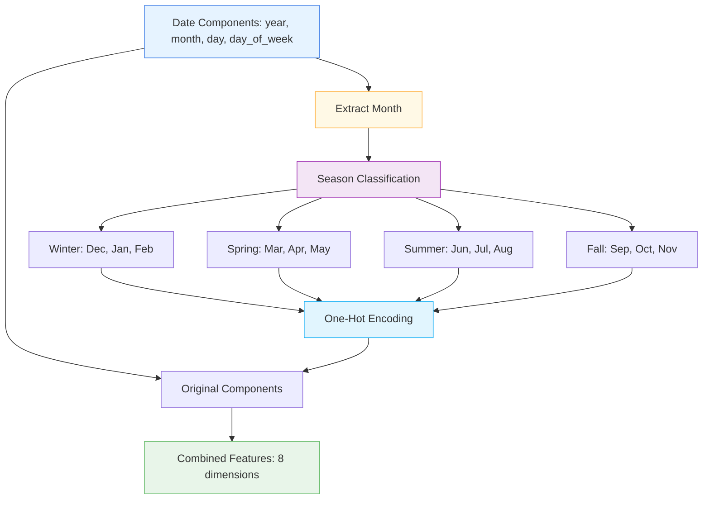

# 🌸 SeasonLayer

<div class="layer-hero">
  <div class="layer-hero-content">
    <h1>🌸 SeasonLayer</h1>
    <div class="layer-badges">
      <span class="badge badge-beginner">🟢 Beginner</span>
      <span class="badge badge-stable">✅ Stable</span>
      <span class="badge badge-popular">🔥 Popular</span>
    </div>
  </div>
</div>

## 🎯 Overview

The `SeasonLayer` adds seasonal information based on the month, encoding it as a one-hot vector for the four seasons: Winter, Spring, Summer, and Fall. This layer is essential for temporal feature engineering where seasonal patterns are important.

This layer takes date components and adds seasonal information, making it perfect for time series analysis, weather forecasting, and any application where seasonal patterns matter.

## 🔍 How It Works

The SeasonLayer processes date components through seasonal encoding:

1. **Month Extraction**: Extracts month from date components
2. **Season Classification**: Classifies months into four seasons:
   - Winter: December (12), January (1), February (2)
   - Spring: March (3), April (4), May (5)
   - Summer: June (6), July (7), August (8)
   - Fall: September (9), October (10), November (11)
3. **One-Hot Encoding**: Creates one-hot vectors for each season
4. **Feature Combination**: Combines original date components with seasonal features
5. **Output Generation**: Produces 8-dimensional feature vector



## 💡 Why Use This Layer?

| Challenge | Traditional Approach | SeasonLayer's Solution |
|-----------|---------------------|----------------------|
| **Seasonal Patterns** | Manual season calculation | 🎯 **Automatic season** classification and encoding |
| **Temporal Features** | Separate season processing | ⚡ **Integrated seasonal** information with date components |
| **One-Hot Encoding** | Manual one-hot encoding | 🧠 **Built-in one-hot** encoding for seasons |
| **Feature Engineering** | Complex season extraction | 🔗 **Simple seasonal** feature addition |

## 📊 Use Cases

- **Weather Forecasting**: Adding seasonal context to weather predictions
- **Sales Analysis**: Analyzing seasonal sales patterns
- **Agricultural Planning**: Incorporating seasonal information for crop planning
- **Energy Consumption**: Predicting energy usage based on seasons
- **Event Planning**: Considering seasonal factors in event planning

## 🚀 Quick Start

### Basic Usage

```python
import keras
from kmr.layers import SeasonLayer

# Create sample date components [year, month, day, day_of_week]
date_components = keras.ops.convert_to_tensor([
    [2023, 1, 15, 6],   # Winter (January)
    [2023, 4, 15, 5],   # Spring (April)
    [2023, 7, 15, 5],   # Summer (July)
    [2023, 10, 15, 6]   # Fall (October)
], dtype="float32")

# Apply seasonal encoding
season_layer = SeasonLayer()
seasonal_features = season_layer(date_components)

print(f"Input shape: {date_components.shape}")    # (4, 4)
print(f"Output shape: {seasonal_features.shape}") # (4, 8)
print(f"Seasonal features: {seasonal_features}")
# Output: [year, month, day, day_of_week, winter, spring, summer, fall]
```

### In a Sequential Model

```python
import keras
from kmr.layers import SeasonLayer

model = keras.Sequential([
    SeasonLayer(),
    keras.layers.Dense(32, activation='relu'),
    keras.layers.Dense(16, activation='relu'),
    keras.layers.Dense(1, activation='sigmoid')
])

model.compile(optimizer='adam', loss='binary_crossentropy', metrics=['accuracy'])
```

### In a Functional Model

```python
import keras
from kmr.layers import SeasonLayer

# Define inputs
inputs = keras.Input(shape=(4,))  # [year, month, day, day_of_week]

# Apply seasonal encoding
x = SeasonLayer()(inputs)

# Continue processing
x = keras.layers.Dense(32, activation='relu')(x)
x = keras.layers.Dropout(0.2)(x)
x = keras.layers.Dense(16, activation='relu')(x)
outputs = keras.layers.Dense(1, activation='sigmoid')(x)

model = keras.Model(inputs, outputs)
```

### Advanced Configuration

```python
# Advanced configuration with seasonal analysis
def create_seasonal_analysis_model():
    # Input for date components
    date_input = keras.Input(shape=(4,))  # [year, month, day, day_of_week]
    
    # Apply seasonal encoding
    seasonal_features = SeasonLayer()(date_input)
    
    # Process seasonal features
    x = keras.layers.Dense(64, activation='relu')(seasonal_features)
    x = keras.layers.BatchNormalization()(x)
    x = keras.layers.Dropout(0.2)(x)
    x = keras.layers.Dense(32, activation='relu')(x)
    
    # Multi-task output
    temperature = keras.layers.Dense(1, name='temperature')(x)
    humidity = keras.layers.Dense(1, name='humidity')(x)
    season = keras.layers.Dense(4, activation='softmax', name='season')(x)
    
    return keras.Model(date_input, [temperature, humidity, season])

model = create_seasonal_analysis_model()
model.compile(
    optimizer='adam',
    loss={'temperature': 'mse', 'humidity': 'mse', 'season': 'categorical_crossentropy'},
    loss_weights={'temperature': 1.0, 'humidity': 0.5, 'season': 0.3}
)
```

## 📖 API Reference

::: kmr.layers.SeasonLayer

## 🔧 Parameters Deep Dive

### No Parameters
- **Purpose**: This layer has no configurable parameters
- **Behavior**: Automatically classifies months into four seasons
- **Output**: Always produces 8-dimensional output (4 original + 4 seasonal)

## 📈 Performance Characteristics

- **Speed**: ⚡⚡⚡⚡ Very fast - simple conditional logic
- **Memory**: 💾 Low memory usage - no additional parameters
- **Accuracy**: 🎯🎯🎯🎯 Excellent for seasonal feature extraction
- **Best For**: Temporal data requiring seasonal information

## 🎨 Examples

### Example 1: Weather Prediction with Seasons

```python
import keras
import numpy as np
from kmr.layers import SeasonLayer

# Create weather prediction model with seasonal information
def create_weather_model():
    # Input for date components
    date_input = keras.Input(shape=(4,))  # [year, month, day, day_of_week]
    
    # Apply seasonal encoding
    seasonal_features = SeasonLayer()(date_input)
    
    # Process seasonal features
    x = keras.layers.Dense(128, activation='relu')(seasonal_features)
    x = keras.layers.BatchNormalization()(x)
    x = keras.layers.Dropout(0.3)(x)
    x = keras.layers.Dense(64, activation='relu')(x)
    x = keras.layers.Dropout(0.2)(x)
    x = keras.layers.Dense(32, activation='relu')(x)
    
    # Weather predictions
    temperature = keras.layers.Dense(1, name='temperature')(x)
    humidity = keras.layers.Dense(1, name='humidity')(x)
    precipitation = keras.layers.Dense(1, name='precipitation')(x)
    wind_speed = keras.layers.Dense(1, name='wind_speed')(x)
    
    return keras.Model(date_input, [temperature, humidity, precipitation, wind_speed])

model = create_weather_model()
model.compile(
    optimizer='adam',
    loss={'temperature': 'mse', 'humidity': 'mse', 'precipitation': 'mse', 'wind_speed': 'mse'},
    loss_weights={'temperature': 1.0, 'humidity': 0.5, 'precipitation': 0.3, 'wind_speed': 0.2}
)

# Test with sample data
sample_dates = keras.ops.convert_to_tensor([
    [2023, 1, 15, 6],   # Winter Sunday
    [2023, 4, 15, 5],   # Spring Saturday
    [2023, 7, 15, 5],   # Summer Saturday
    [2023, 10, 15, 6]   # Fall Sunday
], dtype="float32")

predictions = model(sample_dates)
print(f"Weather predictions: {[p.shape for p in predictions]}")
```

### Example 2: Sales Analysis with Seasonal Patterns

```python
# Analyze sales patterns with seasonal information
def create_sales_analysis_model():
    # Input for date components
    date_input = keras.Input(shape=(4,))  # [year, month, day, day_of_week]
    
    # Apply seasonal encoding
    seasonal_features = SeasonLayer()(date_input)
    
    # Process seasonal features
    x = keras.layers.Dense(64, activation='relu')(seasonal_features)
    x = keras.layers.BatchNormalization()(x)
    x = keras.layers.Dropout(0.2)(x)
    x = keras.layers.Dense(32, activation='relu')(x)
    
    # Sales predictions
    sales_volume = keras.layers.Dense(1, name='sales_volume')(x)
    revenue = keras.layers.Dense(1, name='revenue')(x)
    is_peak_season = keras.layers.Dense(1, activation='sigmoid', name='is_peak_season')(x)
    
    return keras.Model(date_input, [sales_volume, revenue, is_peak_season])

model = create_sales_analysis_model()
model.compile(
    optimizer='adam',
    loss={'sales_volume': 'mse', 'revenue': 'mse', 'is_peak_season': 'binary_crossentropy'},
    loss_weights={'sales_volume': 1.0, 'revenue': 0.5, 'is_peak_season': 0.3}
)
```

### Example 3: Seasonal Feature Analysis

```python
# Analyze seasonal features produced by the layer
def analyze_seasonal_features():
    # Create sample date components for each season
    dates = keras.ops.convert_to_tensor([
        [2023, 1, 15, 6],   # Winter (January)
        [2023, 4, 15, 5],   # Spring (April)
        [2023, 7, 15, 5],   # Summer (July)
        [2023, 10, 15, 6]   # Fall (October)
    ], dtype="float32")
    
    # Apply seasonal encoding
    season_layer = SeasonLayer()
    seasonal_features = season_layer(dates)
    
    # Analyze seasonal patterns
    print("Seasonal Feature Analysis:")
    print("=" * 60)
    print("Date\t\tMonth\tWinter\tSpring\tSummer\tFall")
    print("-" * 60)
    
    for i, date in enumerate(dates):
        year, month, day, dow = date.numpy()
        year, month, day, dow, winter, spring, summer, fall = seasonal_features[i].numpy()
        
        print(f"{int(year)}-{int(month):02d}-{int(day):02d}\t{int(month)}\t"
              f"{int(winter)}\t{int(spring)}\t{int(summer)}\t{int(fall)}")
    
    return seasonal_features

# Analyze seasonal features
# seasonal_data = analyze_seasonal_features()
```

## 💡 Tips & Best Practices

- **Input Format**: Input must be [year, month, day, day_of_week] format
- **Season Classification**: Automatically classifies months into four seasons
- **One-Hot Encoding**: Produces one-hot encoded seasonal features
- **Feature Combination**: Combines original date components with seasonal features
- **Neural Networks**: Works well with neural networks for seasonal patterns
- **Integration**: Combines well with other temporal processing layers

## ⚠️ Common Pitfalls

- **Input Shape**: Must be (..., 4) tensor with date components
- **Component Order**: Must be [year, month, day, day_of_week] in that order
- **Data Type**: Input should be float32 tensor
- **Missing Values**: Doesn't handle missing values - preprocess first
- **Season Definition**: Uses standard Northern Hemisphere season definitions

## 🔗 Related Layers

- [DateParsingLayer](date-parsing-layer.md) - Date string parsing
- [DateEncodingLayer](date-encoding-layer.md) - Cyclical date encoding
- [CastToFloat32Layer](cast-to-float32-layer.md) - Type casting utility
- [DifferentiableTabularPreprocessor](differentiable-tabular-preprocessor.md) - End-to-end preprocessing

## 📚 Further Reading

- [Seasonal Patterns in Time Series](https://en.wikipedia.org/wiki/Seasonality) - Seasonality concepts
- [One-Hot Encoding](https://en.wikipedia.org/wiki/One-hot) - One-hot encoding techniques
- [Temporal Feature Engineering](https://en.wikipedia.org/wiki/Feature_engineering) - Feature engineering techniques
- [KMR Layer Explorer](../layers_overview.md) - Browse all available layers
- [Data Preprocessing Tutorial](../tutorials/feature-engineering.md) - Complete guide to data preprocessing
