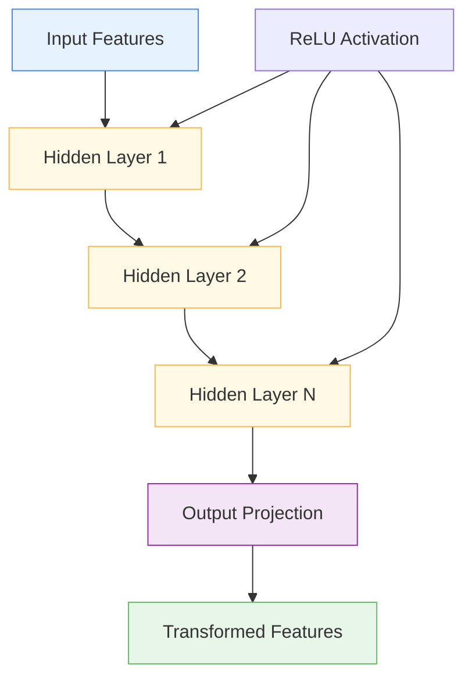

# 🐌 SlowNetwork

<div class="layer-hero">
  <div class="layer-hero-content">
    <h1>🐌 SlowNetwork</h1>
    <div class="layer-badges">
      <span class="badge badge-intermediate">🟡 Intermediate</span>
      <span class="badge badge-stable">✅ Stable</span>
      <span class="badge badge-popular">🔥 Popular</span>
    </div>
  </div>
</div>

## 🎯 Overview

The `SlowNetwork` is a multi-layer network with configurable depth and width that processes input features through multiple dense layers with ReLU activations, then projects the output back to the original feature dimension. This layer is designed to be used as a component in more complex architectures.

This layer is particularly powerful for complex feature processing where you need deep transformations while maintaining the original feature dimension, making it ideal for sophisticated feature engineering and complex pattern recognition.

## 🔍 How It Works

The SlowNetwork processes data through a multi-layer transformation:

1. **Input Processing**: Takes input features of specified dimension
2. **Hidden Layers**: Applies multiple dense layers with ReLU activations
3. **Feature Transformation**: Transforms features through the hidden layers
4. **Output Projection**: Projects back to original input dimension
5. **Output Generation**: Produces transformed features with same shape



## 💡 Why Use This Layer?

| Challenge | Traditional Approach | SlowNetwork's Solution |
|-----------|---------------------|----------------------|
| **Complex Processing** | Single dense layer | 🎯 **Multi-layer processing** for complex transformations |
| **Feature Dimension** | Fixed output dimension | ⚡ **Maintains input dimension** while processing |
| **Deep Transformations** | Limited transformation depth | 🧠 **Configurable depth** for complex patterns |
| **Architecture Components** | Manual layer stacking | 🔗 **Pre-built component** for complex architectures |

## 📊 Use Cases

- **Complex Feature Processing**: Deep transformations of input features
- **Architecture Components**: Building blocks for complex architectures
- **Feature Engineering**: Sophisticated feature transformation
- **Pattern Recognition**: Complex pattern recognition in features
- **Dimensionality Preservation**: Maintaining input dimension while processing

## 🚀 Quick Start

### Basic Usage

```python
import keras
from kerasfactory.layers import SlowNetwork

# Create sample input data
batch_size, input_dim = 32, 16
x = keras.random.normal((batch_size, input_dim))

# Apply slow network
slow_net = SlowNetwork(input_dim=16, num_layers=3, units=64)
output = slow_net(x)

print(f"Input shape: {x.shape}")           # (32, 16)
print(f"Output shape: {output.shape}")     # (32, 16)
```

### In a Sequential Model

```python
import keras
from kerasfactory.layers import SlowNetwork

model = keras.Sequential([
    keras.layers.Dense(32, activation='relu'),
    SlowNetwork(input_dim=32, num_layers=3, units=64),
    keras.layers.Dense(16, activation='relu'),
    SlowNetwork(input_dim=16, num_layers=2, units=32),
    keras.layers.Dense(1, activation='sigmoid')
])

model.compile(optimizer='adam', loss='binary_crossentropy', metrics=['accuracy'])
```

### In a Functional Model

```python
import keras
from kerasfactory.layers import SlowNetwork

# Define inputs
inputs = keras.Input(shape=(20,))  # 20 features

# Apply slow network
x = SlowNetwork(input_dim=20, num_layers=3, units=64)(inputs)

# Continue processing
x = keras.layers.Dense(32, activation='relu')(x)
x = SlowNetwork(input_dim=32, num_layers=2, units=32)(x)
x = keras.layers.Dense(16, activation='relu')(x)
outputs = keras.layers.Dense(1, activation='sigmoid')(x)

model = keras.Model(inputs, outputs)
```

### Advanced Configuration

```python
# Advanced configuration with multiple slow networks
def create_complex_network():
    inputs = keras.Input(shape=(30,))
    
    # Multiple slow networks with different configurations
    x = SlowNetwork(input_dim=30, num_layers=4, units=128)(inputs)
    x = keras.layers.Dense(64, activation='relu')(x)
    x = keras.layers.BatchNormalization()(x)
    
    x = SlowNetwork(input_dim=64, num_layers=3, units=96)(x)
    x = keras.layers.Dense(48, activation='relu')(x)
    x = keras.layers.Dropout(0.2)(x)
    
    x = SlowNetwork(input_dim=48, num_layers=2, units=64)(x)
    x = keras.layers.Dense(32, activation='relu')(x)
    x = keras.layers.Dropout(0.1)(x)
    
    # Multi-task output
    classification = keras.layers.Dense(3, activation='softmax', name='classification')(x)
    regression = keras.layers.Dense(1, name='regression')(x)
    
    return keras.Model(inputs, [classification, regression])

model = create_complex_network()
model.compile(
    optimizer='adam',
    loss={'classification': 'categorical_crossentropy', 'regression': 'mse'},
    loss_weights={'classification': 1.0, 'regression': 0.5}
)
```

## 📖 API Reference

::: kerasfactory.layers.SlowNetwork

## 🔧 Parameters Deep Dive

### `input_dim` (int)
- **Purpose**: Dimension of the input features
- **Range**: 1 to 1000+ (typically 16-256)
- **Impact**: Determines the input and output feature dimension
- **Recommendation**: Match the actual input feature dimension

### `num_layers` (int)
- **Purpose**: Number of hidden layers
- **Range**: 1 to 20+ (typically 2-5)
- **Impact**: More layers = more complex transformations
- **Recommendation**: Start with 3, scale based on complexity needs

### `units` (int)
- **Purpose**: Number of units per hidden layer
- **Range**: 16 to 512+ (typically 64-256)
- **Impact**: Larger values = more complex transformations
- **Recommendation**: Start with 64-128, scale based on data complexity

## 📈 Performance Characteristics

- **Speed**: ⚡⚡⚡ Fast for small to medium networks, scales with layers and units
- **Memory**: 💾💾💾 Moderate memory usage due to multiple dense layers
- **Accuracy**: 🎯🎯🎯🎯 Excellent for complex feature transformation
- **Best For**: Complex feature processing while maintaining input dimension

## 🎨 Examples

### Example 1: Complex Feature Processing

```python
import keras
import numpy as np
from kerasfactory.layers import SlowNetwork

# Create a complex feature processing model
def create_complex_feature_processor():
    inputs = keras.Input(shape=(25,))  # 25 features
    
    # Multiple slow networks for different processing stages
    x = SlowNetwork(input_dim=25, num_layers=4, units=128)(inputs)
    x = keras.layers.Dense(64, activation='relu')(x)
    x = keras.layers.BatchNormalization()(x)
    
    x = SlowNetwork(input_dim=64, num_layers=3, units=96)(x)
    x = keras.layers.Dense(48, activation='relu')(x)
    x = keras.layers.Dropout(0.2)(x)
    
    x = SlowNetwork(input_dim=48, num_layers=2, units=64)(x)
    x = keras.layers.Dense(32, activation='relu')(x)
    x = keras.layers.Dropout(0.1)(x)
    
    # Output
    outputs = keras.layers.Dense(1, activation='sigmoid')(x)
    
    return keras.Model(inputs, outputs)

model = create_complex_feature_processor()
model.compile(optimizer='adam', loss='binary_crossentropy')

# Test with sample data
sample_data = keras.random.normal((100, 25))
predictions = model(sample_data)
print(f"Complex feature processor predictions shape: {predictions.shape}")
```

### Example 2: Architecture Component

```python
# Use SlowNetwork as a component in complex architecture
def create_component_based_architecture():
    inputs = keras.Input(shape=(20,))
    
    # Initial processing
    x = keras.layers.Dense(32, activation='relu')(inputs)
    x = keras.layers.BatchNormalization()(x)
    
    # SlowNetwork component 1
    x = SlowNetwork(input_dim=32, num_layers=3, units=64)(x)
    x = keras.layers.Dropout(0.2)(x)
    
    # SlowNetwork component 2
    x = SlowNetwork(input_dim=32, num_layers=2, units=48)(x)
    x = keras.layers.Dropout(0.1)(x)
    
    # Final processing
    x = keras.layers.Dense(16, activation='relu')(x)
    x = keras.layers.Dropout(0.1)(x)
    
    # Output
    outputs = keras.layers.Dense(1, activation='sigmoid')(x)
    
    return keras.Model(inputs, outputs)

model = create_component_based_architecture()
model.compile(optimizer='adam', loss='binary_crossentropy')
```

### Example 3: Layer Analysis

```python
# Analyze SlowNetwork behavior
def analyze_slow_network():
    # Create model with SlowNetwork
    inputs = keras.Input(shape=(15,))
    x = SlowNetwork(input_dim=15, num_layers=3, units=32)(inputs)
    outputs = keras.layers.Dense(1, activation='sigmoid')(x)
    
    model = keras.Model(inputs, outputs)
    
    # Test with different input patterns
    test_inputs = [
        keras.random.normal((10, 15)),  # Random data
        keras.random.normal((10, 15)) * 2,  # Scaled data
        keras.random.normal((10, 15)) + 1,  # Shifted data
    ]
    
    print("SlowNetwork Analysis:")
    print("=" * 40)
    
    for i, test_input in enumerate(test_inputs):
        prediction = model(test_input)
        print(f"Test {i+1}: Prediction mean = {keras.ops.mean(prediction):.4f}")
    
    return model

# Analyze SlowNetwork
# model = analyze_slow_network()
```

## 💡 Tips & Best Practices

- **Input Dimension**: Must match the actual input feature dimension
- **Number of Layers**: Start with 3, scale based on complexity needs
- **Units**: Use 64-128 units for most applications
- **Activation Functions**: ReLU is used by default, consider alternatives if needed
- **Regularization**: Consider adding dropout between SlowNetwork layers
- **Architecture**: Use as components in larger architectures

## ⚠️ Common Pitfalls

- **Input Dimension**: Must be positive integer
- **Number of Layers**: Must be positive integer
- **Units**: Must be positive integer
- **Memory Usage**: Scales with number of layers and units
- **Overfitting**: Can overfit with too many layers/units on small datasets

## 🔗 Related Layers

- [GatedResidualNetwork](gated-residual-network.md) - Gated residual networks
- [TransformerBlock](transformer-block.md) - Transformer processing
- [BoostingBlock](boosting-block.md) - Boosting block processing
- [VariableSelection](variable-selection.md) - Variable selection

## 📚 Further Reading

- [Multi-Layer Networks](https://en.wikipedia.org/wiki/Multilayer_perceptron) - Multi-layer network concepts
- [Feature Engineering](https://en.wikipedia.org/wiki/Feature_engineering) - Feature engineering techniques
- [Deep Learning](https://en.wikipedia.org/wiki/Deep_learning) - Deep learning concepts
- [KerasFactory Layer Explorer](../layers_overview.md) - Browse all available layers
- [Feature Engineering Tutorial](../tutorials/feature-engineering.md) - Complete guide to feature engineering
