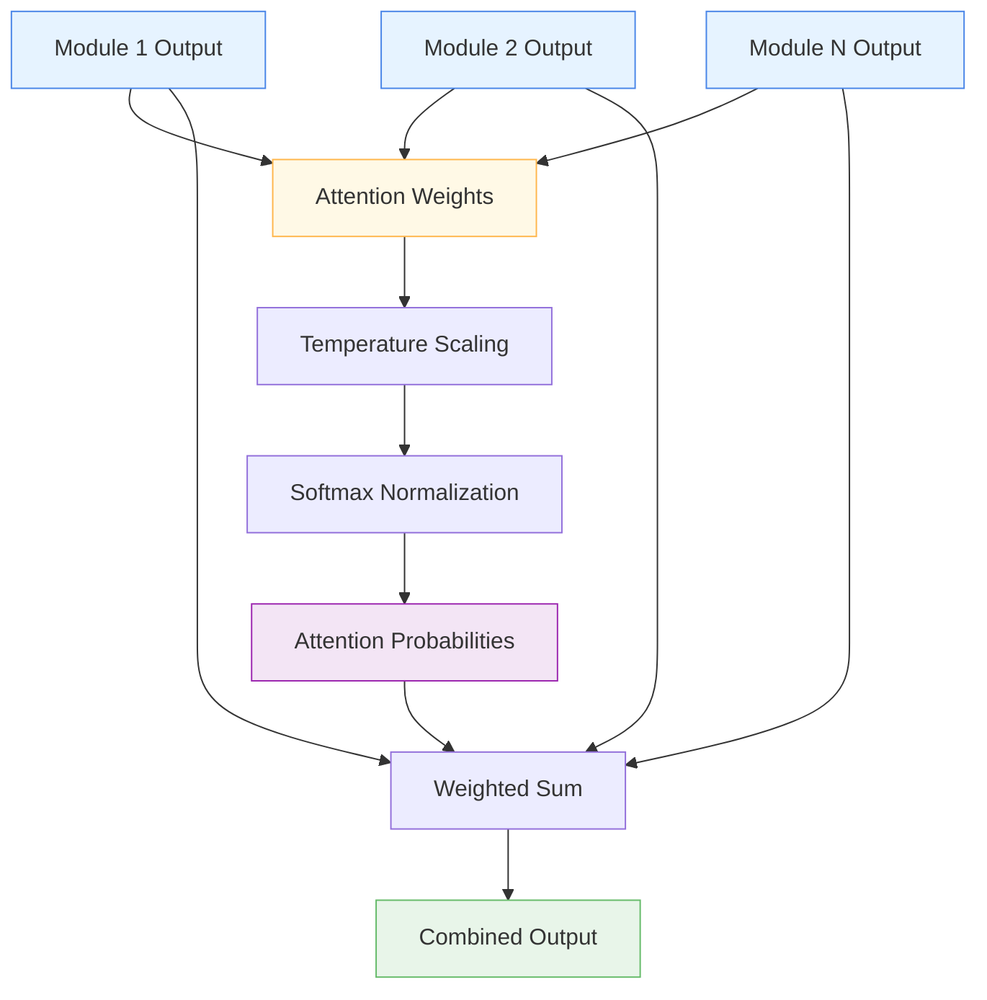

# 🎯 SparseAttentionWeighting

<div class="layer-hero">
  <div class="layer-hero-content">
    <h1>🎯 SparseAttentionWeighting</h1>
    <div class="layer-badges">
      <span class="badge badge-advanced">🔴 Advanced</span>
      <span class="badge badge-stable">✅ Stable</span>
      <span class="badge badge-popular">🔥 Popular</span>
    </div>
  </div>
</div>

## 🎯 Overview

The `SparseAttentionWeighting` layer implements a learnable attention mechanism that combines outputs from multiple modules using temperature-scaled attention weights. The attention weights are learned during training and can be made more or less sparse by adjusting the temperature parameter.

This layer is particularly powerful for ensemble learning, multi-branch architectures, and any scenario where you need to intelligently combine outputs from different processing modules.

## 🔍 How It Works

The SparseAttentionWeighting layer processes multiple module outputs through temperature-scaled attention:

1. **Module Weighting**: Learns importance weights for each input module
2. **Temperature Scaling**: Applies temperature scaling to control sparsity
3. **Softmax Normalization**: Converts weights to attention probabilities
4. **Weighted Combination**: Combines module outputs using attention weights
5. **Output Generation**: Produces final combined output



## 💡 Why Use This Layer?

| Challenge | Traditional Approach | SparseAttentionWeighting's Solution |
|-----------|---------------------|------------------------------------|
| **Module Combination** | Simple concatenation or averaging | 🎯 **Learned attention** weights for optimal combination |
| **Sparsity Control** | Fixed combination strategies | ⚡ **Temperature scaling** for controllable sparsity |
| **Ensemble Learning** | Uniform weighting of models | 🧠 **Adaptive weighting** based on module performance |
| **Multi-Branch Networks** | Manual branch combination | 🔗 **Automatic learning** of optimal combination weights |

## 📊 Use Cases

- **Ensemble Learning**: Combining multiple model outputs intelligently
- **Multi-Branch Architectures**: Weighting different processing branches
- **Attention Mechanisms**: Implementing sparse attention for efficiency
- **Module Selection**: Learning which modules are most important
- **Transfer Learning**: Combining pre-trained and fine-tuned features

## 🚀 Quick Start

### Basic Usage

```python
import keras
from kmr.layers import SparseAttentionWeighting

# Create sample module outputs
batch_size, feature_dim = 32, 64
module1 = keras.random.normal((batch_size, feature_dim))
module2 = keras.random.normal((batch_size, feature_dim))
module3 = keras.random.normal((batch_size, feature_dim))

# Apply sparse attention weighting
attention = SparseAttentionWeighting(
    num_modules=3,
    temperature=0.5  # Lower temperature for sharper attention
)
combined = attention([module1, module2, module3])

print(f"Input shapes: {[m.shape for m in [module1, module2, module3]]}")
print(f"Output shape: {combined.shape}")  # (32, 64)
```

### In a Sequential Model

```python
import keras
from kmr.layers import SparseAttentionWeighting

# Create multiple processing branches
inputs = keras.Input(shape=(20,))

# Branch 1: Linear processing
branch1 = keras.layers.Dense(32, activation='relu')(inputs)
branch1 = keras.layers.Dense(16, activation='relu')(branch1)

# Branch 2: Non-linear processing
branch2 = keras.layers.Dense(32, activation='tanh')(inputs)
branch2 = keras.layers.Dense(16, activation='tanh')(branch2)

# Branch 3: Residual processing
branch3 = keras.layers.Dense(32, activation='relu')(inputs)
branch3 = keras.layers.Dense(16, activation='relu')(branch3)
branch3 = keras.layers.Add()([branch3, inputs[:, :16]])

# Combine branches with sparse attention
combined = SparseAttentionWeighting(
    num_modules=3,
    temperature=0.7
)([branch1, branch2, branch3])

# Final processing
outputs = keras.layers.Dense(1, activation='sigmoid')(combined)

model = keras.Model(inputs, outputs)
```

### In a Functional Model

```python
import keras
from kmr.layers import SparseAttentionWeighting

# Define inputs
inputs = keras.Input(shape=(25,))  # 25 features

# Create multiple processing paths
path1 = keras.layers.Dense(64, activation='relu')(inputs)
path1 = keras.layers.Dropout(0.2)(path1)
path1 = keras.layers.Dense(32, activation='relu')(path1)

path2 = keras.layers.Dense(64, activation='tanh')(inputs)
path2 = keras.layers.BatchNormalization()(path2)
path2 = keras.layers.Dense(32, activation='tanh')(path2)

path3 = keras.layers.Dense(64, activation='swish')(inputs)
path3 = keras.layers.Dense(32, activation='swish')(path3)

# Combine paths with attention
x = SparseAttentionWeighting(
    num_modules=3,
    temperature=0.5
)([path1, path2, path3])

# Final layers
x = keras.layers.Dense(16, activation='relu')(x)
outputs = keras.layers.Dense(1, activation='sigmoid')(x)

model = keras.Model(inputs, outputs)
```

### Advanced Configuration

```python
# Advanced configuration with different temperature settings
def create_adaptive_model():
    inputs = keras.Input(shape=(30,))
    
    # Create multiple specialized branches
    branches = []
    for i in range(4):
        x = keras.layers.Dense(64, activation='relu')(inputs)
        x = keras.layers.Dropout(0.1 * (i + 1))(x)  # Different dropout rates
        x = keras.layers.Dense(32, activation='relu')(x)
        branches.append(x)
    
    # Combine with different temperature settings
    # Lower temperature = more sparse attention
    combined = SparseAttentionWeighting(
        num_modules=4,
        temperature=0.3  # Very sparse attention
    )(branches)
    
    # Multi-task output
    task1 = keras.layers.Dense(1, activation='sigmoid', name='binary')(combined)
    task2 = keras.layers.Dense(5, activation='softmax', name='multiclass')(combined)
    
    return keras.Model(inputs, [task1, task2])

model = create_adaptive_model()
model.compile(
    optimizer='adam',
    loss={'binary': 'binary_crossentropy', 'multiclass': 'categorical_crossentropy'},
    loss_weights={'binary': 1.0, 'multiclass': 0.5}
)
```

## 📖 API Reference

::: kmr.layers.SparseAttentionWeighting

## 🔧 Parameters Deep Dive

### `num_modules` (int)
- **Purpose**: Number of input modules whose outputs will be combined
- **Range**: 2 to 20+ (typically 2-8)
- **Impact**: Must match the number of input tensors
- **Recommendation**: Start with 2-4 modules, scale based on architecture complexity

### `temperature` (float)
- **Purpose**: Temperature parameter for softmax scaling
- **Range**: 0.1 to 10.0 (typically 0.3-2.0)
- **Impact**: Controls attention sparsity
- **Recommendation**: 
  - 0.1-0.5: Very sparse attention (focus on 1-2 modules)
  - 0.5-1.0: Moderate sparsity (balanced attention)
  - 1.0-2.0: More uniform attention (all modules contribute)

## 📈 Performance Characteristics

- **Speed**: ⚡⚡⚡⚡ Very fast - simple weighted combination
- **Memory**: 💾💾 Low memory usage - minimal additional parameters
- **Accuracy**: 🎯🎯🎯🎯 Excellent for ensemble and multi-branch architectures
- **Best For**: Multi-module architectures requiring intelligent combination

## 🎨 Examples

### Example 1: Ensemble Model Combination

```python
import keras
import numpy as np
from kmr.layers import SparseAttentionWeighting

# Create ensemble of different model types
def create_ensemble_model():
    inputs = keras.Input(shape=(20,))
    
    # Model 1: Linear model
    linear = keras.layers.Dense(32, activation='linear')(inputs)
    linear = keras.layers.Dense(16, activation='linear')(linear)
    
    # Model 2: Non-linear model
    nonlinear = keras.layers.Dense(32, activation='relu')(inputs)
    nonlinear = keras.layers.Dense(16, activation='relu')(nonlinear)
    
    # Model 3: Deep model
    deep = keras.layers.Dense(64, activation='relu')(inputs)
    deep = keras.layers.Dense(32, activation='relu')(deep)
    deep = keras.layers.Dense(16, activation='relu')(deep)
    
    # Combine with sparse attention
    ensemble_output = SparseAttentionWeighting(
        num_modules=3,
        temperature=0.4  # Sparse attention to focus on best models
    )([linear, nonlinear, deep])
    
    # Final prediction
    prediction = keras.layers.Dense(1, activation='sigmoid')(ensemble_output)
    
    return keras.Model(inputs, prediction)

model = create_ensemble_model()
model.compile(optimizer='adam', loss='binary_crossentropy')
```

### Example 2: Multi-Scale Feature Processing

```python
# Process features at different scales with attention weighting
def create_multi_scale_model():
    inputs = keras.Input(shape=(50,))
    
    # Different scale processing
    # Fine-grained features
    fine = keras.layers.Dense(128, activation='relu')(inputs)
    fine = keras.layers.Dense(64, activation='relu')(fine)
    fine = keras.layers.Dense(32, activation='relu')(fine)
    
    # Medium-grained features
    medium = keras.layers.Dense(64, activation='relu')(inputs)
    medium = keras.layers.Dense(32, activation='relu')(medium)
    
    # Coarse-grained features
    coarse = keras.layers.Dense(32, activation='relu')(inputs)
    
    # Combine with attention
    combined = SparseAttentionWeighting(
        num_modules=3,
        temperature=0.6
    )([fine, medium, coarse])
    
    # Multi-task output
    classification = keras.layers.Dense(3, activation='softmax', name='class')(combined)
    regression = keras.layers.Dense(1, name='reg')(combined)
    
    return keras.Model(inputs, [classification, regression])

model = create_multi_scale_model()
model.compile(
    optimizer='adam',
    loss={'class': 'categorical_crossentropy', 'reg': 'mse'},
    loss_weights={'class': 1.0, 'reg': 0.5}
)
```

### Example 3: Attention Analysis

```python
# Analyze attention patterns to understand module importance
def analyze_attention_patterns(model, test_data):
    """Analyze which modules are getting the most attention."""
    # Get the sparse attention weighting layer
    attention_layer = None
    for layer in model.layers:
        if isinstance(layer, SparseAttentionWeighting):
            attention_layer = layer
            break
    
    if attention_layer is None:
        print("No SparseAttentionWeighting layer found")
        return
    
    # Get attention weights
    weights = attention_layer.attention_weights
    
    # Apply temperature scaling and softmax (same as in the layer)
    scaled_weights = weights / attention_layer.temperature
    attention_probs = keras.ops.softmax(scaled_weights, axis=0)
    
    print("Module attention weights:")
    for i, prob in enumerate(attention_probs):
        print(f"Module {i+1}: {prob:.4f}")
    
    # Find most important module
    most_important = keras.ops.argmax(attention_probs)
    print(f"Most important module: {most_important + 1}")
    
    return attention_probs

# Use with your model
# attention_probs = analyze_attention_patterns(model, test_data)
```

## 💡 Tips & Best Practices

- **Temperature Tuning**: Start with 0.5-1.0, adjust based on desired sparsity
- **Module Diversity**: Ensure modules have different characteristics for effective combination
- **Weight Initialization**: Weights are initialized to ones (equal importance)
- **Gradient Flow**: Attention weights are learnable and differentiable
- **Monitoring**: Track attention patterns to understand module importance
- **Regularization**: Consider adding L1 regularization to encourage sparsity

## ⚠️ Common Pitfalls

- **Module Count**: Must match the number of input tensors exactly
- **Temperature Range**: Very low temperatures (<0.1) can cause numerical instability
- **Input Consistency**: All input tensors must have the same shape
- **Gradient Vanishing**: Very sparse attention can lead to gradient issues
- **Overfitting**: Too many modules without regularization can cause overfitting

## 🔗 Related Layers

- [GatedFeatureFusion](gated-feature-fusion.md) - Gated feature fusion mechanism
- [VariableSelection](variable-selection.md) - Dynamic feature selection
- [TabularAttention](tabular-attention.md) - General attention mechanisms
- [InterpretableMultiHeadAttention](interpretable-multi-head-attention.md) - Interpretable attention

## 📚 Further Reading

- [Attention Mechanisms in Deep Learning](https://distill.pub/2016/augmented-rnns/) - Understanding attention mechanisms
- [Ensemble Learning Methods](https://en.wikipedia.org/wiki/Ensemble_learning) - Ensemble learning concepts
- [Temperature Scaling in Neural Networks](https://arxiv.org/abs/1706.04599) - Temperature scaling techniques
- [KMR Layer Explorer](../layers-explorer.md) - Browse all available layers
- [Feature Engineering Tutorial](../tutorials/feature-engineering.md) - Complete guide to feature engineering
