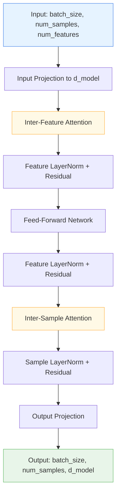

# 🧠 TabularAttention

<div class="layer-hero">
  <div class="layer-hero-content">
    <h1>🧠 TabularAttention</h1>
    <div class="layer-badges">
      <span class="badge badge-popular">🔥 Popular</span>
      <span class="badge badge-stable">✅ Stable</span>
      <span class="badge badge-intermediate">🟡 Intermediate</span>
    </div>
  </div>
</div>

## 🎯 Overview

The `TabularAttention` layer implements a sophisticated dual attention mechanism specifically designed for tabular data. Unlike traditional attention mechanisms that focus on sequential data, this layer captures both **inter-feature relationships** (how features interact within each sample) and **inter-sample relationships** (how samples relate to each other across features).

This layer is particularly powerful for tabular datasets where understanding feature interactions and sample similarities is crucial for making accurate predictions. It's especially useful in scenarios where you have complex feature dependencies that traditional neural networks struggle to capture.

## 🔍 How It Works

The TabularAttention layer processes tabular data through a two-stage attention mechanism:

1. **Inter-Feature Attention**: Analyzes relationships between different features within each sample
2. **Inter-Sample Attention**: Examines relationships between different samples across features



## 💡 Why Use This Layer?

| Challenge | Traditional Approach | TabularAttention's Solution |
|-----------|---------------------|----------------------------|
| **Feature Interactions** | Manual feature engineering or simple concatenation | 🧠 **Automatic discovery** of complex feature relationships through attention |
| **Sample Relationships** | Treating samples independently | 🔗 **Cross-sample learning** to identify similar patterns and outliers |
| **High-Dimensional Data** | Dimensionality reduction or feature selection | ⚡ **Efficient attention** that scales to high-dimensional tabular data |
| **Interpretability** | Black-box models with limited insights | 👁️ **Attention weights** provide insights into feature and sample importance |

## 📊 Use Cases

- **Financial Risk Assessment**: Understanding how different financial indicators interact and identifying similar risk profiles
- **Medical Diagnosis**: Capturing complex relationships between symptoms and patient characteristics
- **Recommendation Systems**: Learning user-item interactions and finding similar users/items
- **Anomaly Detection**: Identifying unusual patterns by comparing samples across features
- **Feature Engineering**: Automatically discovering meaningful feature combinations

## 🚀 Quick Start

### Basic Usage

```python
import keras
from kerasfactory.layers import TabularAttention

# Create sample tabular data
batch_size, num_samples, num_features = 32, 100, 20
x = keras.random.normal((batch_size, num_samples, num_features))

# Apply tabular attention
attention = TabularAttention(num_heads=8, d_model=64, dropout_rate=0.1)
output = attention(x)

print(f"Input shape: {x.shape}")   # (32, 100, 20)
print(f"Output shape: {output.shape}")  # (32, 100, 64)
```

### In a Sequential Model

```python
import keras
from kerasfactory.layers import TabularAttention

model = keras.Sequential([
    keras.layers.Dense(64, activation='relu'),
    TabularAttention(num_heads=4, d_model=64, dropout_rate=0.1),
    keras.layers.Dense(32, activation='relu'),
    keras.layers.Dense(1, activation='sigmoid')
])

model.compile(optimizer='adam', loss='binary_crossentropy', metrics=['accuracy'])
```

### In a Functional Model

```python
import keras
from kerasfactory.layers import TabularAttention

# Define inputs
inputs = keras.Input(shape=(100, 20))  # 100 samples, 20 features

# Apply attention
x = TabularAttention(num_heads=8, d_model=128, dropout_rate=0.1)(inputs)

# Add more processing
x = keras.layers.Dense(64, activation='relu')(x)
x = keras.layers.Dropout(0.2)(x)
outputs = keras.layers.Dense(1, activation='sigmoid')(x)

# Create model
model = keras.Model(inputs, outputs)
```

### Advanced Configuration

```python
# Advanced configuration with custom parameters
attention = TabularAttention(
    num_heads=16,           # More attention heads for complex patterns
    d_model=256,            # Higher dimensionality for rich representations
    dropout_rate=0.2,       # Higher dropout for regularization
    name="advanced_attention"
)

# Use in a complex model
inputs = keras.Input(shape=(50, 30))
x = keras.layers.Dense(256)(inputs)
x = attention(x)
x = keras.layers.LayerNormalization()(x)
x = keras.layers.Dense(128, activation='relu')(x)
outputs = keras.layers.Dense(10, activation='softmax')(x)

model = keras.Model(inputs, outputs)
```

## 📖 API Reference

::: kerasfactory.layers.TabularAttention

## 🔧 Parameters Deep Dive

### `num_heads` (int)
- **Purpose**: Number of attention heads for parallel processing
- **Range**: 1 to 64+ (typically 4, 8, or 16)
- **Impact**: More heads = better pattern recognition but higher computational cost
- **Recommendation**: Start with 8, increase if you have complex feature interactions

### `d_model` (int)
- **Purpose**: Dimensionality of the attention model
- **Range**: 32 to 512+ (must be divisible by num_heads)
- **Impact**: Higher values = richer representations but more parameters
- **Recommendation**: Start with 64-128, scale based on your data complexity

### `dropout_rate` (float)
- **Purpose**: Regularization to prevent overfitting
- **Range**: 0.0 to 0.9
- **Impact**: Higher values = more regularization but potentially less learning
- **Recommendation**: Start with 0.1, increase if overfitting occurs

## 📈 Performance Characteristics

- **Speed**: ⚡⚡⚡ Fast for small to medium datasets, scales well with parallel processing
- **Memory**: 💾💾💾 Moderate memory usage due to attention computations
- **Accuracy**: 🎯🎯🎯🎯 Excellent for complex tabular data with feature interactions
- **Best For**: Tabular data with complex feature relationships and sample similarities

## 🎨 Examples

### Example 1: Customer Segmentation

```python
import keras
import numpy as np
from kerasfactory.layers import TabularAttention

# Simulate customer data: age, income, spending, credit_score, etc.
num_customers, num_features = 1000, 15
customer_data = keras.random.normal((32, num_customers, num_features))

# Build segmentation model
inputs = keras.Input(shape=(num_customers, num_features))
x = TabularAttention(num_heads=8, d_model=64)(inputs)
x = keras.layers.GlobalAveragePooling1D()(x)  # Pool across samples
x = keras.layers.Dense(32, activation='relu')(x)
segments = keras.layers.Dense(5, activation='softmax')(x)  # 5 customer segments

model = keras.Model(inputs, segments)
model.compile(optimizer='adam', loss='categorical_crossentropy')
```

### Example 2: Time Series Forecasting

```python
# For time series data where each sample is a time point
time_steps, features = 30, 10
ts_data = keras.random.normal((32, time_steps, features))

# Build forecasting model
inputs = keras.Input(shape=(time_steps, features))
x = TabularAttention(num_heads=4, d_model=32)(inputs)
x = keras.layers.Dense(16, activation='relu')(x)
forecast = keras.layers.Dense(1)(x)  # Predict next value

model = keras.Model(inputs, forecast)
model.compile(optimizer='adam', loss='mse')
```

### Example 3: Multi-Task Learning

```python
# Shared attention for multiple related tasks
inputs = keras.Input(shape=(100, 20))

# Shared attention layer
shared_attention = TabularAttention(num_heads=8, d_model=128)
x = shared_attention(inputs)

# Task-specific heads
task1_output = keras.layers.Dense(1, activation='sigmoid', name='classification')(x)
task2_output = keras.layers.Dense(1, name='regression')(x)

model = keras.Model(inputs, [task1_output, task2_output])
model.compile(
    optimizer='adam',
    loss={'classification': 'binary_crossentropy', 'regression': 'mse'},
    loss_weights={'classification': 1.0, 'regression': 0.5}
)
```

## 💡 Tips & Best Practices

- **Start Simple**: Begin with 4-8 attention heads and d_model=64, then scale up
- **Data Preprocessing**: Ensure your tabular data is properly normalized before applying attention
- **Batch Size**: Use larger batch sizes (32+) for better attention learning
- **Layer Order**: Place TabularAttention after initial feature processing but before final predictions
- **Regularization**: Use dropout and layer normalization to prevent overfitting
- **Monitoring**: Watch attention weights to understand what the model is learning

## ⚠️ Common Pitfalls

- **Memory Issues**: Large d_model values can cause memory problems - start smaller
- **Overfitting**: Too many heads or too high d_model can lead to overfitting on small datasets
- **Input Shape**: Ensure input is 3D: (batch_size, num_samples, num_features)
- **Divisibility**: d_model must be divisible by num_heads
- **Gradient Issues**: Use gradient clipping if training becomes unstable

## 🔗 Related Layers

- [MultiResolutionTabularAttention](multi-resolution-tabular-attention.md) - Multi-scale attention for different feature granularities
- [ColumnAttention](column-attention.md) - Focused column-wise attention mechanism
- [RowAttention](row-attention.md) - Specialized row-wise attention for sample relationships
- [VariableSelection](variable-selection.md) - Feature selection that works well with attention layers

## 📚 Further Reading

- [Attention Is All You Need](https://arxiv.org/abs/1706.03762) - Original Transformer paper
- [TabNet: Attentive Interpretable Tabular Learning](https://arxiv.org/abs/1908.07442) - Tabular-specific attention mechanisms
- [KerasFactory Layer Explorer](../layers_overview.md) - Browse all available layers
- [Tabular Data Tutorial](../tutorials/feature-engineering.md) - Complete guide to tabular modeling
