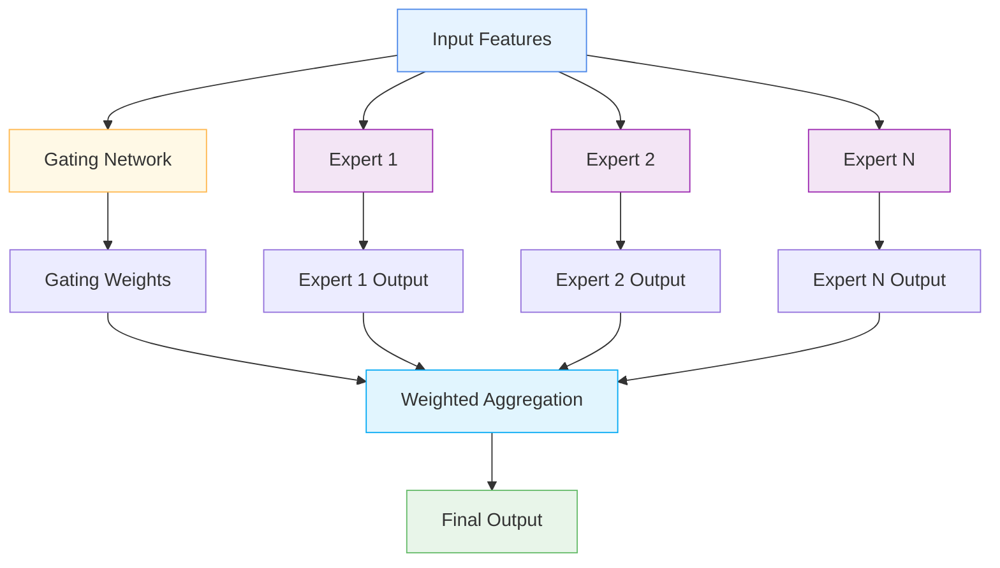

# 🎯 TabularMoELayer

<div class="layer-hero">
  <div class="layer-hero-content">
    <h1>🎯 TabularMoELayer</h1>
    <div class="layer-badges">
      <span class="badge badge-advanced">🔴 Advanced</span>
      <span class="badge badge-stable">✅ Stable</span>
      <span class="badge badge-popular">🔥 Popular</span>
    </div>
  </div>
</div>

## 🎯 Overview

The `TabularMoELayer` implements a Mixture-of-Experts (MoE) architecture for tabular data, routing input features through multiple expert sub-networks and aggregating their outputs via a learnable gating mechanism. Each expert is a small MLP that can specialize in different feature patterns.

This layer is particularly powerful for tabular data where different experts can specialize in different feature patterns, making it ideal for complex datasets with diverse feature types and interactions.

## 🔍 How It Works

The TabularMoELayer processes data through a mixture-of-experts architecture:

1. **Expert Networks**: Creates multiple expert MLPs for different feature patterns
2. **Gating Mechanism**: Learns to weight expert contributions based on input
3. **Expert Processing**: Each expert processes the input independently
4. **Weighted Aggregation**: Combines expert outputs using learned weights
5. **Output Generation**: Produces final aggregated output



## 💡 Why Use This Layer?

| Challenge | Traditional Approach | TabularMoELayer's Solution |
|-----------|---------------------|---------------------------|
| **Feature Diversity** | Single model for all features | 🎯 **Multiple experts** specialize in different patterns |
| **Complex Patterns** | Limited pattern recognition | ⚡ **Specialized experts** for different feature types |
| **Ensemble Learning** | Separate ensemble models | 🧠 **Integrated ensemble** with learned weighting |
| **Scalability** | Fixed model capacity | 🔗 **Scalable capacity** with more experts |

## 📊 Use Cases

- **Complex Tabular Data**: Datasets with diverse feature types
- **Feature Specialization**: Different experts for different feature patterns
- **Ensemble Learning**: Integrated ensemble with learned weighting
- **Scalable Models**: Models that can scale with more experts
- **Pattern Recognition**: Complex pattern recognition in tabular data

## 🚀 Quick Start

### Basic Usage

```python
import keras
from kmr.layers import TabularMoELayer

# Create sample input data
batch_size, num_features = 32, 8
x = keras.random.normal((batch_size, num_features))

# Apply mixture of experts
moe_layer = TabularMoELayer(num_experts=4, expert_units=16)
output = moe_layer(x)

print(f"Input shape: {x.shape}")           # (32, 8)
print(f"Output shape: {output.shape}")     # (32, 8)
```

### In a Sequential Model

```python
import keras
from kmr.layers import TabularMoELayer

model = keras.Sequential([
    keras.layers.Dense(32, activation='relu'),
    TabularMoELayer(num_experts=4, expert_units=16),
    keras.layers.Dense(16, activation='relu'),
    TabularMoELayer(num_experts=2, expert_units=8),
    keras.layers.Dense(1, activation='sigmoid')
])

model.compile(optimizer='adam', loss='binary_crossentropy', metrics=['accuracy'])
```

### In a Functional Model

```python
import keras
from kmr.layers import TabularMoELayer

# Define inputs
inputs = keras.Input(shape=(20,))  # 20 features

# Apply mixture of experts
x = TabularMoELayer(num_experts=4, expert_units=16)(inputs)

# Continue processing
x = keras.layers.Dense(32, activation='relu')(x)
x = TabularMoELayer(num_experts=2, expert_units=16)(x)
x = keras.layers.Dense(16, activation='relu')(x)
outputs = keras.layers.Dense(1, activation='sigmoid')(x)

model = keras.Model(inputs, outputs)
```

### Advanced Configuration

```python
# Advanced configuration with multiple MoE layers
def create_moe_network():
    inputs = keras.Input(shape=(30,))
    
    # Multiple MoE layers with different configurations
    x = TabularMoELayer(num_experts=6, expert_units=32)(inputs)
    x = keras.layers.Dense(64, activation='relu')(x)
    x = TabularMoELayer(num_experts=4, expert_units=32)(x)
    x = keras.layers.Dense(32, activation='relu')(x)
    x = TabularMoELayer(num_experts=2, expert_units=16)(x)
    
    # Final processing
    x = keras.layers.Dense(16, activation='relu')(x)
    x = keras.layers.Dropout(0.2)(x)
    
    # Multi-task output
    classification = keras.layers.Dense(3, activation='softmax', name='classification')(x)
    regression = keras.layers.Dense(1, name='regression')(x)
    
    return keras.Model(inputs, [classification, regression])

model = create_moe_network()
model.compile(
    optimizer='adam',
    loss={'classification': 'categorical_crossentropy', 'regression': 'mse'},
    loss_weights={'classification': 1.0, 'regression': 0.5}
)
```

## 📖 API Reference

::: kmr.layers.TabularMoELayer

## 🔧 Parameters Deep Dive

### `num_experts` (int)
- **Purpose**: Number of expert networks
- **Range**: 2 to 20+ (typically 4-8)
- **Impact**: More experts = more specialization but more parameters
- **Recommendation**: Start with 4-6, scale based on data complexity

### `expert_units` (int)
- **Purpose**: Number of hidden units in each expert network
- **Range**: 8 to 128+ (typically 16-64)
- **Impact**: Larger values = more complex expert transformations
- **Recommendation**: Start with 16-32, scale based on data complexity

## 📈 Performance Characteristics

- **Speed**: ⚡⚡⚡ Fast for small to medium models, scales with experts
- **Memory**: 💾💾💾 Moderate memory usage due to multiple experts
- **Accuracy**: 🎯🎯🎯🎯 Excellent for complex pattern recognition
- **Best For**: Tabular data with diverse feature patterns

## 🎨 Examples

### Example 1: Feature Specialization

```python
import keras
import numpy as np
from kmr.layers import TabularMoELayer

# Create a MoE model for feature specialization
def create_feature_specialized_moe():
    inputs = keras.Input(shape=(25,))  # 25 features
    
    # MoE layer with multiple experts
    x = TabularMoELayer(num_experts=6, expert_units=32)(inputs)
    
    # Process expert outputs
    x = keras.layers.Dense(64, activation='relu')(x)
    x = keras.layers.BatchNormalization()(x)
    x = keras.layers.Dropout(0.2)(x)
    
    # Another MoE layer
    x = TabularMoELayer(num_experts=4, expert_units=32)(x)
    
    # Final processing
    x = keras.layers.Dense(32, activation='relu')(x)
    x = keras.layers.Dropout(0.1)(x)
    
    # Output
    outputs = keras.layers.Dense(1, activation='sigmoid')(x)
    
    return keras.Model(inputs, outputs)

model = create_feature_specialized_moe()
model.compile(optimizer='adam', loss='binary_crossentropy')

# Test with sample data
sample_data = keras.random.normal((100, 25))
predictions = model(sample_data)
print(f"Feature specialized MoE predictions shape: {predictions.shape}")
```

### Example 2: Expert Analysis

```python
# Analyze expert usage patterns
def analyze_expert_usage():
    # Create model with MoE
    inputs = keras.Input(shape=(15,))
    x = TabularMoELayer(num_experts=4, expert_units=16)(inputs)
    outputs = keras.layers.Dense(1, activation='sigmoid')(x)
    
    model = keras.Model(inputs, outputs)
    
    # Test with different input patterns
    test_inputs = [
        keras.random.normal((10, 15)),  # Random data
        keras.random.normal((10, 15)) * 2,  # Scaled data
        keras.random.normal((10, 15)) + 1,  # Shifted data
    ]
    
    print("Expert Usage Analysis:")
    print("=" * 40)
    
    for i, test_input in enumerate(test_inputs):
        prediction = model(test_input)
        print(f"Test {i+1}: Prediction mean = {keras.ops.mean(prediction):.4f}")
    
    return model

# Analyze expert usage
# model = analyze_expert_usage()
```

### Example 3: Scalable MoE Architecture

```python
# Create a scalable MoE architecture
def create_scalable_moe_architecture():
    inputs = keras.Input(shape=(40,))
    
    # Progressive MoE layers with increasing specialization
    x = TabularMoELayer(num_experts=8, expert_units=32)(inputs)
    x = keras.layers.Dense(64, activation='relu')(x)
    x = keras.layers.BatchNormalization()(x)
    
    x = TabularMoELayer(num_experts=6, expert_units=32)(x)
    x = keras.layers.Dense(48, activation='relu')(x)
    x = keras.layers.Dropout(0.2)(x)
    
    x = TabularMoELayer(num_experts=4, expert_units=24)(x)
    x = keras.layers.Dense(32, activation='relu')(x)
    x = keras.layers.Dropout(0.1)(x)
    
    x = TabularMoELayer(num_experts=2, expert_units=16)(x)
    x = keras.layers.Dense(16, activation='relu')(x)
    
    # Multi-task output
    classification = keras.layers.Dense(5, activation='softmax', name='classification')(x)
    regression = keras.layers.Dense(1, name='regression')(x)
    anomaly = keras.layers.Dense(1, activation='sigmoid', name='anomaly')(x)
    
    return keras.Model(inputs, [classification, regression, anomaly])

model = create_scalable_moe_architecture()
model.compile(
    optimizer='adam',
    loss={'classification': 'categorical_crossentropy', 'regression': 'mse', 'anomaly': 'binary_crossentropy'},
    loss_weights={'classification': 1.0, 'regression': 0.5, 'anomaly': 0.3}
)
```

## 💡 Tips & Best Practices

- **Number of Experts**: Start with 4-6 experts, scale based on data complexity
- **Expert Units**: Use 16-32 units per expert for most applications
- **Gating Mechanism**: The layer automatically learns expert weighting
- **Specialization**: Different experts will specialize in different patterns
- **Scalability**: Can scale by adding more experts
- **Regularization**: Consider adding dropout between MoE layers

## ⚠️ Common Pitfalls

- **Number of Experts**: Must be positive integer
- **Expert Units**: Must be positive integer
- **Memory Usage**: Scales with number of experts and units
- **Overfitting**: Can overfit with too many experts on small datasets
- **Expert Utilization**: Some experts may not be used effectively

## 🔗 Related Layers

- [SparseAttentionWeighting](sparse-attention-weighting.md) - Sparse attention weighting
- [GatedFeatureFusion](gated-feature-fusion.md) - Gated feature fusion
- [VariableSelection](variable-selection.md) - Variable selection
- [TransformerBlock](transformer-block.md) - Transformer processing

## 📚 Further Reading

- [Mixture of Experts](https://en.wikipedia.org/wiki/Mixture_of_experts) - MoE concepts
- [Gating Networks](https://arxiv.org/abs/1701.06538) - Gating mechanism paper
- [Ensemble Learning](https://en.wikipedia.org/wiki/Ensemble_learning) - Ensemble learning concepts
- [KMR Layer Explorer](../layers_overview.md) - Browse all available layers
- [Feature Engineering Tutorial](../tutorials/feature-engineering.md) - Complete guide to feature engineering
