# ⏱️ TemporalMixing

<div class="layer-hero">
  <div class="layer-hero-content">
    <h1>⏱️ TemporalMixing</h1>
    <div class="layer-badges">
      <span class="badge badge-intermediate">🟡 Intermediate</span>
      <span class="badge badge-stable">✅ Stable</span>
      <span class="badge badge-timeseries">⏱️ Time Series</span>
    </div>
  </div>
</div>

## 🎯 Overview

The `TemporalMixing` layer is a core component of the TSMixer architecture that applies MLP-based transformations across the time dimension. It mixes temporal information while preserving the multivariate structure through batch normalization and linear projections. The layer uses residual connections to enable training of deep architectures.

This layer is particularly effective for capturing temporal dependencies and patterns in multivariate time series forecasting tasks where you need to learn complex temporal interactions.

## 🔍 How It Works

The TemporalMixing layer processes data through:

1. **Transpose**: Converts input from (batch, time, features) to (batch, features, time)
2. **Flatten**: Reshapes to (batch, features × time) for batch normalization
3. **Batch Normalization**: Normalizes across feature-time dimensions (epsilon=0.001, momentum=0.01)
4. **Reshape**: Restores to (batch, features, time)
5. **Linear Transformation**: Learnable dense layer across time dimension
6. **ReLU Activation**: Non-linear activation function
7. **Transpose Back**: Converts back to (batch, time, features)
8. **Dropout**: Stochastic regularization during training
9. **Residual Connection**: Adds input to output for improved gradient flow

```mermaid
graph TD
    A["Input<br/>(batch, time, features)"] --> B["Transpose<br/>→ (batch, features, time)"]
    B --> C["Reshape<br/>→ (batch, feat×time)"]
    C --> D["Batch Norm<br/>ε=0.001, m=0.01"]
    D --> E["Reshape<br/>→ (batch, feat, time)"]
    E --> F["Dense Layer<br/>output_size=time"]
    F --> G["ReLU Activation"]
    G --> H["Transpose<br/>→ (batch, time, feat)"]
    H --> I["Dropout<br/>rate=dropout"]
    I --> J["Residual Connection<br/>output + input"]
    J --> K["Output<br/>(batch, time, features)"]
    
    style A fill:#e6f3ff,stroke:#4a86e8
    style K fill:#e8f5e9,stroke:#66bb6a
    style D fill:#fff9e6,stroke:#ffb74d
    style J fill:#f3e5f5,stroke:#9c27b0
```



## 💡 Why Use This Layer?

| Challenge | Traditional Approach | TemporalMixing Solution |
|-----------|---------------------|-------------------------|
| **Temporal Dependencies** | Fixed pattern matching | 🎯 **Learnable** temporal projections |
| **Multivariate Learning** | Treats features independently | 🔗 **Joint** temporal-feature optimization |
| **Deep Models** | Vanishing gradients | ✨ **Residual connections** stabilize training |
| **Regularization** | Manual dropout insertion | 🎲 **Integrated** dropout in mixing |

## 📊 Use Cases

- **Multivariate Time Series Forecasting**: When multiple related time series have temporal dependencies
- **Temporal Pattern Learning**: For complex temporal patterns requiring non-linear transformations
- **Deep Models**: As a building block in stacked TSMixer architectures
- **Dropout Regularization**: When training data is limited and overfitting is a concern
- **Feature Interaction**: When temporal relationships between time steps are critical

## 🚀 Quick Start

### Basic Usage

```python
import keras
from kerasfactory.layers import TemporalMixing

# Create sample multivariate time series
batch_size, time_steps, features = 32, 96, 7
x = keras.random.normal((batch_size, time_steps, features))

# Apply temporal mixing
layer = TemporalMixing(n_series=features, input_size=time_steps, dropout=0.1)
output = layer(x, training=True)

print(f"Input shape:  {x.shape}")        # (32, 96, 7)
print(f"Output shape: {output.shape}")   # (32, 96, 7)
```

### In TSMixer Model

```python
from kerasfactory.layers import TemporalMixing, FeatureMixing, MixingLayer
import keras

# TemporalMixing is used inside MixingLayer
mixing_layer = MixingLayer(
    n_series=7,
    input_size=96,
    dropout=0.1,
    ff_dim=64
)

# MixingLayer internally uses TemporalMixing first, then FeatureMixing
x = keras.random.normal((32, 96, 7))
output = mixing_layer(x)
```

## 🎓 Advanced Usage

### Training vs Inference

```python
import tensorflow as tf

layer = TemporalMixing(n_series=7, input_size=96, dropout=0.2)
x = keras.random.normal((32, 96, 7))

# Training mode: dropout is active
output_train1 = layer(x, training=True)
output_train2 = layer(x, training=True)
# Outputs differ due to stochastic dropout

# Inference mode: dropout disabled
output_infer1 = layer(x, training=False)
output_infer2 = layer(x, training=False)
# Outputs are identical
```

### Stacking Multiple Layers

```python
# Create stacked temporal mixing
layers = [
    TemporalMixing(n_series=7, input_size=96, dropout=0.1)
    for _ in range(3)
]

x = keras.random.normal((32, 96, 7))
for layer in layers:
    x = layer(x, training=True)

print(f"Output after stacking: {x.shape}")  # (32, 96, 7)
```

### Serialization

```python
# Get configuration
layer = TemporalMixing(n_series=7, input_size=96, dropout=0.1)
config = layer.get_config()
print(config)

# Recreate from configuration
new_layer = TemporalMixing.from_config(config)

# Verify parameters match
assert new_layer.n_series == layer.n_series
assert new_layer.input_size == layer.input_size
assert new_layer.dropout_rate == layer.dropout_rate
```

## 📈 Performance Characteristics

| Aspect | Value | Notes |
|--------|-------|-------|
| **Time Complexity** | O(B × T × D²) | B=batch, T=time, D=features |
| **Space Complexity** | O(B × T × D) | Residual connection overhead is minimal |
| **Gradient Flow** | ✅ Excellent | Residual connections prevent vanishing gradients |
| **Trainability** | ⭐⭐⭐⭐⭐ | Very stable with batch normalization |

## 🔧 Parameter Guide

| Parameter | Type | Range | Impact |
|-----------|------|-------|--------|
| **n_series** | int | > 0 | Number of multivariate features/channels |
| **input_size** | int | > 0 | Temporal sequence length |
| **dropout** | float | [0, 1] | Higher values = more regularization |

### Tuning Recommendations

- **Small datasets**: Use dropout ≥ 0.2 to prevent overfitting
- **Deep models**: Use lower dropout (0.05-0.1) to maintain information flow
- **Limited features**: Increase n_series impact through feature expansion layers
- **Long sequences**: Consider computational cost for large input_size

## 🧪 Testing & Validation

### Unit Tests

```python
import tensorflow as tf
from kerasfactory.layers import TemporalMixing

# Test 1: Output shape preservation
layer = TemporalMixing(n_series=7, input_size=96, dropout=0.1)
x = tf.random.normal((32, 96, 7))
output = layer(x)
assert output.shape == x.shape, "Shape mismatch!"

# Test 2: Dropout effect
output1 = layer(x, training=True)
output2 = layer(x, training=True)
diff = tf.reduce_mean(tf.abs(output1 - output2))
assert diff > 0, "Dropout not working!"

# Test 3: Inference determinism
output1 = layer(x, training=False)
output2 = layer(x, training=False)
tf.debugging.assert_near(output1, output2)
```

## ⚠️ Common Issues & Solutions

| Issue | Cause | Solution |
|-------|-------|----------|
| **NaN values in output** | Unstable batch norm or extreme inputs | Normalize inputs to [-1, 1] range |
| **Slow gradient updates** | Batch norm momentum too high | Use default momentum=0.01 |
| **Poor performance** | Dropout too high | Reduce dropout rate to 0.05-0.1 |
| **Memory overflow** | Large input_size with many features | Use smaller batch sizes |

## 📚 Related Layers

- **FeatureMixing**: Complements TemporalMixing by mixing across feature dimension
- **MixingLayer**: Combines TemporalMixing + FeatureMixing sequentially
- **MovingAverage**: Alternative temporal processing via trend extraction
- **ReversibleInstanceNorm**: Normalization layer often paired with TSMixer

## 🔗 Integration with TSMixer

The TemporalMixing layer is the temporal component of MixingLayer, which is the building block of TSMixer:

```
TSMixer Model
    ↓
[ReversibleInstanceNorm] → normalize input
    ↓
[MixingLayer] × n_blocks (temporal + feature mixing)
    ↓
[Dense] → project time dimension
    ↓
[ReversibleInstanceNorm] → denormalize output
    ↓
Output
```

## 📖 References

- Chen, Si-An, et al. (2023). "TSMixer: An All-MLP Architecture for Time Series Forecasting." arXiv:2303.06053
- Batch Normalization: Ioffe & Szegedy (2015). "Batch Normalization: Accelerating Deep Network Training"
- Residual Networks: He, K., et al. (2015). "Deep Residual Learning for Image Recognition"

## 💻 Implementation Details

- **Backend**: Pure Keras 3 with ops module
- **Computation**: CPU/GPU optimized through backend
- **Memory**: Efficient streaming with residual connections
- **Serialization**: Full support for model.save() and weights export
