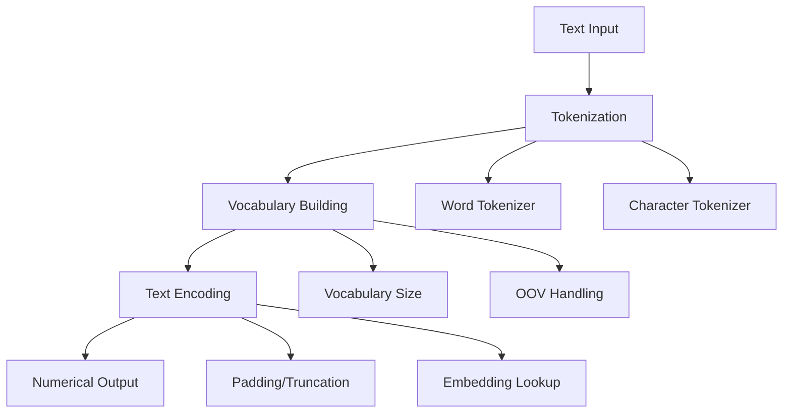

# 📝 TextPreprocessingLayer

Process and preprocess text features in tabular data with advanced tokenization and encoding capabilities.

## 🎯 Overview

The `TextPreprocessingLayer` provides comprehensive text preprocessing functionality for tabular data, including tokenization, vocabulary building, and text encoding. This layer is essential when your tabular dataset contains text features that need to be converted into numerical representations.

## 🏗️ Architecture



## 🚀 Quick Start

### Basic Usage

```python
import keras
import numpy as np
from kmr.layers import TextPreprocessingLayer

# Create sample text data
text_data = [
    "This is a sample text",
    "Another example sentence",
    "Text preprocessing layer"
]

# Create the layer
text_preprocessor = TextPreprocessingLayer(
    max_length=100,
    vocab_size=10000,
    tokenizer='word'
)

# Process text
processed_text = text_preprocessor(text_data)
print("Processed text shape:", processed_text.shape)
```

### Integration in Model

```python
def create_text_model(vocab_size, max_length, num_classes):
    """Create a model with text preprocessing."""
    
    # Input for text
    text_input = keras.Input(shape=(max_length,), dtype='string')
    
    # Text preprocessing
    x = TextPreprocessingLayer(
        max_length=max_length,
        vocab_size=vocab_size,
        tokenizer='word'
    )(text_input)
    
    # Additional processing
    x = keras.layers.Dense(128, activation='relu')(x)
    x = keras.layers.Dropout(0.2)(x)
    
    # Output
    outputs = keras.layers.Dense(num_classes, activation='softmax')(x)
    
    return keras.Model(text_input, outputs)

# Usage
model = create_text_model(vocab_size=10000, max_length=100, num_classes=3)
```

## ⚙️ Parameters

| Parameter | Type | Default | Description |
|-----------|------|---------|-------------|
| `max_length` | int | 100 | Maximum length of processed text sequences |
| `vocab_size` | int | 10000 | Size of vocabulary for tokenization |
| `tokenizer` | str | 'word' | Type of tokenizer ('word' or 'char') |
| `padding` | str | 'post' | Padding strategy ('pre' or 'post') |
| `truncation` | str | 'post' | Truncation strategy ('pre' or 'post') |
| `oov_token` | str | '<OOV>' | Token for out-of-vocabulary words |

## 🔧 Advanced Usage

### Custom Tokenization

```python
# Word-level tokenization
word_preprocessor = TextPreprocessingLayer(
    max_length=50,
    vocab_size=5000,
    tokenizer='word',
    padding='post',
    truncation='post'
)

# Character-level tokenization
char_preprocessor = TextPreprocessingLayer(
    max_length=200,
    vocab_size=256,
    tokenizer='char',
    padding='post',
    truncation='post'
)
```

### Text Feature Integration

```python
def create_mixed_model(text_vocab_size, text_max_length, num_features, num_classes):
    """Create a model with both text and numerical features."""
    
    # Text input
    text_input = keras.Input(shape=(text_max_length,), dtype='string')
    
    # Numerical input
    numerical_input = keras.Input(shape=(num_features,))
    
    # Process text
    text_processed = TextPreprocessingLayer(
        max_length=text_max_length,
        vocab_size=text_vocab_size,
        tokenizer='word'
    )(text_input)
    
    # Process numerical features
    numerical_processed = keras.layers.Dense(64, activation='relu')(numerical_input)
    
    # Combine features
    combined = keras.layers.Concatenate()([text_processed, numerical_processed])
    
    # Final processing
    x = keras.layers.Dense(128, activation='relu')(combined)
    x = keras.layers.Dropout(0.2)(x)
    
    # Output
    outputs = keras.layers.Dense(num_classes, activation='softmax')(x)
    
    return keras.Model([text_input, numerical_input], outputs)

# Usage
model = create_mixed_model(
    text_vocab_size=10000,
    text_max_length=100,
    num_features=20,
    num_classes=3
)
```

## 📊 Use Cases

### 1. **Customer Reviews Analysis**
```python
# Process customer reviews
reviews = [
    "Great product, highly recommended!",
    "Poor quality, would not buy again",
    "Average product, nothing special"
]

preprocessor = TextPreprocessingLayer(
    max_length=50,
    vocab_size=5000,
    tokenizer='word'
)

processed_reviews = preprocessor(reviews)
```

### 2. **Product Descriptions**
```python
# Process product descriptions
descriptions = [
    "High-quality wireless headphones with noise cancellation",
    "Durable laptop bag with multiple compartments",
    "Organic cotton t-shirt in various sizes"
]

preprocessor = TextPreprocessingLayer(
    max_length=30,
    vocab_size=3000,
    tokenizer='word'
)

processed_descriptions = preprocessor(descriptions)
```

### 3. **Social Media Text**
```python
# Process social media posts
posts = [
    "Just had an amazing dinner at the new restaurant!",
    "Traffic is terrible today #commute",
    "Looking forward to the weekend!"
]

preprocessor = TextPreprocessingLayer(
    max_length=40,
    vocab_size=8000,
    tokenizer='word'
)

processed_posts = preprocessor(posts)
```

## 🎯 Performance Characteristics

| Aspect | Performance |
|--------|-------------|
| **Speed** | ⚡ Fast - Optimized tokenization |
| **Memory** | 💾 Moderate - Depends on vocab size |
| **Accuracy** | 🎯 High - Preserves text semantics |
| **Scalability** | 📈 Good - Handles large vocabularies |

## 🔍 Best Practices

### 1. **Vocabulary Size Selection**
```python
# For small datasets
small_vocab = TextPreprocessingLayer(vocab_size=1000)

# For large datasets
large_vocab = TextPreprocessingLayer(vocab_size=50000)
```

### 2. **Sequence Length Optimization**
```python
# Analyze your text lengths first
text_lengths = [len(text.split()) for text in your_texts]
max_length = int(np.percentile(text_lengths, 95))  # Use 95th percentile

preprocessor = TextPreprocessingLayer(max_length=max_length)
```

### 3. **Tokenizer Selection**
```python
# Word tokenizer - better for most cases
word_tokenizer = TextPreprocessingLayer(tokenizer='word')

# Character tokenizer - for morphologically rich languages
char_tokenizer = TextPreprocessingLayer(tokenizer='char')
```

## 🚨 Common Pitfalls

### 1. **Vocabulary Size Too Small**
```python
# ❌ Too small - loses information
small_vocab = TextPreprocessingLayer(vocab_size=100)

# ✅ Appropriate size
good_vocab = TextPreprocessingLayer(vocab_size=10000)
```

### 2. **Sequence Length Too Short**
```python
# ❌ Too short - truncates important information
short_seq = TextPreprocessingLayer(max_length=10)

# ✅ Appropriate length
good_seq = TextPreprocessingLayer(max_length=100)
```

### 3. **Inconsistent Preprocessing**
```python
# ❌ Different preprocessing for train/test
train_preprocessor = TextPreprocessingLayer(vocab_size=5000)
test_preprocessor = TextPreprocessingLayer(vocab_size=10000)

# ✅ Consistent preprocessing
preprocessor = TextPreprocessingLayer(vocab_size=10000)
```

## 🔗 Related Layers

- **[AdvancedNumericalEmbedding](advanced-numerical-embedding.md)** - For numerical feature embedding
- **[VariableSelection](variable-selection.md)** - For feature selection
- **[GatedFeatureFusion](gated-feature-fusion.md)** - For combining text and numerical features

## 📚 API Reference

::: kmr.layers.TextPreprocessingLayer
