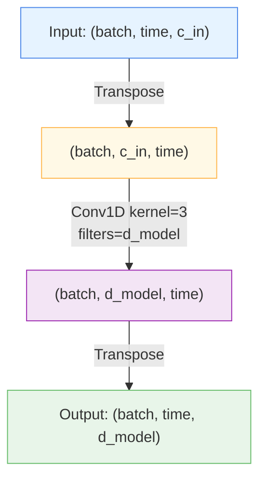

# 🎫 TokenEmbedding

<div class="layer-hero">
  <div class="layer-hero-content">
    <h1>🎫 TokenEmbedding</h1>
    <div class="layer-badges">
      <span class="badge badge-beginner">🟢 Beginner</span>
      <span class="badge badge-stable">✅ Stable</span>
      <span class="badge badge-timeseries">⏱️ Time Series</span>
    </div>
  </div>
</div>

## 🎯 Overview

The `TokenEmbedding` layer embeds raw time series values using 1D convolution with learnable filters and bias. It transforms raw numerical input values into rich, learnable feature representations suitable for transformer-based models and deep learning architectures.

This layer is inspired by the TokenEmbedding component used in state-of-the-art time series forecasting models like Informer and TimeMixer. It provides a learnable alternative to fixed embeddings, allowing the model to discover optimal feature representations during training.

## 🔍 How It Works

The TokenEmbedding layer processes data through a 1D convolutional transformation:

1. **Input Reception**: Receives raw time series values of shape `(batch, time_steps, channels)`
2. **Transposition**: Rearranges to `(batch, channels, time_steps)` for Conv1D
3. **1D Convolution**: Applies learnable 3×1 kernels across the time dimension
4. **Same Padding**: Preserves temporal dimension using "same" padding
5. **Output Generation**: Returns embedded features of shape `(batch, time_steps, d_model)`



## 💡 Why Use This Layer?

| Challenge | Fixed Embeddings | Learnable Tokens | TokenEmbedding's Solution |
|-----------|-----------------|------------------|--------------------------|
| **Feature Learning** | No learning | Limited | ✨ **Learnable 1D convolution** |
| **Contextual Awareness** | No context | Local only | 🎯 **Kernel-size receptive field** |
| **Adaptation** | Static | Slow | ⚡ **Trained end-to-end** |
| **Multivariate Support** | Single channel | Per-channel | 🔄 **True multi-channel learning** |
| **Initialization** | Random/fixed | Basic | 🔧 **Kaiming normal init** |

## 📊 Use Cases

- **Time Series Forecasting**: Embedding raw values in LSTM/Transformer models
- **Anomaly Detection**: Feature extraction for anomaly detection models
- **Time Series Classification**: Converting raw series to embeddings for classification
- **Multivariate Analysis**: Processing multiple correlated time series simultaneously
- **Feature Engineering**: Automatic feature extraction from raw temporal data
- **Preprocessing Pipeline**: As first layer in deep time series models
- **Pre-training**: For self-supervised learning on time series

## 🚀 Quick Start

### Basic Usage

```python
import keras
from kerasfactory.layers import TokenEmbedding

# Create token embedding layer
token_emb = TokenEmbedding(c_in=7, d_model=64)

# Create sample time series data
batch_size, time_steps, n_features = 32, 100, 7
x = keras.random.normal((batch_size, time_steps, n_features))

# Apply embedding
output = token_emb(x)

print(f"Input shape: {x.shape}")      # (32, 100, 7)
print(f"Output shape: {output.shape}") # (32, 100, 64)
```

### In a Time Series Forecasting Model

```python
import keras
from kerasfactory.layers import TokenEmbedding, PositionalEmbedding

# Build forecasting model
def create_forecasting_model():
    inputs = keras.Input(shape=(96, 7))  # 96 time steps, 7 features
    
    # Embed raw values
    x = TokenEmbedding(c_in=7, d_model=64)(inputs)
    
    # Add positional encoding
    x = x + PositionalEmbedding(max_len=96, d_model=64)(x)
    
    # Process with transformers
    x = keras.layers.MultiHeadAttention(num_heads=8, key_dim=8)(x, x)
    x = keras.layers.Dense(128, activation='relu')(x)
    x = keras.layers.Dense(32, activation='relu')(x)
    
    # Forecast future values
    outputs = keras.layers.Dense(7)(x)  # Forecast next 7 features
    
    return keras.Model(inputs, outputs)

model = create_forecasting_model()
model.compile(optimizer='adam', loss='mse')
```

### With Multivariate Time Series

```python
from kerasfactory.layers import TokenEmbedding, TemporalEmbedding, DataEmbeddingWithoutPosition

# Multi-feature time series embedding
token_emb = TokenEmbedding(c_in=12, d_model=96)
temporal_emb = TemporalEmbedding(d_model=96, embed_type='fixed')

# Input data
x = keras.random.normal((32, 100, 12))  # 12 features
x_mark = keras.random.uniform((32, 100, 5), minval=0, maxval=24, dtype='int32')

# Embed values
x_embedded = token_emb(x)

# Add temporal context
temporal_features = temporal_emb(x_mark)
combined = x_embedded + temporal_features

print(f"Combined embedding shape: {combined.shape}")  # (32, 100, 96)
```

### Advanced Multi-Scale Architecture

```python
from kerasfactory.layers import TokenEmbedding, MultiScaleSeasonMixing

class MultiScaleTimeSeriesModel(keras.Model):
    def __init__(self, c_in, d_model, num_scales=3):
        super().__init__()
        self.token_emb = TokenEmbedding(c_in, d_model)
        self.scale_embeddings = [
            TokenEmbedding(c_in, d_model // (2 ** i))
            for i in range(num_scales)
        ]
    
    def call(self, inputs):
        # Primary embedding
        x = self.token_emb(inputs)
        
        # Multi-scale embeddings
        scales = [emb(inputs) for emb in self.scale_embeddings]
        
        # Combine scales
        combined = x + keras.layers.average(scales)
        return combined
```

## 🔧 API Reference

### TokenEmbedding

```python
kerasfactory.layers.TokenEmbedding(
    c_in: int,
    d_model: int,
    name: str | None = None,
    **kwargs: Any
)
```

#### Parameters

| Parameter | Type | Default | Description |
|-----------|------|---------|-------------|
| `c_in` | `int` | — | Number of input channels (features) |
| `d_model` | `int` | — | Output embedding dimension |
| `name` | `str \| None` | None | Optional layer name for identification |

#### Input Shape
- `(batch_size, time_steps, c_in)`

#### Output Shape
- `(batch_size, time_steps, d_model)`

#### Returns
- Embedded time series tensor with learned representations

## 📈 Performance Characteristics

- **Time Complexity**: O(time_steps × c_in × d_model × kernel_size) per forward pass
- **Space Complexity**: O(c_in × d_model × kernel_size) for weights
- **Trainable Parameters**: c_in × d_model × kernel_size + d_model (weights + bias)
- **Training Efficiency**: Fast convergence with proper initialization
- **Inference Speed**: Optimized for batch processing

## 🎨 Advanced Usage

### Custom Initialization

```python
from kerasfactory.layers import TokenEmbedding

# Create layer with custom initialization
token_emb = TokenEmbedding(c_in=8, d_model=64)

# Access the conv layer for custom initialization
conv_layer = token_emb.conv
conv_layer.kernel_initializer = keras.initializers.HeNormal()
```

### Integration with Preprocessing

```python
from kerasfactory.layers import TokenEmbedding, ReversibleInstanceNorm

# Preprocessing pipeline
normalizer = ReversibleInstanceNorm(num_features=7)
token_emb = TokenEmbedding(c_in=7, d_model=64)

# Apply normalization then embedding
x = keras.random.normal((32, 100, 7))
x_normalized = normalizer(x, mode='norm')
x_embedded = token_emb(x_normalized)

print(f"Embedded shape: {x_embedded.shape}")  # (32, 100, 64)
```

### Ensemble of Embeddings

```python
class EnsembleTokenEmbedding(keras.layers.Layer):
    def __init__(self, c_in, d_model, num_embeddings=3):
        super().__init__()
        self.embeddings = [
            TokenEmbedding(c_in, d_model // num_embeddings)
            for _ in range(num_embeddings)
        ]
    
    def call(self, inputs):
        outputs = [emb(inputs) for emb in self.embeddings]
        return keras.layers.concatenate(outputs, axis=-1)
```

## 🔍 Visual Representation

```
Input Time Series (Raw Values)
┌─────────────────────────────────┐
│ Shape: (batch, time, channels)  │
│ Example: (32, 96, 7)            │
└──────────────┬──────────────────┘
               │
               ▼
       ┌───────────────────┐
       │  Transposition    │
       │ (batch, ch, time) │
       └─────────┬─────────┘
               │
               ▼
       ┌───────────────────┐
       │  Conv1D Layer     │
       │  kernel_size=3    │
       │  filters=d_model  │
       │  padding='same'   │
       └─────────┬─────────┘
               │
               ▼
       ┌───────────────────┐
       │  Transposition    │
       │(batch, time, d_m) │
       └─────────┬─────────┘
               │
               ▼
    Output Embeddings (Learned)
    ┌──────────────────────────┐
    │ Shape: (batch, time, 64) │
    │ Rich feature rep.        │
    └──────────────────────────┘
```

## 💡 Best Practices

1. **Match d_model**: Ensure d_model matches downstream layer dimensions
2. **Normalize First**: Apply normalization before embedding for stability
3. **Proper Initialization**: Kaiming normal is applied automatically
4. **Batch Consistency**: Use consistent batch sizes for training
5. **Feature Scaling**: Consider scaling inputs to [-1, 1] range
6. **Layer Stacking**: Combine with positional embeddings for transformers
7. **Learning Rate**: Use moderate learning rates (0.001-0.01)

## ⚠️ Common Pitfalls

- ❌ **c_in mismatch**: Using wrong input channel count causes shape errors
- ❌ **d_model too small**: Underfitting if embedding dimension too small
- ❌ **Missing normalization**: Training instability without preprocessing
- ❌ **Batch size 1**: Can cause issues with layer normalization (if used)
- ❌ **Extreme values**: Very large input values can cause training issues
- ❌ **Forgetting temporal position**: Don't use alone; add positional encoding

## 📚 References

- He, K., Zhang, X., Ren, S., & Sun, J. (2015). "Delving Deep into Rectifiers: Surpassing Human-Level Performance on ImageNet Classification"
- Vaswani, A., et al. (2017). "Attention Is All You Need"
- Zhou, H., et al. (2021). "Informer: Beyond Efficient Transformer for Long Sequence Time-Series Forecasting"

## 🔗 Related Layers

- [`PositionalEmbedding`](positional-embedding.md) - Add positional information
- [`TemporalEmbedding`](temporal-embedding.md) - Embed temporal features
- [`DataEmbeddingWithoutPosition`](data-embedding-without-position.md) - Combined embedding
- [`ReversibleInstanceNorm`](reversible-instance-norm.md) - Normalize before embedding
- [`MultiScaleSeasonMixing`](multi-scale-season-mixing.md) - Process multi-scale patterns

## ✅ Serialization

```python
# Get layer configuration
config = token_emb.get_config()

# Save to file
import json
with open('token_embedding_config.json', 'w') as f:
    json.dump(config, f)

# Recreate from config
new_layer = TokenEmbedding.from_config(config)
```

## 🧪 Testing & Validation

```python
# Test with different input sizes
token_emb = TokenEmbedding(c_in=7, d_model=64)

# Small batch
x_small = keras.random.normal((1, 96, 7))
out_small = token_emb(x_small)
assert out_small.shape == (1, 96, 64)

# Large batch
x_large = keras.random.normal((256, 96, 7))
out_large = token_emb(x_large)
assert out_large.shape == (256, 96, 64)

# Different time steps
x_diff_time = keras.random.normal((32, 200, 7))
out_diff_time = token_emb(x_diff_time)
assert out_diff_time.shape == (32, 200, 64)

print("✓ All shape tests passed!")
```

---

**Last Updated**: 2025-11-04  
**Version**: 1.0  
**Keras**: 3.0+  
**Status**: ✅ Production Ready
