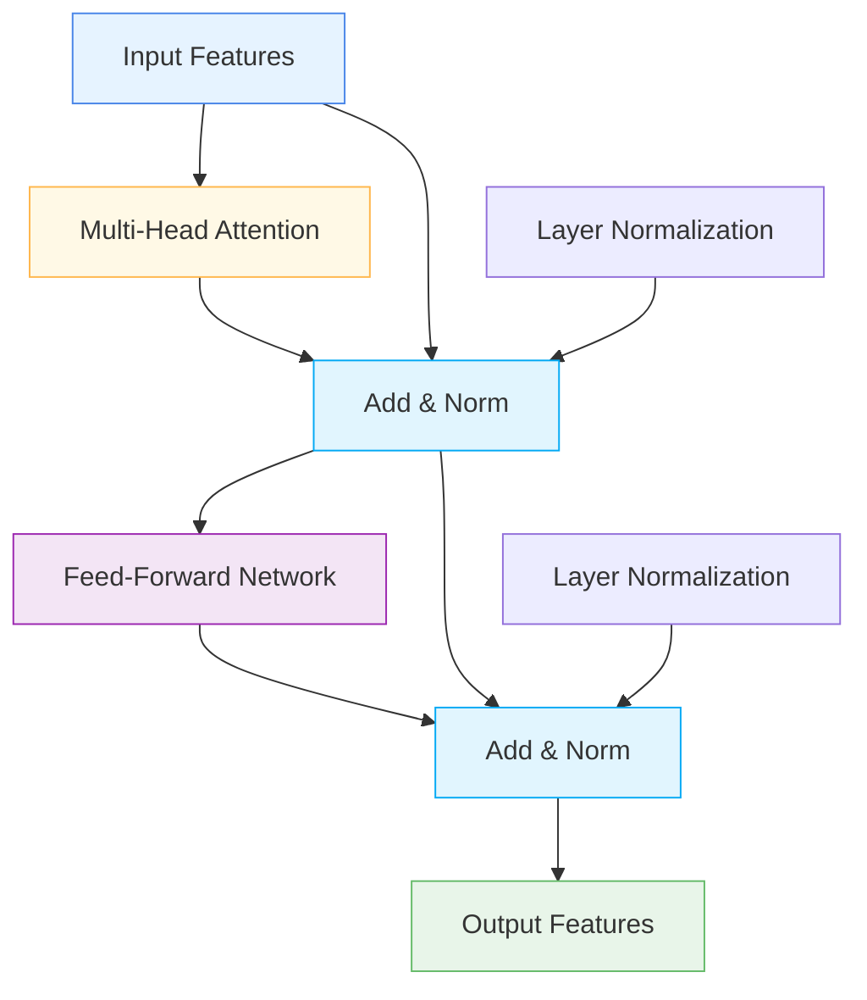

# 🔄 TransformerBlock

<div class="layer-hero">
  <div class="layer-hero-content">
    <h1>🔄 TransformerBlock</h1>
    <div class="layer-badges">
      <span class="badge badge-advanced">🔴 Advanced</span>
      <span class="badge badge-stable">✅ Stable</span>
      <span class="badge badge-popular">🔥 Popular</span>
    </div>
  </div>
</div>

## 🎯 Overview

The `TransformerBlock` implements a standard transformer block with multi-head self-attention followed by a feed-forward network, with residual connections and layer normalization. This layer is particularly useful for capturing complex relationships in tabular data and sequence processing.

This layer is particularly powerful for tabular data where feature interactions are complex, making it ideal for sophisticated feature processing and relationship modeling.

## 🔍 How It Works

The TransformerBlock processes data through a transformer architecture:

1. **Multi-Head Attention**: Applies multi-head self-attention to capture relationships
2. **Residual Connection**: Adds input to attention output for gradient flow
3. **Layer Normalization**: Normalizes the attention output
4. **Feed-Forward Network**: Applies two-layer feed-forward network
5. **Residual Connection**: Adds attention output to feed-forward output
6. **Layer Normalization**: Normalizes the final output



## 💡 Why Use This Layer?

| Challenge | Traditional Approach | TransformerBlock's Solution |
|-----------|---------------------|---------------------------|
| **Feature Interactions** | Limited interaction modeling | 🎯 **Multi-head attention** captures complex interactions |
| **Sequence Processing** | RNN-based processing | ⚡ **Parallel processing** with attention mechanisms |
| **Long Dependencies** | Limited by sequence length | 🧠 **Self-attention** captures long-range dependencies |
| **Tabular Data** | Simple feature processing | 🔗 **Sophisticated processing** for tabular data |

## 📊 Use Cases

- **Tabular Data Processing**: Complex feature interaction modeling
- **Sequence Processing**: Time series and sequential data
- **Feature Engineering**: Sophisticated feature transformation
- **Attention Mechanisms**: Implementing attention-based processing
- **Deep Learning**: Building deep transformer architectures

## 🚀 Quick Start

### Basic Usage

```python
import keras
from kerasfactory.layers import TransformerBlock

# Create sample input data
batch_size, seq_len, dim_model = 32, 10, 64
x = keras.random.normal((batch_size, seq_len, dim_model))

# Apply transformer block
transformer = TransformerBlock(
    dim_model=64,
    num_heads=4,
    ff_units=128,
    dropout_rate=0.1
)
output = transformer(x)

print(f"Input shape: {x.shape}")           # (32, 10, 64)
print(f"Output shape: {output.shape}")     # (32, 10, 64)
```

### In a Sequential Model

```python
import keras
from kerasfactory.layers import TransformerBlock

model = keras.Sequential([
    keras.layers.Dense(64, activation='relu'),
    TransformerBlock(dim_model=64, num_heads=4, ff_units=128, dropout_rate=0.1),
    keras.layers.Dense(32, activation='relu'),
    TransformerBlock(dim_model=32, num_heads=2, ff_units=64, dropout_rate=0.1),
    keras.layers.Dense(1, activation='sigmoid')
])

model.compile(optimizer='adam', loss='binary_crossentropy', metrics=['accuracy'])
```

### In a Functional Model

```python
import keras
from kerasfactory.layers import TransformerBlock

# Define inputs
inputs = keras.Input(shape=(20, 32))  # 20 time steps, 32 features

# Apply transformer block
x = TransformerBlock(
    dim_model=32,
    num_heads=4,
    ff_units=64,
    dropout_rate=0.1
)(inputs)

# Continue processing
x = keras.layers.Dense(64, activation='relu')(x)
x = TransformerBlock(
    dim_model=64,
    num_heads=4,
    ff_units=128,
    dropout_rate=0.1
)(x)
x = keras.layers.Dense(32, activation='relu')(x)
outputs = keras.layers.Dense(1, activation='sigmoid')(x)

model = keras.Model(inputs, outputs)
```

### Advanced Configuration

```python
# Advanced configuration with multiple transformer blocks
def create_transformer_network():
    inputs = keras.Input(shape=(15, 48))  # 15 time steps, 48 features
    
    # Multiple transformer blocks
    x = TransformerBlock(
        dim_model=48,
        num_heads=6,
        ff_units=96,
        dropout_rate=0.1
    )(inputs)
    
    x = TransformerBlock(
        dim_model=48,
        num_heads=6,
        ff_units=96,
        dropout_rate=0.1
    )(x)
    
    x = TransformerBlock(
        dim_model=48,
        num_heads=6,
        ff_units=96,
        dropout_rate=0.1
    )(x)
    
    # Global pooling and final processing
    x = keras.layers.GlobalAveragePooling1D()(x)
    x = keras.layers.Dense(64, activation='relu')(x)
    x = keras.layers.Dropout(0.2)(x)
    x = keras.layers.Dense(32, activation='relu')(x)
    
    # Multi-task output
    classification = keras.layers.Dense(3, activation='softmax', name='classification')(x)
    regression = keras.layers.Dense(1, name='regression')(x)
    
    return keras.Model(inputs, [classification, regression])

model = create_transformer_network()
model.compile(
    optimizer='adam',
    loss={'classification': 'categorical_crossentropy', 'regression': 'mse'},
    loss_weights={'classification': 1.0, 'regression': 0.5}
)
```

## 📖 API Reference

::: kerasfactory.layers.TransformerBlock

## 🔧 Parameters Deep Dive

### `dim_model` (int)
- **Purpose**: Dimensionality of the model
- **Range**: 8 to 512+ (typically 32-128)
- **Impact**: Determines the size of the feature space
- **Recommendation**: Start with 32-64, scale based on data complexity

### `num_heads` (int)
- **Purpose**: Number of attention heads
- **Range**: 1 to 16+ (typically 2-8)
- **Impact**: More heads = more attention patterns
- **Recommendation**: Start with 4-6, adjust based on data complexity

### `ff_units` (int)
- **Purpose**: Number of units in the feed-forward network
- **Range**: 16 to 512+ (typically 64-256)
- **Impact**: Larger values = more complex transformations
- **Recommendation**: Start with 2x dim_model, scale as needed

### `dropout_rate` (float)
- **Purpose**: Dropout rate for regularization
- **Range**: 0.0 to 0.5 (typically 0.1-0.2)
- **Impact**: Higher values = more regularization
- **Recommendation**: Start with 0.1, adjust based on overfitting

## 📈 Performance Characteristics

- **Speed**: ⚡⚡⚡ Fast for small to medium models, scales with attention heads
- **Memory**: 💾💾💾 Moderate memory usage due to attention mechanisms
- **Accuracy**: 🎯🎯🎯🎯 Excellent for complex relationship modeling
- **Best For**: Tabular data with complex feature interactions

## 🎨 Examples

### Example 1: Tabular Data Processing

```python
import keras
import numpy as np
from kerasfactory.layers import TransformerBlock

# Create a transformer for tabular data
def create_tabular_transformer():
    inputs = keras.Input(shape=(25, 32))  # 25 features, 32 dimensions
    
    # Transformer processing
    x = TransformerBlock(
        dim_model=32,
        num_heads=4,
        ff_units=64,
        dropout_rate=0.1
    )(inputs)
    
    x = TransformerBlock(
        dim_model=32,
        num_heads=4,
        ff_units=64,
        dropout_rate=0.1
    )(x)
    
    # Global pooling and final processing
    x = keras.layers.GlobalAveragePooling1D()(x)
    x = keras.layers.Dense(64, activation='relu')(x)
    x = keras.layers.Dropout(0.2)(x)
    x = keras.layers.Dense(32, activation='relu')(x)
    
    # Output
    outputs = keras.layers.Dense(1, activation='sigmoid')(x)
    
    return keras.Model(inputs, outputs)

model = create_tabular_transformer()
model.compile(optimizer='adam', loss='binary_crossentropy')

# Test with sample data
sample_data = keras.random.normal((100, 25, 32))
predictions = model(sample_data)
print(f"Tabular transformer predictions shape: {predictions.shape}")
```

### Example 2: Time Series Processing

```python
# Create a transformer for time series data
def create_time_series_transformer():
    inputs = keras.Input(shape=(30, 16))  # 30 time steps, 16 features
    
    # Multiple transformer blocks
    x = TransformerBlock(
        dim_model=16,
        num_heads=4,
        ff_units=32,
        dropout_rate=0.1
    )(inputs)
    
    x = TransformerBlock(
        dim_model=16,
        num_heads=4,
        ff_units=32,
        dropout_rate=0.1
    )(x)
    
    # Global pooling and final processing
    x = keras.layers.GlobalAveragePooling1D()(x)
    x = keras.layers.Dense(32, activation='relu')(x)
    x = keras.layers.Dropout(0.2)(x)
    
    # Multi-task output
    trend = keras.layers.Dense(1, name='trend')(x)
    seasonality = keras.layers.Dense(1, name='seasonality')(x)
    anomaly = keras.layers.Dense(1, activation='sigmoid', name='anomaly')(x)
    
    return keras.Model(inputs, [trend, seasonality, anomaly])

model = create_time_series_transformer()
model.compile(
    optimizer='adam',
    loss={'trend': 'mse', 'seasonality': 'mse', 'anomaly': 'binary_crossentropy'},
    loss_weights={'trend': 1.0, 'seasonality': 0.5, 'anomaly': 0.3}
)
```

### Example 3: Attention Analysis

```python
# Analyze attention patterns in transformer
def analyze_attention_patterns():
    # Create model with transformer
    inputs = keras.Input(shape=(10, 32))
    x = TransformerBlock(
        dim_model=32,
        num_heads=4,
        ff_units=64,
        dropout_rate=0.1
    )(inputs)
    outputs = keras.layers.Dense(1, activation='sigmoid')(x)
    
    model = keras.Model(inputs, outputs)
    
    # Test with sample data
    sample_data = keras.random.normal((5, 10, 32))
    predictions = model(sample_data)
    
    print("Attention Analysis:")
    print("=" * 40)
    print(f"Input shape: {sample_data.shape}")
    print(f"Output shape: {predictions.shape}")
    print(f"Model parameters: {model.count_params()}")
    
    return model

# Analyze attention patterns
# model = analyze_attention_patterns()
```

## 💡 Tips & Best Practices

- **Model Dimension**: Start with 32-64, scale based on data complexity
- **Attention Heads**: Use 4-6 heads for most applications
- **Feed-Forward Units**: Use 2x model dimension as starting point
- **Dropout Rate**: Use 0.1-0.2 for regularization
- **Residual Connections**: Built-in residual connections for gradient flow
- **Layer Normalization**: Built-in layer normalization for stable training

## ⚠️ Common Pitfalls

- **Model Dimension**: Must match input feature dimension
- **Attention Heads**: Must divide model dimension evenly
- **Memory Usage**: Scales with attention heads and sequence length
- **Overfitting**: Monitor for overfitting with complex models
- **Gradient Flow**: Residual connections help but monitor training

## 🔗 Related Layers

- [TabularAttention](tabular-attention.md) - Tabular attention mechanisms
- [MultiResolutionTabularAttention](multi-resolution-tabular-attention.md) - Multi-resolution attention
- [GatedResidualNetwork](gated-residual-network.md) - Gated residual networks
- [TabularMoELayer](tabular-moe-layer.md) - Mixture of experts

## 📚 Further Reading

- [Attention Is All You Need](https://arxiv.org/abs/1706.03762) - Original transformer paper
- [Multi-Head Attention](https://arxiv.org/abs/1706.03762) - Multi-head attention mechanism
- [Transformer Architecture](https://en.wikipedia.org/wiki/Transformer_(machine_learning_model)) - Transformer concepts
- [KerasFactory Layer Explorer](../layers_overview.md) - Browse all available layers
- [Feature Engineering Tutorial](../tutorials/feature-engineering.md) - Complete guide to feature engineering
