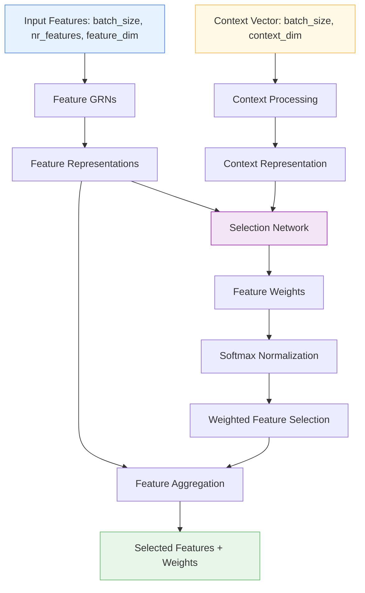

# 🎯 VariableSelection

<div class="layer-hero">
  <div class="layer-hero-content">
    <h1>🎯 VariableSelection</h1>
    <div class="layer-badges">
      <span class="badge badge-intermediate">🟡 Intermediate</span>
      <span class="badge badge-stable">✅ Stable</span>
      <span class="badge badge-popular">🔥 Popular</span>
    </div>
  </div>
</div>

## 🎯 Overview

The `VariableSelection` layer implements dynamic feature selection using gated residual networks (GRNs). Unlike traditional feature selection methods that make static decisions, this layer learns to dynamically select and weight features based on the input context, making it particularly powerful for time series and tabular data where feature importance can vary.

This layer applies a gated residual network to each feature independently and learns feature weights through a softmax layer, optionally using a context vector to condition the feature selection process.

## 🔍 How It Works

The VariableSelection layer processes features through a sophisticated selection mechanism:

1. **Feature Processing**: Each feature is processed independently through a gated residual network
2. **Weight Learning**: A selection network learns weights for each feature
3. **Context Integration**: Optionally uses a context vector to condition the selection
4. **Softmax Weighting**: Applies softmax to normalize feature weights
5. **Feature Aggregation**: Combines features based on learned weights



## 💡 Why Use This Layer?

| Challenge | Traditional Approach | VariableSelection's Solution |
|-----------|---------------------|----------------------------|
| **Feature Selection** | Static selection or manual feature engineering | 🎯 **Dynamic selection** that adapts to input context |
| **Feature Importance** | Fixed importance or post-hoc analysis | ⚡ **Learned importance** during training |
| **Context Awareness** | Ignore contextual information | 🧠 **Context-conditioned** selection using context vectors |
| **Feature Interactions** | Treat features independently | 🔗 **Gated processing** that considers feature relationships |

## 📊 Use Cases

- **Time Series Forecasting**: Selecting relevant features for different time periods
- **Dynamic Feature Engineering**: Adapting feature selection based on data patterns
- **Context-Aware Modeling**: Using external context to guide feature selection
- **High-Dimensional Data**: Intelligently reducing feature space
- **Multi-Task Learning**: Different feature selections for different tasks

## 🚀 Quick Start

### Basic Usage

```python
import keras
from kerasfactory.layers import VariableSelection

# Create sample input data
batch_size, nr_features, feature_dim = 32, 10, 16
x = keras.random.normal((batch_size, nr_features, feature_dim))

# Apply variable selection
vs = VariableSelection(nr_features=nr_features, units=32, dropout_rate=0.1)
selected_features, feature_weights = vs(x)

print(f"Selected features shape: {selected_features.shape}")  # (32, 16)
print(f"Feature weights shape: {feature_weights.shape}")      # (32, 10)
```

### With Context Vector

```python
# Create data with context
features = keras.random.normal((32, 10, 16))
context = keras.random.normal((32, 64))  # 64-dimensional context

# Apply variable selection with context
vs_context = VariableSelection(
    nr_features=10, 
    units=32, 
    dropout_rate=0.1, 
    use_context=True
)
selected, weights = vs_context([features, context])

print(f"Selected features shape: {selected.shape}")  # (32, 16)
print(f"Feature weights shape: {weights.shape}")     # (32, 10)
```

### In a Sequential Model

```python
import keras
from kerasfactory.layers import VariableSelection

# Create a model with variable selection
model = keras.Sequential([
    keras.layers.Dense(32, activation='relu'),
    keras.layers.Reshape((1, 32)),  # Reshape for variable selection
    VariableSelection(nr_features=1, units=16, dropout_rate=0.1),
    keras.layers.Dense(16, activation='relu'),
    keras.layers.Dense(1, activation='sigmoid')
])

model.compile(optimizer='adam', loss='binary_crossentropy')
```

### In a Functional Model

```python
import keras
from kerasfactory.layers import VariableSelection

# Define inputs
features_input = keras.Input(shape=(10, 16), name='features')
context_input = keras.Input(shape=(64,), name='context')

# Apply variable selection with context
selected_features, weights = VariableSelection(
    nr_features=10, 
    units=32, 
    dropout_rate=0.1, 
    use_context=True
)([features_input, context_input])

# Continue processing
x = keras.layers.Dense(64, activation='relu')(selected_features)
x = keras.layers.Dropout(0.2)(x)
outputs = keras.layers.Dense(1, activation='sigmoid')(x)

model = keras.Model([features_input, context_input], outputs)
```

### Advanced Configuration

```python
# Advanced configuration with custom parameters
vs = VariableSelection(
    nr_features=20,
    units=64,           # Larger hidden units for complex selection
    dropout_rate=0.2,   # Higher dropout for regularization
    use_context=True,   # Enable context conditioning
    name="advanced_variable_selection"
)

# Use in a complex model
features = keras.Input(shape=(20, 32), name='features')
context = keras.Input(shape=(128,), name='context')

selected, weights = vs([features, context])

# Multi-task processing
task1 = keras.layers.Dense(32, activation='relu')(selected)
task1 = keras.layers.Dense(5, activation='softmax', name='classification')(task1)

task2 = keras.layers.Dense(16, activation='relu')(selected)
task2 = keras.layers.Dense(1, name='regression')(task2)

model = keras.Model([features, context], [task1, task2])
```

## 📖 API Reference

::: kerasfactory.layers.VariableSelection

## 🔧 Parameters Deep Dive

### `nr_features` (int)
- **Purpose**: Number of input features to select from
- **Range**: 1 to 1000+ (typically 5-50)
- **Impact**: Must match the number of features in your input
- **Recommendation**: Set to the actual number of features you want to select from

### `units` (int)
- **Purpose**: Number of hidden units in the selection network
- **Range**: 8 to 512+ (typically 16-128)
- **Impact**: Larger values = more complex selection patterns but more parameters
- **Recommendation**: Start with 32, scale based on feature complexity

### `dropout_rate` (float)
- **Purpose**: Regularization to prevent overfitting
- **Range**: 0.0 to 0.9
- **Impact**: Higher values = more regularization but potentially less learning
- **Recommendation**: Start with 0.1, increase if overfitting occurs

### `use_context` (bool)
- **Purpose**: Whether to use a context vector for conditioning
- **Default**: False
- **Impact**: Enables context-aware feature selection
- **Recommendation**: Use True when you have contextual information

## 📈 Performance Characteristics

- **Speed**: ⚡⚡⚡ Fast for small to medium feature counts, scales with nr_features
- **Memory**: 💾💾💾 Moderate memory usage due to per-feature processing
- **Accuracy**: 🎯🎯🎯🎯 Excellent for dynamic feature selection tasks
- **Best For**: Time series and tabular data with varying feature importance

## 🎨 Examples

### Example 1: Time Series Feature Selection

```python
import keras
import numpy as np
from kerasfactory.layers import VariableSelection

# Simulate time series data with multiple features
batch_size, time_steps, features = 32, 24, 8  # 24 hours, 8 features per hour
time_series_data = keras.random.normal((batch_size, time_steps, features))

# Context: time of day, day of week, etc.
context_data = keras.random.normal((batch_size, 16))  # 16-dim context

# Build time series model with variable selection
features_input = keras.Input(shape=(time_steps, features), name='time_series')
context_input = keras.Input(shape=(16,), name='context')

# Apply variable selection to each time step
selected_features, weights = VariableSelection(
    nr_features=time_steps,
    units=32,
    dropout_rate=0.1,
    use_context=True
)([time_series_data, context_data])

# Process selected features
x = keras.layers.Dense(64, activation='relu')(selected_features)
x = keras.layers.Dropout(0.2)(x)
forecast = keras.layers.Dense(1)(x)  # Predict next value

model = keras.Model([features_input, context_input], forecast)
model.compile(optimizer='adam', loss='mse')

# Analyze feature weights over time
print("Feature weights shape:", weights.shape)  # (32, 24)
print("Average weights per time step:", np.mean(weights, axis=0))
```

### Example 2: Multi-Task Feature Selection

```python
# Different tasks may need different feature selections
def create_multi_task_model():
    features = keras.Input(shape=(15, 20), name='features')  # 15 features, 20 dims each
    context = keras.Input(shape=(32,), name='context')
    
    # Shared variable selection
    selected, weights = VariableSelection(
        nr_features=15,
        units=48,
        dropout_rate=0.15,
        use_context=True
    )([features, context])
    
    # Task-specific processing
    # Classification task
    cls_features = keras.layers.Dense(64, activation='relu')(selected)
    cls_features = keras.layers.Dropout(0.3)(cls_features)
    classification = keras.layers.Dense(3, activation='softmax', name='classification')(cls_features)
    
    # Regression task
    reg_features = keras.layers.Dense(32, activation='relu')(selected)
    reg_features = keras.layers.Dropout(0.2)(reg_features)
    regression = keras.layers.Dense(1, name='regression')(reg_features)
    
    return keras.Model([features, context], [classification, regression])

model = create_multi_task_model()
model.compile(
    optimizer='adam',
    loss={'classification': 'categorical_crossentropy', 'regression': 'mse'},
    loss_weights={'classification': 1.0, 'regression': 0.5}
)
```

### Example 3: Feature Importance Analysis

```python
# Analyze which features are being selected
def analyze_feature_selection(model, test_data, feature_names=None):
    """Analyze feature selection patterns."""
    # Get the variable selection layer
    vs_layer = None
    for layer in model.layers:
        if isinstance(layer, VariableSelection):
            vs_layer = layer
            break
    
    if vs_layer is None:
        print("No VariableSelection layer found")
        return
    
    # Get feature weights
    features, context = test_data
    _, weights = vs_layer([features, context])
    
    # Analyze weights
    avg_weights = np.mean(weights, axis=0)
    print("Average feature weights:")
    for i, weight in enumerate(avg_weights):
        feature_name = feature_names[i] if feature_names else f"Feature_{i}"
        print(f"{feature_name}: {weight:.4f}")
    
    # Find most important features
    top_features = np.argsort(avg_weights)[-5:]  # Top 5 features
    print(f"\nTop 5 most important features: {top_features}")
    
    return weights

# Use with your model
# weights = analyze_feature_selection(model, [test_features, test_context], feature_names)
```

## 💡 Tips & Best Practices

- **Feature Dimension**: Ensure feature_dim is consistent across all features
- **Context Usage**: Use context vectors when you have relevant contextual information
- **Units Sizing**: Start with units = nr_features * 2, adjust based on complexity
- **Regularization**: Use appropriate dropout to prevent overfitting
- **Weight Analysis**: Monitor feature weights to understand selection patterns
- **Batch Size**: Works best with larger batch sizes for stable weight learning

## ⚠️ Common Pitfalls

- **Input Shape**: Must be 3D tensor (batch_size, nr_features, feature_dim)
- **Context Mismatch**: Context vector must be 2D (batch_size, context_dim)
- **Feature Count**: nr_features must match actual number of input features
- **Memory Usage**: Scales with nr_features - be careful with large feature counts
- **Weight Interpretation**: Weights are relative, not absolute importance

## 🔗 Related Layers

- [GatedFeatureSelection](gated-feature-selection.md) - Gated feature selection mechanism
- [GatedResidualNetwork](gated-residual-network.md) - Core GRN used in variable selection
- [TabularAttention](tabular-attention.md) - Attention-based feature processing
- [DistributionAwareEncoder](distribution-aware-encoder.md) - Distribution-aware feature encoding

## 📚 Further Reading

- [Temporal Fusion Transformers](https://arxiv.org/abs/1912.09363) - Original paper on variable selection
- [Gated Residual Networks](https://arxiv.org/abs/1612.08083) - GRN architecture details
- [Feature Selection in Deep Learning](https://en.wikipedia.org/wiki/Feature_selection) - Feature selection concepts
- [KerasFactory Layer Explorer](../layers_overview.md) - Browse all available layers
- [Time Series Tutorial](../tutorials/feature-engineering.md) - Complete guide to time series modeling
